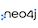

<table>
  <tr>
    <td colspan=4><b><i>编程基础</i></b></td>
  </tr>
  <tr align="center">
    <td align="center"></td>
    <td></td>
    <td></td>
    <td></td>
  </tr>
  <tr align="center">
    <td><a href="#Java核心">Java核心</a></td>
    <td><a href="#数据结构与算法">数据结构与算法</a></td>
    <td><a href="#设计模式">设计模式</a></td>
    <td><a href="#linux">Linux</a></td>
  </tr>
  <tr>
    <td colspan=4><b><i>可视化</i></b></td>
  </tr>
  <tr align="center">
    <td></td>
    <td></td>
    <td></td>
    <td></td>
  </tr>
  <tr align="center">
    <td><a href="#HTML">Html</a></td>
    <td><a href="#HTML">Css</a></td>
    <td><a href="#HTML">JavaScript</a></td>
    <td><a href="#Jquery">Jquery</a></td>
  </tr>
  <tr align="center">
    <td></td>
    <td></td>
    <td></td>
    <td></td>
  </tr>
  <tr align="center">
    <td><a href="#Vue.js">Vue.js</a></td>
    <td><a href="#">ECharts</a></td>
    <td><a href="#">HighCharts</a></td>
    <td></td>
  </tr>
  <tr>
    <td colspan=4><b><i>常见DB及缓存</i></b></td>
  </tr>
  <tr align="center">
    <td></td>
    <td></td>
    <td></td>
    <td></td>
  </tr>
  <tr align="center">
    <td><a href="#Mysql">Mysql</a></td>
    <td><a href="#Redis">Redis</a></td>
    <td><a href="#Mongo">Mongo</a></td>
    <td><a href="#Neo4j">Neo4j</a></td>
  </tr>
  <tr>
    <td colspan=4><b><i>消息中间件</i></b></td>
  </tr>
  <tr align="center">
    <td></td>
    <td></td>
    <td></td>
    <td></td>
  </tr>
  <tr align="center">
    <td><a href="#Kafka">Kafka</a></td>
    <td><a href="#RabbitMQ">RabbitMQ</a></td>
    <td><a href="#RocketMQ">RocketMQ</a></td>
    <td><a href="#ActiveMQ">ActiveMQ</a></td>
  </tr>
  <tr>
    <td colspan=4><b><i>SSM + SpringBoot</i></b></td>
  </tr>
  <tr align="center">
    <td></td>
    <td></td>
    <td></td>
    <td></td>
  </tr>
  <tr align="center">
    <td><a href="#MyBatis">MyBatis</a></td>
    <td><a href="#Spring">Spring</a></td>
    <td><a href="#SpringMVC">SpringMVC</a></td>
    <td><a href="#SpringBoot">SpringBoot</a></td>
  </tr>
  <tr>
    <td colspan=4><b><i>WEB服务器</i></b></td>
  </tr>
  <tr align="center">
    <td></td>
    <td></td>
    <td></td>
    <td></td>
  </tr>
  <tr align="center">
    <td><a href="#Nginx">Nginx</a></td>
    <td><a href="#Tomcat">Tomcat</a></td>
    <td></td>
    <td></td>
  </tr>
</table>

<table
  <tr>
    <td colspan=4><b><i>离线计算</i></b></td>
  </tr>
  <tr align="center">
    <td></td>
    <td></td>
    <td></td>
    <td></td>  </tr>
  <tr align="center">
    <td><a href="#Hadoop">Hadoop 分布式系统基础架构</a></td>
    <td><a href="#Hive">Hive 数据仓库工具</a></td>
    <td><a href="">Hue 数据交互工具</a></td>
    <td><a href="#Flume">Flume 数据交互工具</a></td>
  </tr>
  <tr align="center">
    <td></td>
    <td></td>
    <td></td>
    <td></td>
  </tr>
  <tr align="center">
    <td><a href="#Sqoop">Sqoop</a></td>
    <td><a href="#Impala">Impala</a></td>
    <td><a href="#HBase">HBase</a></td>
    <td><a href="#Zookeeper">Zookeeper</a></td>
  </tr>
  <tr align="center">
   	<td></td>
    <td></td>
    <td></td>
    <td></td>
    <td></td>
  </tr>
  <tr align="center">
    <td><a href="#Azkaban">Azkaban</a></td>
    <td><a href="#电商离线数仓">电商离线数仓</a></td>
    <td></td>
    <td></td>
    <td></td>
  </tr>
  <tr>
    <td colspan=4><b><i>Spark + Flink</i></b></td>
  </tr>
  <tr align="center">
    <td></td>
    <td></td>
    <td></td>
    <td></td>
  </tr>
  <tr align="center">
    <td><a href="#Scala">Scala</a></td>
    <td><a href="#Spark">Spark</a></td>
    <td><a href="#分析调度平台">分析调度平台</a></td>
    <td><a href="#Flink">Flink</a></td>
  </tr>
  <tr>
    <td colspan=4><b><i>大数据新技术</i></b></td>
  </tr>
  <tr align="center">
    <td></td>
    <td></td>
    <td></td>
    <td></td>
  </tr>
  <tr align="center">
    <td><a href="#ClickHouse">ClickHouse</a></td>
    <td><a href="#Kudu">Kudu</a></td>
    <td><a href="#Kylin">Kylin</a></td>
    <td><a href="#Druid">Druid</a></td>
  </tr>
  <tr>
    <td colspan=4><b><i>ELK</i></b></td>
  </tr>
  <tr align="center">
    <td></td>
    <td></td>
    <td></td>
    <td></td>
  </tr>
  <tr align="center">
    <td><a href="#Elasticsearch">Elasticsearch</a></td>
    <td><a href="#Logstash">Logstash</a></td>
    <td><a href="#Kibana">Kibana</a></td>
    <td></td>
  </tr>
  <tr>
    <td colspan=4><b><i>机器学习</i></b></td>
  </tr>
  <tr align="center">
    <td></td>
    <td></td>
    <td></td>
    <td></td>
  </tr>
  <tr align="center">
    <td><a href="#Python">Python</a></td>
    <td><a href="#统计学基础">统计学基础</a></td>
    <td><a href="#数据挖掘算法">数据挖掘算法</a></td>
    <td><a href="#Tensflow">Tensflow</a></td>
  </tr>
</table>

## Java核心

[初识](./java/初识.md)

[变量与常量](./java/变量与常量.md)

[运算符](./java/运算符.md)

[流程控制语句—选择结构、循环结构](./java/流程控制语句.md)

数组

类与对象

方法和封装

继承

单例模式

多态和特殊类

异常

包装类

字符串

集合

范型

多线程

输入输出流

## 数据结构与算法

学习概览

复杂度分析

数组

栈

链表

栈和队列

链表和递归

二分搜索树

集合和映射

优先队列和堆

线段树

Trie

并查集

AVL

红黑树

哈希表

## 设计模式

## Linux

[shell命令大全](./linux/shell命令大全.md)

[命令—关机\重启 shutdown、reboot](./linux/命令-关机重启.md)

如何使用命令

[命令—文件目录 ls、pwd、cp、mv、touch、mkdir、rm、less、cat、ln](./linux/命令-文件目录.md)

[命令—用户\用户组管理 useradd、userdel、usermod、groupadd、groupdel、groupmod](./linux/命令-用户用户组管理.md)

[命令—文件权限 chmod、chown、chgrp](./linux/命令-文件权限命令.md)

[命令—压缩\解压缩 tar、zip、gzip](./linux/命令-压缩解压缩.md)

[命令—文件内容统计 wc、uniq、sort、head](./linux/命令-文件内容统计.md)

[命令—日期 date、cal](./linux/命令-日期.md)

[命令—进程 ps、top 、jobs、bg、fg、netstat、jps、kill、killall](./linux/命令-进程.md)

[命令—linux三剑客 grep、sed、awk](./linux/命令-linux三剑客.md)

[命令—远程同步 scp、rsync](./linux/命令-远程复制.md)

[命令—系统使用信息 df、free](./linux/命令-系统使用信息.md)

文件编辑利器 - vi

[命令—软件管理 rpm、yum](./linux/命令-软件管理.md)

命令—查找文件

[用户与系统沟通的桥梁-shell脚本](./linux/shell脚本.md)

[练习 - 分析论坛日志](./linux/练习-分析论坛日志.md)

[练习 - 杀死挖矿程序](./linux/练习-杀死挖矿程序.md)

[练习 - shell脚本安装jdk](linux/练习-shell脚本安装jdk.md)

[面试](./linux/面试.md)

#### 基础环境篇

[第四节 Hadoop3.x分布式集群安装](./hadoop/hadoop3分布式集群环境.md)

## Hadoop

[hadoop完全分布式环境搭建](./hadoop/hadoop2分布式集群环境.md)

[iterm2-ssh客户端配置](./hadoop/iterm2配置.md)

[第一节 初识](./hadoop/初识.md)

[第二节 Hadoop之分布式文件系统HDFS](./hadoop/hadoop-hdfs.md)

[第三节 Hadoop之集群资源管理系统YARN](./hadoop/hadoop-yarn.md)

[第四节 Hadoop之分布式计算框架MapReduce](./hadoop/hadoop-mapreduce.md)

[第五节 Hadoop源码剖析](./hadoop/hadoop源码剖析.md)

[第六节 Hadoop调优及二次开发](./hadoop/hadoop调优及二次开发.md)

## Hive

[Hive概述](./hive/hive概述.md)

[Hive安装部署](./hive/hive安装部署.md)

[Hive命令](./hive/hive命令.md)

[Hive数据类型与文件格式](./hive/hive数据类型与文件格式.md)

[HQL之DDL命令](./hive/hql之ddl命令.md)

[HQL之数据操作](./hive/hql之数据操作.md)

[HQL之DQL命令 - 重点](./hive/hql之dql命令.md)

[Hive函数 - 重点](./hive/hive函数.md)

[HQL之DML命令](./hive/hql之dml命令.md)

[Hive元数据管理与存储](./hive/hive元数据管理与存储.md)

[Hive调优策略](./hive/hive调优策略.md)

[Hive案例](./hive/hive案例.md)

## Hue

[Hue安装部署](./hue/hue安装部署.md)

[Hue整合Hadoop、Hive](./hue/hue整合hadoop与hive.md)

## Flume

[flume概述](./flume/flume概述.md)

[flume安装部署](./flume/flume安装部署.md)

[flume基础应用](./flume/flume基础应用.md)

[flume高级特性](./flume/flume高级特性.md)

## Sqoop

[sqoop安装配置](./sqoop/sqoop安装配置.md)

[sqoop应用案例](./sqoop/sqoop应用案例.md)

[Sqoop常用命令及参数](./sqoop/sqoop常用命令及参数.md)

## Impala

impala概述