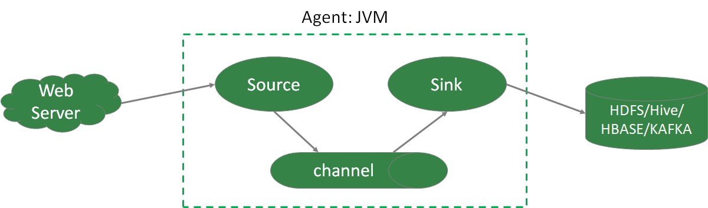

## Flume概述

无论数据来自什么企业，或是多大量级，通过部署Flume，可以确保数据都安全、及时地到达大数据平台，用户可以将精力集中在如何洞悉数据上。 

### **第** **1** **节** Flume的定义

Flume由Cloudera公司开发，**是一个分布式、高可靠、高可用的海量日志采集、聚合、传输的系统**。

Flume支持在日志系统中定制各类数据发送方，用于采集数据；

Flume提供对数据进行简单处理，并写到各种数据接收方的能力；

简单的说，Flume是**实时采集日志的数据采集引擎**。 

Flume有3个重要组件：Source、Channel、Sink

特点

- 分布式：flume分布式集群部署，扩展性好
- 可靠性好：当节点出现故障时，日志能够被传送到其他节点上而不会丢失
- 易用性：flume配置使用较繁琐，对使用人员专业技术要求高
- 实时采集：flume采集流模式进行数据实时采集 

适用场景：适用于日志文件实时采集。 

其他数据采集工具还有：DataX、Kettle、Logstash、Scribe、sqoop。 

1. DataX

   阿里开源软件异构数据源离线同步工具。实现包括关系型数据库(MySQL、 Oracle等)、HDFS、Hive、ODPS、HBase、FTP等各种异构数据源之间稳定高效的数据同步功能。 

   特点

   - 易用性：没有界面，以执行脚本方式运行，对使用人员技术要求较高
   - 性能：数据抽取性能高
   - 部署：可独立部署 

   适用场景：在异构数据库/文件系统之间高速交换数据 

2. Kettle

   开源ETL工具。支持数据库、FTP、文件、rest接口、hdfs、hive等平台的数据进行抽取、转换、传输等操作，Java编写跨平台，C/S架构，不支持浏览器模式。

   特点

   - 易用性：有可视化设计器进行可视化操作，使用简单
   - 功能强大：不仅能进行数据传输，也能同时进行数据清洗转换等操作
   - 支持多种源：支持各种数据库、FTP、文件、rest接口、hdfs、Hive等源
   - 部署方便：独立部署，不依赖第三方产品 

   适用场景：数据量及增量不大，业务规则变化较快，要求可视化操作，对技术人员的技术门槛要求低。

3. Logstash

   应用程序日志、事件的传输、处理、管理和搜索的平台。可以用它来统一对应用程序日志进行收集管理，提供了Web接口用于查询和统计。

4. Scribe

  Facebook开源的日志收集系统，它能够从各种日志源上收集日志，存储到一个中央存储系统（可以是NFS，分布式文件系统等）上，以便于进行集中统计分析处理。

### 第2节 Flume体系结构

Flume架构中的组件

- Agent

  本质上是一个JVM进程，该JVM进程控制Event数据流从外部日志生产者那里传输到目的地（或是下一个Agent）。一个完整的Agent中包含了三个组件Source、Channel和Sink，Source是指数据的来源和方式，Channel是一个数据的缓冲池，Sink定义了数据输出的方式和目的地 

- Source

  负责接收数据到Flume Agent的组件。Source组件可以处理各种类型、各种格式的日志数据，包括avro、exec、spooldir、netcat等。 

- Channel

  位于Source和Sink之间的缓冲区。Channel允许Source和Sink运作在不同的速率上。Channel是线程安全的，可以同时处理多个Source的写入操作及多个Sink的读取操作。

  常用的Channel包括: 

  - Memory Channel是内存中的队列。Memory Channel在允许数据丢失的情景下适用。如果不允许数据丢失，应该避免使用Memory Channel，因为程序死亡、机器宕机或者重启都可能会导致数据丢失;
  - File Channel将所有事件写到磁盘。因此在程序关闭或机器宕机的情况下不 会丢失数据; 

- Sink

  不断地轮询Channel中的事件且批量地移除它们，并将这些事件批量写入到存储或索引系统、或被发送到另一个Flume Agent。 

  Sink是完全事务性的。在从Channel批量删除数据之前，每个Sink用Channel启动一个事务。批量事件一旦成功写出到存储系统或下一个Flume Agent，Sink就利用Channel提交事务。事务一旦被提交，该Channel从自己的内部缓冲区删除事件。 

  Sink组件包括hdfs、logger、avro、file、null、HBase、消息队列等

- Event

  Flume定义的一个数据流传输的最小单位 

### 第3节 Flume拓扑结构

**串行模式** 

将多个flume给顺序连接起来，从最初的source开始到最终sink传送的目的存储系统。 

此模式不建议桥接过多的flume数量， flume数量过多不仅会影响传输速率，而且一旦传输过程中某个节点flume宕机，会影响整个传输系统。 

**复制模式（单Souce多Channel、Sink模式）**

将事件流向一个或者多个目的地。这种模式将数据源复制到多个channel中，每个channel都有相同的数据，sink可以选择传送的不同的目的地。 

**负载均衡模式（单Source、Channel多Sink）** 

将多个sink逻辑上分到一个sink组，flume将数据发送到不同的sink，主要解决负载均衡和故障转移问题。 

**聚合模式** 

这种模式最常见的，也非常实用，日常web应用通常分布在上百个服务器，大者甚至上千个、上万个服务器。产生的日志，处理起来也非常麻烦。用这种组合方式能很好的解决这一问题，每台服务器部署一个flume采集日志，传送到一个集中收集日志的flume，再由此flume上传到hdfs、hive、hbase、消息队列中。 

### 第4节 Flume内部原理

> 总体数据流向：source => Channel => Sink
>
> Channel：处理器、拦截器、选择器

**具体过程** 

1. Source接收事件，交给其Channel处理器处理事件

2. 处理器通过拦截器Interceptor，对事件一些处理，比如压缩解码，正则拦截，时间戳拦截，分类等

3. 经过拦截器处理过的事件再传给Channel选择器，将事件写入相应的Channel。 

   Channel Selector有两种：

   - Replicating Channel Selector（默认），会将Source过来的Event发往所有Channel（比较常用的场景是，用多个Channel实现冗余副本，保证可用性）
   - Multiplexing Channel Selector，根据配置分发Event。此Selector会根据 Event中某个header对应的value来将Event发往不同的channel

4. 最后由Sink处理器处理各个Channel的事件

