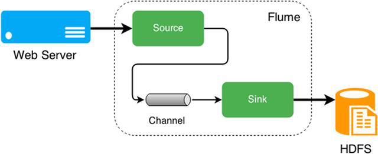
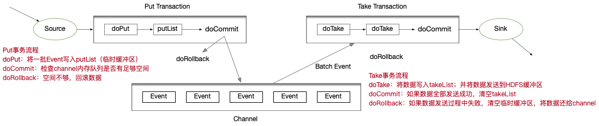

## Flume概述

无论数据来自什么企业，或是多大量级，通过部署Flume，可以确保数据都安全、及时地到达大数据平台，用户可以将精力集中在如何洞悉数据上。

### **第** **1** **节** Flume的定义

Flume由Cloudera公司开发，**是一个分布式、高可靠、高可用的海量日志采集、聚合、传输的系统**。

Flume支持在日志系统中定制各类数据发送方，用于采集数据；

Flume提供对数据进行简单处理，并写到各种数据接收方的能力；

简单的说，Flume是**实时采集日志的数据采集引擎**。



Flume有3个重要组件：Source、Channel、Sink

特点

- 分布式：flume分布式集群部署，扩展性好
- 可靠性好：当节点出现故障时，日志能够被传送到其他节点上而不会丢失
- 易用性：flume配置使用较繁琐，对使用人员专业技术要求高
- 实时采集：flume采集流模式进行数据实时采集

适用场景：适用于日志文件实时采集。

其他数据采集工具还有：DataX、Kettle、Logstash、Scribe、sqoop。

1. DataX

   阿里开源软件异构数据源离线同步工具。实现包括关系型数据库(MySQL、 Oracle等)、HDFS、Hive、ODPS、HBase、FTP等各种异构数据源之间稳定高效的数据同步功能。

   特点

    - 易用性：没有界面，以执行脚本方式运行，对使用人员技术要求较高
    - 性能：数据抽取性能高
    - 部署：可独立部署

   适用场景：在异构数据库/文件系统之间高速交换数据

2. Kettle

   开源ETL工具。支持数据库、FTP、文件、rest接口、hdfs、hive等平台的数据进行抽取、转换、传输等操作，Java编写跨平台，C/S架构，不支持浏览器模式。

   特点

    - 易用性：有可视化设计器进行可视化操作，使用简单
    - 功能强大：不仅能进行数据传输，也能同时进行数据清洗转换等操作
    - 支持多种源：支持各种数据库、FTP、文件、rest接口、hdfs、Hive等源
    - 部署方便：独立部署，不依赖第三方产品

   适用场景：数据量及增量不大，业务规则变化较快，要求可视化操作，对技术人员的技术门槛要求低。

3. Logstash

   应用程序日志、事件的传输、处理、管理和搜索的平台。可以用它来统一对应用程序日志进行收集管理，提供了Web接口用于查询和统计。


4. Scribe

Facebook开源的日志收集系统，它能够从各种日志源上收集日志，存储到一个中央存储系统（可以是NFS，分布式文件系统等）上，以便于进行集中统计分析处理。

### 第2节 Flume体系结构


Flume架构中的组件

- Agent

  本质上是一个JVM进程，该JVM进程控制Event数据流从外部日志生产者那里传输到目的地（或是下一个Agent）。一个完整的Agent中包含了三个组件Source、Channel和Sink，Source是指数据的来源和方式，Channel是一个数据的缓冲池，Sink定义了数据输出的方式和目的地

- Source

  负责接收数据到Flume Agent的组件。Source组件可以处理各种类型、各种格式的日志数据，包括avro、exec、spooldir、netcat等。

- Channel

  位于Source和Sink之间的缓冲区。Channel允许Source和Sink运作在不同的速率上。Channel是线程安全的，可以同时处理多个Source的写入操作及多个Sink的读取操作。

  常用的Channel包括:

    - Memory Channel是内存中的队列。Memory Channel在允许数据丢失的情景下适用。如果不允许数据丢失，应该避免使用Memory Channel，因为程序死亡、机器宕机或者重启都可能会导致数据丢失;
    - File Channel将所有事件写到磁盘。因此在程序关闭或机器宕机的情况下不 会丢失数据;

- Sink

  不断地轮询Channel中的事件且批量地移除它们，并将这些事件批量写入到存储或索引系统、或被发送到另一个Flume Agent。

  Sink是完全事务性的。在从Channel批量删除数据之前，每个Sink用Channel启动一个事务。批量事件一旦成功写出到存储系统或下一个Flume Agent，Sink就利用Channel提交事务。事务一旦被提交，该Channel从自己的内部缓冲区删除事件。

  Sink组件包括hdfs、logger、avro、file、null、HBase、消息队列等

- Event

  Flume定义的一个数据流传输的最小单位

### 第3节 Flume拓扑结构

**串行模式**

将多个flume给顺序连接起来，从最初的source开始到最终sink传送的目的存储系统。

此模式不建议桥接过多的flume数量， flume数量过多不仅会影响传输速率，而且一旦传输过程中某个节点flume宕机，会影响整个传输系统。


**复制模式（单Souce多Channel、Sink模式）**

将事件流向一个或者多个目的地。这种模式将数据源复制到多个channel中，每个channel都有相同的数据，sink可以选择传送的不同的目的地。


**负载均衡模式（单Source、Channel多Sink）**

将多个sink逻辑上分到一个sink组，flume将数据发送到不同的sink，主要解决负载均衡和故障转移问题。


**聚合模式**

这种模式最常见的，也非常实用，日常web应用通常分布在上百个服务器，大者甚至上千个、上万个服务器。产生的日志，处理起来也非常麻烦。用这种组合方式能很好的解决这一问题，每台服务器部署一个flume采集日志，传送到一个集中收集日志的flume，再由此flume上传到hdfs、hive、hbase、消息队列中。


### 第4节 Flume内部原理

> 总体数据流向：source => Channel => Sink
>
> Channel：处理器、拦截器、选择器


**具体过程**

1. Source接收事件，交给其Channel处理器处理事件

2. 处理器通过拦截器Interceptor，对事件一些处理，比如压缩解码，正则拦截，时间戳拦截，分类等

3. 经过拦截器处理过的事件再传给Channel选择器，将事件写入相应的Channel。

   Channel Selector有两种：

    - Replicating Channel Selector（默认），会将Source过来的Event发往所有Channel（比较常用的场景是，用多个Channel实现冗余副本，保证可用性）
    - Multiplexing Channel Selector，根据配置分发Event。此Selector会根据 Event中某个header对应的value来将Event发往不同的channel

4. 最后由Sink处理器处理各个Channel的事件

## Flume安装部署

官网地址 http://flume.apache.org/

文档地址 http://flume.apache.org/FlumeUserGuide.html

下载地址 http://archive.apache.org/dist/flume/

版本 **1.9.0**

**安装步骤**

1. 下载软件apache-flume-1.9.0-bin.tar.gz，并上传到 bigdata03上的/opt/software目录下

2. 解压apache-flume-1.9.0-bin.tar.gz到/opt/lagou/servers/目录下，并重命名为flume-1.9.0

   ```shell
   tar -zxvf /opt/software/apache-flume-1.9.0-bin.tar.gz -C /opt/servers/
   mv apache-flume-1.9.0-bin flume-1.9.0
   ```

3. 在/etc/profile中增加环境变量，并执行source /etc/profile，使修改生效

   ```
   export FLUME_HOME=/opt/servers/flume-1.9.0
   export PATH=$PATH:$FLUME_HOME/bin
   ```

4. 将$FLUME_HOME/conf下的 flume-env.sh.template 改名为 flume-env.sh，并添加JAVA_HOME的配置

   ```
   cd $FLUME_HOME/conf
   mv flume-env.sh.template flume-env.sh
   vi flume-env.sh
   ......
   export JAVA_HOME=/opt/servers/jdk1.8
   ```

   ## Flume基础应用

Flume支持的数据源种类有很多，可以来自directory、http、kafka等。Flume提供 了**Source组件**用来采集数据源；**Channel组件**用来缓存数据；**Sink组件**用来保存数据。

**常见Source**

1. Avro Source

   监听Avro端口来接收外部Avro客户端的事件流。Avro Source接收到的是经过Avro序列化后的数据，然后反序列化数据继续传输。如果是Avro Source的话，源数据必须是经过Avro序列化后的数据。利用Avro Source可以实现多级流动、扇出流、扇入流等效果。接收通过Flume提供的Avro客户端发送的日 志信息。

   > Avro是Hadoop的一个数据序列化系统，由Hadoop的创始人Doug Cutting开发，设计用于支持大批量数据交换的应用。它的主要特点:
   >
   > 1. 支持二进制序列化方式，可以便捷，快速地处理大量数据；
   > 2. 动态语言友好，Avro提供的机制使动态语言可以方便地处理Avro数据；

   

2. Exec Source

   可以将命令产生的输出作为source。如`ping 192.168.218.101`、`tail -f hive.log`。

3. NetCat Source

   一个NetCat Source用来监听一个指定端口，并接收监听到的数据。

4. Spooling Directory Source

   将指定的文件加入到“自动搜集”目录中。Flume会持续监听这个目录，把文件当做Source来处理。

   注意：一旦文件被放到目录中后， 便不能修改，如果修改，Flume会报错。此外，也不能有重名的文件。

5. Taildir Source(1.7)

   监控指定的多个文件，一旦文件内有新写入的数据， 就会将其写入到指定的Sink内，本来源可靠性高，不会丢失数据。其不会对于跟踪的文件有任何处理，不会重命名也不会删除，不会做任何修改。目前不支持Windows 系统，不支持读取二进制文件，支持一行一行的读取文本文件。

**常见Channel**

1. Memory Channel 缓存到内存中(最常用)
2. File Channel 缓存到文件中
3. JDBC Channel 通过JDBC缓存到关系型数据库中
4. Kafka Channel 缓存到Kafka中

**常见Sink**

1. Logger Sink

   将信息显示在标准输出上，主要用于测试

2. Avro Sink

   Flume Events发送到Sink，转换为Avro Events，并发送到配置好的hostname/port。从配置好的Channel按照配置好的批量大小批量获取Events

3. Null Sink

   将接收到events全部丢弃

4. HDFS Sink

   将 Events写进HDFS。支持创建文本和序列文件，支持两种文件类型压缩。文件可以基于数据的经过时间、大小、事件的数量周期性地滚动

5. Hive Sink

   该Sink Streams 将包含分割文本或者JSON数据的Events直接传送到Hive表或分区中。使用Hive事务写Events。当一系列Events提交到Hive时，它们马上可以被Hive查询到

6. HBase Sink

   保存到HBase

7. Kafka Sink

   保存到kafka

日志采集就是根据业务需求选择合适的Source、Channel、Sink，并将其组合在一起。

### 第1节 入门案例

中文帮助文档 https://flume.liyifeng.org

业务需求

- 监听本机8888端口，Flume将监听的数据实时显示在控制台

需求分析

- 使用telnet工具可以向8888端口发送数据
- 监听端口数据，选择Netcat Source
- Channel选择Memory
- 数据实时显示，选择Logger Sink

实现步骤

1. 安装telnet工具

   ```
   yum install telnet
   ```

2. 检查8888端口是否被占用。如果该端口被占用，可以选择使用其他端口完成任务

   ```
   lsof -i:8888
   ```

3. 创建Flume Agent配置文件flume-netcat-logger.conf

    ```
    # a1是agent的名称。source、channel、sink的名称分别为:r1 c1 k1
    a1.sources = r1
    a1.channels = c1
    a1.sinks = k1
    
    # source
    a1.sources.r1.type = netcat
    a1.sources.r1.bind = bigdata03
    a1.sources.r1.port = 8888
    # channel
    a1.channels.c1.type = memory
    a1.channels.c1.capacity = 10000
    a1.channels.c1.transactionCapacity = 100
    
    # sink
    a1.sinks.k1.type = logger
    
    # source、channel、sink之间的关系
    a1.sources.r1.channels = c1
    a1.sinks.k1.channel = c1
    ```

   Memory Channel是使用内存缓冲Event的Channel实现。速度比较快速，容量会受到jvm内存大小的限制，可靠性不够高。适用于允许丢失数据，但对性能要求较高的日志采集业务

4. 启动Flume Agent

   ```
   flume-ng agent --name a1 --conf-file $FLUME_HOME/conf/flume-netcat-logger.conf -Dflume.root.logger=INFO,console
   ```

    - name。定义agent的名字，要与参数文件一致
    - conf-file。指定参数文件位置
    - -D表示flume运行时动态修改flume.root.logger参数属性值，并将控制台日志打印级别设置为INFO级别。日志级别包括：log、info、warn、error

5. 使用telnet向本机的8888端口发送消息hello

   ```
   telnet bigdata03 8888
   ```

6. 在Flume监听页面查看数据接收情况

   ```
   INFO sink.LoggerSink: Event: { headers:{} body: 68 65 6C 6C 6F 0D                               hello. }
   ```

### 第2节 监控日志文件信息到HDFS

业务需求

- 监控本地日志文件，收集内容实时上传到HDFS

需求分析

- 使用 tail -F 命令即可找到本地日志文件产生的信息
- Source选择Exec。Exec监听一个指定的命令，获取命令的结果作为数据源。Source组件从这个命令的结果中取数据。当agent进程挂掉重启后，可能存在数据丢失;
- Channel选择Memory
- Sink选择HDFS

> tail -f
>
> 等同于--follow=descriptor，根据文件描述符进行追踪，当文件改名或被删除，追
>
> 踪停止
>
> tail -F
>
> 等同于--follow=name --retry，根据文件名进行追踪，并保持重试，即该文件被
>
> 删除或改名后，如果再次创建相同的文件名，会继续追踪

实现步骤

1. 环境准备

   Flume要想将数据输出到HDFS，必须持有Hadoop相关jar包。将

   commons-configuration-1.6.jar hadoop-auth-2.9.2.jar hadoop-common- 2.9.2.jar hadoop-hdfs-2.9.2.jar commons-io-2.4.jar htrace-core4-4.1.0-incubating.jar

   拷贝到 $FLUME_HOME/lib 文件夹下，目前验证此步骤没必要

   ```
   cd $HADOOP_HOME/share/hadoop/httpfs/tomcat/webapps/webhdfs/WEB-INF/lib
   cp commons-configuration-1.6.jar $FLUME_HOME/lib
   cp hadoop-auth-2.9.2.jar $FLUME_HOME/lib
   cp hadoop-common-2.9.2.jar $FLUME_HOME/lib
   cp hadoop-hdfs-2.9.2.jar $FLUME_HOME/lib
   cp commons-io-2.4.jar $FLUME_HOME/lib
   cp htrace-core4-4.1.0-incubating.jar $FLUME_HOME/lib
   ```

2. 创建配置文件flume-exec-hdfs.conf

   ```
   # Name the components on this agent
   a2.sources = r2
   a2.sinks = k2
   a2.channels = c2
   
   # Describe/configure the source
   a2.sources.r2.type = exec
   a2.sources.r2.command = tail -F /opt/servers/hive-2.3.7/logs/hive.log
   
   # Use a channel which buffers events in memory
   a2.channels.c2.type = memory
   a2.channels.c2.capacity = 10000
   a2.channels.c2.transactionCapacity = 500
   
   # Describe the sink
   a2.sinks.k2.type = hdfs
   a2.sinks.k2.hdfs.path = hdfs://bigdata01:9000/flume/%Y%m%d/%H%M
   # 上传文件的前缀
   a2.sinks.k2.hdfs.filePrefix = logs-
   # 是否使用本地时间戳
   a2.sinks.k2.hdfs.useLocalTimeStamp = true
   # 积攒500个Event才flush到HDFS一次
   a2.sinks.k2.hdfs.batchSize = 500
   # 设置文件类型，支持压缩。DataStream没启用压缩
   a2.sinks.k2.hdfs.fileType = DataStream
   # 1分钟滚动一次
   a2.sinks.k2.hdfs.rollInterval = 60
   # 128M滚动一次
   a2.sinks.k2.hdfs.rollSize = 134217700
   # 文件的滚动与Event数量无关
   a2.sinks.k2.hdfs.rollCount = 0
   # 最小冗余数
   a2.sinks.k2.hdfs.minBlockReplicas = 1
   
   # Bind the source and sink to the channel
   a2.sources.r2.channels = c2
   a2.sinks.k2.channel = c2
   ```

3. 启动agent

   ```
   flume-ng agent --name a2 --conf-file ./flume-exec-hdfs.conf -Dflume.root.logger=INFO,console
   ```

4. 启动hadoop和hive，操作hive产生日志

   ```
   start-dfs.sh start-yarn.sh
   # 在命令行多次执行
   hive -e "show databases"
   ```

5. 在HDFS查看文件


### 第3节 监控目录采集信息到HDFS

业务需求

- 监控指定目录，收集信息实时上传到HDFS

需求分析

- Source选择Spooling Directory。Spooling Directory能够保证数据不丢失，且能够实现断点续传， 但延迟较高，不能实时监控
- Channel选择Memory
- Sink选择HDFS

Spooling Directory Source监听一个指定的目录，即只要向指定目录**添加新的文件**，Source组件就可以获取到该信息，并解析该文件的内容，写入到Channel。Sink处理完之后， 标记该文件已完成处理，文件名添加`.completed`后缀。虽然是自动监控整个目录， 但是只能监控文件，如果以追加的方式向已被处理的文件中添加内容，Source并不能识别。

> 注意
>
> - 拷贝到spool目录下的文件不可以再打开编辑
> - 无法监控子目录的文件夹变动
> - 被监控文件夹每500毫秒扫描一次文件变动
> - 适合用于同步新文件，但不适合对实时追加日志的文件进行监听并同步

实现步骤

1. 创建配置文件`flume-spooldir-hdfs.conf`

   ```
   # Name the components on this agent
   a3.sources = r3
   a3.channels = c3
   a3.sinks = k3
   
   # Describe/configure the source
   a3.sources.r3.type = spooldir
   a3.sources.r3.spoolDir = /root/upload
   a3.sources.r3.fileSuffix = .COMPLETED
   a3.sources.r3.fileHeader = true
   
   # 忽略以.tmp结尾的文件，不上传
   a3.sources.r3.ignorePattern = ([^ ]*\.tmp)
   
   # Use a channel which buffers events in memory
   a3.channels.c3.type = memory
   a3.channels.c3.capacity = 10000
   a3.channels.c3.transactionCapacity = 500
   
   # Describe the sink
   a3.sinks.k3.type = hdfs
   a3.sinks.k3.hdfs.path = hdfs://bigdata01:9000/flume/upload/%Y%m%d/%H%M
   a3.sinks.k3.hdfs.filePrefix = upload-
   # 是否使用本地时间戳
   a3.sinks.k3.hdfs.useLocalTimeStamp = true
   # 积攒500个Event，flush到HDFS一次
   a3.sinks.k3.hdfs.batchSize = 500
   # 设置文件类型
   a3.sinks.k3.hdfs.fileType = DataStream
   # 60秒滚动一次
   a3.sinks.k3.hdfs.rollInterval = 60
   # 128M滚动一次
   a3.sinks.k3.hdfs.rollSize = 134217700
   # 文件滚动与event数量无关
   a3.sinks.k3.hdfs.rollCount = 0
   # 最小冗余数
   a3.sinks.k3.hdfs.minBlockReplicas = 1
   
   # Bind the source and sink to the channel
   a3.sources.r3.channels = c3
   a3.sinks.k3.channel = c3
   ```

2. 启动agent

   ```
   flume-ng agent --name a3 --conf-file /opt/servers/flume-1.9.0/conf/flume-spooldir-hdfs.conf -Dflume.root.logger=INFO,console
   ```

3. 向`/root/upload`文件夹中添加文件

4. 查看HDFS上的数据

### 第4节 监控日志文件采集数据到HDFS、本地文件系统

业务需求

- 监控日志文件，收集信息上传到HDFS和本地文件系统

需求分析

- 需要多个Agent级联实现

- Source选择Taildir

  Taildir Source。Flume 1.7.0加入的新Source，相当于 Spooling Directory Source + Exec Source。可以监控多个目录，并且使用正则表达式匹配该目录中的文件名进行实时收集。实时监控一批文件，并记录每个文件最新消费位置，agent进程重启后不会有数据丢失的问题。目前不适用于Windows系统；其不会对于跟踪的文件有任何处理，不会重命名也不会删除，不会做任何修改。不支持读取二进制文件，支持一行一行的读取文本文件。

- Channel选择Memory

- 最终的Sink分别选择HDFS、File Roll


实现步

1. 创建agent1配置文件`flume-taildir-avro.conf`

    - 1个 Taildir Source
    - 2个 Memory Channel
    - 2个 Avro Sink

   ```
   # Name the components on this agent
   a1.sources = r1
   a1.sinks = k1 k2
   a1.channels = c1 c2
   
   # 将数据流复制给所有channel
   a1.sources.r1.selector.type = replicating
   
   # source type
   a1.sources.r1.type = taildir
   # 记录每个文件最新消费位置
   a1.sources.r1.positionFile = /root/flume/taildir_position.json
   a1.sources.r1.filegroups = f1
   # 备注:.*log 是正则表达式;这里写成 *.log 是错误的
   a1.sources.r1.filegroups.f1 = /opt/servers/hive-2.3.7/logs/.*log
   
   # sink
   a1.sinks.k1.type = avro
   a1.sinks.k1.hostname = bigdata03
   a1.sinks.k1.port = 9091
   a1.sinks.k2.type = avro
   a1.sinks.k2.hostname = bigdata03
   a1.sinks.k2.port = 9092
   
   # channel
   a1.channels.c1.type = memory
   a1.channels.c1.capacity = 10000
   a1.channels.c1.transactionCapacity = 500
   
   a1.channels.c2.type = memory
   a1.channels.c2.capacity = 10000
   a1.channels.c2.transactionCapacity = 500
   
   # Bind the source and sink to the channel
   a1.sources.r1.channels = c1 c2
   a1.sinks.k1.channel = c1
   a1.sinks.k2.channel = c2
   ```

2. 创建agent2配置文件`flume-avro-hdfs.conf`

    - 1个Avro Source
    - 1个Memory Channel
    - 1个HDFS Sink

   ```
   # Name the components on this agent
   a2.sources = r1
   a2.sinks = k1
   a2.channels = c1
   
   # Describe/configure the source
   a2.sources.r1.type = avro
   a2.sources.r1.bind = bigdata03
   a2.sources.r1.port = 9091
   
   # Describe the channel
   a2.channels.c1.type = memory
   a2.channels.c1.capacity = 10000
   a2.channels.c1.transactionCapacity = 500
   
   # Describe the sink
   a2.sinks.k1.type = hdfs
   a2.sinks.k1.hdfs.path = hdfs://bigdata01:9000/flume2/%Y%m%d/%H
   # 上传文件的前缀
   a2.sinks.k1.hdfs.filePrefix = flume2-
   # 是否使用本地时间戳
   a2.sinks.k1.hdfs.useLocalTimeStamp = true
   # 500个Event才flush到HDFS一次
   a2.sinks.k1.hdfs.batchSize = 500
   # 设置文件类型，可支持压缩
   a2.sinks.k1.hdfs.fileType = DataStream
   # 60秒生成一个新的文件
   a2.sinks.k1.hdfs.rollInterval = 60
   a2.sinks.k1.hdfs.rollSize = 0
   a2.sinks.k1.hdfs.rollCount = 0
   a2.sinks.k1.hdfs.minBlockReplicas = 1
   
   # Bind the source and sink to the channel
   a2.sources.r1.channels = c1
   a2.sinks.k1.channel = c1
   ```

3. 创建agent3配置文件`flume-avro-file.conf`

    - 1个Avro Source
    - 1个Memory Channel
    - 1个File Roll Sink

   ```
   # Name the components on this agent
   a3.sources = r1
   a3.sinks = k1
   a3.channels = c2
   
   # Describe/configure the source
   a3.sources.r1.type = avro
   a3.sources.r1.bind = bigdata03
   a3.sources.r1.port = 9092
   
   # Describe the sink
   a3.sinks.k1.type = file_roll
   # 目录需要提前创建好
   a3.sinks.k1.sink.directory = /root/flume/output
   
   # Describe the channel
   a3.channels.c2.type = memory
   a3.channels.c2.capacity = 10000
   a3.channels.c2.transactionCapacity = 500
   
   # Bind the source and sink to the channel
   a3.sources.r1.channels = c2
   a3.sinks.k1.channel = c2
   ```

4. 分别启动3个Agent

   先启动agent2、agent3，最后启动agent1

   ```
   cd $FLUME_HOME/conf
   flume-ng agent --name a2 --conf-file ./flume-avro-hdfs.conf -Dflume.root.logger=INFO,console
   flume-ng agent --name a3 --conf-file ./flume-avro-file.conf -Dflume.root.logger=INFO,console
   flume-ng agent --name a1 --conf-file ./flume-taildir-avro.conf -Dflume.root.logger=INFO,console
   ```

5. 执行hive命令产生日志

   ```
   hive -e "show databases"
   ```

6. 分别检查HDFS文件、文帝文件以及消费位置文件

三种监控日志文件Source对比

- Exec Source：适用于监控一个实时追加的文件，但不能保证数据不丢失;
- Spooling Directory Source：能够保证数据不丢失，且能够实现断点续传，但延迟较高，不能实时监控
- Taildir Source：既能够实现断点续传，又可以保证数据不丢失，还能够进行实时监控。

## Flume高级特性

### 第1节 拦截器

Flume支持在运行时对Event进行修改或丢弃，通过拦截器来实现;

Flume拦截器实现了*org.apache.flume.interceptor.Interceptor* 接口的类; 拦截器可以根据配置修改甚至丢弃Event；Flume也支持链式的拦截器执行方式，在配置文件里面配置多个拦截器就可以了；拦截器的顺序取决于它们配置的顺序，Event 按照顺序经过每一个拦截器

#### 时间戳添加拦截器

这个拦截器会向每个Event的header中添加一个时间戳属性进去，key默认是 “timestamp ”（也可以通过下面表格中的header来自定义），value就是当前的毫秒值（其实就是用*System.currentTimeMillis()*方法得到的）。如果Event已经存在同名的属性，可以选择是否保留原始的值。

| 属性             | 默认值    | 解释                                                         |
| ---------------- | --------- | ------------------------------------------------------------ |
| type             | -         | timestamp                                                    |
| header           | timestamp | 向event header中添加时间戳键值对的key                        |
| preserveExisting | false     | 是否保留event header中已经存在的同名（上面header设置的key，默认是 timestamp）时间戳 |

时间戳添加拦截器测试

1. 再次运行入门案例中的测试，观察event header信息

   ```
   flume-ng agent --name a1 --conf-file ./flume-netcat-logger.conf -Dflume.root.logger=INFO,console
   
   telnet bigdata03 8888
   #输入hello world
   ```

   

   可以看到header为空

2. 在入门案例的基础上，在配置文件中增加时间拦截器的配置，命名为timestamp.conf

   ```
   # a1是agent的名称。source、channel、sink的名称分别为:r1 c1 k1
   a1.sources = r1
   a1.channels = c1
   a1.sinks = k1
   
   # source
   a1.sources.r1.type = netcat
   a1.sources.r1.bind = bigdata03
   a1.sources.r1.port = 8888
   
   # 这部分是新增 时间拦截器的 内容
   a1.sources.r1.interceptors = i1
   a1.sources.r1.interceptors.i1.type = timestamp
   # 是否保留Event header中已经存在的同名时间戳，缺省值false
   a1.sources.r1.interceptors.i1.preserveExisting= false
   # 这部分是新增 时间拦截器 的内容
   
   # channel
   a1.channels.c1.type = memory
   a1.channels.c1.capacity = 10000
   a1.channels.c1.transactionCapacity = 100
   
   # sink
   a1.sinks.k1.type = logger
   
   # source、channel、sink之间的关系
   a1.sources.r1.channels = c1
   a1.sinks.k1.channel = c1
   ```

3. 启动agent

   ```
   flume-ng agent --name a1 --conf-file ./timestamp.conf -Dflume.root.logger=INFO,console
   
   telnet bigdata03 8888
   #输入hello world
   ```

   

   可以看见 event header 中出现了时间戳信息。

#### Host添加拦截器

这个拦截器会把当前Agent的hostname 或者 IP 地址写入到Event的header中，key默认是“host”（也可以通过配置自定义key），value可以选择使用hostname或者IP 地址。

| 属性             | 默认值 | 解释                                   |
| ---------------- | ------ | -------------------------------------- |
| type             | -      | 组件类型，这个是：host                 |
| preserveExisting | false  | 如果header中已经存在同名的属性是否保留 |
| useIP            | true   | true：使用IP地址；false：使用hostname  |
| hostHeader       | host   | 向Event header中添加host键值对的key    |

host添加拦截器测试

1. 在时间戳拦截器案例的基础上，在配置文件中增加主机名拦截器的配置`hostname.conf`

   ```
   # a1是agent的名称。source、channel、sink的名称分别为:r1 c1 k1
   a1.sources = r1
   a1.channels = c1
   a1.sinks = k1
   
   # source
   a1.sources.r1.type = netcat
   a1.sources.r1.bind = bigdata03
   a1.sources.r1.port = 8888
   
   # 这部分是新增 时间戳拦截器的 内容
   a1.sources.r1.interceptors = i1 i2
   a1.sources.r1.interceptors.i1.type = timestamp
   # 是否保留Event header中已经存在的同名时间戳，缺省值false
   a1.sources.r1.interceptors.i1.preserveExisting= false
   # 这部分是新增 时间戳拦截器 的内容
   
   #这部分是新增 主机名拦截器 的内容
   a1.sources.r1.interceptors.i2.type = host
   # 如果header中已经存在同名的属性是否保留
   a1.sources.r1.interceptors.i2.preserveExisting= false
   # true:使用IP地址;false:使用hostname
   a1.sources.r1.interceptors.i2.useIP = false
   #这部分是新增 主机名拦截器 的内容
   
   # channel
   a1.channels.c1.type = memory
   a1.channels.c1.capacity = 10000
   a1.channels.c1.transactionCapacity = 100
   
   # sink
   a1.sinks.k1.type = logger
   
   # source、channel、sink之间的关系
   a1.sources.r1.channels = c1
   a1.sinks.k1.channel = c1
   ```

2. 启动agent

   ```
   flume-ng agent --name a1 --conf-file ./hostname.conf -Dflume.roog.logger=INFO,console
   
   telnet bigdata03 8888
   #输入hello
   ```

   

   可以看见event headers 中 增加了主机名信息、时间戳信息。

#### 正则表达式过滤拦截器

这个拦截器会把Event的body当做字符串来处理，并用配置的正则表达式来匹配。可以配置指定被匹配到的Event丢弃还是没被匹配到的Event丢弃。


### 第2节 选择器

Source可以向多个Channel同时写数据，所以也就产生了以何种方式向多个Channel写的问题

- replication(复制，缺省)。数据完整地发送到每一个channel；
- multiplexing(多路复用)。通过配置来按照一定的规则进行分发；

#### 复制选择器

默认的选择器

| 属性              | 默认值      | 解释                                  |
| ----------------- | ----------- | ------------------------------------- |
| selector.type     | Replicating | 复制                                  |
| selector.optional | -           | 指定哪些channel是可选的，多个空格分开 |

```
a1.sources = r1
a1.channels = c1 c2 c3
a1.sources.r1.selector.type = replicating
a1.sources.r1.channels = c1 c2 c3
a1.sources.r1.selector.optional = c3
```

上面这个例子中，c3配置成了可选的。向c3发送数据如果失败了会被忽略。c1和c2没有配置成可选的，向c1和c2写数据失败会导致事务失败回滚。

#### 多路复用选择器

| 属性               | 默认值                | 说明                                                         |
| ------------------ | --------------------- | ------------------------------------------------------------ |
| selector.type      | replicating           | 组件类型，这个是：`multiplexing`                             |
| selector.header    | flume.selector.header | 想要进行匹配的header属性的名字                               |
| selector.default   | -                     | 指定一个默认的channel。如果没有被规则匹配到，默认会发送到这个channel上 |
| selector.mapping.* | -                     | 一些匹配规则，具体参考例子                                   |

```
a1.sources = r1
a1.channels = c1 c2 c3 c4
a1.sources.r1.selector.type = multiplexing
# 以每个Event的header中的state这个属性的值作为选择channel的依据
a1.sources.r1.selector.header = state
#如果state=CZ，则选择c1这个channel
a1.sources.r1.selector.mapping.CZ = c1
#如果state=US，则选择c2和c3这两个channel
a1.sources.r1.selector.mapping.US = c2 c3
#默认使用c4这个channel
a1.sources.r1.selector.default = c4
```

#### 自定义选择器

自定义选择器就是开发一个org.apache.flume.ChannelSelector接口的实现类。实现类以及依赖的jar包在启动时候都必须放入Flume的classpath。

| 属性          | 默认值 | 解释                                                         |
| ------------- | ------ | ------------------------------------------------------------ |
| selector.type | -      | 你写的自定义选择器的全限定类型，例：org.flume.channel.MyChannelSelector |

```
a1.sources = r1
a1.channels = c1
a1.sources.r1.selector.type = org.flume.channel.MyChannelSelector
```

### 第3节 Sink组逻辑处理器

可以把多个Sink分成一个组， Sink组逻辑处理器可以对这同一个组里的几个Sink进行负载均衡或者其中一个sink发生故障后将输出Event的任务转移到其他的sink上。

N个Sink将Event输出到对应的N个目的地的，通过Sink组逻辑处理器可以把这N个Sink配置成**负载均衡**或者**故障转移**的工作方式

- 负载均衡是将Channel里面的Event，按照配置的负载机制（比如轮询）分别发送到Sink各自对应的目的地
- 故障转移是这N个Sink同一时间只有一个在工作，其余的作为备用，工作的Sink挂掉之后备用的Sink顶上

| 属性           | 默认值 | 解释                                                         |
| -------------- | ------ | ------------------------------------------------------------ |
| sinks          | -      | 这一组的所有sink名，多个用空格分隔                           |
| processor.type | type   | 这个sink组的逻辑处理器类型，可选值`default`（默认一对一）、`failover`（故障转移）、`load_balance`（负载均衡） |

```
a1.sinkgroups = g1
a1.sinkgroups.g1.sinks = k1 k2
a1.sinkgroups.g1.processor.type = load_balance
```

#### 默认

默认的组逻辑处理器就是只有一个sink的情况，这种情况就没必要配置sink组了。前面的例子都是 Source-Channel-Sink这种一对一，单个Sink的。

#### 故障转移

故障转移组逻辑处理器维护了一个发送Event失败的Sink的列表，保证有一个Sink是可用的来发送Event。

故障转移机制的工作原理是将故障Sink降级到一个池中，在池中为它们分配冷却期（超时时间），在重试之前随顺序故障而增加。 Sink成功发送事件后，它将恢复到实时池。Sink具有与之相关的优先级，数值越大，优先级越高。 如果在发送Event时Sink发生故障，会继续尝试下一个具有最高优先级的Sink。 例如，在优先级为80的Sink之前激活优先级为100的Sink。如果未指定优先级，则根据配置中的顺序来选取。

要使用故障转移选择器，不仅要设置Sink组的选择器为failover，还有为每一个Sink设置一个唯一的优先级数值。 可以使用 *maxpenalty* 属性设置故障转移时间的上限 (毫秒)。

| 属性                          | 默认值  | 说明                                                         |
| ----------------------------- | ------- | ------------------------------------------------------------ |
| sinks                         | -       | 这一组的所有sink名，多个用空格分开                           |
| processor.type                | default | 组件类型，这个是：`failover`                                 |
| processor.priority.<sinkName> | -       | 组内sink的权重值，<sinkName>必须是当前组关联的sink之一。数值（绝对值）越高越早被激活 |
| processor.maxpenalty          | 30000   | 发生异常的Sink最大故障转移时间（毫秒）                       |

```
a1.sinkgroups = g1
a1.sinkgroups.g1.sinks = k1 k2
a1.sinkgroups.g1.processor.type = failover
a1.sinkgroups.g1.processor.priority.k1 = 5
a1.sinkgroups.g1.processor.priority.k2 = 10
a1.sinkgroups.g1.processor.maxpenalty = 10000
```

#### 负载均衡

负载均衡Sink选择器提供了在多个sink上进行负载均衡流量的功能。 它维护一个活动Sink列表的索引来实现负载的分配。 支持轮询（round_robin）【默认值】和随机（random）两种选择机制分配负载。

工作时，此选择器使用其配置的选择机制选择下一个Sink并调用它。 如果所选Sink无法正常工作，则处理器通过其配置的选择机制选择下一个可用Sink。 此实现不会将失败的Sink列入黑名单，而是继续乐观地尝试每个可用的Sink。

如果所有Sink调用都失败了，选择器会将故障抛给Sink的运行器。

如果 backoff 设置为true则启用了退避机制，失败的Sink会被放入黑名单，达到一定的超时时间后会自动从黑名单移除。 如从黑名单出来后Sink仍然失败，则再次进入黑名单而且超时时间会翻倍，以避免在无响应的Sink上浪费过长时间。 如果没有启用退避机制，在禁用此功能的情况下，发生Sink传输失败后，会将本次负载传给下一 个Sink继续尝试，因此这种情况下是不均衡的。

| 属性                          | 默认值      | 解释                                                         |
| ----------------------------- | ----------- | ------------------------------------------------------------ |
| processor.sinks               | -           | 这一组的所有sink名，多个用空格分开                           |
| processor.type                | default     | 组件类型，这个是`load_balance`                               |
| processor.backoff             | false       | 失败的sink是否成倍地增加退避它的时间。 如果设置为false，负载均衡在某一个sink发生异常后，下一次选择sink的时候仍然会将失败的这个sink加入候选队列； 如果设置为true，某个sink连续发生异常时会成倍地增加它的退避时间，在退避的时间内是无法参与负载均衡竞争的。退避机制只统计1个小时发生的异常，超过1个小时没有发生异常就会重新计算 |
| processor.selector            | round_robin | 负载均衡机制，可选值：`round_robin` （轮询）、 `random` （随机选择）、「自定义选择器的全限定类名」：自定义的负载器要继承 *AbstractSinkSelector* |
| processor.selector.maxTimeOut | 30000       | 发生异常的sink最长退避时间（毫秒） 如果设置了processor.backoff=true，某一个sink发生异常的时候就会触发自动退避它一段时间，这个 *maxTimeOut* 就是退避一个sink的最长时间 |

```
a1.sinkgroups = g1
a1.sinkgroups.g1.sinks = k1 k2
a1.sinkgroups.g1.processor.type = load_balance
a1.sinkgroups.g1.processor.backoff = true
a1.sinkgroups.g1.processor.selector = random
```


### 第4节 事务机制与可靠性

一提到事务，首先就想到的是关系型数据库中的事务，事务一个典型的特征就是将一批操作做成原子性的，要么都成功，要么都失败。 在Flume中一共有两个事务：

- Put事务：在Source到Channel之间
- Take事务：Channel到Sink之间

从Source到Channel过程中，数据在Flume中会被封装成Event对象，也就是一批Event，把这批Event放到一个事务中，把这个事务也就是这批Event一次性的放入Channel中。同理，Take事务的时候，也是把这一批Event组成的事务统一拿出来到Sink放到HDFS上。

#### Flume中的Put事务

- 事务开始的时候会调用一个`doPut`方法， `doPut`方法将一批数据放在`putList`中;
   - `putList`在向Channel发送数据之前先检查Channel的容量能否放得下，如果放不下一个都不放，只能`doRollback`；
   - 数据批的大小取决于配置参数`batch size`的值；
   - `putList`的大小取决于配置Channel的参数`transaction capacity`的大小，该参数大小就体现在putList上;（Channel的另一个参数`capacity`指的是Channel的容量）

- 数据顺利的放到`putList`之后，接下来可以调用`doCommit`方法，把putList中所有 的 Event 放到 Channel 中，成功放完之后就清空putList;

在`doCommit`提交之后，事务在向`Channel`存放数据的过程中，事务容易出问题。 如`Sink`取数据慢，而`Source`放数据速度快，容易造成`Channel`中数据的积压，如果`putList`中的数据放不进去，会如何呢?

此时会调用`doRollback`方法，`doRollback`方法会进行两项操作：将`putList`清空；抛出ChannelException异常。Source会捕捉到`doRollback`抛出的异常，然后Source就将刚才的一批数据重新采集，然后重新开始一个新的事务，这就是事务的回滚。


#### Flume中的Take事务

Take事务同样也有`takeList`，HDFS Sink配置有一个`batch size`，这个参数决定Sink从Channel取数据的时候一次取多少个，所以该`batch size`得小于`takeList`的大小，而`takeList`的大小取决于`transaction capacity`的大小，同样是Channel中的参数。



**Take事务流程：**

事务开始后`doTake`方法会将Channel中的Event剪切到takeList中。如果后面接的是HDFS Sink的话，在把Channel中的Event剪切到takeList中的同时也往写入HDFS的IO 缓冲流中放一份event(数据写入HDFS是先写入IO缓冲流然后flush到HDFS);

当takeList中存放了`batch size`数量的Event之后，就会调用doCommit方法， doCommit方法会做两个操作:

1. 针对HDFS Sink，手动调用IO流的flush方法，将IO流缓冲区的数据写入到HDFS磁盘中；
2. 清空takeList中的数据

flush到HDFS的时候组容易出问题。flush到HDFS的时候，可能由于网络原因超时导致数据传输失败，这个时候调用`doRollback`方法来进行回滚，回滚的时候由于takeList中还有备份数据，所以将takeList中的数据原封不动地还给Channel，这时候就完成了事务的回滚。但是，如果flush到HDFS的时候，数据flush了一半之后出问题了，这意味着已经有一半的数据已经发送到HDFS上面了，现在出了问题，同样需要调用`doRollback`方法来进行回滚，回滚并没有“一半”之说，它只会把整个takeList中的数据返回给Channel，然后继续进行数据的读写。这样开启下一个事务的时候容易造成数据重复的问题。

Flume在数据进行采集传输的时候，有可能会造成数据的重复，但不会丢失数据。 Flume在数据传输的过程中是否可靠，还需要考虑具体使用Source、Channel、Sink的类型。

- 分析Source

  Exec Source ，后面接 tail -f ，这个数据也是有可能丢的

  TailDir Source ，这个是不会丢数据的，它可以保证数据不丢失

- 分析Sink

  HDFS Sink，数据有可能重复，但是不会丢失

- 分析Channel

  理论上说：要想数据不丢失的话，还是要用File Channel；Memory Channel在Flume挂掉的时候是有可能造成数据丢失的。

- 如果使用Taildir Source和HDFS Sink，所以数据会重复但是不会丢失

### 第5节 高可用案例-Agent故障转移


1. 配置环境

   在bigdata01、bigdata02上部署Flume，修改环境变量

   ```shell
   #在bigdata03上执行
   cd /opt/servers/
   #同步flume
   rsync-script flume-1.9.0
   #同步环境变量配置
   rsync-script /etc/profile
   
   #在bigdata01、bigdata02上执行
   source /etc/profile
   ```

2. agent配置文件

   Agent1: bigdata03上`flume-taildir-avro.conf`

   ```
   # agent name
   a1.sources = r1
   a1.channels = c1
   a1.sinks = k1 k2
   
   # source
   a1.sources.r1.type = TAILDIR
   a1.sources.r1.positionFile = /root/flume_log/taildir_position.json
   a1.sources.r1.filegroups = f1
   a1.sources.r1.filegroups.f1 = /tmp/root/.*log
   a1.sources.r1.fileHeader = true
   
   # interceptor
   a1.sources.r1.interceptors = i1 i2
   a1.sources.r1.interceptors.i1.type = static
   a1.sources.r1.interceptors.i1.key = Type
   a1.sources.r1.interceptors.i1.value = LOGIN
   # 在event header添加了时间戳
   a1.sources.r1.interceptors.i2.type = timestamp
   
   # channel
   a1.channels.c1.type = memory
   a1.channels.c1.capacity = 10000
   a1.channels.c1.transactionCapacity = 500
   
   # sink group
   a1.sinkgroups = g1
   a1.sinkgroups.g1.sinks = k1 k2
   
   # set sink1
   a1.sinks.k1.type = avro
   a1.sinks.k1.hostname = bigdata01
   a1.sinks.k1.port = 9999
   
   # set sink2
   a1.sinks.k2.type = avro
   a1.sinks.k2.hostname = bigdata02
   a1.sinks.k2.port = 9999
   
   # set failover
   a1.sinkgroups.g1.processor.type = failover
   a1.sinkgroups.g1.processor.priority.k1 = 100
   a1.sinkgroups.g1.processor.priority.k2 = 60
   a1.sinkgroups.g1.processor.maxpenalty = 10000
   
   a1.sources.r1.channels = c1
   a1.sinks.k1.channel = c1
   a1.sinks.k2.channel = c1
   ```

   Agent2: bigdata01上flume-avro-hdfs.conf

   ```
   # set Agent name
   a2.sources = r1
   a2.channels = c1
   a2.sinks = k1
   # Source
   a2.sources.r1.type = avro
   a2.sources.r1.bind = bigdata01
   a2.sources.r1.port = 9999
   
   # interceptor
   a2.sources.r1.interceptors = i1
   a2.sources.r1.interceptors.i1.type = static
   a2.sources.r1.interceptors.i1.key = Collector
   a2.sources.r1.interceptors.i1.value = bigdata01
   
   # set channel
   a2.channels.c1.type = memory
   a2.channels.c1.capacity = 10000
   a2.channels.c1.transactionCapacity = 500
   
   # HDFS Sink
   a2.sinks.k1.type=hdfs
   a2.sinks.k1.hdfs.path=hdfs://bigdata01:9000/flume/failover/
   a2.sinks.k1.hdfs.fileType=DataStream
   a2.sinks.k1.hdfs.writeFormat=TEXT
   a2.sinks.k1.hdfs.rollInterval=60
   a2.sinks.k1.hdfs.filePrefix=%Y-%m-%d
   a2.sinks.k1.hdfs.minBlockReplicas=1
   a2.sinks.k1.hdfs.rollSize=0
   a2.sinks.k1.hdfs.rollCount=0
   a2.sinks.k1.hdfs.idleTimeout=0
   
   a2.sources.r1.channels = c1
   a2.sinks.k1.channel=c1
   ```

   Agent3：bigdata02上flume-avro-hdfs.conf

   ```
   # set Agent name
   a3.sources = r1
   a3.channels = c1
   a3.sinks = k1
   
   # Source
   a3.sources.r1.type = avro
   a3.sources.r1.bind = bigdata02
   a3.sources.r1.port = 9999
   
   # interceptor
   a3.sources.r1.interceptors = i1
   a3.sources.r1.interceptors.i1.type = static
   a3.sources.r1.interceptors.i1.key = Collector
   a3.sources.r1.interceptors.i1.value = bigdata02
   
   # set channel
   a3.channels.c1.type = memory
   a3.channels.c1.capacity = 10000
   a3.channels.c1.transactionCapacity = 500
   
   # HDFS Sink
   a3.sinks.k1.type=hdfs
   a3.sinks.k1.hdfs.path=hdfs://bigdata01:9000/flume/failover/
   a3.sinks.k1.hdfs.fileType=DataStream
   a3.sinks.k1.hdfs.writeFormat=TEXT
   a3.sinks.k1.hdfs.rollInterval=60
   a3.sinks.k1.hdfs.filePrefix=%Y-%m-%d
   a3.sinks.k1.hdfs.minBlockReplicas=1
   a3.sinks.k1.hdfs.rollSize=0
   a3.sinks.k1.hdfs.rollCount=0
   a3.sinks.k1.hdfs.idleTimeout=0
   
   a3.sources.r1.channels = c1
   a3.sinks.k1.channel=c1
   ```

3. 分别在bigdata01、bigdata02、bigdata03上启动对应服务

   bigdata01上启动Agent2

   ```
   flume-ng agent --name a2 --conf-file $FLUME_HOME/conf/test/flume-avro-hdfs.conf -Dflume.root.logger=INFO,console
   ```

   bigdata02上启动Agent3

   ```
   flume-ng agent --name a3 --conf-file $FLUME_HOME/conf/test/flume-avro-hdfs.conf -Dflume.root.logger=INFO,console
   ```

   bigdata03上启动Agent

   ```
   flume-ng agent --name a1 --conf-file $FLUME_HOME/conf/test/flume-taildir-avro.conf -Dflume.root.logger=INFO,console
   ```

4. 先向test.log中写入数据，然后检查HDFS目录

   ```
   echo 'hello' >> /tmp/root/test.log
   ```

5. 杀掉Agent2或Agent3，执行步骤4查看其它Agent