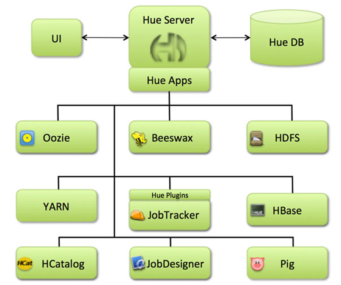
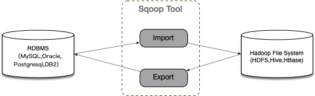

# Hive 数据仓库工具

## Hive概述

### Hive产生背景

直接使用MapReduce处理大数据，将面临以下问题

> MapReduce开发难度大，学习成本高
>
> HDFS文件没有字段名、没有数据类型，不方便进行数据的文件管理
>
> 使用MapReduce框架开发，项目周期长，成本高

Hive是基于Hadoop的一个**数据仓库工具**，可以将结构化的数据文件映射为一张表（类似于RDBMS中的表），并提供类SQL查询功能；Hive是由Facebook开源，用于解决海量结构化日志的数据统计。

- Hive的本质：将SQL转换为MapReduce的任务进行计算
- 底层：由HDFS来提供数据存储
- 可以将Hive理解为一个将SQL转换为MapReduce任务的工具

数据仓库（Data Warehouse）是一个面向主题的、集成的、相对稳定的、反应历史变化的数据集合，主要用于管理决策。（数据仓库之父比尔·恩门，1991年提出）

- 数据仓库的目的：构建面向分析的、集成的数据结合；为企业提供决策支持
- 数据仓库本身不产生数据，数据来源于外部
- 存储了大量数据，对这些数据的分析和处理不可避免的用到Hive

### Hive和RDBMS对比

由于Hive采用了类似SQL的查询语言HQL（Hive QUERY Language），因此很容易将Hive理解为数据库。其实从结构上来看，Hive和传统的关系数据库除了拥有类似的查询语言，再无类似之处。


> **查询语言。**HQL<=>SQL高度相似
>
> 由于SQL被广泛的应用在数据仓库中，因此，专门针对Hive的特性设计了类SQL的查询语言HQL。熟悉SQL开发的开发者可以很方便的使用Hive进行开发。
>
> 
>
> **数据规模。**Hive处理海量数据；RDBMS只能处理有限的数据集；
>
> 由于Hive建立在集群上并可以利用MapReduce进行并行计算，因此可以支持很大规模的数据；而RDBMS可以支持的数据规模较小。
>
> 
>
> **执行引擎。**Hive的引擎是MR/Tez/Spark/Flink；RDBMS使用自己的执行引擎；
>
> Hive中大多数查询的执行时通过Hadoop提供的MapReduce来实现的。而RDBMS通常由自己的执行引擎。
>
> 
>
> **数据存储。**Hive保存在HDFS上；RDBMS保存在本地系统或裸设备上。
>
> 
>
> **执行速度。**Hive相对较慢；RDBMS相对快。
>
> Hive存储的数据量大，在查询数据的时候通常没有索引，需要扫描整个表；加之Hive使用MapReduce作为执行引擎，这些因素都会导致较高的延迟。而RDBMS对数据的访问通常是基于索引的，执行延迟较低。当然这个低是有条件的，即数据规模小，当数据规模达到超过数据库的处理能力的时候，Hive的并行计算显然能体现出并行的优势。
>
> 
>
> **可扩展性。**Hive支持水平扩展；通常RDBMS支持垂直扩展，对水平扩展不友好。
>
> Hive建立在Hadoop之上，其可扩展性与Hadoop的可扩展性是一致的（Hadoop集群规模可以轻松超过1000个节点）。而RDBMS由于ACID语义的严格限制，扩展行非常有限。目前最先进的并行数据库Oracle在理论上的扩展能力也只有100台左右。
>
> 
>
> **数据更新。**Hive对数据更新不友好；RDBMS支持频繁、快速数据更新。
>
> Hive是针对数据仓库应用设计的，数据仓库的内容是读多写少的。因此，Hive中不建议对数据的改写，所有的数据都是在加载的时候确定好的。而RDBMS中的数据需要频繁、快速的进行更新。


### Hive的优缺点

**优点**

学习成本低。Hive提供了类似SQL的查询语言，开发人员能快速上手；

处理海量数据。底层执行的是MapReduce任务；

系统可水平扩展。底层基于Hadoop；

功能可以扩展。Hive允许用户自定义函数；

良好的容错性。某个节点发生故障，HQL仍然可以正常完成；

统一的元数据管理。元数据包括：有哪些表、表有什么字段、字段是什么类型

**缺点**

HQL表达能力有限；

迭代计算无法表达；

Hive的执行效率不高（基于MR的执行引擎）；

Hive自动生成的MapReduce作业，某些情况下不够智能；

Hive调优困难；


### Hive架构


- 用户接口，包括CLI、JDBC/ODBC、WebGUI

  CLI，即Hive Shell命令行，用于接受HQL，并返回结果

  JDBC/ODBC：Hive的Java实现，与传统数据库JDBC的方式类似。Thrift Server：可选组件，是一个软件框架服务，允许客户端使用包括Jav、C++、Ruby和其他多种语言，通过变成的方式远程访问Hive。

  WebUI是通过浏览器访问Hive

- 元数据存储（Metastore），注意这里的存储是名词，Metastore表示是一个存储系统

  Hive将元数据存储在关系数据库中（mysql或derby）

- 启动程序（Driver）

  解析器（SQLParser）使用第三方工具（antlr）将HQL字符串转换成抽象语法树（AST）；对AST进行语法分析，比如字段是否存在、SQL语义是否有误、表是否存在

  编译器（Compiler）将抽象语法树编译生成逻辑执行计划

  优化器（Optimizer）：对逻辑执行计划进行优化，减少不必要的列、使用分区等

  执行器（Excutor）把逻辑计划转换成可以运行的物理计划

用户通过接口传递Hive SQL，然后经过Driver对SQL进行分析、编译、生成查询计划，查询计划会存储在HDFS中，然后在通过MapReduce进行计算结果。

## Hive安装部署

安装前提：3台已安装了hadoop的虚拟机

安装软件：Hive(2.3.7) + MySQL(8.0.16)

备注：Hive的元数据默认存储在自带的derby数据库中，生产用多采用MySQL

| 软件   | Bigdata01 | bigdata02 | bigdata03 |
| ------ | --------- | --------- | --------- |
| Hadoop | ✔️         | ✔️         | ✔️         |
| MySQL  |           |           | ✔️         |
| Hive   |           |           | ✔️         |

>Hive安装包 - apache-hive-2.3.7-bin.tar.gz
>
>MySQL安装包 - mysql-8.0.16-2.el7.aarch64.rpm-bundle.tar
>
>MySQL的JDBC驱动程序 - mysql-connector-java-8.0.16.jar
>
>**安装步骤**
>
>1、安装MySQL
>
>2、安装配置Hive
>
>3、Hive添加常用配置

### 第1步：MySQL安装

> **安装步骤**
> 1、环境准备(删除有冲突的依赖包、安装必须的依赖包) 
> 2、安装MySQL 
> 3、修改root口令(找到系统给定的随机口令、修改口令) 
> 4、在数据库中创建hive用户

1. 删除mariadb

   ```shell
   [root@bigdata03 ~]# rpm -qa | grep mariadb
   mariadb-libs-5.5.68-1.el7.aarch64
   [root@bigdata03 ~]# rpm -e --nodeps mariadb-libs-5.5.68-1.el7.aarch64
   ```

2. 安装依赖

   ```
   yum install -y perl
   yum install -y net-tools
   ```

3. 安装MySQL

   ```shell
   cd /opt/soft/
   tar xvf mysql-8.0.16-2.el7.aarch64.rpm-bundle.tar
   rpm -ivh mysql-community-common-8.0.16-2.el7.aarch64.rpm
   rpm -ivh mysql-community-libs-8.0.16-2.el7.aarch64.rpm
   rpm -ivh mysql-community-client-8.0.16-2.el7.aarch64.rpm
   rpm -ivh mysql-community-server-8.0.16-2.el7.aarch64.rpm
   ```

4. 启动数据库

   ```shell
   #启动
   systemctl start mysqld.service
   #开机启动
   systemctl enable mysqld.service
   ```

5. 查找root密码

   ```shell
   grep password /var/log/mysqld.log
   ```

6. 修改root口令

   ```
   #进入MySQL，使用前面查询到的口令
   mysql -u root -p
   # 设置口令强度;将root口令设置为123456;刷新
   mysql> set global validate_password.policy=0;
   mysql> set global validate_password.length=1;
   mysql> alter user root@localhost identified by '123456';
   mysql> flush privileges;
   ```

7. 创建hive用户

   ```
   -- 创建用户设置口令、授权、刷新
   CREATE USER 'hive'@'%' IDENTIFIED BY '123456';
   GRANT ALL ON *.* TO 'hive'@'%';
   FLUSH PRIVILEGES;
   ```

### 第2步：Hive安装

> 安装步骤
>
> 1. 下载、上传、解压缩 
> 2. 修改环境变量
> 3. 修改hive配置
> 4. 拷贝JDBC的驱动程序
> 5. 初始化元数据库

1. 解压缩

   ```
   cd /opt/software/
   tar zxvf apache-hive-2.3.7-bin.tar.gz -C /opt/servers/
   cd /opt/servers/
   mv apache-hive-2.3.7-bin hive-2.3.7
   ```

2. 修改环境变量

   ```
   #在/etc/profile文件中增加环境变量
   export HIVE_HOME=/opt/servers/hive-2.3.7
   export PATH=$PATH:$HIVE_HOME/bin
   ```

   执行`source /etc/profile`使环境变量生效

3. 修改Hive配置

   ```
   [root@bigdata03 ~]# cd $HIVE_HOME/conf
   [root@bigdata03 conf]# vi hive-site.xml
   ```

   ```xml
   <?xml version="1.0" encoding="UTF-8" standalone="no"?>
   <?xml-stylesheet type="text/xsl" href="configuration.xsl"?>
   <configuration>
     <!-- hive元数据的存储位置 -->
     <property>
       <name>javax.jdo.option.ConnectionURL</name>
       <value>jdbc:mysql://bigdata03:3306/hivemetadata?createDatabaseIfNotExist=true&amp;useSSL=false&amp;allowPublicKeyRetrieval=true&amp;serverTimezone=Asia/Shanghai</value>
       <description>JDBC connect string for a JDBC metastore</description>
     </property>
     <!-- 指定驱动程序 -->
     <property>
       <name>javax.jdo.option.ConnectionDriverName</name>
       <value>com.mysql.cj.jdbc.Driver</value>
       <description>Driver class name for a JDBC metastore</description>
     </property>
     <!-- 连接数据库的用户名 -->
     <property>
       <name>javax.jdo.option.ConnectionUserName</name>
       <value>hive</value>
       <description>username to use against metastore database</description>
     </property>
     <!-- 连接数据库的口令 -->
     <property>
       <name>javax.jdo.option.ConnectionPassword</name>
       <value>123456</value>
       <description>password to use against metastore database</description>
     </property>
   </configuration>
   ```

   > 注意
   >
   > jdbc的连接串，如果没有useSSL=false会有大量警告
   >
   > 在xml文件中`&amp;`表示`&`

4. 拷贝MySQL JDBC驱动程序

   将mysql-connector-java-8.0.16.jar拷贝到$HIVE_HOME/lib

5. 初始化元数据库

   ```
   [root@bigdata03 ~]# schematool -dbType mysql -initSchema
   ......
   Metastore connection URL:	 jdbc:mysql://bigdata03:3306/hivemetadata?createDatabaseIfNotExist=true&useSSL=false&serverTimezone=Asia/Shanghai
   Metastore Connection Driver :	 com.mysql.cj.jdbc.Driver
   Metastore connection User:	 hive
   Starting metastore schema initialization to 2.3.0
   Initialization script hive-schema-2.3.0.mysql.sql
   Initialization script completed
   schemaTool completed
   ```

6. 启动Hive，执行命令

   ```
   # 启动hive服务之前，请先启动hdfs、yarn的服务
   [root@bigdata03 ~]# hive
   hive> show functions;
   ```

### 第3步：Hive属性设置

可在hive-site.xml中增加以下常用配置

#### 数据存储位置

```xml
  <!-- 数据默认的存储位置(HDFS) -->
  <property>
    <name>hive.metastore.warehouse.dir</name>
    <value>/user/hive/warehouse</value>
    <description>location of default database for the warehouse</description>
  </property>
```

#### 显示当前库

```xml
  <!-- 在命令行中，显示当前操作的数据库 -->
  <property>
    <name>hive.cli.print.current.db</name>
    <value>true</value>
    <description>Whether to include the current database in the Hive prompt.</description>
  </property>
```

#### 显示表头属性

```xml
  <!-- 在命令行中，显示数据的表头 -->
  <property>
    <name>hive.cli.print.header</name>
    <value>true</value>
  </property>
```

#### 本地模式

```xml
  <!-- 操作小规模数据时，使用本地模式，提高效率 -->
  <property>
    <name>hive.exec.mode.local.auto</name>
    <value>true</value>
    <description>Let Hive determine whether to run in local mode automatically</description>
  </property>
```

当 Hive的输入数据量非常小时，Hive通过本地模式在单台机器上处理所有的任务。对于小数据集，执行时间会明显被缩短。

当一个job满足如下条件才能真正使用本地模式：

job的输入数据量必须小于参数:hive.exec.mode.local.auto.inputbytes.max (默认128MB) 

job的map数必须小于参数:hive.exec.mode.local.auto.tasks.max (默认4) 

job的reduce数必须为0或者1 

#### 日志配置

进入hive命令行的日志如下

```
which: no hbase in (.:.:/usr/local/sbin:/usr/local/bin:/usr/sbin:/usr/bin:/root/bin:/opt/servers/jdk1.8/bin:/opt/servers/hadoop-2.9.2/bin:/opt/servers/hadoop-2.9.2/sbin:/opt/servers/jdk1.8/bin:/opt/servers/hadoop-2.9.2/bin:/opt/servers/hadoop-2.9.2/sbin:/opt/servers/hive-2.3.7/bin)
SLF4J: Class path contains multiple SLF4J bindings.
SLF4J: Found binding in [jar:file:/opt/servers/hive-2.3.7/lib/log4j-slf4j-impl-2.6.2.jar!/org/slf4j/impl/StaticLoggerBinder.class]
SLF4J: Found binding in [jar:file:/opt/servers/hadoop-2.9.2/share/hadoop/common/lib/slf4j-log4j12-1.7.25.jar!/org/slf4j/impl/StaticLoggerBinder.class]
SLF4J: See http://www.slf4j.org/codes.html#multiple_bindings for an explanation.
SLF4J: Actual binding is of type [org.apache.logging.slf4j.Log4jLoggerFactory]

Logging initialized using configuration in file:/opt/servers/hive-2.3.7/conf/hive-log4j2.properties Async: true
Hive-on-MR is deprecated in Hive 2 and may not be available in the future versions. Consider using a different execution engine (i.e. spark, tez) or using Hive 1.X releases.
hive (default)>
```

进入hive命令行有一大坨日志，看着很恶心，想要去除，怎么办呢？ 通过分析日志可知默认有重复的日志依赖，所以需要删除一个

```
jar:file:/opt/servers/hive-2.3.7/lib/log4j-slf4j-impl-2.6.2.jar
jar:file:/opt/servers/hadoop-2.9.2/share/hadoop/common/lib/slf4j-log4j12-1.7.25.jar
```

这里是hive中的一个日志依赖包和hadoop中的日志依赖包冲入了，我们删除Hive的日志依赖包，因为hadoop是共用的，尽量不要删它里面的东西。

```
[root@bigdata03 ~]# cd /opt/servers/hive-2.3.7/lib
[root@bigdata03 lib]# mv log4j-slf4j-impl-2.6.2.jar log4j-slf4j-impl-2.6.2.jar.bak
```

再次启动查看，剩下的就属于正常的了。

当遇到Hive发生错误时，我们需要查看Hive日志，可以通过配置文件来找到默认日志文件所在的位置。

```
[root@bigdata03 conf]# mv hive-log4j2.properties.template hive-log4j2.properties
# 添加以下内容
property.hive.log.level = WARN
property.hive.root.logger = DRFA
property.hive.perflogger.log.level = INFO
#log默认存放在/tmp/root，修改这个位置
property.hive.log.dir = /opt/servers/hive-2.3.7/logs
property.hive.log.file = hive.log

[root@bigdata03 conf]# mv hive-exec-log4j2.properties.template hive-exec-log4j2.properties
# 添加以下内容
property.hive.log.level = WARN
property.hive.root.logger = FA
property.hive.query.id = hadoop
property.hive.log.dir = /opt/servers/hive-2.3.7/logs
property.hive.log.file = ${sys:hive.query.id}.log
```

Hadoop 2.x中NameNode RPC 缺省的端口号8020，经常使用的端口号9000, 对端口号要敏感

#### 参数配置方式

查看参数配置信息

```
-- 查看全部参数
hive> set;

-- 查看某个参数
hive (default)> set hive.exec.mode.local.auto;
hive.exec.mode.local.auto=false
```

> 参数配置的3种方式
>
> 1. 用户自定义配置文件（hive-site.xml）
> 2. 启动hive时指定参数(-hiveconf) 
> 3. hive命令行指定参数(set) 
>
> 配置信息的优先级：set > -hiveconf > hive-site.xml > hive-default.xml


1. 配置文件方式

   默认配置文件：hive-default.xml

   用户自定义配置文件：hive-site.xml

   配置优先级：hive-site.xml > hive-default.xml

   配置文件的设定对本机启动的所有Hive进程有效;

   配置文件的设定对本机所有启动的Hive进程有效; 

2. 启动时指定参数值

   启动Hive时，可以在命令行添加 -hiveconf param=value 来设定参数，这些设定仅 

   对本次启动有效。 

   ```
   [root@bigdata03 ~]# hive -hiveconf hive.exec.mode.local.auto=true
   hive (default)> set hive.exec.mode.local.auto;
   hive.exec.mode.local.auto=true
   ```

3. 命令行修改参数

   可在 Hive 命令行中使用SET关键字设定参数，同样仅对本次启动有效 

   ```
   hive (default)> set hive.exec.mode.local.auto=false;
   hive (default)> set hive.exec.mode.local.auto;
   hive.exec.mode.local.auto=false
   ```

## Hive命令

1. hive命令

   ```
   [root@bigdata03 ~]# hive -help
   usage: hive
    -d,--define <key=value>          Variable substitution to apply to Hive
                                     commands. e.g. -d A=B or --define A=B
       --database <databasename>     Specify the database to use
    -e <quoted-query-string>         SQL from command line
    -f <filename>                    SQL from files
    -H,--help                        Print help information
       --hiveconf <property=value>   Use value for given property
       --hivevar <key=value>         Variable substitution to apply to Hive
                                     commands. e.g. --hivevar A=B
    -i <filename>                    Initialization SQL file
    -S,--silent                      Silent mode in interactive shell
    -v,--verbose                     Verbose mode (echo executed SQL to the
   ```

   -e：不进入hive交互窗口，执行sql语句

   ```
   [root@bigdata03 ~]# hive -e "select * from users"
   ```

   -f：执行脚本中sql语句

   ```
   # 创建文件hqlfile1.sql，内容:select * from users
   # 执行文件中的sql语句
   [root@bigdata03 ~]# hive -f hqlfile1.sql
   ```

2. 退出hive命令行

   ```
   hive (default)> exit;
   -- 或
   hive (default)> quit;
   ```

3. 在命令行中执行shell命令

   ```
   -- 显示文件列表
   hive (default)> !ls -l;
   anaconda-ks.cfg
   hqlfile1.sql
   -- 清空屏幕
   hive (default)> !clear;
   ```

4. 在命令行中执行dfs命令

   ```
   -- 显示hdfs文件根目录文件列表
   hive (default)> dfs -ls /;
   ```

## Hive数据类型与文件格式

Hive支持关系型数据库中的绝大多数基本数据类型，同时也支持4中集合数据类型

### 第1节 基本数据类型

| 大类                          | 类型                                                         |
| ----------------------------- | ------------------------------------------------------------ |
| Integers 整型                 | TINYINT -- 1字节有符号整数<br>SMALLINT -- 2字节有符号整数<br>INT -- 4字节有符号整数<br>BIGINT -- 8字节有符号整数 |
| Floating point numbers 浮点数 | FLOAT -- 单精度浮点数<br>DOUBLE -- 双精度浮点数              |
| Fixed point numbers 定点数    | DECIMAL -- 17字节，任意精度数字。<br>通常用户自定义decimal(12, 6) |
| String 字符串                 | STRING -- 可指定字符集的不定长字符串<br>VARCHAR -- 1~65535长度的不定长字符串<br>CHAR -- 1~255定长字符串 |
| Datetime 时间日期类型         | TIMESTAMP -- 时间戳（纳秒精度）<br>DATE -- 时间日期类型      |
| Boolean 布尔类型              | BOOLEAN -- TRUE/FALSE                                        |
| Binary types 二进制类型       | BINARY -- 二进制类型                                         |

#### 数据类型的隐式转换

hive的数据类型是可以进行隐式转换的，基本类型遵循以下层次结构，按照这个层次结构，子类型到祖先类型允许隐式转换。


总结来说数据转换遵循以下规律

```
hive (default)> select '1.0'+2;
3.0

hive (default)> select '111'>10;
true

hive (default)> select 1>0.2;
true
```

#### 数据类型的显示转换

使用cast函数进行强制类型转换；如果潜质类型转换失败，则返回NULL

```
hive (default)> select cast('1abc' as int);
NULL

hive (default)> select cast('11' as int);
11
```

### 第2节 集合数据类型

hive支持集合数据类型，包括array、map、struct、union

| 类型   | 说明                                              | 示例                                                         |
| ------ | ------------------------------------------------- | ------------------------------------------------------------ |
| ARRAY  | 有序的相同数据类型的集合                          | array(1,3,5)                                                 |
| MAP    | key-value对。<br>key必须是基本数据类型，value不限 | map('a',1,'b',2)                                             |
| STRUCT | 不同类型字段的集合                                | struct('1',1,1.0)，<br>named_struct('col1','1','col2',1,'col3',1.0) |
| UNION  | 不同类型的元素存储在统一字段的不同行中            | create_union(1,'a',63)                                       |

```
hive (default)> select array(1,2,3);
[1,2,3]

hive (default)> select arr[0],arr[3] from (select array(1,2,3) as arr) as tmp;
_c0	_c1
1	NULL

hive (default)> select map('a',1,'b',2,'c',3);
{"a":1,"b":2,"c":3}

-- 使用 [] 访问map元素，key不存在返回NULL
hive (default)> select mymap['a'],mymap['x'] from (select map('a',1,'b',2) mymap) tmp;
_c0	_c1
1	NULL

hive (default)> select struct('abc', 1, 3.0);
_c0
{"col1":"abc","col2":1,"col3":3}

-- 给struct中的字段命名
hive (default)> select named_struct('name','zhangsan','age',18);
_c0
{"name":"zhangsan","age":18}
-- 使用 列名.字段名 访问具体信息
hive (default)> select userinfo.name,userinfo.age from (select named_struct('name','zhangsan','age',18) userinfo) tmp;
name	age
zhangsan	18

-- union数据类型
-- union是从几种数据类型中指明选择一种，union的值必须与这些数据类型之一完全匹配
hive (default)> select create_union(0, "zhansan", 19, 8000.88) uinfo;
uinfo
{0:"zhansan"}
```

### 第3节 文本文件数据编码

Hive表中的数据在存储在文件系统上，Hive定义了默认的存储格式，也支持用户自定义文件存储格式。

Hive默认使用几个很少出现在字段值中的控制字符，来表示替换默认分隔符的字符。 

**Hive默认分隔符**

| 分隔符 | 名称     | 说明                                                         |
| ------ | -------- | ------------------------------------------------------------ |
| \n     | 换行符   | 用于分隔行。每一行是一条记录，使用换行符分割数据             |
| ^A     | <Ctrl>+A | 用于分隔字段。在CREATE TABLE语句中使用八进制编码 \001表示    |
| ^B     | <Ctrl>+B | 用于分隔 ARRAY、MAP、STRUCT 中的元素。在CREATE TABLE语句中使用八进制编码\002表示 |
| ^C     | <Ctrl>+C | Map中 key、value之间的分隔符。在CREATE TABLE语句 中使用八进制编码\003表示 |

Hive中没有定义专门的数据格式，数据格式可以由用户指定，用户定义数据格式需要指定三个属性:

1. 列分隔符(通常为空格、"\t"、"\x001")
2. 行分隔符("\n")
3. 读取文件数据的方法。 

**在加载数据的过程中，Hive不会对数据本身进行任何修改，而只是将数据内容复制或者移动到相应的HDFS目中。** 

将 Hive 数据导出到本地时，系统默认的分隔符是^A、^B、^C 这些特殊字符，使用 cat 或者 vim 是看不到的; 

在 vi 中输入特殊字符: 

(Ctrl + v) + (Ctrl + a) => ^A

(Ctrl + v) + (Ctrl + b) => ^B 

(Ctrl + v) + (Ctrl + c) => ^C 

^A / ^B / ^C 都是特殊的控制字符，使用 more 、 cat 命令是看不见的; 可以使用`cat -A file.dat `

**示例**


```
s1.dat
id name age hobby(array) score(map)
666^Alisi^A18^Aread^Bgame^Ajava^C97^Bhadoop^C87

create table s1(
id int,
name string,
age int,
hobby array<string>,
score map<string, int>
);
load data local inpath '/home/hadoop/data/s1.dat' into table s1;
select * from s1;
```

### 第4节 读时模式

在传统数据库中，在加载时发现数据不符合表的定义，则拒绝加载数据。数据在写入数据库时对照表模式进行检查，这种模式称为"写时模式"(schema on write)。 

写时模式 -> 写数据检查 -> RDBMS; 

Hive中数据加载过程采用"读时模式" (schema on read)，加载数据时不进行数据格式的校验，读取数据时如果不合法则显示NULL。

读时模式 -> 读时检查数据 -> Hive;

优点：加载数据快;

问题：数据显示NULL 

## HQL之DDL命令【重点】

DDL（data definition language），数据定义语言，主要的命令有CREATE、ALTER、DROP等

DDL主要用在定义、修改数据库对象的结构或数据类型


### 第1节 数据库操作

hive有一个默认的数据库default，在操作HQL时，如果不明确的指定要使用哪个库，则使用默认数据库。

hive的数据库名、表名均不区分大小写；

不能使用关键字，尽量不使用特殊符号；

1. 创建数据库

   语法

   ```
   CREATE [REMOTE] (DATABASE|SCHEMA) [IF NOT EXISTS] database_name
     [COMMENT database_comment]
     [LOCATION hdfs_path]
     [MANAGEDLOCATION hdfs_path]
     [WITH DBPROPERTIES (property_name=property_value, ...)];
   ```

   示例

   ```
   -- 创建数据库，在HDFS上存储路径为 /user/hive/warehouse/*.db
   hive (default)> create database mydb;
   hive (default)> dfs -ls /user/hive/warehouse;
   drwxr-xr-x   - root supergroup          0 2022-04-05 03:15 /user/hive/warehouse/mydb.db
   
   -- 避免数据库已经存在时报错，使用 if not exists 进行判断【标准写法】
   hive (default)> create database if not exists mydb;
   
   -- 创建数据库: 添加备注，指定数据库在存放位置
   hive (default)> create database if not exists mydb2
                 > comment 'this is mydb2'
                 > location '/user/hive/mydb2.db';
   hive (default)> dfs -ls /user/hive;
   Found 2 items
   drwxr-xr-x   - root supergroup          0 2022-04-05 03:20 /user/hive/mydb2.db
   drwxr-xr-x   - root supergroup          0 2022-04-05 03:15 /user/hive/warehouse
   ```

2. 查看数据库

   ```
   -- 查看所有数据库
   hive (default)> show databases;
   
   -- 查看数据库信息
   desc database mydb2;
   desc database extended mydb2;
   describe database extended mydb2;
   ```

3. 使用数据库

   ```
   -- 切换到数据库mydb2
   hive (default)> use mydb2;
   OK
   Time taken: 0.038 seconds
   hive (mydb2)>
   ```

4. 删除数据库

   ```
   -- 删除一个空数据库
   drop database dbname;
   
   -- 如果数据库不为空，使用 cascade 强制删除
   drop database dbname cascade;
   ```

### 第2节 建表语法

```
CREATE [TEMPORARY] [EXTERNAL] TABLE [IF NOT EXISTS] [db_name.]table_name
[(col_name data_type [column_constraint_specification] [COMMENT col_comment], ... [constraint_specification])]
  [COMMENT table_comment]
  [PARTITIONED BY (col_name data_type [COMMENT col_comment], ...)]
  [CLUSTERED BY (col_name, col_name, ...)
  [SORTED BY (col_name [ASC|DESC], ...)] INTO num_buckets BUCKETS]
  [ROW FORMAT row_format] 
  [STORED AS file_format]
  [LOCATION hdfs_path]
  [TBLPROPERTIES (property_name=property_value, ...)]
  [AS select_statement];

CREATE [TEMPORARY] [EXTERNAL] TABLE [IF NOT EXISTS] [db_name.]table_name
  LIKE existing_table_or_view_name
  [LOCATION hdfs_path];
```

说明

- CREATE TABLE：按给定名称创建表，如果表已经存在则抛出异常；可使用if not exists 规避

- EXTERNAL：创建外部表，否则创建的是内部表(管理表)。 

  删除内部表时，数据和表的定义同时被删除;

  删除外部表时，仅仅删除了表的定义，数据保留;

  在生产环境中，多使用外部表; 

- COMMENT：表的注释

- PARTITIONED BY：对标中数据进行分区，指定表的分区字段

- CLUSTERED BY：创建分桶表，指定分桶字段

- STORED BY：对桶中的一个或多个列排序，较少使用。

- 存储字句

  ```
  ROW FORMAT DELIMITED
  [FIELDS TERMINATED BY char]
  [COLLECTION ITEMS TERMINATED BY char]
  [MAP KEYS TERMINATED BY char]
  [LINES TERMINATED BY char] | SERDE serde_name
  [WITH SERDEPROPERTIES (property_name=property_value,
  property_name=property_value, ...)]
  ```

  建表时可指定 SerDe。如果没有指定 ROW FORMAT 或者 ROW FORMAT DELIMITED，将会使用默认的 SerDe。建表时还需要为表指定列，在指定列的同时也会指定自定义的 SerDe。Hive通过 SerDe 确定表的具体的列的数据。 

  **SerDe是Serialize/Deserilize的简称，hive使用Serde进行行对象的序列与反序列化。** 

- STORED AS SEQUENCEFILE|TEXTFILE|RCFILE

  如果文件数据是纯文本，可以使 用 STORED AS TEXTFILE(缺省);

  如果数据需要压缩，使用 STORED AS SEQUENCEFILE(二进制序列文件)。

- LOCATION：表在HDFS上的存放位置

- TBLPROPERTIES：定义表的属性 

- AS：后面可以接查询语句，表示根据后面的查询结果创建表

- LIKE：like表名，允许用户复制现有的表结构，但是不复制数据

### 第3节 内部表&外部表

#### 内部表

文件：/root/t1.dat

```
2;zhangsan;book,TV,code;beijing:chaoyang,shagnhai:pudong
3;lishi;book,code;nanjing:jiangning,taiwan:taibei
4;wangwu;music,book;heilongjiang:haerbin
```

创建表SQL

```
-- 创建内部表
create table t1(
id int,
name string,
hobby array<string>,
addr map<string, string>
)
row format delimited
fields terminated by ";"
collection items terminated by ","
map keys terminated by ":";

-- 显示表的定义，显示的信息较少
hive (default)> desc t1;

-- 显示表的定义，显示的信息多，格式友好
hive (default)> desc formatted t1;

-- 加载数据
hive (default)> load data local inpath '/root/t1.dat' into table t1;

-- 查询数据
hive (default)> select * from t1;

-- 查询数据文件
hive (default)> dfs -ls /user/hive/warehouse/t1;
Found 1 items
-rwxr-xr-x   3 root supergroup        148 2022-04-05 05:16 /user/hive/warehouse/t1/t1.dat

-- 删除表。表和数据同时被删除
hive (default)> drop table t1;

-- 再次查询数据文件，已经被删除
```

#### 外部表

```
-- 创建外部表
create external table t2(
id int,
name string,
hobby array<string>,
address map<string,string>
)
row format delimited
fields terminated by ";"
collection items terminated by ","
map keys terminated by ":";

-- 显示表的定义
hive (default)> desc formatted t2;

-- 加载数据
hive (default)> load data local inpath "/root/t1.dat" into table t2;

-- 查询数据
hive (default)> select * from t2;

-- 删除表。表删除了，目录仍然存在
hive (default)> drop table t2;

-- 再次查询数据文件，仍然存在
hive (default)> dfs -ls -R /user/hive/warehouse;
drwxr-xr-x   - root supergroup          0 2022-04-05 05:52 /user/hive/warehouse/t2
-rwxr-xr-x   3 root supergroup        148 2022-04-05 05:52 /user/hive/warehouse/t2/t1.dat
```

#### 内部表与外部表的转换

```
-- 创建内部表，加载数据，并检查数据文件和表的定义
create table t1(
id int,
name string,
hobby array<string>,
adrress map<string,string>
)
row format delimited
fields terminated by ";"
collection items terminated by ","
map keys terminated by ":";

-- 加载数据
hive (default)> load data local inpath "/root/t1.dat" into table t1;

-- 查看数据文件
hive (default)> dfs -ls /user/hive/warehouse/t1;

-- 显示表的定义，Table Type: MANAGED_TABLE
hive (default)> desc formatted t1;

-- 内部表转换为外部表
hive (default)> alter table t1 set tblproperties('EXTERNAL'='TRUE');

-- 再次查看表的定义，Table Type: EXTERNAL_TABLE，已转换为外部表

-- 外部表转换成内部表
hive (default)> alter table t1 set tblproperties('EXTERNAL'='FALSE');
```

### 第3节 分区表

Hive在执行查询时，一般会扫描整个表的数据。由于表的数据量大，全表扫描消耗时间长、效率低。 而有时候，查询只需要扫描表中的一部分数据即可，Hive引入了分区表的概念，将表的数据存储在不同的子目录中，每一个子目录对应一个分区。只查询部分分区数据时，可避免全表扫描，提高查询效率。 

在实际中，通常根据时间、地区等信息进行分区。

```
-- 创建分区表
create table if not exists t3(
id int,
name string,
hobby array<string>,
address map<string,string>
)
partitioned by (dt string)
row format delimited
fields terminated by ";"
collection items terminated by ","
map keys terminated by ":";

-- 加载数据
hive (default)> load data local inpath "/root/t1.dat" into table t3
              > partition(dt="2022-04-01");
hive (default)> load data local inpath "/root/t1.dat" into table t3
              > partition(dt="2022-04-02");
```

> 注意：分区字段不是表中已经存在的数据，可以将分区字段看成伪列

查看分区

```
hive (default)> show partitions t3;
partition
dt=2022-04-01
dt=2022-04-02
```

新增分区并设置数据

```
-- 增加一个分区，不加载数据
hive (default)> alter table t3 add partition(dt="2022-04-03");

-- 增加多个分区，不加载
hive (default)> alter table t3
              > add partition(dt="2022-04-04") partition(dt="2022-04-05");
              
              
-- 增加多个分区。准备数据
hive (default)> dfs -cp /user/hive/warehouse/t3/dt=2022-04-01 /user/hive/warehouse/t3/dt=2022-04-06;
hive (default)> dfs -cp /user/hive/warehouse/t3/dt=2022-04-01 /user/hive/warehouse/t3/dt=2022-04-07;
-- 增加多个分区。加载数据
hive (default)> alter table t3 add
              > partition(dt="2022-04-06") location "/user/hive/warehouse/t3/dt=2022-04-06"
              > partition(dt="2022-04-07") location "/user/hive/warehouse/t3/dt=2022-04-07";
```

修改分区的hdfs路径 

```
hive (default)> alter table t3 partition(dt="2022-04-01") set location "/user/hive/warehouse/t3/dt=2022-04-03";
```

删除分区

```
-- 可以删除一个或多个分区，用逗号隔开
hive (default)> alter table t3 drop partition(dt="2022-04-03"), partition(dt="2022-04-04");
```

### 第5节 分桶表

当单个的分区或者表的数据量过大，分区不能更细粒度的划分数据，就需要使用分桶技术将数据划分成更细的粒度。将数据按照指定的字段分成到多个桶中去，即将数据按照字段进行划分，数据按照字段划分到多个文件当中去。分桶的原理:

- MR中：key.hashCode % reductTask
- Hive中：分桶字段.hashCode % 分桶个数 

文件：/root/course.dat

```
-- 测试数据
1       java    90
1       c       78
1       python  91
1       hadoop  80
2       java    75
2       c       76
2       python  80
2       hadoop  93
3       java    98
3       c       74
3       python  89
3       hadoop  91
5       java    93
6       c       76
7       python  87
8       hadoop  88

```

HQL

```
-- 创建分桶表
create table course(
id int,
name string,
score int
)
clustered by (id) into 3 buckets
row format delimited
fields terminated by "\t";

-- 创建普通表
create table course_common(
id int,
name string,
score int
)
row format delimited
fields terminated by "\t";

-- 普通表加载数据
hive (default)> load data local inpath "/root/course.dat" into table course_common;

-- 通过 insert ... select ... 给桶表加载数据
hive (default)> insert into table course select * from course_common;

-- 观察分桶数据。数据按照:(分区字段.hashCode) % (分桶数) 进行分区
hive (default)> dfs -ls -R /user/hive/warehouse/course;
-rwxr-xr-x   3 root supergroup         48 2022-04-05 09:05 /user/hive/warehouse/course/000000_0
-rwxr-xr-x   3 root supergroup         53 2022-04-05 09:05 /user/hive/warehouse/course/000001_0
-rwxr-xr-x   3 root supergroup         63 2022-04-05 09:05 /user/hive/warehouse/course/000002_0
hive (default)> dfs -cat /user/hive/warehouse/course/000000_0;
3	hadoop	91
3	python	89
3	c	74
3	java	98
6	c	76
hive (default)> dfs -cat /user/hive/warehouse/course/000001_0;
7	python	87
1	hadoop	80
1	python	91
1	c	78
1	java	90
hive (default)> dfs -cat /user/hive/warehouse/course/000002_0;
8	hadoop	88
5	java	93
2	python	80
2	c	76
2	java	75
2	hadoop	93

```

分桶规则：分桶字段.hashCode % 分桶数
分桶表加载数据时，使用 insert... select ... 方式进行，网上有资料说要使用分区表需要设置 hive.enforce.bucketing=true，那是Hive 1.x 以前的版本；Hive 2.x 中，删除了该参数，始终可以分桶; 

### 第6节 修改表&删除表

```
-- 修改表名；rename
hive (default)> alter table course_common rename to course_common1;

-- 修改列名；change column
hive (default)> alter table course_common1 change column id cid int;

-- 修改字段类型；change column
hive (default)> alter table course_common1 change column cid cid string;
-- 修改字段数据类型时，要满足数据类型转换的要求。如int可以转为string，但是string不能转为int

-- 增加字段
hive (default)> alter table course_common1 add columns(common string);

-- 删除字段；replace columns
-- 这里仅仅是在元数据中删除了字段，并没有改动hdfs上的数据文件
hive (default)> alter table course_common1 replace columns(id string, cname string, score int);

-- 删除表
hive (default)> drop table course_common1;

```


### HQL DDL命令小结

主要对象：数据库、表

表的分类

1. 内部表。删除表时，同时删除元数据和表数据
2. 外部表。删除表时，仅删除元数据，保留表中数据；生产环境多使用外部表
3. 分区表。按照分区字段将表中的数据放置在不同的目录中，提高SQL查询的性能 
4. 分桶表。按照分桶字段，将表中数据分开，分桶字段.hashCode % 分桶数据

主要命令：create、alter 、drop 


## HQL之数据操作

### 第1节 数据导入

#### 装载数据Load

语法

```
LOAD DATA [LOCAL] INPATH 'filepath' [OVERWRITE] INTO TABLE tablename [PARTITION (partcol1=val1, partcol2=val2 ...)]
```

- LOAD DATA INPATH ...  从HDFS加载数据到HIVE表中；HDFS文件移动到Hive表指定的位置。
- LOAD DATA LOCAL INPATH ... 从本地文件系统加载数据到Hive表中；本地文件会拷贝到Hive表指定的位置
- INPATH 加载数据的路径
- OVERWRITE 覆盖表中已有数据；否则表示追加数据
- PARTITION 将数据加载到指定的分区

准备工作

```
数据文件（/root/sourceA.txt）
1,fish1,SZ
2,fish2,SH
3,fish3,HZ
4,fish4,QD
5,fish5,SR

-- 创建表
create table tabA(
id int,
name string,
area string
)
row format delimited
fields terminated by ",";

-- 拷贝文件到HDFS
hdfs dfs -put sourceA.txt /data
```

装载数据

```
-- 加载本地文件到表tabA
load data local inpath '/root/sourceA.txt' into table tabA;
-- 检查本地文件还在

-- 加载hdfs文件到表tabA
load data inpath '/data/sourceA.txt' into table tabA;
-- 检查HDFS文件，已经被转移

-- 加载数据覆盖表中已有数据
load data inpath "/data/sourceA.txt" overwrite into table tabA;

-- 创建表时加载数据
hdfs dfs -mkdir /user/hive/tabB
hdfs dfs -put sourceA.txt /user/hive/tabB

create table tabB(
id int,
name string,
area string
)
row format delimited
fields terminated by ","
location "/user/hive/tabB";

```

#### 插入数据Insert

```
-- 创建分区表
create table tabC(
id int,
name string,
area string
)
partitioned by (month string)
row format delimited
fields terminated by ",";

-- 插入数据
insert into table tabC
partition(month="20220401")
values (5, 'wangwu', 'BJ'), (4, 'lishi', 'SH'), (3, 'zhangsan', 'TJ');

-- 插入查询的结果数据
insert into table tabC partition(month="20220402")
select id,name,area from tabC where month="20220401";

-- 多表（多分区）插入模式
hive (default)> from tabC
              > insert overwrite table tabC partition(month="20220403")
              > select id,name,area where month="20220402"
              > insert overwrite table tabC partition(month="20220404")
              > select id,name,area where month="20220402";
```

#### 创建表并插入数据（as select）

```
-- 据查询结果创建表
create table if not exists tabD
as select * from tabC;
```

#### 使用import导入数据（没有实验成功！！！！）

```
import table tabC partition(month="20220405") from "/data/tabC4";
```

### 第2节 数据导出

```
-- 将查询结果导出到本地
insert overwrite local directory "/root/tabC" select * from tabC;

-- 将查询结果格式化输出到本地
insert overwrite local directory "/root/tabC2"
row format delimited
fields terminated by " "
select * from tabC;

-- 将查询结果导出到HDFS
insert overwrite directory "/data/tabC3"
row format delimited
fields terminated by ";"
select * from tabC;

-- dfs 命令导出数据到本地；本质是执行数据文件的拷贝
hive (default)> dfs -get /user/hive/warehouse/tabc /root/tabC4;

-- hive 命令导出数据到本地；执行查询将查询结果重定向到文件
[root@bigdata03 ~]# hive -e "select * from tabC" > a.log

-- export导出数据到HDFS；使用export导出数据时，不仅有数还有表的元数据信息
hive (default)> export table tabC to "/data/tabC4";

-- export导出的数据，可以使用import命令导入到Hive表中
-- 使用like tname创建的表结构与原表一致。create ... as select ...结构可能不一致
hive (default)> create table tabE like tabc;
hive (default)> import table tabE from "/data/tabC4";

-- 截断表，清空数据。（注意：仅能操作内部表）
hive (default)> truncate table tabE;

-- 以下语句报错，外部表不能执行truncate操作
-- 修改表tabC为外部表
hive (default)> alter table tabC set tblproperties("EXTERNAL"="TRUE");
-- 清空数据，提示失败不能清空非内部表
hive (default)> truncate table tabC;
FAILED: SemanticException [Error 10146]: Cannot truncate non-managed table tabC.
```

### 总结

**数据导入：**load data/insert/create table ... as select ... /import table

**数据导出：**insert overwrite ... directory ... /hdfs dfs -get/hive -e "select ..." > a.log/export table ...

hive的数据导入与导出还可以使用其它工具：Sqoop、DataX等


## HQL之DQL命令

DQL（Data Query Language）数据查询语言

### select语法

```
SELECT [ALL | DISTINCT] select_expr, select_expr, ...
  FROM table_reference
  [WHERE where_condition]
  [GROUP BY col_list]
  [ORDER BY col_list]
  [CLUSTER BY col_list | [DISTRIBUTE BY col_list] [SORT BY col_list]]
 [LIMIT [offset,] rows]
```

### SQL语句书写注意事项

- SQL语句对大小写不敏感
- SQL语句可以写一行（简单SQL），也可以写多行（复杂SQL）
- 关键字不能缩写，也不能分行
- 各字句一般要分行
- 使用缩写格式，提高SQL语句的可读性（重要）

测试文件/root/emp.dat

```
7369,SMITH,CLERK,7902,2010-12-17,800,,20
7499,ALLEN,SALESMAN,7698,2011-02-20,1600,300,30
7521,WARD,SALESMAN,7698,2011-02-22,1250,500,30
7566,JONES,MANAGER,7839,2011-04-02,2975,,20
7654,MARTIN,SALESMAN,7698,2011-09-28,1250,1400,30
7698,BLAKE,MANAGER,7839,2011-05-01,2850,,30
7782,CLARK,MANAGER,7839,2011-06-09,2450,,10
7788,SCOTT,ANALYST,7566,2017-07-13,3000,,20
7839,KING,PRESIDENT,,2011-11-07,5000,,10
7844,TURNER,SALESMAN,7698,2011-09-08,1500,0,30
7876,ADAMS,CLERK,7788,2017-07-13,1100,,20
7900,JAMES,CLERK,7698,2011-12-03,950,,30
7902,FORD,ANALYST,7566,2011-12-03,3000,,20
7934,MILLER,CLERK,7782,2012-01-23,1300,,10
```

加载数据SQL

```
-- 建表并加载数据
create table emp(
empno int,
ename string,
job string,
mgr int,
hiredate DATE,
sal int,
comm int,
deptno int
)
row format delimited
fields terminated by ",";

-- 加载数据
hive (default)> load data local inpath "/root/emp.dat" into table emp;
```

### 第1节 基本查询

```
-- 省略from子句的查询
select 8*888;
select current_date;

-- 使用列别名
select 8*888 product;
select current_date as currdate;

-- 全表查询
select * from tmp;

-- 选择特定列查询
select ename,sal,comm from emp;

-- 使用函数
select count(*) from emp;

-- count(colname)按字段进行count，不统计NULL
select sum(sal) from emp;
select max(sal) from emp;
select min(sal) from emp;
select avg(sal) from emp;

-- 使用limit子句限制返回的行数
select * from emp limit 3;
```

### 第2节 WHERE子句

where子句紧随from子句，使用where子句，过滤满足条件的数据；

⚠️ where子句中不能使用列的别名

```
select * from emp
 where sal > 2000;
```

where子句中会涉及到较多的比较运算和逻辑运算。

#### 比较运算符

| 运算符                    | 说明                                                         |
| ------------------------- | ------------------------------------------------------------ |
| =、==、<=>                | 等于                                                         |
| <>、!=                    | 不等于                                                       |
| <、<=、>、>=              | 大于等于、小于等于                                           |
| is [not] null             | 如果A等于NULL，则返回TRUE，反之返回FALSE。<br>使用NOT关键字结果相反 |
| in(value1,value2, ... )   | 匹配列表中的值                                               |
| LIKE                      | 简单正则表达式，也称通配符模式。<br>'%x'表示必须以字母'x'结尾；<br>'%x%'表示包含有字母'x'，可以位于字符串任意位置。<br>使用NOT关键字结果相反。<br>%代表匹配零个活多个字符（任意个字符）；<br>_代表匹配一个字符。 |
| [NOT] BETWEEN ... AND ... | 范围的判断，使用NOT关键字结果相反。                          |
| RLIKE、REGEXP             | 基于java的正则表达式，匹配返回TRUE，反之返回FALSE。<br>匹配使用的是JDK中的正则表达式接口实现的，因为正则也依据其中的规则。<br>例如，正则表达式必须和整个字符串A相匹配，而不是只需与其字符串匹配。 |

通常情况下NULL参与运算，返回值为NULL；NULL<=>NULL的结果为true。

#### 逻辑运算符

常用：and、or、not

```
-- 比较运算符
hive (default)> select null=null;
NULL
hive (default)> select null==null;
NULL
hive (default)> select null<=>null;
true

-- 使用is null判空
select * from emp where comm is null;

-- 使用in
select * from emp where deptno in (20,30);

-- 使用between ... and ...
select * from emp where sal between 1000 and 2000;

-- 使用like
select ename, sal from emp where ename like '%L%';

-- 使用rlike。正则表达式，名字以A或S开头
select ename,sal from emp where ename rlike '^(A|S).*';
```

### 第3节 group by 子句

group by语句通常与聚组函数一起使用，按照一个活多个列对数据进行分组，对每个分组进行聚合操作。

```
-- 计算emp表每个部门的平均工资
hive (default)> select deptno, avg(sal) from emp group by deptno;

-- 计算emp每个部门中每个岗位的最高薪水
hive (default)> select deptno,job,max(sal) from emp group by deptno,job;
```

- where子句针对表中的数据发挥作用;having针对查询结果(聚组以后的结果) 发挥作用；
- where子句不能有分组函数；
- having子句可以有分组函数 having只用于group by分组统计之后 

```
-- 求每个部门的平均薪水大于2000的部门
select deptno, avg(sal) from emp
group by deptno
having avg(sal) > 2000;
```

### 第4节 表连接

Hive支持通常的SQL JOIN语句。默认情况下，仅支持等值连接，不支持非等值连接。

JOIN 语句中经常会使用表的别名。使用别名可以简化SQL语句的编写，使用表名前缀可以提高SQL的解析效率。 

连接查询操作分为两大类：内连接和外连接，而外连接可进一步细分为三种类型: 

1. 内连接: [inner] join 
2. 外连接 (outer join) 
   - 左外连接。 left [outer] join，左表的数据全部显示
   - 右外连接。 right [outer] join，右表的数据全部显示
   - 全外连接。 full [outer] join，两张表的数据都显示 

数据文件

```
/data/u1.dat
1,a
2,b
3,c
4,d
5,e
6,f

/data/u2.dat
4,d
5,e
6,f
7,g
8,h
9,i

create table if not exists u1(
id int,
name string
)
row format delimited
fields terminated by ",";

create table if not exists u2(
id int,
name string
)
row format delimited
fields terminated by ",";

load data local inpath "/root/u1.dat" into table u1;
load data local inpath "/root/u2.dat" into table u2;

-- 内连接
select * from u1 join u2 on u1.id=u2.id;

-- 左外连接
select * from u1 left join u2 on u1.id=u2.id;

-- 右外连接
select * from u1 right join u2 on u1.id=u2.id;

-- 全外连接
select * from u1 full join u2 on u1.id=u2.id;
```

#### 多表连接

连接n张表，至少需要 n-1 个连接条件。例如：连接四张表，至少需要三个连接条件。 

多表连接查询，查询老师对应的课程，以及对应的分数，对应的学生：

```
select *
  from techer t left join course c on t.t_id = c.t_id
                left join score  s on s.c_id = c.c_id
                left join student stu on s.s_id = stu.s_id;
```

Hive总是按照从左到右的顺序执行，Hive会对每对JOIN连接对象启动一个MapReduce任务。 

上面的例子中会首先启动一个MapReduce job对表t和表c进行连接操作；然后再启动一个MapReduce job将第一个MapReduce job的输出和表s进行连接操作; 然后再继续直到全部操作。

#### 笛卡尔积

满足以下条件将会产生笛卡尔集:

- 没有连接条件
- 连接条件无效、
- 所有表中的所有行互相连接

如果表A、B分别有M、N条数据，其笛卡尔积的结果将有 M*N 条数据;缺省条件下 hive不支持笛卡尔积运算; 

```
hive (default)> set hive.strict.checks.cartesian.product=false;
hive (default)> select * from u1,u2;
```

### 第5节 排序子句【重点】

#### 全局排序order by

order by子句出现在select语句的结尾；

order by子句对最终的结果进行排序；

默认使用升序ASC；可以使用DESC，跟在字段名之后表示降序；

order by执行全局排序，只有一个reduce；

```
-- 普通排序
select * from emp order by deptno;

-- 按别名排序
select empno,ename,job,mgr,sal+nvl(comm,0) salcomm,deptno from emp order by salcomm desc;

-- 多列排序
select empno,ename,job,mgr,sal+nvl(comm,0) salcomm,deptno from emp order by dept, salcomm desc;

-- 排序字段要出现在select子句中。以下语句无法执行(因为select子句中缺少deptno)
hive (default)> select empno,ename,job,mgr,sal+nvl(comm,0) salcomm from emp order by deptno, salcomm desc;
FAILED: SemanticException [Error 10004]: Line 1:69 Invalid table alias or column reference 'deptno': (possible column names are: empno, ename, job, mgr, salcomm)
```

#### 每个MR内部排序（sort by）

对于大规模数据而言order by效率低；

在很多业务场景，我们并不需要全局有序的数据，此时可以使用sort by；

sort by为每个reduce产生一个排序文件，在reduce内部进行排序，得到局部有序的结果; 

```
-- 设置reduce个数
set mapreduce.job.reduces=2;

-- 按照工资降序查看员工信息
select * from emp sort by sal desc;

-- 将查询结果导入到文件中（按照工资降序）。生成两个输出文件，每个文件内部数据按工资降序排列
insert overwrite local directory '/data/output/sortsal' select * from emp sort by sal desc;
```

#### 分区排序（distribute by）

distribute by 将特定的行发送到特定的reducer中，便于后继的聚合与排序操作；

distribute by 类似于MR中的分区操作，可以结合sort by操作，使分区数据有序；

distribute by 要写在sort by之前；

```
-- 启动2个reducer task；先按deptno分区，在分区内按 sal+comm 排序
set mapreduce.job.reduces=2;
insert overwrite local directory "/data/output/distby"
select empno,ename,job,deptno,sal+nvl(comm,0) salcomm from emp
distribute by deptno
sort by salcomm desc;
-- 上例中，数据被分到了统一区，看不出分区的结果

-- 将数据分到3个区中，每个分区都有数据
set mapreduce.job.reduces=3;
insert overwrite local directory "/data/output/distby1"
select empno,ename,job,deptno,sal+nvl(comm,0) salcomm from emp
distribute by deptno
sort by salcomm desc;
```

#### cluster by

当distribute by 与 sort by是同一个字段时，可使用cluster by简化语法;

cluster by 只能是升序，不能指定排序规则; 

```
-- 以下sql是等价的
select * from emp distribute by deptno sort by deptno;
select * from emp cluster by deptno;
```

### 总结 

order by：执行全局排序，效率低；生产环境中慎用

sort by：使数据局部有序(在reduce内部有序)

distribute by：按照指定的条件将数据分组，常与sort by联用，使数据局部有序

cluster by：当distribute by 与 sort by是同一个字段时并且是升序时，可使用cluster by简化语法 


## Hive函数

### 第1节 系统内置函数

#### 查看系统函数

1. 查看系统自带函数

   ```
   show functions;
   ```

2. 显示自带函数的用法

   ```
   desc function upper;
   desc function extended upper;
   ```

#### 日期函数【重要】

1. 当前日期

   ```sql
   select current_date;
   -- 2022-04-16
   select current_timestamp();
   -- 2022-04-16 08:07:01.393
   select unix_timestamp();
   -- unix_timestamp(void) is deprecated. Use current_timestamp instead.
   -- 1650067735
   ```

2. 时间戳转日期

   ```sql
   select from_unixtime(1650067735);
   -- 2022-04-16 08:08:55
   select from_unixtime(1650067735, "yyyyMMdd");
   -- 20220416
   select from_unixtime(1650067735, "yyyy-MM-dd HH:mm:ss");
   -- 2022-04-16 08:08:55
   ```

3. 日期转时间戳

   ```sql
   select unix_timestamp("2022-04-16 08:08:55");
   -- 1650067735
   ```

4. 计算时间差

   ```sql
   select datediff("2022-04-12", '2022-03-26');
   -- 17
   select datediff("2022-03-26", "2022-04-12");
   -- -17
   ```

5. 查询当月第几天

   ```sql
   select dayofmonth("2022-04-16");
   ```

6. 计算月末日期

   ```sql
   select last_day("2022-04-16");
   ```

7. 当月第一天

   ```sql
   select date_sub(current_date, dayofmonth(current_date) - 1);
   ```

8. 下月第一天，即当月第一天加一个月

   ```sql
   select add_months(date_sum(current_date, dayofmonth(current_date)-1), 1);
   ```

9. 字符串转时间，字符串格式必须为：yyyy-MM-dd格式

   ```sql
   select to_date("2022-01-01");
   -- 2022-01-01
   select to_date("2022-01-01 11:12:12");
   -- 2022-01-01
   ```

10. 时期、时间戳、字符串类型格式化输出标准时间格式

    ```sql
    select date_format(current_timestamp(), "yyyy-MM-dd hh:MM:ss");
    -- 2022-04-16 08:04:02
    select date_format(current_date, "yyyyMMdd");
    -- 20220416
    select date_format("2022-01-01", "yyyy-MM-dd hh:MM:ss");
    -- 结果2022-01-01 12:01:00
    ```

示例：计算emp表中，每个人的工龄

```sql
select *, round(datediff(current_date,hiredate)/365,1) from emp;
```

#### 字符串函数

1. `lower` 转小写

   ```sql
   select lower("HELLO WORLD");
   ```

2. `upper`转大写

   ```sql
   select upper("hello world");
   ```

3. `length` 字符串长度

   ```sql
   select length("hello world");
   ```

4. `concat`或`||  `字符串拼接 

   ```sql
   select concat("hello", " ", "world", "!");
   select "hello" || " " || "world" || "!";
   
   ```

5. `concat_ws`指定分隔符对字符串拼接

   语法：concat_ws(separator, [string|array(string)]+)

   ```sql
   select concat_ws(".", "www", array("baidu", "com"));
   select concat_ws(".", "www", "baidu", "com");
   
   ```

6. `substr`求子串，index从1开始

   ```sql
   select substr("www.baidu.com", 5);
   -- baidu.com
   
   select substr("www.baidu.com", -5);
   -- u.com
   
   select substr("www.baidu.com", 5, 5);
   -- baidu
   
   ```

7. `split`字符串切分

   ```sql
   select split("www.baidu.com", "\\.");
   
   ```

   > **注意','逗号要转义**

#### 数学函数

1. `round`四舍五入

   ```sql
   select round(314.15926);
   -- 314
   select round(314.15926, 2);
   -- 314.16
   select round(314.15926, -2);
   -- 300
   
   ```

2. `ceil`向上取整

   ```sql
   select ceil(3.14);
   -- 4
   select ceil(3.0);
   -- 3
   
   ```

3. 向下取整

   ```sql
   select floor(3.8);
   -- 3
   
   ```

其它数学函数包括：绝对值、平方、开方、对数运算、三角运算等，可查看函数文档

#### 条件函数【重要】

1. `if`

   语法：if(boolean testCondition, T valueTrue, T valueFalseOrNull)

   ```
   select sal, if(sal<1500, 1, if(sal<3000, 2, 3)) from emp;
   
   ```

2. `case when`

   语法：case when a then b [when c then d]* [else 3] end

   复杂条件用case when更直观

   ```sql
   select sal, case when sal<=1500 then 1
   								 when sal<=3000 then 2
               		 else 3 end sallevel
   from emp;
   
   ```

   以下两语句时等价的：

   ```sql
   select ename,deptno,
   			 case when deptno=10 then 'accounting'
   			 			when deptno=20 then 'research'
   			 			when deptno=30 then 'sales'
   			 			else 'unknown' end deptname
   from emp;
   -- 等价语句
   select ename, deptno,
   			 case deptno when 10 then 'accounting'
   			 						 when 20 then 'research'
   			 						 when 30 then 'sales'
   			 						 else 'unknown' end deptname
   from emp;
   
   ```

3. `coalesce`

   语法：coalesce(T v1, T v2, ...)

   返回参数中的第一个非空值；如果所有值都为NULL，那么返回NULL

   ```sql
   select sal, coalesce(comm, 0) from emp;
   
   ```

4. `isnull`、`isnotnull`

   语法：isnull(a),isnotnull(a)

   ```
   select * from emp where isnull(comm);
   select * from emp where isnotnull(comm);
   
   ```

5. `nvl`

   语法：nvl(T value, T default_value)

   ```sql
   select empno, ename, sal + nvl(comm, 0) sumsal from emp;
   
   ```

6. `nullify`

   语法：nullif(x,y)

   相等为空，否则为x

   ```sql
   select nullif("a","b"),nullif("b","b");
   
   ```

#### UDTF函数【重要】

UDTF：User Defined Table-Generating Functions。用户定义表生成函数，一行输入，多行输出。

1. `explode` 炸裂函数，就是将一行中的复杂的array或map结构拆分成多行

   ```
   hive (default)> select explode(array('A','B','C'));
   col
   A
   B
   C
   hive (default)> select explode(map('a',1,'b',2));
   key	value
   a	1
   b	2
   
   ```

   > UDTF's are not supported outside the SELECT clause, nor nested in expressions
   > SELECT pageid, explode(adid_list) AS myCol... is not supported
   > SELECT explode(explode(adid_list)) AS myCol... is not supported

2. `lateral view` 用于将数据一行转多列, ，常与表生成函数explode结合使用

   语法

   ```
   lateralView: LATERAL VIEW udtf(expression) tableAlias AS columnAlias (',' columnAlias)*
   fromClause: FROM baseTable (lateralView)*
   
   ```

   示例

   ```sql
   with t1 as (select "ok" cola, split("www.baidu.com", "\\.") colb)
   select cola, colb, colc from t1
   lateral view explode(colb) t2 as colc;
   
   ```

##### UDTF案例1

测试数据文件：/root/tab1.dat

```
id	tags
1	1,2,3
2	2,3
3	1,2

```

编写sql实现以下结果

```
1 1
1 2
1 3
2 2
2 3
3 1
3 2

```

SQL

```sql
-- 建表
create table tab1(
  id int,
  tags string
)
row format delimited
fields terminated by "\t";

-- 加载数据
load data local inpath "/root/tab1.dat" into table tab1;

-- 查询语句
select id, tag
	from tab1
			 lateral view explode(split(tags, ",")) tmp as tag;

```

##### UDTF案例2

测试数据文件：/root/score.dat

```
lisi|Chinese:90,Math:80,English:70
wangwu|Chinese:88,Math:90,English:96
maliu|Chinese:99,Math:65,English:60

```

SQL

```sql
-- 建表
create table stuscore(
name string,
score map<string,string>
)
row format delimited
fields terminated by "|"
collection items terminated by ","
map keys terminated by ":";

-- 加载数据
load data local inpath "/root/score.dat" into table stuscore;

-- 需求：找到每个学员的最好成绩
-- 第1步，使用explode函数将map结构拆分成多行
select explode(score) as (subject, scorenum) from stuscore;
-- 但是这里却少了学员姓名，加上学员姓名后出错。以下语句时错误的
select name,explode(score) as (subject, scorenum) from stuscore;

-- 第2步：explode长于lateral view函数联用，这两个函数结合在一起关联其它字段
select name, subject, scorenum
	from stuscore
			 lateral view explode(score) tmp as subject, scorenum

-- 第3步:找到每个学员的最好成绩
select name, max(scorenum) max_num
	from (select name, subject, scorenum
					from stuscore
			 				 lateral view explode(score) tmp as subject, scorenum
  ) tmp2
 group by name;
 

with tmp as(
select name, subject, scorenum
  from stuscore
  		 lateral view explode(score) t2 as subject, scorenum
)
select name, max(scorenum) max_num
	from tmp
 group by name;


```

##### UDTF小结

1. 将一行数据转换成多行数据，可以用于array和map类型的数据;

2. `lateral view` 与 `explode` 联用，解决 UDTF 不能添加额外列的问题 

### 第2节 窗口函数【重要】

窗口函数又名开窗函数，属于分析函数的一种。

用于解决复杂报表统计需求的功能强大的函数，很多场景都需要用到。

窗口函数用于计算基于组的某种聚合值，它和聚合函数的不同之处是：

- 对于每个组返回多行，而聚合函数对于每个组只返回一行。
- 窗口函数指定了分析函数工作的数据窗口大小，这个数据窗口大小可能会随着行的变化而变化。

1. `over`关键字

   使用窗口函数之前一般要通过over()进行开窗；

   窗口函数是针对每一行数据的；

   如果over中没有参数，默认的是全部结果集

   ```sql
   -- 查询emp表工资之和
   select sum(sal) from emp;
   
   -- 不使用窗口函数，有语法错误
   select ename, sal, sum(sal) salsum from emp;
   
   -- 使用窗口函数，查询员工姓名、薪水、薪水总和
   select ename, sal, sum(sal) over() sumsal, concat(round(sal/sum(sal) over() * 100, 1), "%") ratiosal from emp;
   
   ```

2. `partition by`子句

   在over窗口进行分区，对某一列进行分区统计，窗口的大小就是分区的大小

   ```sql
   -- 查询员工姓名、薪水、部门薪水总和
   select ename, sal, sum(sal) over(partition by deptno) sumsal from emp;
   
   ```

3. `order by`子句

   order by子句对输入的数据进行排序

   ```sql
   -- 增加了order by子句;sum:从分组的第一行到当前行求和
   select ename, sal, deptno, sum(sal) over(partition by deptno order by sal) salsum from emp;
   
   ```

   

   4. window子句

      语法：rows between ... and ...

      如果要对窗口的结果做更细粒度的划分，使用window子句，有如下的几个选项：

      - unbounded preceding 组内第一行数据
      - n preceding 组内当前行的前n行数据
      - current row 当前行数据
      - n following 组内当前行的后n行数据
      - Unbounded following 组内最后一行数据

      

      ```sql
      -- rows between ... and ... 子句
      -- 等价。组内，第一行到当前行的和
      select ename, sal, deptno,
      			 sum(sal) over(partition by deptno order by ename)
      	from emp;
      select ename, sal, deptno,
      			 sum(sal) over(partition by deptno order by ename
                           rows between unbounded preceding and current row)
       	from emp;
       	
      -- 组内，第一行到最后一行的和
      select ename, sal, deptno,
      			 sum(sal) over(partition by deptno order by ename
                           rows between unbounded preceding and unbounded following)
      	from emp;
      	
      -- 组内，前一行、当前行、后一行的和
      select ename, sal, deptno, 
      			 sum(sal) over(partition by deptno order by ename 
                           rows between 1 preceding and 1 following)
      	from emp;
      
      ```

#### 排名函数

都是从1开始，生成数据项在分组中的排名。

1. row_number() 排名顺序增加不会重复；如1、2、3、4、5、...
2. rank() 排名相等会在名次中留下空位；如1、2、2、4、5、...
3. dense_rank()  排名相等会在名次中不会留下空位 ;如1、2、2、3、4、...

测试数据文件/root/t2.dat

```
class1	s01	100
class1	s03	100
class1	s05	100
class1	s07	99
class1	s09	98
class1	s02	98
class1	s04	97
class2	s21	100
class2	s24	99
class2	s27	99
class2	s22	98
class2	s25	98
class2	s28	97
class2	s26	96

```

SQL

```
-- 建表
create table t2(
cname string,
sname string,
score int
)
row format delimited
fields terminated by "\t";

-- 加载数据
load data local inpath "/root/t2.dat" into table t2;

-- 按照班级，使用3中方式对成绩进行排名
select cname, sname, score,
			 row_number() over(partition by cname order by score desc) rank,
			 rank() over(partition by cname order by score desc) rank2,
			 dense_rank() over(partition by cname order by score desc) rank3
	from t2;

```

#### 序列函数

测试文件数据/root/userpv.dat

```
cid	ctime	pv
cookie1,2019-04-10,1
cookie1,2019-04-11,5
cookie1,2019-04-12,7
cookie1,2019-04-13,3
cookie1,2019-04-14,2
cookie1,2019-04-15,4
cookie1,2019-04-16,4
cookie2,2019-04-10,2
cookie2,2019-04-11,3
cookie2,2019-04-12,5
cookie2,2019-04-13,6
cookie2,2019-04-14,3
cookie2,2019-04-15,9
cookie2,2019-04-16,7

```

建表及加载数据SQL

```sql
-- 建表
create table userpv(
cid string,
ctime date,
pv int
)
row format delimited
fields terminated by ",";

-- 加载数据
load data local inpath "/root/userpv.dat" into table userpv;	

```

1. `lag` 返回当前数据行的上一行数据

   ```sql
   select cid, ctime, pv,
   			 lag(pv) over(partition by cid order by ctime) lagpv
   	from userpv;
   
   ```

2. `lead` 返回当前数据行的下一行数据

   ```
   select cid, ctime, pv,
   			 lead(pv) over(partition by cid order by ctime) leadpv
   	from userpv;
   
   ```

3. `first_value` 取分组内排序后，截止到当前行第一个值

   ```sql
   select cid, ctime, pv,
   			 first_value(pv) over(partition by cid order by ctime
                               rows between unbounded preceding and unbounded following) firstpv
   	from userpv;
   
   ```

4. `last_value` 分组内排序后，截止到当前行，最后一个值

   ```sql
   select cid, ctime, pv,
   			 last_value(pv) over(partition by cid order by ctime
                              rows between unbounded preceding and unbounded following) lastpv
   	from userpv;
   
   ```

5. `ntile` 将分组的数据按照顺序切分成n片，返回当前切片值

   ```
   select cid, ctime, pv,
   			 ntile(3) over(partition by cid order by ctime) ntile
   	from userpv;
   
   ```

### 第3节 SQL面试题

1. 连续7天登录的用户 

   ```
   -- 测试数据文件/root/ulogin.dat
   uid dt status(1 正常登录，0 异常) 1 2019-07-11 1
   1 2019-07-12 1
   1 2019-07-13 1
   1 2019-07-14 1
   1 2019-07-15 1
   1 2019-07-16 1
   1 2019-07-17 1
   1 2019-07-18 1
   2 2019-07-11 1
   2 2019-07-12 1
   2 2019-07-13 0
   2 2019-07-14 1
   2 2019-07-15 1
   2 2019-07-16 0
   2 2019-07-17 1
   2 2019-07-18 0
   3 2019-07-11 1
   3 2019-07-12 1
   3 2019-07-13 1
   3 2019-07-14 0
   3 2019-07-15 1
   3 2019-07-16 1
   3 2019-07-17 1
   3 2019-07-18 1
   4 2019-07-12 1
   4 2019-07-13 1
   4 2019-07-14 1
   4 2019-07-15 1
   4 2019-07-16 1
   4 2019-07-18 1
   4 2019-07-19 1
   4 2019-07-20 1
   
   ```

   SQL实现

   ```sql
   -- 建表语句
   create table ulogin(
       uid int,
       dt date,
       status int
   )
   row format delimited fields terminated by ' ';
   
   -- 加载数据
   load data local inpath "/root/ulogin.dat" into table ulogin;
   
   -- 1、使用 row_number 在组内给数据编号(rownum)
   -- 2、某个值 - rownum = gid，得到结果可以作为后面分组计算的依据
   -- 3、根据求得的gid，作为分组条件，求最终结果
   select uid, count(gid) gcount
   	from (select uid, dt, date_sub(dt, row_number() over(partition by uid order by dt)) gid
           	from ulogin
            where status=1) as tmp
    group by uid, gid
    having gcount>=7;
   
   ```

2. 编写sql语句实现每班前三名，分数一样并列，同时求出前三名按名次排序的分差

   ```
   -- 测试数据文件/root/stu.dat
   id class score
   1 1901 90
   2 1901 90
   3 1901 83
   4 1901 60
   5 1902 66
   6 1902 23
   7 1902 99
   8 1902 67
   9 1902 87
   -- 实现结果
   class score rank lagscore
   1901 90 1 0
   1901 90 1 0
   1901 83 2 -7
   1901 60 3 -23
   1902 99 1 0
   1902 87 2 -12
   1902 67 3 -20
   
   ```

   SQL实现

   ```sql
   -- 建表
   create table stu(
   sid int,
   class string,
   score int
   )
   row format delimited
   fields terminated by " ";
   
   -- 加载数据
   load data local inpath "/root/stu.dat" into table stu;
   
   -- 求解思路:
   -- 1、上排名函数，分数一样并列，所以用dense_rank 
   -- 2、将上一行数据下移，相减即得到分数差
   -- 3、处理 NULL
   with tmp as(
     select sid,class,score,
     			 dense_rank() over(partition by class order by score desc) rank
     	from stu
   )
   select sid, class, rank,
   			 nvl(score-lag(score) over(partition by class order by score desc), 0) lagscore
   	from tmp
    where rank<=3;
   
   
   ```

3. 行 <=> 列

   需求

   ```
   -- 测试数据文件/root/rowline1.dat
   id course
   1 java
   1 hadoop
   1 hive
   1 hbase
   2 java
   2 hive
   2 spark
   2 flink
   3 java
   3 hadoop
   3 hive
   3 kafka
   
   -- 编写sql，得到结果如下(1表示选修，0表示未选修)
   id java hadoop hive hbase spark flink kafka
   1 	1 	1 			1 	1 		0 		0 		0 
   2 	1 	0 			1 	0 		1 		1 		0
   3 	1 	1 			1	 	0 		0 		0 		1
   
   ```

   SQL实现

   ```sql
   -- 建表
   create table rowline1(
   id int,
   course string
   )
   row format delimited
   fields terminated by " ";
   
   -- 加载数据
   hive (default)> load data local inpath "/root/rowline1.dat" into table rowline1;
   
   -- sql
   select id,
   			 sum(case when course="java" then 1 else 0 end) as java,
   			 sum(case when course="hadoop" then 1 else 0 end) as hadoop,
   			 sum(case when course="hive" then 1 else 0 end) as hive,
   			 sum(case when course="hbase" then 1 else 0 end) as hbase,
   			 sum(case when course="spark" then 1 else 0 end) as spark,
   			 sum(case when course="flink" then 1 else 0 end) as flink,
   			 sum(case when course="kafka" then 1 else 0 end) as kafka
   	from rowline1
    group by id;		 
   
   ```

   需求2

   ```
   -- 测试数据文件/root
   id1 id2 flag
   a b 2
   a b 1
   a b 3
   c d 6
   c d 8
   c d 8
   
   -- 编写sql实现如下结果
   id1 id2 flag
   a b 2|1|3
   c d 6|8
   
   ```

   SQL实现

   ```sql
   -- 建表
   create table rowline2(
   id1 string,
   id2 string,
   flag int
   )
   row format delimited fields terminated by " ";
   
   -- 加载
   load data local inpath "/root/rowline2.dat" into table rowline2;
   
   -- sql
   -- 1.对数据进行分组聚拢
   select id1, id2, collect_set(flag) from rowline2 group by id1, id2;
   select id1, id2, collect_list(flag) from rowline2 group by id1, id2;
   select id1, id2, sort_array(flag) from rowline2 group by id1, id2;
   -- 2.将元素连接在一起，因flag为int类型，需使用cast函数将其转换成string
   select id1, id2, concat_ws("|", collect_set(cast(flag as string))) flag
   	from rowline2
    group by id1, id2; 
   
   ```

   

   需求2

   ```sql
   -- 建表
   create table rowline3 as
   select id1, id2, concat_ws("|", collect_set(cast(flag as string))) flag
   	from rowline2
    group by id1, id2; 
   
   ```

   实现结果

   ```
   id1 id2 flag
   a b 2
   a b 1
   a b 3
   c d 6
   c d 8
   c d 8
   
   ```

   SQL实现

   ```sql
   select id1, id2, newflag
     from rowline3
   			 lateral view explode(split(flag, "\\|")) t1 as newflag;
   
   ```

### 第4节 用户自定义函数

当 Hive 提供的内置函数无法满足实际的业务处理需要时，可以考虑使用用户自定义函数进行扩展。

用户自定义函数分为以下三类

1. UDF(User Defined Function) 用户自定义函数，一进一出
2. UDAF(User Defined Aggregation Function) 用户自定义聚集函数，多进一 出；类似于：count/max/min
3. UDTF(User Defined Table-Generating Functions) 用户自定义表生成函数，一进多出；类似于：explode 


**UDF开发:** 

- 继承org.apache.hadoop.hive.ql.exec.UDF
- 需要实现evaluate函数;
- evaluate函数支持重载
- UDF必须要有返回类型，可以返回null，但是返回类型不能为void 

**UDF开发步骤** 

1. 创建maven java 工程，添加依赖
2. 开发java类继承UDF，实现evaluate 方法
3. 将项目打包上传服务器
4. 添加开发的jar包
5. 设置函数与自定义函数关联
6. 使用自定义函数 

**需求：扩展系统nvl函数功能** 

```
-- 系统内建的 nvl 函数
nvl(ename, "OK"): ename==null => 返回第二个参数

-- 要实现的函数功能
nvl(ename, "OK"): ename==null or ename=="" or ename=="
返回第二个参数
```

**步骤**

1. 创建maven java工程，添加依赖

   ```xml
   <!-- pom.xml 文件 -->
   <repositories>
     <!-- 增加这个配置，避免org.pentaho:pentaho-aggdesigner-algorithm:pom:5.1.5-jhyde加载错误 -->
     <repository>
       <id>spring-plugin</id>
       <url>https://maven.aliyun.com/repository/spring-plugin</url>
     </repository>
   </repositories>
   <dependencies>
     <dependency>
       <groupId>org.apache.hive</groupId>
       <artifactId>hive-exec</artifactId>
       <version>2.3.7</version>
     </dependency>
   </dependencies>
   ```

2. 开发java类继承UDF，实现evaluate方法

   ```
   package com.hive.udf;
   
   import org.apache.hadoop.hive.ql.exec.UDF;
   import org.apache.hadoop.io.Text;
   
   public class nvl extends UDF {
       public Text evaluate(final Text t, final Text x){
           if(t == null || t.toString().trim().length() == 0){
               return x;
           }
           return t;
       }
   }
   ```

3. 将项目打包上传服务器

4. 添加开发的jar包

   ```
   hive (default)> add jar /root/HiveUdf.jar;
   ```

5. 创建临时函数，指定类名一定要完整的路径，即包名加类名

   ```
   hive (default)> create temporary function mynvl as "com.hive.udf.nvl";
   ```

6. 测试

   ```sql
   -- 基本功能
   select mynvl(null, 0);
   
   -- 测试扩展功能
   select mynvl("", "ok");
   select mynvl(" ", "ok");
   ```

7. 退出hive命令行，再次进入，发现mynvl函数失效。

 针对临时生效的函数，我们可以创建永久函数

1. 将jar上传HDFS

   ```
   hdfs dfs -put HiveUdf.jar /jar
   ```

2. 在hive命令行中创建永久函数

   ```sql
   create function mynvl as "com.hive.udf.nvl" using jar "hdfs:/jar/HiveUdf.jar";
   ```

3. 查询说有的函数，发现mynvl在列表中

   ```
   show functions;
   ```

4. 退出hive后再测试，参照临时步骤6测试

5. 删除永久函数，并检查（再hive shell中执行）

   ```
   drop function mynvl;
   ```

   退出hive命令行后执查看函数，发现mynvl函数已经被删除了

   ```
   show functions;
   ```

## HQL之DML命令【重要】

DML(Data Manipulation Language)，数据操纵语言

DML主要有3种形式：插入（INSERT）、删除（DELETE）、更新（UPDATE）。 

事务（Transaction）是一组单元化操作，这些操作要么都执行，要么都不执行，是一个不可分割的工作单元。 

事务具有的四个要素，这四个基本要素通常称为ACID特性

1. 原子性(Atomicity)

   一个事务是一个不可再分割的工作单位，事务中的所有操作要么都发生，要么都不发生。

2. 一致性(Consistency)

   事务的一致性是指事务的执行不能破坏数据库数据的完整性和一致性， 一个事务在执行之前和执行之后，数据库都必须处于一致性状态。

3. 隔离性 (Isolation)

   在并发环境中，并发的事务是相互隔离的，一个事务的执行不能被其他事务干扰。即不同的事务并发操纵相同的数据时，每个事务都有各自完整的数据空间，即一个事务内部的操作及使用的数据对其他并发事务是隔离的，并发执行的各个事务之间不能互相干扰。

4. 持久性(Durability)

   事务一旦提交，它对数据库中数据的改变就应该是永久性的。

### 第1节 Hive事务

Hive从0.14版本开始支持事务和**行级更新**，但缺省是不支持的，需要一些附加的配置。要想支持**行级insert、update、delete**，需要配置Hive支持事务。

**Hive事务的限制** 

- Hive提供行级别的ACID语义
- BEGIN、COMMIT、ROLLBACK 暂时不支持，所有操作自动提交
- 目前只支持 ORC 的文件格式
- 默认事务是关闭的，需要设置开启
- 要是使用事务特性，表必须是分桶的
- 只能使用内部表 如果一个表用于ACID写入(INSERT、UPDATE、DELETE)，必须在表中设置表属性 : "transactional=true"
- 必须使用事务管理器org.apache.hadoop.hive.ql.lockmgr.DbTxnManager
- 目前支持快照级别的隔离。就是当一次数据查询时，会提供一个数据一致性的快照
- LOAD DATA语句目前在事务表中暂时不支持 

HDFS不支持文件的修改；并且当有数据追加到文件时，HDFS不对读数据的用户提供一致性。为了在HDFS上支持数据的更新：

- 表和分区的数据都被存在基本文件中(base files) 
- 新的记录和更新，删除都存在增量文件中(delta files) 
- 一个事务操作创建一系列的增量文件
- 在读取的时候，将基础文件和修改，删除合并，最后返回给查询 

### 第2节 Hive事务操作实例

测试数据文件/data/zxz_data.dat

```
name1,1,010-83596208,2020-01-01
name2,2,027-63277201,2020-01-02
name3,3,010-83596208,2020-01-03
name4,4,010-83596208,2020-01-04
name5,5,010-83596208,2020-01-05
```

SQL

```sql
-- 这些参数也可以设置在hive-site.xml中
set hive.support.concurrency = true;

-- hive 0.x and 1.x only
set hive.enforce.bucketing = true;

set hive.exec.dynamic.partition.mode = nonstrict;
set hive.txn.manager = org.apache.hadoop.hive.ql.lockmgr.DbTxnManager;

-- 创建表用于更新。满足条件：内部表、ORC格式、分桶、设置表属性
create table zxz_data(
name string,
nid int,
phone string,
ntime date
)
clustered by(nid) into 5 buckets
stored as orc
tblproperties("transactional"="true");

-- 创建临时表，用于向分桶表插入数据
create table temp1(
name string,
nid int,
phone string,
ntime date
)
row format delimited
fields terminated by ",";

-- 向临时表载入数据
load data local inpath "/root/zxz_data.dat" overwrite into table temp1;
-- 向事务表中加载数据
insert into table zxz_data select * from temp1;

-- DML操作
delete from zxz_data where nid=3;
dfs -ls /user/hive/warehouse/mydb.db/zxz_data;

-- 不支持
insert into zxz_data values ("name3", 3, "010-83596208", current_data);
-- 执行
insert into zxz_data values ("name3", 3, "010-83596208", "2022-04-20");

insert into zxz_data select "name3", 3, "010-83596208", current_date;
dfs -ls /user/hive/warehouse/mydb.db/zxz_data;

insert into zxz_data values
("name6", 6, "010-83596208", "2022-03-21"),
("name7", 7, "010-83596208", "2022-03-22"),
("name8", 9, "010-83596208", "2022-03-23"),
("name9", 8, "010-83596208", "2022-03-24");
dfs -ls /user/hive/warehouse/mydb.db/zxz_data;

update zxz_data set name=concat(name, "00") where nid>3;
dfs -ls /user/hive/warehouse/mydb.db/zxz_data;

-- 分桶字段不能修改，下面的语句不能执行
-- Updating values of bucketing columns is not supported
update zxz_data set nid = nid + 1;
```


## Hive元数据管理与存储

### 第1节 Metastore

在Hive的具体使用中，首先面临的问题便是如何定义表结构信息，跟结构化的数据映射成功。所谓的映射指的是一种对应关系。

在Hive中需要描述清楚表跟文件之间的映射关系、列和字段之间的关系等等信息。这些描述映射关系的数据的称之为Hive的元数据。该数据十分重要，因为只有通过查询它才可以确定用户编写sql和最终操作文件之间的关系。 

**Metadata**即元数据。元数据包含用Hive创建的database、table、表的字段等元信息。元数据存储在关系型数据库中。如hive内置的Derby、第三方如MySQL等。 

**Metastore**即元数据服务，是Hive用来管理库表元数据的一个服务。有了它上层的服务不用再跟裸的文件数据打交道，而是可以基于结构化的库表信息构建计算框架。 

通过Metastore服务将Hive的元数据暴露出去，而不是需要通过对Hive元数据库mysql的访问才能拿到Hive的元数据信息；metastore服务实际上就是一种thrift服务，通过它用户可以获取到Hive元数据，并且通过thrift获取元数据的方式，屏蔽了 数据库访问需要驱动，url，用户名，密码等细节。 

#### Metastore三种配置模式

1. ##### 内嵌模式

   内嵌模式使用的是内嵌的Derby数据库来存储元数据，也不需要额外起Metastore服 务。数据库和Metastore服务都嵌入在主Hive Server进程中。这个是默认的，配置 简单，但是一次只能一个客户端连接，适用于用来实验，不适用于生产环境。 

   

   **优点：**配置简单，解压hive安装包 bin/hive 启动即可使用; 

   **缺点：**不同路径启动hive，每一个hive拥有一套自己的元数据，无法共享。 

   **配置步骤**

   > 1. 下载软件解压缩
   > 2. 设置环境变量，并使之声笑
   > 3. 初始化数据库。schematool -dbType derby --initSchema
   > 4. 进入hive命令行
   > 5. 再打开一个hive命令，发现无法进入

   

2. ##### 本地模式

   本地模式采用外部数据库来存储元数据，目前支持的数据库有：MySQL、 Postgres、Oracle、MS SQL Server。教学中实际采用的是MySQL。 

   本地模式不需要单独起metastore服务，用的是跟Hive在同一个进程里的metastore服务。也就是说当启动一个hive 服务时，其内部会启动一个metastore服务。hive根据hive.metastore.uris参数值来判断，如果为空，则为本地模式。 

   

   **缺点：**每启动一次hive服务，都内置启动了一个metastore；在hive-site.xml中暴露了数据库的连接信息; 

   **优点：**配置较简单，本地模式下hive的配置中指定mysql的相关信息即可。 

3. ##### 远程模式

   远程模式下，需要单独起metastore服务，然后每个客户端都在配置文件里配置连接到该metastore服务。远程模式的metastore服务和hive运行在不同的进程里。

   **在生产环境中，建议用远程模式来配置Hive Metastore。** 

   

   在这种模式下，其他依赖Hive的软件都可以通过Metastore访问Hive。此时需要配置 hive.metastore.uris 参数来指定 metastore 服务运行的机器ip和端口，并且需要单独手动启动metastore服务。metastore服务可以配置多个节点上，避免单节点故障导致整个集群的hive client不可用。同时hive client配置多个metastore地址，会自动选择可用节点。 

   **配置规划**

   | 节点      | metastore | client |
   | --------- | --------- | ------ |
   | bigdata01 | ✔️         |        |
   | bigdata02 |           | ✔️      |
   | bigdata03 | ✔️         |        |

   **配置步骤**

   1. 将bigdata03的hive安装文件拷贝到bigdata01、bigdata02

   2. 在bigdata01、bigdata03上分别启动metastore服务

      ```shell
      #启动metastore服务
      nohup hive --service metastore &
      
      # 安装lsof
      yum install lsof
      
      # 查询9083端口(metastore服务占用的端口)
      lsof -i:9083
      ```

   3. 修改bigdata02上的hive-site.xml

      删除配置文件中：MySQL的配置、连接数据库的用户名、口令等信息；

      增加连接metastore的配置

      ```xml
      	<!-- hive metastore服务地址 -->
        <property>
          <name>hive.metastore.uris</name>
          <value>thrift://bigdata01:9083,thrift://bigdata03:9083</value>
        </property>
      ```

   4. 启动hive，此时client端无需实例化hive的metastore，启动速度会加快。

      ```
      cd /opt/servers/hive-2.3.7
      #启动hive
      bin/hive
      ```

   5. 高可用测试。关闭已连接的metastore服务，发现hive连到另一个节点的服务上，仍然能够正常使用。

### 第2节 HiveServer2

HiveServer2是一个服务端接口，使远程客户端可以执行对Hive的查询并返回结果。 目前基于Thrift RPC的实现是HiveServer的改进版本，并支持多客户端并发和身份验证，启动hiveServer2服务后，就可以使用jdbc、odbc、thrift的方式连接。 

Thrift是一种接口描述语言和二进制通讯协议，它被用来定义和创建跨语言的服务。 它被当作一个远程过程调用(RPC)框架来使用，是由Facebook为“大规模跨语言服务开发”而开发的。 


HiveServer2(HS2)是一种允许客户端对Hive执行查询的服务。HiveServer2是HiveServer1的后续版本。HS2支持多客户端并发和身份验证，旨在为JDBC、ODBC等开放API客户端提供更好的支持。 

HS2包括基于Thrift的Hive服务(TCP或HTTP)和用于Web UI 的Jetty Web服务器。 

**HiveServer2作用** 

- 为Hive提供了一种允许客户端远程访问的服务
- 基于thrift协议，支持跨平台，跨编程语言对Hive访问
- 允许远程访问Hive 

**HiveServerw配置规划**

| 节点      | HiveServer2 | client(beeline) |
| --------- | ----------- | --------------- |
| bigdata01 |             |                 |
| bigdata02 |             | ✔️               |
| bigdata03 | ✔️           |                 |

**配置步骤**

1. 修改hadoop集群的core-site.xml

   ```xml
   	<!-- HiveServer2连不上10000；hadoop为安装用户 -->
     <!-- root用户可以代理所有主机上的所有用户 -->
     <property>
       <name>hadoop.proxyuser.root.hosts</name>
       <value>*</value>
     </property>
     <property>
       <name>hadoop.proxyuser.root.groups</name>
       <value>*</value>
     </property>
     <property>
       <name>hadoop.proxyuser.hadoop.hosts</name>
       <value>*</value>
     </property>
     <property>
       <name>hadoop.proxyuser.hadoop.groups</name>
       <value>*</value>
     </property>
   ```

2. 修改hadoop集群的hdfs-site.xml

   ```xml
   	<!-- HiveServer2 连不上10000;启用 webhdfs 服务 -->
     <property>
       <name>dfs.webhdfs.enabled</name>
       <value>true</value>
     </property>
   ```

3. 在bigdata03上的HiveServer2服务

   ```
   #启动hiveserver2服务
   nohup hiveserver2 &
   
   #检查hiveserver2端口
   lsof -i:10000
   
   #从2.0开始，HiveServer2提供了WebUI
   #还可以使用浏览器检查hiveserver2的启动情况。http://bigdata03:10002/
   ```

4. 启动bigdata02节点上的beeline

   Beeline是从Hive 0.11版本引入的，是Hive新的命令行客户端工具。Hive客户端工具后续将使用Beeline替代Hive命令行工具 ，并且后续版本也会废弃掉Hive客户端工具。 

   ```
   [root@bigdata02 hive-2.3.7]# beeline
   Beeline version 2.3.7 by Apache Hive
   #以root用户启动
   beeline> !connect jdbc:hive2://bigdata03:10000 root
   0: jdbc:hive2://bigdata03:10000> show databases;
   +----------------+
   | database_name  |
   +----------------+
   | default        |
   | mydb           |
   | test           |
   +----------------+
   3 rows selected (0.668 seconds)
   ```

   或

   ```
   beeline -u jdbc:hive2://bigdata03:10000 -n root
   ```

   执行一个DDL命令

   ```
   0: jdbc:hive2://bigdata03:10000> create database mytest;
   No rows affected (0.152 seconds)
   0: jdbc:hive2://bigdata03:10000> show databases;
   ```

   连接mysql

   ```
   [root@bigdata02 hive-2.3.7]# beeline
   Beeline version 2.3.7 by Apache Hive
   beeline> !connect jdbc:mysql://bigdata03:3306
   0: jdbc:mysql://bigdata03:3306> show databases;
   +---------------------+
   |      Database       |
   +---------------------+
   | hivemetadata        |
   | information_schema  |
   | mysql               |
   | performance_schema  |
   | sys                 |
   +---------------------+
   5 rows selected (0.067 seconds)
   0: jdbc:mysql://bigdata03:3306> use hivemetadata;
   No rows affected (0.008 seconds)
   0: jdbc:mysql://bigdata03:3306> select * from VERSION;
   +---------+-----------------+-----------------------------+
   | VER_ID  | SCHEMA_VERSION  |       VERSION_COMMENT       |
   +---------+-----------------+-----------------------------+
   | 1       | 2.3.0           | Hive release version 2.3.0  |
   +---------+-----------------+-----------------------------+
   1 row selected (0.024 seconds)
   
   #帮助命令
   0: jdbc:mysql://bigdata03:3306> !help
   #退出
   0: jdbc:mysql://bigdata03:3306> !quit
   Closing: 0: jdbc:mysql://bigdata03:3306
   [root@bigdata02 hive-2.3.7]#
   ```

### 第3节 HCatalog

HCatalog 提供了一个统一的元数据服务，允许不同的工具如 Pig、MapReduce 等通 过 HCatalog 直接访问存储在 HDFS 上的底层文件。HCatalog是用来访问Metastore的Hive子项目，它的存在给了整个Hadoop生态环境一个统一的定义。 

HCatalog 使用了Hive的元数据存储，这样就使得像 MapReduce 这样的第三方应用可以直接从 Hive 的数据仓库中读写数据。同时，HCatalog 还支持用户在MapReduce程序中只读取需要的表分区和字段，而不需要读取整个表，即提供一种逻辑上的视图来读取数据，而不仅仅是从物理文件的维度。 

HCatalog 提供了一个称为 hcat 的命令行工具。这个工具和 Hive 的命令行工具类 似，两者最大的不同就是 hcat 只接受不会产生 MapReduce 任务的命令。 

```shell
#进入hcat所在目录。$HIVE_HOME/hcatalog/bin
cd $HIVE_HOME/hcatalog/bin
#执行命令，创建表
./hcat -e "create table default.test1(id string, name string, age int)"

#长命令也可写入文件，使用 -f 选项执行
./hcat -f createtable.txt

#查看元数据
./hcat -e "use mydb;show tables;"
#查看表结构
./hcat -e "desc default.emp;"
#删除表
./hcat -e "drop table default.test1;"
```

### 第4节 数据存储格式

Hive支持的存储数的格式主要有：TEXTFILE(默认格式) 、SEQUENCEFILE、RCFILE、ORCFILE、PARQUET。 

- TEXTFILE为默认格式，建表时没有指定文件格式，则使用TEXTFILE，导入数据时会直接把数据文件拷贝到hdfs上不进行处理；
- SEQUENCEFILE、RCFILE、ORCFILE格式的表不能直接从本地文件导入数据，数据要先导入到TEXTFILE格式的表中， 然后再从表中用insert导入sequencefile、rcfile、 orcfile表中。 

##### 行存储与列存储

行式存储下一张表的数据都是放在一起的，但列式存储下数据被分开保存了。

**行式存储**

- 优点：数据被保存在一起，insert和update更加容易
- 缺点：选择(selection)时即使只涉及某几列，所有数据也都会被读取

**列式存储**

- 优点：查询时只有涉及到的列会被读取，效率高
- 缺点：选中的列要重新组装，insert/update比较麻烦 

TEXTFILE、SEQUENCEFILE的存储格式是基于行存储的；

ORC和PARQUET 是基于列式存储的；


##### TextFile

Hive默认的数据存储格式，数据**不做压缩**，磁盘开销大，数据解析开销大。 可结合 Gzip、Bzip2使用（系统自动检查，执行查询时自动解压），但使用这种方式，hive不 会对数据进行切分，从而无法对数据进行并行操作。 

```
create table if not exists uaction_text(
  userid string,
  itemid string,
  behaviortype int,
  geohash string,
  itemcategory string,
  time string)
row format delimited fields terminated by ','
stored as textfile;
load data local inpath '/data/uaction.dat' overwrite into table uaction_text;
```

##### SEQUENCEFILE

SequenceFile是Hadoop API提供的一种二进制文件格式，其具有使用方便、可分割、可压缩的特点。 SequenceFile支持三种压缩选择：none、record、block。 Record压缩率低，**一般建议使用BLOCK压缩**。 

##### RCFile

RCFile全称Record Columnar File，列式记录文件，是一种类似于SequenceFile的键值对数据文件。RCFile结合列存储和行存储的优缺点，是基于行列混合存储的RCFile。 

RCFile遵循的“**先水平划分，再垂直划分**”的设计理念。先将数据按行水平划分为行组，这样一行的数据就可以保证存储在同一个集群节点；然后在对行进行垂直划分。 


- 一张表可以包含多个HDFS block
- 在每个block中，RCFile以行组为单位存储其中的数据；row group又由三个部分组成 
  1. 用于在block中分隔两个row group的16字节的标志区
  2. 存储row group元数据信息的header
  3. 实际数据区，表中的实际数据以列为单位进行存储 

##### ORCFile

ORC File，它的全名是Optimized Row Columnar (ORC) file，其实就是对RCFile做 了一些优化，在hive 0.11中引入的存储格式。这种文件格式可以提供一种高效的方法来存储Hive数据。它的设计目标是来克服Hive其他格式的缺陷。运用ORC File可以提高Hive的读、写以及处理数据的性能。ORC文件结构由三部分组成：

1. 文件脚注（file footer）：包含了文件中stripe的列表，每个stripe行数，以及每个列的数据类型。还包括每个列的最大、最小值、行计数、求和等信息 
2. postscript：压缩参数和压缩大小相关信息
3. 条带（stripe）：ORC文件存储数据的地方。在默认情况下，一个stripe的大小为250MB 
   - Index Data：一个轻量级的index，默认是每隔1W行做一个索引。包括该条带的一些统计信息，以及数据在stripe中的位置索引信息
   - Rows Data：存放实际的数据。先取部分行，然后对这些行按列进行存储。 对每个列进行了编码，分成多个stream来存储 
   - Stripe Footer：存放stripe的元数据信息 


ORC在每个文件中提供了3个级别的索引：文件级、条带级、行组级。借助ORC提供的索引信息能加快数据查找和读取效率，规避大部分不满足条件的查询条件的文件和数据块。使用ORC可以避免磁盘和网络IO的浪费，提升程序效率，提升整个集群的工作负载。 

```sql
create table if not exists uaction_orc(
  userid string,
  itemid string,
  behaviortype int,
  geohash string,
  itemcategory string,
  time string)
stored as orc;
insert overwrite table uaction_orc select * from uaction_text;
```

##### Parquet

Apache Parquet是Hadoop生态圈中一种新型列式存储格式，它可以兼容Hadoop生态圈中大多数计算框架（Mapreduce、Spark等），被多种查询引擎支持（Hive、 Impala、Drill等），**与语言和平台无关的**。 

Parquet文件以二进制方式存储，不能直接读取，文件中包括实际数据和元数据，Parquet格式文件是自解析的。 


**Row group**

- 写入数据时的最大缓存单元
- MR任务的最小并发单元
- 一般大小在50MB-1GB之间 

**Column chunk**

- 存储当前Row group内的某一列数据
- 最小的IO并发单元 

**Page** 

- 压缩、读数据的最小单元
- 获得单条数据时最小的读取数据单元
- 大小一般在8KB-1MB之间，越大压缩效率越高 

**Footer**

- 数据Schema信息
- 每个Row group的元信息：偏移量、大小
- 每个Column chunk的元信息：每个列的编码格式、首页偏移量、首索引页偏移量、个数、大小等信息 

```sql
create table if not exists uaction_parquet(
userid string,
itemid string,
behaviortype int,
geohash string,
itemcategory string,
time string)
stored as parquet;

insert overwrite table uaction_parquet select * from uaction_text;
```


##### 文件存储格式对比测试

说明

1. 给bigdata03分配合适的资源。2core、2048M内存 

2. 适当减小文件的数据量（现有数据约800W，根据自己的实际选择处理100-300W 条数据均可）

   ```
   #检查文件行数
   wc -l uaction.dat
   
   #抽取数据
   head -n 1000000 uaction.dat > uaction1.dat
   tail -n 1000000 uaction.dat > uaction2.dat
   ```

**文件压缩比**

```
hive (mydb)> dfs -ls -h /user/hive/warehouse/mydb.db/ua*;
Found 2 items
38.8 M 2022-04-21 11:57 /user/hive/warehouse/mydb.db/uaction_orc/000000_0
12.7 M 2022-04-21 11:57 /user/hive/warehouse/mydb.db/uaction_orc/000001_0
Found 2 items
117.4 M 2022-04-21 12:26 /user/hive/warehouse/mydb.db/uaction_parquet/000000_0
32.9 M 2022-04-21 12:25 /user/hive/warehouse/mydb.db/uaction_parquet/000001_0
Found 1 items
339.1 M 2022-04-21 11:25 /user/hive/warehouse/mydb.db/uaction_text/uaction.dat
```

ORC > Parquet > text

**执行查询**

```sql
SELECT COUNT(*) FROM uaction_text;
SELECT COUNT(*) FROM uaction_orc;
SELECT COUNT(*) FROM uaction_parquet;

-- text: 14.537 seconds, Fetched: 1 row(s)
-- orc: 0.112 seconds, Fetched: 1 row(s)
-- parquet: 0.107 seconds, Fetched: 1 row(s)

```

orc ≈ parquet > txt 


在生产环境中，Hive表的数据格式使用最多的有三种：TextFile、ORCFile、 Parquet。 

- TextFile文件更多的是作为跳板来使用（即方便将数据转为其他格式）
- 有update、delete和事务性操作的需求，通常选择ORCFile
- 没有事务性要求，希望支持Impala、Spark，建议选择Parquet

## Hive调优策略

Hive作为大数据领域常用的数据仓库组件，在设计和开发阶段需要注意效率。 

影响Hive效率的不仅仅是数据量过大，数据倾斜、数据冗余、job或I/O过多、 MapReduce分配不合理等因素都对Hive的效率有影响。 

对Hive的调优既包含对HiveQL语句本身的优化，也包含Hive配置项和MR方面的调整。 

从以下三个方面优化

> 1. 架构优化
> 2. 参数优化
> 3. SQL优化 

### 第一节 架构优化

1. ### 执行引擎

   Hive支持多种执行引擎，分别是 MapReduce、Tez、Spark、Flink。可以通过hive-site.xml文件中的hive.execution.engine属性控制。 

   **Tez**是一个构建于YARN之上的支持复杂的DAG（有向无环图）任务的数据处理框架。由Hontonworks开源，将MapReduce的过程拆分成若干个子过程，同时可以把多个mapreduce任务组合成一个较大的DAG任务，减少了MapReduce之间的文件存储，同时合理组合其子过程从而大幅提升MR作业的性能。 

   

2. ### 优化器

   与关系型数据库类似，Hive会在真正执行计算之前，生成和优化逻辑执行计划与物理执行计划。

   Hive有两种优化器：Vectorize（向量化优化器） 、Cost-Based Optimization（CBO 成本优化器）。 

   - 矢量化查询执行

     矢量化查询（要求执行引擎为Tez）执行通过一次批量执行1024行而不是每行一行来提高扫描，聚合，过滤器和连接等操作的性能，这个功能显著缩短查询执行时间。 

     ```
     set hive.vectorized.execution.enabled = true;
     -- 默认 false
     set hive.vectorized.execution.reduce.enabled = true;
     -- 默认 false
     ```

     > 注意要使用矢量化查询执行，必须用ORC格式存储数据 

   - 成本优化器

     Hive的CBO是基于apache Calcite的，Hive的CBO通过查询成本（有analyze收集的统计信息）会生成有效率的执行计划，最终会减少执行的时间和资源的利用，使用CBO的配置如下

     ```
     SET hive.cbo.enable=true; 								--从 v0.14.0默认true
     SET hive.compute.query.using.stats=true; 	-- 默认false
     SET hive.stats.fetch.column.stats=true; 	-- 默认false
     SET hive.stats.fetch.partition.stats=true;-- 默认true
     ```

     定期执行表(analyze)的分析，分析后的数据放在元数据库中。 

3. ### 分区表

   对于一张比较大的表，将其设计成分区表可以提升查询的性能，对于一个特定分区的查询，只会加载对应分区路径的文件数据，所以执行速度会比较快。
   分区字段的选择是影响查询性能的重要因素，尽量避免层级较深的分区，这样会造成太多的子文件夹。一些常见的分区字段可以是：

   - 日期或时间。如year、month、day或者hour，当表中存在时间或者日期字段时
   - 地理位置。如国家、省份、城市等
   - 业务逻辑。如部门、销售区域、客户等等 

4. ### 分桶表

   与分区表类似，分桶表的组织方式是将HDFS上的文件分割成多个文件。 

   分桶可以加快数据采样，也可以提升join的性能（join的字段是分桶字段），因为分桶可以确保某个key对应的数据在一个特定的桶内（文件），巧妙地选择分桶字段可以大幅度提升join的性能。 

   通常情况下，分桶字段可以选择经常用在过滤操作或者join操作的字段。

5. ### 文件格式

   在HiveQL的create table语句中，可以使用stored as ... 指定表的存储格式。 Hive表支持的存储格式有TextFile、SequenceFile、RCFile、ORC、Parquet等。 

   存储格式一般需要根据业务进行选择，生产环境中绝大多数表都采用TextFile、 ORC、Parquet存储格式之一。 

   TextFile是最简单的存储格式，它是纯文本记录，也是Hive的默认格式。其磁盘开销大，查询效率低，更多的是作为跳板来使用。RCFile、ORC、Parquet等格式的表都不能由文件直接导入数据，必须由TextFile来做中转。 

   Parquet和ORC都是Apache旗下的开源列式存储格式。列式存储比起传统的行式存储更适合批量OLAP查询，并且也支持更好的压缩和编码。选择Parquet的原因主要是它支持Impala查询引擎，并且对update、delete和事务性操作需求很低。 

6. ### 数据压缩

   压缩技术可以减少map与reduce之间的数据传输，从而可以提升查询性能，关于压缩的配置可以在hive的命令行中或者hive-site.xml文件中进行配置。 

   ```
   SET hive.exec.compress.intermediate=true
   ```

   开启压缩之后，可以选择下面的压缩格式

   

   关于压缩的编码器可以通过mapred-site.xml，hive-site.xml进行配置，也可以通过命令行进行配置，如：

   ```
   -- 中间结果压缩
   SET hive.intermediate.compression.codec=org.apache.hadoop.io.compress.SnappyCodec ;
   -- 输出结果压缩
   SET hive.exec.compress.output=true;
   SET mapreduce.output.fileoutputformat.compress.codec = org.apache.hadoop.io.compress.SnappyCodc;
   ```

### 第2节 参数优化

1. ### 本地模式

   当Hive处理的数据量较小时，启动分布式去处理数据会有点浪费，因为可能启动的时间比数据处理的时间还要长。Hive支持将作业动态地转为本地模式，需要使用下面的配置

   ```
   SET hive.exec.mode.local.auto=true; -- 默认 false
   SET hive.exec.mode.local.auto.inputbytes.max=50000000;
   SET hive.exec.mode.local.auto.input.files.max=5; -- 默认 4
   ```

   一个作业只要满足下面的条件，会启用本地模式

   输入文件的大小< hive.exec.mode.local.auto.inputbytes.max配置的大小
   map任务的数量< hive.exec.mode.local.auto.input.files.max配置的 大小 

   reduce任务的数量是1或者0 

2. ### 严格模式

   所谓严格模式，就是强制不允许用户执行3种有风险的HiveQL语句，一旦执行会直接失败。这3种语句是: 

   - 查询分区表时不限定分区列的语句；
   - 两表join产生了笛卡尔积的语句；
   - 用order by来排序，但没有指定limit的语句。 

   要开启严格模式，需要将参数hive.mapred.mode设为strict(缺省值)。 

   该参数可以不在参数文件中定义，在执行SQL之前设置(set hive.mapred.mode=nostrict)

3. ### JVM重用

   默认情况下，Hadoop会为一个map或者reduce启动一个JVM，这样可以并行执行map和reduce。 

   当map或reduce是那种仅运行几秒钟的轻量级作业时，JVM启动进程所耗费的时间会比作业执行的时间还要长。Hadoop可以重用JVM，通过共享JVM以串行而非并行的方式运行map或者reduce。  

   JVM的重用适用于同一个作业的map和reduce，对于不同作业的task不能够共享JVM。如果要开启JVM重用，需要配置一个作业最大task数量，默认值为1，如果设置为-1，则表示不限制

   ```
   # 代表同一个MR job中顺序执行的5个task重复使用一个JVM，减少启动和关闭的开销
   SET mapreduce.job.jvm.numtasks=5;
   ```

   这个功能的缺点是，开启JVM重用将一直占用使用到的task插槽，以便进行重用，直到任务完成后才能释放。如果某个“不平衡的”job中有某几个reduce task执行的时间要比其他Reduce task消耗的时间多的多的话，那么保留的插槽就会一直空闲着却无法被其他的job使用，直到所有的task都结束了才会释放。

4. ### 并行执行

   Hive的查询通常会被转换成一系列的stage，这些stage之间并不是一直相互依赖的， 可以并行执行这些stage，通过下面的方式进行配置:  

   ```
   SET hive.exec.parallel=true; -- 默认false
   SET hive.exec.parallel.thread.number=16; -- 默认8
   ```

   并行执行可以增加集群资源的利用率，如果集群的资源使用率已经很高了，那么并行执行的效果不会很明显。

5. ### 推测执行

   在分布式集群环境下，因为程序Bug、负载不均衡、资源分布不均等原因，会造成同一个作业的多个任务之间运行速度不一致，有些任务的运行速度可能明显慢于其他任 务(比如一个作业的某个任务进度只有50%，而其他所有任务已经运行完毕)，则这些任务会拖慢作业的整体执行进度。 

   为了避免这种情况发生，Hadoop采用了推测执行机制，它根据一定的规则推测出 “拖后腿”的任务，并为这样的任务启动一个备份任务，让该任务与原始任务同时处理同一份数据，并最终选用最先成功运行完成任务的计算结果作为最终结果。 

   ```
   set mapreduce.map.speculative=true
   set mapreduce.reduce.speculative=true
   set hive.mapred.reduce.tasks.speculative.execution=true
   ```

6. ### 合并小文件

   - 在map执行前合并小文件，减少map数

     ```
     # 缺省参数
     set hive.input.format=org.apache.hadoop.hive.ql.io.CombineHiveInputFormat;
     
     ```

   - 在Map-Reduce的任务结束时合并小文件

     ```
     # 在 map-only 任务结束时合并小文件，默认true
     SET hive.merge.mapfiles = true;
     
     # 在 map-reduce 任务结束时合并小文件，默认false
     SET hive.merge.mapredfiles = true;
     
     # 合并文件的大小，默认256M
     SET hive.merge.size.per.task = 268435456;
     
     # 当输出文件的平均大小小于该值时，启动一个独立的map-reduce任务进行文件 merge
     SET hive.merge.smallfiles.avgsize = 16777216;
     
     ```

7. ### Fetch模式

   Fetch模式是指Hive中对某些情况的查询可以不必使用MapReduce计算。select col1, col2 from tab ; 

   可以简单地读取表对应的存储目录下的文件，然后输出查询结果到控制台。在开启 fetch模式之后，在全局查找、字段查找、limit查找等都不启动 MapReduce 。 

   ```
   # Default Value: minimal in Hive 0.10.0 through 0.13.1, more in Hive 0.14.0 and later
   hive.fetch.task.conversion=more
   
   ```

### 第3节 SQL优化

1. ### 列裁剪和分区裁剪

   列裁剪是在查询时只读取需要的列；

   分区裁剪就是只读取需要的分区；

   简单的说：select 中不要有多余的列，坚决避免 select * from tab；查询分区表，不读多余的数据; 

   ```sql
   select uid, event_type, record_data
   	from calendar_record_log
    where pt_date >= 2022-04-01 and pt_date <= 2022-04-15
    	 and status = 0;
   
   ```

2. ### sort by 代替 order by

   HiveQL中的order by与其他关系数据库SQL中的功能一样，是将结果按某字段全局排序，这会导致所有map端数据都进入一个reducer中，在数据量大时可能会长时间计算不完。 

   如果使用sort by，那么还是会视情况启动多个reducer进行排序，并且保证每个reducer内局部有序。为了控制map端数据分配到reducer的key，往往还要配合distribute by一同使用。如果不加distribute by的话，map端数据就会随机分配到reducer。 

3. ### group by 代替 count(distinct)

   当要统计某一列的去重数时，如果数据量很大，count(distinct) 会非常慢。原因与order by类似，count(distinct)逻辑只会有很少的reducer来处理。此时可以用 group by 来改写

   ```
   -- 原始SQL
   select count(distinct uid)
   	from tab;
   
   -- 优化后的SQL
   select count(1)
   	from (select uid
           	from tab
          	 group by uid) tmp;
   
   ```

   这样写会启动两个MR job(单纯distinct只会启动一个)，所以要确保数据量大到启动job的overhead远小于计算耗时，才考虑这种方法。当数据集很小或者key的倾斜比较明显时，group by还可能会比distinct慢。 

4. ### group by配置调整

   - map端预聚合

     group by时，如果先起一个combiner在map端做部分预聚合，可以有效减少shuffle 数据量。 

     ```
     -- 默认为true
     set hive.map.aggr = true
     
     ```

     Map端进行聚合操作的条目数 

     ```
     set hive.groupby.mapaggr.checkinterval = 100000
     
     ```

     通过 hive.groupby.mapaggr.checkinterval 参数也可以设置map端预聚合的行数阈值，超过该值就会分拆job，默认值10W。 

   - 倾斜均衡配置项

     group by时如果某些key对应的数据量过大，就会发生数据倾斜。Hive自带了一个均衡数据倾斜的配置项 hive.groupby.skewindata ，默认值false。 

     其实现方法是在group by时启动两个MR job。第一个job会将map端数据随机输入reducer，每个reducer做部分聚合，相同的key就会分布在不同的reducer中。第二个job再将前面预处理过的数据按key聚合并输出结果，这样就起到了均衡的效果。 

     但是，配置项毕竟是死的，单纯靠它有时不能根本上解决问题，建议了解数据倾斜的细节，并优化查询语句。

5. ### Join基础优化

   Hive join的三种方式

   - common join

     普通连接，在SQL中不特殊指定连接方式使用的都是这种普通连接。

     缺点：性能较差(要将数据分区，有shuffle)

     优点：操作简单，普适性强 

   - map join

     map端连接，与普通连接的区别是这个连接中不会有reduce阶段存在，连接在map端完成
     适用场景：大表与小表连接，小表数据量应该能够完全加载到内存，否则不适用；
     优点：在大小表连接时性能提升明显；

     缺点：使用范围较小，只针对大小表且小表能完全加载到内存中的情况。 

     备注：Hive 0.6的时候默认认为写在select后面的是大表，前面的是小表， 或者使用 /*+mapjoin(map_table) */ select a.*, b.* from a join b on a.id = b.id【要求小表在前，大表之后】 

     hive 0.7的时候这个计算是自动化的，它首先会自动判断哪个是小表，哪个是大表， 这个参数由(hive.auto.convert.join=true)来控制，然后控制小表的大小由 (hive.smalltable.filesize=25000000)参数控制(默认是25M)，当小表超过这个大小，hive会默认转化成common join。 

     Hive 0.8.1，hive.smalltable.filesize => hive.mapjoin.smalltable.filesize

   - bucket map join

     分桶连接：Hive建表的时候支持hash分区通过指定clustered by (col_name,xxx ) into number_buckets；当连接的两个表的join key就是bucket column的时候，就可以通过设置hive.optimize.bucketmapjoin= true来执行优化。 

     原理：通过两个表分桶在执行连接时会将小表的每个分桶映射成hash表，每个task节点都需要这个小表的所有hash表，但是在执行时只需要加载该task所持有大表分桶对应的小表部分的hash表就可以，所以对内存的要求是能够加载小表中最大的hash块即可。 

     > 注意：小表与大表的分桶数量需要是倍数关系，这个是因为分桶策略决定的，分桶时会根据分桶字段对桶数取余后决定哪个桶的，所以要保证成倍数关系。

     优点：比map join对内存的要求降低，能在逐行对比时减少数据计算量(不用比对小表全量) 

     缺点：只适用于分桶表 

   join优化

   - 利用map join特性

     map join特别适合大小表join的情况。Hive会将build table和probe table在map端直接完成join过程，消灭了reduce，效率很高。 

     ```sql
     select a.event_type, b.upload_time
     	from calendar_event_code a
      inner join (
        select event_type, upload_time from calendar_record_log
       	where pt_date = 20190225
     ) b on a.event_type = b.event_type;
     
     ```

     map join的配置项是 hive.auto.convert.join ，默认值true。 

     当build table大小小于hive.mapjoin.smalltable.filesize 会启用map join，默认值25000000(约25MB)。还有 hive.mapjoin.cache.numrows ，表示缓存 build table的多少行数据到内存，默认值25000。 

   - 分桶表map join

     map join对分桶表还有特别的优化。由于分桶表是基于一列进行hash存储的，因此非常适合抽样(按桶或按块抽样)。它对应的配置项是hive.optimize.bucketmapjoin 。 

   - 倾斜均衡配置项

     这个配置与group by的倾斜均衡配置项异曲同工，通过 hive.optimize.skewjoin 来配置，默认false。 

     如果开启了，在join过程中Hive会将计数超过阈值 hive.skewjoin.key (默认100000)的倾斜key对应的行临时写进文件中，然后再启动另一个job做map join生成结果。通过 hive.skewjoin.mapjoin.map.tasks 参数还可以控制第二个job的 mapper数量，默认10000。 

6. ### 处理空值或无意义值

   日志类数据中往往会有一些项没有记录到，其值为null，或者空字符串、-1等。如果缺失的项很多，在做join时这些空值就会非常集中，拖累进度【备注：这个字段是连接字段】。 

   若不需要空值数据，就提前写 where 语句过滤掉。需要保留的话，将空值key用随机方式打散，例如将用户ID为null的记录随机改为负值

   ```sql
   select a.uid, a.event_type, b.nickname, b.age
   from (
   select
     (case when uid is null then cast(rand()*-10240 as int) else
   uid end) as uid,
     event_type from calendar_record_log
     where pt_date >= 20190201
   ) a left outer join (
     select uid,nickname,age from user_info where status = 4
   ) b on a.uid = b.uid;
   
   ```

7. ### 单独处理倾斜key

   如果倾斜的 key有实际的意义，一般来讲倾斜的key都很少，此时可以将它们单独抽取出来，对应的行单独存入临时表中，然后打上一个较小的随机数前缀(比如 0~9)，最后再进行聚合。 

   不要一个Select语句中，写太多的Join。一定要了解业务，了解数据。(A0-A9) 分成多条语句，分步执行；(A0-A4; A5-A9)；先执行大表与小表的关联；

8. ### 调整Map数

   通常情况下，作业会通过输入数据的目录产生一个或者多个map任务。主要因素包括: 

   - 输入文件总数
   - 输入文件大小
   - HDFS文件块大小 

   > **map越多越好吗?当然不是，合适的才是最好的。**

   如果一个任务有很多小文件(<< 128M)，每个小文件也会被当做一个数据块，用一个 Map Task 来完成。
   一个 Map Task 启动和初始化时间 >> 处理时间，会造成资源浪费，而且系统中同时可用的map数是有限的。 

   > **对于小文件采用的策略是合并。** 

   每个map处理接近128M的文件块，会有其他问题吗。也不一定。 

   有一个125M的文件，一般情况下会用一个Map Task完成。假设这个文件字段很少， 但记录数却非常多。如果Map处理的逻辑比较复杂，用一个map任务去做，性能也不好。 

   > **对于复杂文件采用的策略是增加Map数。** 
   >
   > 1. computeSliteSize(max(minSize, min(maxSize, blocksize))) = blocksize 
   > 2. minSize : mapred.min.split.size (默认值1) 
   > 3. maxSize : mapred.max.split.size (默认值256M) 
   >
   > 
   >
   > 调整maxSize最大值。让maxSize最大值低于blocksize就可以增加map的个数。 
   >
   > 建议用set的方式，针对SQL语句进行调整。 

9. ### 调整reduce数

   reducer数量的确定方法比mapper简单得多。使用参数 mapred.reduce.tasks 可以 

   直接设定reducer数量。如果未设置该参数，Hive会进行自行推测，逻辑如下

   - 参数hive.exec.reducers.bytes.per.reducer用来设定每个reducer能够处理的最大数据量，默认值256M
   - 参数hive.exec.reducers.max用来设定每个job的最大reducer数量，默认值999(1.2版本之前)或1009(1.2版本之后) 
   - 得出reducer数`reducer_num = MIN(total_input_size/reducers.bytes.per.reducer, reducers.max)`
     即: min(输入总数据量 / 256M, 1009) 

   reducer数量与输出文件的数量相关。如果reducer数太多，会产生大量小文件，对HDFS造成压力。如果reducer数太少，每个reducer要处理很多数据，容易拖慢运行时间或者造成OOM。 

### 第4节 优化总结

深入理解 Hadoop 的核心能力，对Hive优化很有帮助。Hadoop/Hive 处理数据过程，有几个显著特征: 

- 不怕数据多，就怕数据倾斜
- 对job数比较多的作业运行效率相对比较低，比如即使有几百行的表，多次关联多次汇总，产生十几个jobs，执行也需要较长的时间。MapReduce 作业初始化的时间是比较长的
- 对sum、count等聚合操作而言，不存在数据倾斜问题
- count(distinct) 效率较低，数据量大容易出问题 

从大的方面来说，优化可以从几个方面着手

- 好的模型设计，事半功倍
- 解决数据倾斜问题。仅仅依靠参数解决数据倾斜，是通用的优化手段，收获有限。开发人员应该熟悉业务，了解数据规律，通过业务逻辑解决数据倾斜往往更可靠
- 减少 job 数
- 设置合理的map、reduce task数
- 对小文件进行合并，是行之有效的提高Hive效率的方法
- 优化把握整体，单一作业的优化不如整体最优

### 第5节 优化实战

1. 数据说明

   学生信息表(student_txt) 

   ```sql
   -- 创建数据库
   create database tuning;
   use tuning;
   
   -- 创建表
   create table if not exists tuning.student_txt(
     s_no string comment '学号',
     s_name string comment '姓名',
     s_birth string comment '出生日期',
     s_age int comment '年龄',
     s_sex string comment '性别',
     s_score int comment '综合得分',
     s_desc string comment '自我介绍'
   )
   row format delimited
   fields terminated by '\t';
   
   -- 加载数据
   load data local inpath "/data/student/*.txt" into table tuning.student_txt;
   
   ```

   数据文件位置：/data/student，50个文件，每个文件平均大小 40M 左右，包含4W条左右的信息；

2. sql案例

   查询 student_txt 表，每个年龄最晚出生和最早出生的人的出生日期，并将其存入表student_stat 中。 student_stat 表结构如下: 

   ```sql
   create table student_stat(
     age int,
     brith string
   )
   partitioned by (tp string);
   
   ```

   需要执行的SQL如下: 

   ```sql
   -- 开启动态分区
   set hive.exec.dynamic.partition=true;
   set hive.exec.dynamic.partition.mode=nonstrict;
   
   insert overwrite table student_stat partition(tp)
   select s_age, max(s_birth) stat, 'max' tp
   	from student_txt
    group by s_age
   union all
   select s_age, min(s_birth) stat, 'min' tp
   	from student_txt
    group by s_age;
   
   ```

   - 静态分区：若分区的值是确定的，新增分区或者是加载分区数据时，指定分区名

   - 动态分区：分区的值是非确定的，由输入数据来确定
   - hive.exec.dynamic.partition(默认值true)，是否开启动态分区功能，默认开启 
   - hive.exec.dynamic.partition.mode(默认值strict)，动态分区的模式 strict 至少一个分区为静态分区
   - nonstrict 允许所有的分区字段都可以使用动态分区 

   > 问题1: SQL执行过程中有多少个Stage(job)
   >
   > 问题2: 为什么在Stage-1、Stage-9中有9个Map Task、9个Reduce Task
   >
   > 问题3: SQL语句是否能优化，如何优化

3. 执行计划

   SQL => MR 

   解决上面这些问题，需要对 Hive 执行计划有一个基本的了解。 

   有越来越多的Hive经验后，掌握Hive背后的理论知识以及底层实现细节，会让更加高效地使用Hive。要了解Hive 是如何工作的，需要了解`EXPLAIN`的功能，它能帮助我们了解Hive如何将查询转化成Mapreduce任务。 

   **Hive的执行计划不是最终真实的执行计划**，但是对了解其中的细节仍然有帮助。 

   ```
   hive (tuning)> explain select * from student_txt limit 10;
   OK
   Explain
   STAGE DEPENDENCIES:
     Stage-0 is a root stage
   
   STAGE PLANS:
     Stage: Stage-0
       Fetch Operator
         limit: 10
         Processor Tree:
           TableScan
             alias: student_txt
             Statistics: Num rows: 4317304 Data size: 2193190912 Basic stats: COMPLETE Column stats: NONE
             Select Operator
               expressions: s_no (type: string), s_name (type: string), s_birth (type: string), s_age (type: int), s_sex (type: string), s_score (type: int), s_desc (type: string)
               outputColumnNames: _col0, _col1, _col2, _col3, _col4, _col5, _col6
               Statistics: Num rows: 4317304 Data size: 2193190912 Basic stats: COMPLETE Column stats: NONE
               Limit
                 Number of rows: 10
                 Statistics: Num rows: 10 Data size: 5080 Basic stats: COMPLETE Column stats: NONE
                 ListSink
   
   Time taken: 0.124 seconds, Fetched: 20 row(s)
   
   ```

   执行计划比较简单，只有一个Stage，这个Stage中只有Fetch Operator，读取数据。 

   ```
   hive (tuning)> explain select count(*) from student_txt limit 10;
   OK
   Explain
   STAGE DEPENDENCIES:
     Stage-1 is a root stage
     Stage-0 depends on stages: Stage-1
   
   STAGE PLANS:
     Stage: Stage-1
       Map Reduce
         Map Operator Tree:
             TableScan
               alias: student_txt
               Statistics: Num rows: 1 Data size: 2193190912 Basic stats: COMPLETE Column stats: COMPLETE
               Select Operator
                 Statistics: Num rows: 1 Data size: 2193190912 Basic stats: COMPLETE Column stats: COMPLETE
                 Group By Operator
                   aggregations: count()
                   mode: hash
                   outputColumnNames: _col0
                   Statistics: Num rows: 1 Data size: 8 Basic stats: COMPLETE Column stats: COMPLETE
                   Reduce Output Operator
                     sort order:
                     Statistics: Num rows: 1 Data size: 8 Basic stats: COMPLETE Column stats: COMPLETE
                     TopN Hash Memory Usage: 0.1
                     value expressions: _col0 (type: bigint)
         Reduce Operator Tree:
           Group By Operator
             aggregations: count(VALUE._col0)
             mode: mergepartial
             outputColumnNames: _col0
             Statistics: Num rows: 1 Data size: 8 Basic stats: COMPLETE Column stats: COMPLETE
             Limit
               Number of rows: 10
               Statistics: Num rows: 1 Data size: 8 Basic stats: COMPLETE Column stats: COMPLETE
               File Output Operator
                 compressed: false
                 Statistics: Num rows: 1 Data size: 8 Basic stats: COMPLETE Column stats: COMPLETE
                 table:
                     input format: org.apache.hadoop.mapred.SequenceFileInputFormat
                     output format: org.apache.hadoop.hive.ql.io.HiveSequenceFileOutputFormat
                     serde: org.apache.hadoop.hive.serde2.lazy.LazySimpleSerDe
   
     Stage: Stage-0
       Fetch Operator
         limit: 10
         Processor Tree:
           ListSink
   
   Time taken: 0.157 seconds, Fetched: 46 row(s)
   
   ```

   SQL语句select count(*) from student_txt limit 10;

   - Stage-1、Stage-0，Stage-0依赖Stage-1
   - Stage-0在结果集中取10条数据，显示在屏幕上
   - Stage-1包含Map Task 和 Reduce Task

   再看一个稍微复杂一点SQL语句

   ```sql
   explain select s_age, max(s_birth) stat, 'max' tp
   	from student_txt
    group by s_age
   union all
   select s_age, max(s_birth) stat, 'min' tp
   	from student_txt
    group by s_age;
   
   ```

   执行计划

   ```
   Explain
   STAGE DEPENDENCIES:
     Stage-1 is a root stage
     Stage-2 depends on stages: Stage-1, Stage-3
     Stage-3 is a root stage
     Stage-0 depends on stages: Stage-2
   
   STAGE PLANS:
     Stage: Stage-1
       Map Reduce
         Map Operator Tree:
             TableScan
               alias: student_txt
               Statistics: Num rows: 21088374 Data size: 2193190912 Basic stats: COMPLETE Column stats: NONE
               Select Operator
                 expressions: s_age (type: int), s_birth (type: string)
                 outputColumnNames: s_age, s_birth
                 Statistics: Num rows: 21088374 Data size: 2193190912 Basic stats: COMPLETE Column stats: NONE
                 Group By Operator
                   aggregations: max(s_birth)
                   keys: s_age (type: int)
                   mode: hash
                   outputColumnNames: _col0, _col1
                   Statistics: Num rows: 21088374 Data size: 2193190912 Basic stats: COMPLETE Column stats: NONE
                   Reduce Output Operator
                     key expressions: _col0 (type: int)
                     sort order: +
                     Map-reduce partition columns: _col0 (type: int)
                     Statistics: Num rows: 21088374 Data size: 2193190912 Basic stats: COMPLETE Column stats: NONE
                     value expressions: _col1 (type: string)
         Reduce Operator Tree:
           Group By Operator
             aggregations: max(VALUE._col0)
             keys: KEY._col0 (type: int)
             mode: mergepartial
             outputColumnNames: _col0, _col1
             Statistics: Num rows: 10544187 Data size: 1096595456 Basic stats: COMPLETE Column stats: NONE
             Select Operator
               expressions: _col0 (type: int), _col1 (type: string), 'max' (type: string)
               outputColumnNames: _col0, _col1, _col2
               Statistics: Num rows: 10544187 Data size: 1096595456 Basic stats: COMPLETE Column stats: NONE
               File Output Operator
                 compressed: false
                 table:
                     input format: org.apache.hadoop.mapred.SequenceFileInputFormat
                     output format: org.apache.hadoop.hive.ql.io.HiveSequenceFileOutputFormat
                     serde: org.apache.hadoop.hive.serde2.lazybinary.LazyBinarySerDe
   
     Stage: Stage-2
       Map Reduce
         Map Operator Tree:
             TableScan
               Union
                 Statistics: Num rows: 21088374 Data size: 2193190912 Basic stats: COMPLETE Column stats: NONE
                 File Output Operator
                   compressed: false
                   Statistics: Num rows: 21088374 Data size: 2193190912 Basic stats: COMPLETE Column stats: NONE
                   table:
                       input format: org.apache.hadoop.mapred.SequenceFileInputFormat
                       output format: org.apache.hadoop.hive.ql.io.HiveSequenceFileOutputFormat
                       serde: org.apache.hadoop.hive.serde2.lazy.LazySimpleSerDe
             TableScan
               Union
                 Statistics: Num rows: 21088374 Data size: 2193190912 Basic stats: COMPLETE Column stats: NONE
                 File Output Operator
                   compressed: false
                   Statistics: Num rows: 21088374 Data size: 2193190912 Basic stats: COMPLETE Column stats: NONE
                   table:
                       input format: org.apache.hadoop.mapred.SequenceFileInputFormat
                       output format: org.apache.hadoop.hive.ql.io.HiveSequenceFileOutputFormat
                       serde: org.apache.hadoop.hive.serde2.lazy.LazySimpleSerDe
   
     Stage: Stage-3
       Map Reduce
         Map Operator Tree:
             TableScan
               alias: student_txt
               Statistics: Num rows: 21088374 Data size: 2193190912 Basic stats: COMPLETE Column stats: NONE
               Select Operator
                 expressions: s_age (type: int), s_birth (type: string)
                 outputColumnNames: s_age, s_birth
                 Statistics: Num rows: 21088374 Data size: 2193190912 Basic stats: COMPLETE Column stats: NONE
                 Group By Operator
                   aggregations: max(s_birth)
                   keys: s_age (type: int)
                   mode: hash
                   outputColumnNames: _col0, _col1
                   Statistics: Num rows: 21088374 Data size: 2193190912 Basic stats: COMPLETE Column stats: NONE
                   Reduce Output Operator
                     key expressions: _col0 (type: int)
                     sort order: +
                     Map-reduce partition columns: _col0 (type: int)
                     Statistics: Num rows: 21088374 Data size: 2193190912 Basic stats: COMPLETE Column stats: NONE
                     value expressions: _col1 (type: string)
         Reduce Operator Tree:
           Group By Operator
             aggregations: max(VALUE._col0)
             keys: KEY._col0 (type: int)
             mode: mergepartial
             outputColumnNames: _col0, _col1
             Statistics: Num rows: 10544187 Data size: 1096595456 Basic stats: COMPLETE Column stats: NONE
             Select Operator
               expressions: _col0 (type: int), _col1 (type: string), 'min' (type: string)
               outputColumnNames: _col0, _col1, _col2
               Statistics: Num rows: 10544187 Data size: 1096595456 Basic stats: COMPLETE Column stats: NONE
               File Output Operator
                 compressed: false
                 table:
                     input format: org.apache.hadoop.mapred.SequenceFileInputFormat
                     output format: org.apache.hadoop.hive.ql.io.HiveSequenceFileOutputFormat
                     serde: org.apache.hadoop.hive.serde2.lazybinary.LazyBinarySerDe
   
     Stage: Stage-0
       Fetch Operator
         limit: -1
         Processor Tree:
           ListSink
   
   Time taken: 0.194 seconds, Fetched: 117 row(s)
   ```

   SQL有4个stage，关系如下

   

   其中: 

   Stage-1、Stage-3是root Stage，包含 Map Task、Reduce Task

   Stage-2 合并前两个Stage的数据集

   Stage-0将数据显示在屏幕上 

   **执行计划小结**

   一条Hive SQL语句会包含一个或多个Stage，不同的Stage间会存在着依赖关系。 

   越复杂的查询有越多的Stage，Stage越多就需要越多的时间时间来完成。 

   一个Stage可以是：Mapreduce任务(最耗费资源)、Move Operator(数据移动)、Stats-Aggr Operator(搜集统计数据)、Fetch Operator(读取数据)等； 默认情况下，Hive一次只执行一个stage。

   **执行计划关键词信息说明**

   - Map Reduce：表示当前任务所用的计算引擎是MapReduce
   - Map Operator Tree：表示当前描述的Map阶段执行的操作信息
   - Reduce Operator Tree：表示当前描述的Reduce阶段执行的操作信息

   **Map/Reduce Operator Tree关键信息说明**

   - TableScan：表示对关键字alias声明的结果集进行扫描
   - Statistics：表示当前Stage的统计信息，这个信息通常是预估值
   - Filter Operator：表示在数据集上进行过滤
   - predicate：表示在 Filter Operator 进行过滤时，所用的谓词
   - Select Operator：表示对结果集上对列进行投影，即筛选列
   - expressions：表示需要投影的列，即筛选的列 
   - outputColumnNames：表示输出的列名

   - Group By Operator：表示在结果集上分组聚合
   - aggregations：表示分组聚合使用的算法
   - keys：分组的列
   - Reduce Output Operator：表示当前描述的是对之前结果聚合后的信息

   - key expressions/value expressions：Map阶段输出key、value所用的数据列
   - sort order：是否进行排序，+ 正序，- 倒序
   - Map-reduce partition columns：Map阶段输出到Reduce阶段的分区列
   - compressed：文件输出的结果是否进行压缩
   - input format/output format：输入输出的文件类型
   - serde：数据序列化、反序列化的方式 

4. 问题解答

   **问题1：SQL执行过程中有多少个job(stage)**

   借助SQL的执行计划可以解答这个问题

   ```sql
   explain
   insert overwrite table student_stat partition(tp)
   select s_age, max(s_birth) stat, 'max' tp
   	from student_txt
    group by s_age
   union all
   select s_age, min(s_birth) stat, 'min' tp
   	from student_txt
    group by s_age;
   ```

   

   - 整个SQL语句分为 10 个Stage
   - 其中Stage-1、Stage-9包含 Map Task、Reduce Task
   - Stage-2 完成数据合并
   - Stage 8、5、4、6、7、0 组合完成数据的插入(动态分区插入) 
   - Stage-3 收集SQL语句执行过程中的统计信息
   - Stage-1、Stage-9、Stage-2 最为关键，占用了整个SQL绝大部分资源

   **问题2：为什么在Stage-1、Stage-9中都有9个Map task、9个Reduce task** 

   - 决定map task、reduce task的因素比较多，包括文件格式、文件大小(关键因素)、文件数量、参数设置等。下面是两个重要参数：

     mapred.max.split.size=256000000

     hive.exec.reducers.bytes.per.reducer=256000000

   - 在Map Task中输入数据大小：2193190840 / 256000000 = 9 

   如何调整Map task、Reduce task的个数?

   将这两个参数放大一倍设置，观察是否生效: 

   ```sql
   set mapred.max.split.size=512000000;
   set hive.exec.reducers.bytes.per.reducer=512000000;
   insert overwrite table student_stat partition(tp)
   select s_age, max(s_birth) stat, 'max' tp
     from student_txt
   group by s_age
   union all
   select s_age, min(s_birth) stat, 'min' tp
     from student_txt
   group by s_age;
   ```

   此时 Map Task、Reduce Task的个数均为5个，执行时间如下：56S 左右。 

   ```
   Loading data to table tuning.student_stat partition (tp=null)
   	 Time taken to load dynamic partitions: 0.6 seconds
   	 Time taken for adding to write entity : 0.001 seconds
   MapReduce Jobs Launched:
   Stage-Stage-1: Map: 5  Reduce: 5   Cumulative CPU: 16.69 sec   HDFS Read: 2193237096 HDFS Write: 711 SUCCESS
   Stage-Stage-9: Map: 5  Reduce: 5   Cumulative CPU: 15.97 sec   HDFS Read: 2193237106 HDFS Write: 711 SUCCESS
   Stage-Stage-2: Map: 2   Cumulative CPU: 1.28 sec   HDFS Read: 12054 HDFS Write: 360 SUCCESS
   Total MapReduce CPU Time Spent: 33 seconds 940 msec
   OK
   _u1.s_age	_u1.stat	_u1.tp
   Time taken: 56.572 seconds
   ```

5. SQL优化

   方法一：减少Map、Reduce Task数

   ```sql
   set mapred.max.split.size=1024000000;
   set hive.exec.reducers.bytes.per.reducer=1024000000;
   
   insert overwrite table student_stat partition(tp)
   select s_age, max(s_birth) stat, 'max' tp
     from student_txt
    group by s_age
   union all
   select s_age, min(s_birth) stat, 'min' tp
     from student_txt
    group by s_age;
   ```

   参数从 256M => 512M ，有效果

   参数从 512M => 1024M，效果不明显

   有效果，说明了一个问题：设置合理的Map、Reduce个数

   ```
   Loading data to table tuning.student_stat partition (tp=null)
   	 Time taken to load dynamic partitions: 0.172 seconds
   	 Time taken for adding to write entity : 0.0 seconds
   MapReduce Jobs Launched:
   Stage-Stage-1: Map: 3  Reduce: 3   Cumulative CPU: 11.06 sec   HDFS Read: 2193220330 HDFS Write: 519 SUCCESS
   Stage-Stage-9: Map: 3  Reduce: 3   Cumulative CPU: 11.69 sec   HDFS Read: 2193220336 HDFS Write: 519 SUCCESS
   Stage-Stage-2: Map: 2   Cumulative CPU: 1.34 sec   HDFS Read: 10646 HDFS Write: 360 SUCCESS
   Total MapReduce CPU Time Spent: 24 seconds 90 msec
   OK
   _u1.s_age	_u1.stat	_u1.tp
   Time taken: 48.447 seconds
   ```

   方法二：减少Stage

   使用Hive多表插入语句。可以在同一个查询中使用多个 insert 子句，这样的好处是只需要扫描一次源表就可以生成多个不相交的输出。如: 

   ```sql
   from tab1
   insert overwrite table tab2 partition(age)
   select name, address, school, age
   insert overwrite table tab3
   select name, address
    where age > 24;
   ```

   多表插入的关键点: 

   - 从同一张表选取数据，可以将选取的数据插入其他不同的表中(也可以是相同的表)
   - 将 "from 表名"，放在SQL语句的头部 

   按照这个思路改写SQL

   ```sql
   -- 开启动态分区插入
   set hive.exec.dynamic.partition=true;
   set hive.exec.dynamic.partition.mode=nostrict;
   
   -- 优化有SQL
   from student_txt
   insert overwrite table student_stat partition(tp)
   select s_age, max(s_birth) stat, 'max' tp
    group by s_age
   insert overwrite table student_stat partition(tp)
   select s_age, min(s_birth) stat, 'min' tp
    group by s_age;
   ```

   减少 stage，最关键的是减少了一次数据源的扫描，性能得到了提升。 

6. 文件格式

   ```sql
   -- 创建表插入数据，改变表的存储格式
   create table student_parquet
   stored as parquet
   as
   select * from student_txt;
   
   select count(1) from student_parquet;
   
   -- 仅创建表结构，改变表的存储格式，但是分区的信息丢掉了
   create table student_stat_parquet
   stored as parquet
   as
   select * from student_stat where 1>2;
   
   -- 重新创建表
   drop table student_stat_parquet;
   create table student_stat_parquet(
     age int,
     b string
   )
   partitioned by (tp string)
   stored as parquet;
   ```

   **CTAS建表语句(CREATE TABLE AS SELECT)** 

   - 使用查询创建并填充表，select中选取的列名会作为新表的列名

   - 会改变表的属性、结构，只能是内部表、分区分桶也没有了

   - CTAS创建表存储格式变成默认格式TEXTFILE，可以在CTAS语句中指定表的存储 格式，行和列的分隔符等

   - 字段的注释comment也会丢掉

   更改表的存储格式后，数据文件大小在50M左右。 

   ```
   hive (tuning)> explain select count(1) from student_parquet;
   OK
   Explain
   STAGE DEPENDENCIES:
     Stage-0 is a root stage
   
   STAGE PLANS:
     Stage: Stage-0
       Fetch Operator
         limit: 1
         Processor Tree:
           ListSink
   
   Time taken: 0.122 seconds, Fetched: 10 row(s)
   ```

   parquet文件保存了很多的元数据信息，所以这里没有Map、Reduce Task，直接从文件中的元数据就可以获取记录行数。 

   ```sql
   from student_parquet
   insert into table student_stat_parquet partition(tp)
   select s_age, min(s_birth) stat, 'min' tp
   group by s_age
   insert into table student_stat_parquet partition(tp)
   select s_age, max(s_birth) stat, 'max' tp
   group by s_age;
   
   -- 禁用本地模式
   set hive.exec.mode.local.auto=false;
   ```

   使用parquet文件格式再执行SQL语句，此时符合本地模式的使用条件，执行速度非常快，仅17S 左右; 

   禁用本地模式后，执行时间再观察。

   小结：

   - 减少了对数据源的扫描
   - 使用了列式存储格式

## Hive案例

### 第1节 需求描述

针对销售数据，完成统计：

1. 按年统计销售额
2. 销售金额在10w以上的订单
3. 每年销售额的差值
4. 年度订单金额前10位（年度、订单号、订单金额、排名）
5. 季度订单金额前10位（年度、季度、订单id、订单金额、排名）
6. 求所有交易日中订单金额最高的前10位
7. 每年度销售额最大的交易日
8. 年度最畅销的商品（即每年销售金额最大的商品）

### 第2节 数据说明

<table>
  <tbody>
    <tr><td colspan=3><b><i>日期表（dimdate）</i></b></td></tr>
    <tr><td>dt</td><td>date</td><td>日期</td></tr>
    <tr><td>yearmonth</td><td>int</td><td>年月</td></tr>
    <tr><td>year</td><td>smallint</td><td>年</td></tr>
    <tr><td>month</td><td>tinyint</td><td>月</td></tr>
    <tr><td>day</td><td>tinyint</td><td>日</td></tr>
    <tr><td>week</td><td>tinyint</td><td>周几</td></tr>
    <tr><td>weeks</td><td>tinyint</td><td>第几周</td></tr>
    <tr><td>quat</td><td>tinyint</td><td>季度</td></tr>
    <tr><td>tendays</td><td>tinyint</td><td>旬</td></tr>
    <tr><td>halfmonth</td><td>tinyint</td><td>半月</td></tr>
    <tr><td colspan=3><b><i>订单表（sale）</i></b></td></tr>
    <tr><td>orderid</td><td>string</td><td>订单号</td></tr>
    <tr><td>locationid</td><td>string</td><td>交易位置</td></tr>
    <tr><td>dt</td><td>date</td><td>交易日期</td></tr>
    <tr><td colspan=3><b><i>订单销售明细表（saledetail）</i></b></td></tr>
    <tr><td>orderid</td><td>string</td><td>订单号</td></tr>
    <tr><td>rownum</td><td>int</td><td>行号</td></tr>
    <tr><td>itemid</td><td>string</td><td>货品</td></tr>
    <tr><td>num</td><td>int</td><td>数量</td></tr>
    <tr><td>price</td><td>double</td><td>单价</td></tr>
    <tr><td>amount</td><td>double</td><td>金额</td></tr>
  </tbody>
</table>

### 第3节 实现

1. 创建表SQL

   createtable.sql，将数据存放在ORC文件中

   ```sql
   drop database sale cascade;
   create database if not exists sale;
   
   create table sale.dimdate_ori(
     dt date,
     yearmonth int,
     year smallint,
     month tinyint,
     day tinyint,
     week tinyint,
     weeks tinyint,
     quat tinyint,
     tendays tinyint,
     halfmonth tinyint
   )row format delimited fields terminated by ",";
   
   create table sale.sale_ori(
     orderid string,
     locationid string,
     dt date
   )row format delimited fields terminated by ",";
   
   create table sale.saledetail_ori(
     orderid string,
     rownum int,
     goods string,
     num int,
     price double,
     amount double
   )row format delimited fields terminated by ",";
   
   
   create table sale.dimdate(
     dt date,
     yearmonth int,
     year smallint,
     month tinyint,
     day tinyint,
     week tinyint,
     weeks tinyint,
     quat tinyint,
     tendays tinyint,
     halfmonth tinyint
   ) stored as orc;
   
   create table sale.sale(
     orderid string,
     locationid string,
     dt date
   ) stored as orc;
   
   create table sale.saledetail(
     orderid string,
     rownum int,
     goods string,
     num int,
     price double,
     amount double
   ) stored as orc;
   ```

   执行sql

   ```shell
   hive -f createtable.hql
   ```

2. 数据导入

   loaddata.sql

   ```sql
   -- 加载数据
   use sale;
   load data local inpath "/root/data/tbDate.dat" overwrite into table dimdate_ori;
   load data local inpath "/root/data/tbSale.dat" overwrite into table sale_ori;
   load data local inpath "/root/data/tbSaleDetail.dat" overwrite into table saledetail_ori;
   
   -- 导入数据
   insert into table dimdate select * from dimdate_ori;
   insert into table sale select * from sale_ori;
   insert into table saledetail select * from saledetail_ori;
   ```

   执行sql

   ```
   hive -f loaddata.hql
   ```

3. SQL实现

   ```sql
   -- 1.按年统计销售额
   select year(B.dt) year, round(sum(A.amount)/10000, 2) amount
   	from saledetail A join sale B on A.orderid=B.orderid
    group by year(B.dt);
    
   -- 2.销售金额在 10W 以上的订单
   select orderid, round(sum(amount)/10000, 2) amount
   	from saledetail
    group by orderid
   having sum(amount)>100000;
   
   -- 3.每年销售额的差值
   with tmp as(
     select year(B.dt) year, sum(A.amount) amount
     	from saledetail A join sale B on A.orderid=B.orderid
   	 group by year(B.dt)
   )
   select year, round(amount/10000, 2) amount,
   			 round(nvl(lag(amount) over(order by year), 0)/10000, 2) preamount,
   			 round(nvl(amount - lag(amount) over(order by year), 0)/10000, 2) diff
   	from tmp;
   -- 4.年度订单金额前10位（年度、订单号、订单金额、排名）
   with tmp as(
     select year(B.dt) year, B.orderid, sum(A.amount) amount
   		from saledetail A join sale B on A.orderid=B.orderid
    	 group by year(B.dt),B.orderid
   )
   select year, orderid, round(amount, 2) amount, rank
   	from (
       select year, orderid, amount, 
       			 dense_rank() over(partition by year order by amount desc) rank
       	from tmp
     ) as tmp2
    where rank<=10;
   
   -- 5.季度订单金额前10位（年度、季度、订单id、订单金额、排名）
   with tmp as (
     select year(B.dt) year,
   			 	 case when month(B.dt) <=3 then 1
   			 				when month(B.dt) <=6 then 2
   			 				when month(B.dt) <=9 then 3
   			 				else 4 end quat,
   			 	 B.orderid,
   			 	 sum(A.amount) amount
   		from sale A join saledetail B on A.orderid=B.orderid
    	 group by year(B.dt),
    				 case when month(B.dt) <=3 then 1
   			 				when month(B.dt) <=6 then 2
   			 				when month(B.dt) <=9 then 3
   			 				else 4 end, B.orderid
   )
   select year, quat, round(amount/10000, 2), rank
   	from(
       select year, quat, amount,
       			 dense_rank() over(partition by year, quat order by amount desc) rank
       	from tmp
     ) tmp2
    where rank <= 10;
   
   -- 6.求所有交易日中订单金额最高的前10位
   with tmp as (
   select A.dt, A.orderid, round(sum(B.amount), 2) amount
     from sale A join saledetail B on A.orderid=B.orderid
   group by A.dt, A.orderid
   )
   select dt, orderid, amount, rank
   from(
     select dt, orderid, amount, dense_rank() over(order by amount desc) rank
     	from tmp
   ) tmp1
   where rank <= 10;
   
   -- 7.每年度销售额最大的交易日
   with tmp2 as(
     select year, dt, amount, dense_rank() over(partition by year order by amount desc) rank
    	from(
       select year(A.dt) year, A.dt, sum(B.amount) amount
   			from sale A join saledetail B on A.orderid=B.orderid
    		 group by A.dt
     ) tmp
   )
   select year, dt, round(amount, 2) amount
   	from tmp2
    where rank=1;
   
   -- 8.年度最畅销的商品（即每年销售金额最大的商品）
   with tmp2 as(
     select year, goods, amount, dense_rank() over(partition by year order by amount desc) rank
     	from (
         select year(A.dt) year, B.goods, round(sum(B.amount), 2) amount
         	from sale A join saledetail B on A.orderid=B.orderid
          group by year(A.dt), B.goods
       ) tmp
   )
   select year, goods, amount
   	from tmp2
    where rank=1;
   ```


# Hue 数据交互工具

## Hue概述

Hue(Hadoop User Experience)是一个开源的 Apache Hadoop UI 系统，最早是由Cloudera Desktop演化而来，由 Cloudera贡献给开源社区，它是基于Python Web框架Django实现的。通过使用Hue可以在浏览器端的Web控制台上与 Hadoop集群进行交互来分析处理数据，例如操作HDFS上的数据，运行MapReduce Job等。

Hue所支持的功能特性如下

- 默认基于轻量级sqlite数据库管理会话数据，用户认证和授权，可以自定义为 MySQL、Postgresql，以及Oracle

- 基于文件浏览器(File Browser)访问HDFS
- 基于Hive编辑器来开发和运行Hive查询
- 支持基于Solr进行搜索的应用，并提供可视化的数据视图，以及仪表板 (Dashboard)
- 支持基于Impala的应用进行交互式查询
- 支持Spark编辑器和仪表板(Dashboard)
- 支持Pig编辑器，并能够提交脚本任务
- 支持Oozie编辑器，可以通过仪表板提交和监控Workflow、Coordinator和 Bundle
- 支持HBase浏览器，能够可视化数据、查询数据、修改HBase表
- 支持Metastore浏览器，可以访问Hive的元数据，以及HCatalog
- 支持Job浏览器，能够访问MapReduce Job(MR1/MR2-YARN)
- 支持Job设计器，能够创建MapReduce/Streaming/Java Job
- 支持Sqoop 2编辑器和仪表板(Dashboard)
- 支持ZooKeeper浏览器和编辑器
- 支持MySql、PostGresql、Sqlite和Oracle数据库查询编辑器

Hue是一个友好的界面集成框架，可以集成我们各种学习过的以及将要学习的框架，一个界面就可以做到查看以及执行所有的框架。



类似的产品还有Apache Zeppelin


## Hue安装编译

Hue官方网站 https://gethue.com/

HUE官方用户手册 https://docs.gethue.com/

官方安装文档 https://docs.gethue.com/administrator/installation/install/

HUE下载地址 https://docs.gethue.com/releases/

Hue的安装并不是那么简单，官方并没有编译好的软件包，需要从github上下载源码、安装依赖、编译安装。以下详细讲解Hue下载、编译、安装的操作过程。

安装Hue的节点上最好没有安装过MySQL，否则可能有版本冲突，这里选择将Hue安装在bigdata02上。

> 1、下载软件包、上传、解压(hue-release-4.3.0.zip、apache-maven-3.6.3- bin.tar.gz)
>
> 2、安装依赖包
>
> 3、安装maven
>
> 4、hue编译
>
> 5、修改hadoop配置
>
> 6、修改hue配置
>
> 7、启动hue服务

1. 下载软件包

   hue-release-4.3.0.zip；上传至服务器/opt/software，并解压缩

2. 安装依赖

   ```shell
   # 需要python支持（Python2.7+/Python3.5+）
   python --version
   
   export PYTHON_VER=python3.8
   
   # 在CentOS系统中安装编译Hue需要的依赖库
   sudo yum install ant asciidoc cyrus-sasl-devel cyrus-sasl-gssapi cyrus-sasl-plain gcc gcc-c++ krb5-devel libffi-devel libxml2-devel libxslt-devel make mysql mysql-devel openldap-devel python-devel sqlite-devel gmp-devel
   
   yum install -y libtidy
   yum install -y openssl-devel
   yum install -y rsync
   ```

   备注

   以上依赖仅适用CentOS/RHEL 7.X，其他情况请参考https://docs.gethue.com/administrator/installation/dependencies/

   安装Hue的节点上最好没有安装过MySQL，否则可能有版本冲突安装过程中需要联网，网络不好会有各种奇怪的问题

3. 安装maven

   编译Hue还需要Maven环境，因此在编译前需要安装Maven。

   下载 apache-maven-3.6.3-bin.tar.gz，上传虚拟机解压缩

   ```
   tar -zxvf /opt/software/apache-maven-3.6.3-bin.tar.gz -C /opt/servers/
   ```

   添加环境变量`/etc/profile`

   ```
   export MAVEN_HOME=/opt/servers/apache-maven-3.6.3
   export PATH=$PATH:$MAVEN_HOME/bin
   ```

   测试

   ```
   mvn --version
   ```

4. 编译

   首先安装pip，只针对python2

   ```shell
   yum remove python-pip
   wget https://bootstrap.pypa.io/pip/2.7/get-pip.py
   python get-pip.py
   ```

   然后进入软件目录解压，编译

   ```
   yum install unzip
   #解压
   cd /opt/software/
   unzip hue-release-4.3.0.zip
   #进入hue源码目录，进行编译。使用PREFIX指定安装Hue的路径
   cd ./hue-release-4.3.0
   PREFIX=/opt/servers make install
   
   # 如果想把HUE从移动到另外一个地方，由于HUE使用了Python包的一些绝对路径,移动之后则必须执行以下命令:
   # 这里不要执行
   rm app.reg
   rm -r build
   make apps
   ```

   备注: 编译持续的时间比较长，还会从网上下载jar；需要联网

5. 修改hadoop配置文件

   在hdfs-site.xml中增加配置

   ```xml
   <configuration>
     <!-- HiveServer2 连不上10000;启用 webhdfs 服务 -->
     <property>
       <name>dfs.webhdfs.enabled</name>
       <value>true</value>
     </property>
     <property>
       <name>dfs.permissions.enabled</name>
       <value>false</value>
     </property>
   </configuration>
   ```

   在core-site.xml中增加配置

   ```xml
     <property>
       <name>hadoop.proxyuser.hue.hosts</name>
       <value>*</value>
     </property>
     <property>
       <name>hadoop.proxyuser.hue.groups</name>
       <value>*</value>
     </property>
     <property>
       <name>hadoop.proxyuser.hdfs.hosts</name>
       <value>*</value>
     </property>
     <property>
       <name>hadoop.proxyuser.hdfs.groups</name>
       <value>*</value>
     </property>
   ```

   增加httpfs-site.xml文件，加入配置

   ```xml
   <configuration>
     <!-- HUE -->
     <property>
       <name>httpfs.proxyuser.hue.hosts</name>
       <value>*</value>
     </property>
     <property>
       <name>httpfs.proxyuser.hue.groups</name>
       <value>*</value>
     </property>
   </configuration>
   ```

   **备注：修改完HDFS相关配置后，需要把配置scp给集群中每台机器，重启hdfs服务。**

6. Hue配置

   ```
   # 进入配置目录
   cd /opt/servers/hue/desktop/conf/
   
   # 复制一份HUE的配置文件，并修改复制的配置文件
   cp pseudo-distributed.ini.tmpl pseudo-distributed.ini
   vi pseudo-distributed.ini
   ```

   修改配置

   ```
   # [desktop]
   	http_host=bigdata02
   	http_port=8000
   	is_hue_4=true
   	time_zone=Asia/Shanghai
   	dev=true
   	server_user=hue
   	server_group=hue
   	default_user=hue
   # 211行左右。禁用solr，规避报错
   	app_blacklist=search
   # [[database]]。Hue默认使用SQLite数据库记录相关元数据，替换为mysql
   	engine=mysql
   	host=bigdata03
   	port=3306
   	user=hive
   	password=123456
   	name=hue
   
   # 1003行左右，Hadoop配置文件的路径
   	hadoop_conf_dir=/opt/servers/hadoop-2.9.2/etc/hadoop
   ```

   在mysql中创建数据库

   ```
   [root@bigdata03 ~]# mysql -u hive -p123456
   mysql> create database hue;
   ```

   初始化数据

   ```
   cd /opt/servers/hue/
   build/env/bin/hue syncdb
   build/env/bin/hue migrate
   ```

   错误：

   ```
   django.db.utils.OperationalError: (2059, "Authentication plugin 'caching_sha2_password' cannot be loaded: /usr/lib64/mysql/plugin/caching_sha2_password.so: cannot open shared object file: No such file or directory")
   ```

   目前最新的mysql8.0数据库对用户密码的加密方式为caching_sha2_password, django暂时还不支持这种加密方式。所以只需将加密方式改为老版的即可。

   ```
   mysql> set global validate_password.policy=0;
   mysql> set global validate_password.length=1;
   mysql> alter user 'hive'@'%' identified with mysql_native_password by "123456";
   mysql> flush privileges;
   ```

7. 启动Hue服务

   ```
   # 增加 hue 用户和用户组
   groupadd hue
   useradd -g hue hue
   # 在hue安装路径下执行
   build/env/bin/supervisor
   ```

   在浏览器中输入：**bigdata02:8000**，可以看见以下画面，说明安装成功。

   第一次访问的时候，需要设置超级管理员用户和密码。记住它(hue/123456)

   


## Hue整合Hadoop、Hive、MySQL

配置文件`/opt/servers/hue/desktop/conf/pseudo-distributed.ini`

1. 集成HDFS、Yarn

   ```
   # 211 行。 没有安装 Solr，禁用，否则一直报错
   	app_blacklist=search
   	
   # [hadoop] -- [[hdfs_clusters]] -- [[[default]]]
   # 注意端口号。下面语句只要一个
   	# fs_defaultfs=hdfs://localhost:8020
   	fs_defaultfs=hdfs://bigdata01:9000
   	webhdfs_url=http://bigdata01:50070/webhdfs/v1
   # 211 行
   	hadoop_conf_dir=/opt/lagou/servers/hadoop-2.9.2/etc/hadoop
   	
   # [hadoop] -- [[yarn_clusters]] -- [[[default]]]
   	resourcemanager_host=bigdata03
   	resourcemanager_port=8032
   	submit_to=True
   	resourcemanager_api_url=http://bigdata03:8088
   	proxy_api_url=http://bigdata03:8088
   	history_server_api_url=http://bigdata03:19888
   ```

2. 集成Hive

   在bigdata03上需要启动Hiveserver2服务

   ```
   [beeswax]
     hive_server_host=bigdata03
     hive_server_port=10000
     hive_conf_dir=/opt/servers/hive-2.3.7/conf
   ```

3. 集成MySQL

   ```
   # [librdbms] -- [[databases]] -- [[[mysql]]];1639行
   # 注意:1639行原文: ##[[mysql]] => [[mysql]];两个##要去掉!
       [[[mysql]]]
         nice_name="My SQL DB"
         name=hue
         engine=mysql
         host=bigdata03
         port=3306
         user=hive
         password=123456
   ```

   > name是database名称


# Flume 数据采集工具

## Flume概述

无论数据来自什么企业，或是多大量级，通过部署Flume，可以确保数据都安全、及时地到达大数据平台，用户可以将精力集中在如何洞悉数据上。 

### **第** **1** **节** Flume的定义

Flume由Cloudera公司开发，**是一个分布式、高可靠、高可用的海量日志采集、聚合、传输的系统**。

Flume支持在日志系统中定制各类数据发送方，用于采集数据；

Flume提供对数据进行简单处理，并写到各种数据接收方的能力；

简单的说，Flume是**实时采集日志的数据采集引擎**。 


Flume有3个重要组件：Source、Channel、Sink

特点

- 分布式：flume分布式集群部署，扩展性好
- 可靠性好：当节点出现故障时，日志能够被传送到其他节点上而不会丢失
- 易用性：flume配置使用较繁琐，对使用人员专业技术要求高
- 实时采集：flume采集流模式进行数据实时采集 

适用场景：适用于日志文件实时采集。 

其他数据采集工具还有：DataX、Kettle、Logstash、Scribe、sqoop。 

1. DataX

   阿里开源软件异构数据源离线同步工具。实现包括关系型数据库(MySQL、 Oracle等)、HDFS、Hive、ODPS、HBase、FTP等各种异构数据源之间稳定高效的数据同步功能。 

   特点

   - 易用性：没有界面，以执行脚本方式运行，对使用人员技术要求较高
   - 性能：数据抽取性能高
   - 部署：可独立部署 

   适用场景：在异构数据库/文件系统之间高速交换数据 

2. Kettle

   开源ETL工具。支持数据库、FTP、文件、rest接口、hdfs、hive等平台的数据进行抽取、转换、传输等操作，Java编写跨平台，C/S架构，不支持浏览器模式。

   特点

   - 易用性：有可视化设计器进行可视化操作，使用简单
   - 功能强大：不仅能进行数据传输，也能同时进行数据清洗转换等操作
   - 支持多种源：支持各种数据库、FTP、文件、rest接口、hdfs、Hive等源
   - 部署方便：独立部署，不依赖第三方产品 

   适用场景：数据量及增量不大，业务规则变化较快，要求可视化操作，对技术人员的技术门槛要求低。

3. Logstash

   应用程序日志、事件的传输、处理、管理和搜索的平台。可以用它来统一对应用程序日志进行收集管理，提供了Web接口用于查询和统计。


4. Scribe

   Facebook开源的日志收集系统，它能够从各种日志源上收集日志，存储到一个中央存储系统（可以是NFS，分布式文件系统等）上，以便于进行集中统计分析处理。

### 第2节 Flume体系结构


Flume架构中的组件

- Agent

  本质上是一个JVM进程，该JVM进程控制Event数据流从外部日志生产者那里传输到目的地（或是下一个Agent）。一个完整的Agent中包含了三个组件Source、Channel和Sink，Source是指数据的来源和方式，Channel是一个数据的缓冲池，Sink定义了数据输出的方式和目的地 

- Source

  负责接收数据到Flume Agent的组件。Source组件可以处理各种类型、各种格式的日志数据，包括avro、exec、spooldir、netcat等。 

- Channel

  位于Source和Sink之间的缓冲区。Channel允许Source和Sink运作在不同的速率上。Channel是线程安全的，可以同时处理多个Source的写入操作及多个Sink的读取操作。

  常用的Channel包括: 

  - Memory Channel是内存中的队列。Memory Channel在允许数据丢失的情景下适用。如果不允许数据丢失，应该避免使用Memory Channel，因为程序死亡、机器宕机或者重启都可能会导致数据丢失;
  - File Channel将所有事件写到磁盘。因此在程序关闭或机器宕机的情况下不 会丢失数据; 

- Sink

  不断地轮询Channel中的事件且批量地移除它们，并将这些事件批量写入到存储或索引系统、或被发送到另一个Flume Agent。 

  Sink是完全事务性的。在从Channel批量删除数据之前，每个Sink用Channel启动一个事务。批量事件一旦成功写出到存储系统或下一个Flume Agent，Sink就利用Channel提交事务。事务一旦被提交，该Channel从自己的内部缓冲区删除事件。 

  Sink组件包括hdfs、logger、avro、file、null、HBase、消息队列等

- Event

  Flume定义的一个数据流传输的最小单位 

### 第3节 Flume拓扑结构

**串行模式** 

将多个flume给顺序连接起来，从最初的source开始到最终sink传送的目的存储系统。 

此模式不建议桥接过多的flume数量， flume数量过多不仅会影响传输速率，而且一旦传输过程中某个节点flume宕机，会影响整个传输系统。 


**复制模式（单Souce多Channel、Sink模式）**

将事件流向一个或者多个目的地。这种模式将数据源复制到多个channel中，每个channel都有相同的数据，sink可以选择传送的不同的目的地。 


**负载均衡模式（单Source、Channel多Sink）** 

将多个sink逻辑上分到一个sink组，flume将数据发送到不同的sink，主要解决负载均衡和故障转移问题。 


**聚合模式** 

这种模式最常见的，也非常实用，日常web应用通常分布在上百个服务器，大者甚至上千个、上万个服务器。产生的日志，处理起来也非常麻烦。用这种组合方式能很好的解决这一问题，每台服务器部署一个flume采集日志，传送到一个集中收集日志的flume，再由此flume上传到hdfs、hive、hbase、消息队列中。 


### 第4节 Flume内部原理

> 总体数据流向：source => Channel => Sink
>
> Channel：处理器、拦截器、选择器


**具体过程** 

1. Source接收事件，交给其Channel处理器处理事件

2. 处理器通过拦截器Interceptor，对事件一些处理，比如压缩解码，正则拦截，时间戳拦截，分类等

3. 经过拦截器处理过的事件再传给Channel选择器，将事件写入相应的Channel。 

   Channel Selector有两种：

   - Replicating Channel Selector（默认），会将Source过来的Event发往所有Channel（比较常用的场景是，用多个Channel实现冗余副本，保证可用性）
   - Multiplexing Channel Selector，根据配置分发Event。此Selector会根据 Event中某个header对应的value来将Event发往不同的channel

4. 最后由Sink处理器处理各个Channel的事件

## Flume安装部署

官网地址 http://flume.apache.org/

文档地址 http://flume.apache.org/FlumeUserGuide.html

下载地址 http://archive.apache.org/dist/flume/

版本 **1.9.0** 

**安装步骤**

1. 下载软件apache-flume-1.9.0-bin.tar.gz，并上传到 bigdata03上的/opt/software目录下

2. 解压apache-flume-1.9.0-bin.tar.gz到/opt/lagou/servers/目录下，并重命名为flume-1.9.0

   ```shell
   tar -zxvf /opt/software/apache-flume-1.9.0-bin.tar.gz -C /opt/servers/
   mv apache-flume-1.9.0-bin flume-1.9.0
   ```

3. 在/etc/profile中增加环境变量，并执行source /etc/profile，使修改生效

   ```
   export FLUME_HOME=/opt/servers/flume-1.9.0
   export PATH=$PATH:$FLUME_HOME/bin
   ```

4. 将$FLUME_HOME/conf下的 flume-env.sh.template 改名为 flume-env.sh，并添加JAVA_HOME的配置

   ```
   cd $FLUME_HOME/conf
   mv flume-env.sh.template flume-env.sh
   vi flume-env.sh
   ......
   export JAVA_HOME=/opt/servers/jdk1.8
   ```


## Flume基础应用

Flume支持的数据源种类有很多，可以来自directory、http、kafka等。Flume提供 了**Source组件**用来采集数据源；**Channel组件**用来缓存数据；**Sink组件**用来保存数据。

**常见Source**

1. Avro Source

   监听Avro端口来接收外部Avro客户端的事件流。Avro Source接收到的是经过Avro序列化后的数据，然后反序列化数据继续传输。如果是Avro Source的话，源数据必须是经过Avro序列化后的数据。利用Avro Source可以实现多级流动、扇出流、扇入流等效果。接收通过Flume提供的Avro客户端发送的日 志信息。

   > Avro是Hadoop的一个数据序列化系统，由Hadoop的创始人Doug Cutting开发，设计用于支持大批量数据交换的应用。它的主要特点: 
   >
   > 1. 支持二进制序列化方式，可以便捷，快速地处理大量数据；
   > 2. 动态语言友好，Avro提供的机制使动态语言可以方便地处理Avro数据；

   

2. Exec Source

   可以将命令产生的输出作为source。如`ping 192.168.218.101`、`tail -f hive.log`。 

3. NetCat Source

   一个NetCat Source用来监听一个指定端口，并接收监听到的数据。 

4. Spooling Directory Source

   将指定的文件加入到“自动搜集”目录中。Flume会持续监听这个目录，把文件当做Source来处理。

   注意：一旦文件被放到目录中后， 便不能修改，如果修改，Flume会报错。此外，也不能有重名的文件。 

5. Taildir Source(1.7)

   监控指定的多个文件，一旦文件内有新写入的数据， 就会将其写入到指定的Sink内，本来源可靠性高，不会丢失数据。其不会对于跟踪的文件有任何处理，不会重命名也不会删除，不会做任何修改。目前不支持Windows 系统，不支持读取二进制文件，支持一行一行的读取文本文件。 

**常见Channel**

1. Memory Channel 缓存到内存中(最常用) 
2. File Channel 缓存到文件中
3. JDBC Channel 通过JDBC缓存到关系型数据库中
4. Kafka Channel 缓存到Kafka中

**常见Sink**

1. Logger Sink

   将信息显示在标准输出上，主要用于测试

2. Avro Sink

   Flume Events发送到Sink，转换为Avro Events，并发送到配置好的hostname/port。从配置好的Channel按照配置好的批量大小批量获取Events

3. Null Sink

   将接收到events全部丢弃

4. HDFS Sink

   将 Events写进HDFS。支持创建文本和序列文件，支持两种文件类型压缩。文件可以基于数据的经过时间、大小、事件的数量周期性地滚动

5. Hive Sink

   该Sink Streams 将包含分割文本或者JSON数据的Events直接传送到Hive表或分区中。使用Hive事务写Events。当一系列Events提交到Hive时，它们马上可以被Hive查询到

6. HBase Sink

   保存到HBase

7. Kafka Sink

   保存到kafka

日志采集就是根据业务需求选择合适的Source、Channel、Sink，并将其组合在一起。

### 第1节 入门案例

中文帮助文档 https://flume.liyifeng.org

业务需求

- 监听本机8888端口，Flume将监听的数据实时显示在控制台

需求分析

- 使用telnet工具可以向8888端口发送数据
- 监听端口数据，选择Netcat Source
- Channel选择Memory
- 数据实时显示，选择Logger Sink

实现步骤

1. 安装telnet工具

   ```
   yum install telnet
   ```

2. 检查8888端口是否被占用。如果该端口被占用，可以选择使用其他端口完成任务

   ```
   lsof -i:8888
   ```

3. 创建Flume Agent配置文件flume-netcat-logger.conf

   ```
   # a1是agent的名称。source、channel、sink的名称分别为:r1 c1 k1
   a1.sources = r1
   a1.channels = c1
   a1.sinks = k1
   
   # source
   a1.sources.r1.type = netcat
   a1.sources.r1.bind = bigdata03
   a1.sources.r1.port = 8888
   # channel
   a1.channels.c1.type = memory
   a1.channels.c1.capacity = 10000
   a1.channels.c1.transactionCapacity = 100
   
   # sink
   a1.sinks.k1.type = logger
   
   # source、channel、sink之间的关系
   a1.sources.r1.channels = c1
   a1.sinks.k1.channel = c1
   ```

   Memory Channel是使用内存缓冲Event的Channel实现。速度比较快速，容量会受到jvm内存大小的限制，可靠性不够高。适用于允许丢失数据，但对性能要求较高的日志采集业务

4. 启动Flume Agent 

   ```
   flume-ng agent --name a1 --conf-file $FLUME_HOME/conf/flume-netcat-logger.conf -Dflume.root.logger=INFO,console
   ```

   - name。定义agent的名字，要与参数文件一致
   - conf-file。指定参数文件位置
   - -D表示flume运行时动态修改flume.root.logger参数属性值，并将控制台日志打印级别设置为INFO级别。日志级别包括：log、info、warn、error 

5. 使用telnet向本机的8888端口发送消息hello

   ```
   telnet bigdata03 8888
   ```

6. 在Flume监听页面查看数据接收情况

   ```
   INFO sink.LoggerSink: Event: { headers:{} body: 68 65 6C 6C 6F 0D                               hello. }
   ```

### 第2节 监控日志文件信息到HDFS

业务需求

- 监控本地日志文件，收集内容实时上传到HDFS 

需求分析

- 使用 tail -F 命令即可找到本地日志文件产生的信息
- Source选择Exec。Exec监听一个指定的命令，获取命令的结果作为数据源。Source组件从这个命令的结果中取数据。当agent进程挂掉重启后，可能存在数据丢失;
- Channel选择Memory
- Sink选择HDFS 

> tail -f 
>
> 等同于--follow=descriptor，根据文件描述符进行追踪，当文件改名或被删除，追 
>
> 踪停止 
>
> tail -F 
>
> 等同于--follow=name --retry，根据文件名进行追踪，并保持重试，即该文件被 
>
> 删除或改名后，如果再次创建相同的文件名，会继续追踪 

实现步骤

1. 环境准备

   Flume要想将数据输出到HDFS，必须持有Hadoop相关jar包。将 

   commons-configuration-1.6.jar hadoop-auth-2.9.2.jar hadoop-common- 2.9.2.jar hadoop-hdfs-2.9.2.jar commons-io-2.4.jar htrace-core4-4.1.0-incubating.jar 

   拷贝到 $FLUME_HOME/lib 文件夹下，目前验证此步骤没必要

   ```
   cd $HADOOP_HOME/share/hadoop/httpfs/tomcat/webapps/webhdfs/WEB-INF/lib
   cp commons-configuration-1.6.jar $FLUME_HOME/lib
   cp hadoop-auth-2.9.2.jar $FLUME_HOME/lib
   cp hadoop-common-2.9.2.jar $FLUME_HOME/lib
   cp hadoop-hdfs-2.9.2.jar $FLUME_HOME/lib
   cp commons-io-2.4.jar $FLUME_HOME/lib
   cp htrace-core4-4.1.0-incubating.jar $FLUME_HOME/lib
   ```

2. 创建配置文件flume-exec-hdfs.conf

   ```
   # Name the components on this agent
   a2.sources = r2
   a2.sinks = k2
   a2.channels = c2
   
   # Describe/configure the source
   a2.sources.r2.type = exec
   a2.sources.r2.command = tail -F /opt/servers/hive-2.3.7/logs/hive.log
   
   # Use a channel which buffers events in memory
   a2.channels.c2.type = memory
   a2.channels.c2.capacity = 10000
   a2.channels.c2.transactionCapacity = 500
   
   # Describe the sink
   a2.sinks.k2.type = hdfs
   a2.sinks.k2.hdfs.path = hdfs://bigdata01:9000/flume/%Y%m%d/%H%M
   # 上传文件的前缀
   a2.sinks.k2.hdfs.filePrefix = logs-
   # 是否使用本地时间戳
   a2.sinks.k2.hdfs.useLocalTimeStamp = true
   # 积攒500个Event才flush到HDFS一次
   a2.sinks.k2.hdfs.batchSize = 500
   # 设置文件类型，支持压缩。DataStream没启用压缩
   a2.sinks.k2.hdfs.fileType = DataStream
   # 1分钟滚动一次
   a2.sinks.k2.hdfs.rollInterval = 60
   # 128M滚动一次
   a2.sinks.k2.hdfs.rollSize = 134217700
   # 文件的滚动与Event数量无关
   a2.sinks.k2.hdfs.rollCount = 0
   # 最小冗余数
   a2.sinks.k2.hdfs.minBlockReplicas = 1
   
   # Bind the source and sink to the channel
   a2.sources.r2.channels = c2
   a2.sinks.k2.channel = c2
   ```

3. 启动agent

   ```
   flume-ng agent --name a2 --conf-file ./flume-exec-hdfs.conf -Dflume.root.logger=INFO,console
   ```

4. 启动hadoop和hive，操作hive产生日志

   ```
   start-dfs.sh start-yarn.sh
   # 在命令行多次执行
   hive -e "show databases"
   ```

5. 在HDFS查看文件

### 第3节 监控目录采集信息到HDFS

业务需求

- 监控指定目录，收集信息实时上传到HDFS

需求分析

- Source选择Spooling Directory。Spooling Directory能够保证数据不丢失，且能够实现断点续传， 但延迟较高，不能实时监控
- Channel选择Memory
- Sink选择HDFS 

Spooling Directory Source监听一个指定的目录，即只要向指定目录**添加新的文件**，Source组件就可以获取到该信息，并解析该文件的内容，写入到Channel。Sink处理完之后， 标记该文件已完成处理，文件名添加`.completed`后缀。虽然是自动监控整个目录， 但是只能监控文件，如果以追加的方式向已被处理的文件中添加内容，Source并不能识别。

> 注意
>
> - 拷贝到spool目录下的文件不可以再打开编辑
> - 无法监控子目录的文件夹变动
> - 被监控文件夹每500毫秒扫描一次文件变动
> - 适合用于同步新文件，但不适合对实时追加日志的文件进行监听并同步

实现步骤

1. 创建配置文件`flume-spooldir-hdfs.conf`

   ```
   # Name the components on this agent
   a3.sources = r3
   a3.channels = c3
   a3.sinks = k3
   
   # Describe/configure the source
   a3.sources.r3.type = spooldir
   a3.sources.r3.spoolDir = /root/upload
   a3.sources.r3.fileSuffix = .COMPLETED
   a3.sources.r3.fileHeader = true
   
   # 忽略以.tmp结尾的文件，不上传
   a3.sources.r3.ignorePattern = ([^ ]*\.tmp)
   
   # Use a channel which buffers events in memory
   a3.channels.c3.type = memory
   a3.channels.c3.capacity = 10000
   a3.channels.c3.transactionCapacity = 500
   
   # Describe the sink
   a3.sinks.k3.type = hdfs
   a3.sinks.k3.hdfs.path = hdfs://bigdata01:9000/flume/upload/%Y%m%d/%H%M
   a3.sinks.k3.hdfs.filePrefix = upload-
   # 是否使用本地时间戳
   a3.sinks.k3.hdfs.useLocalTimeStamp = true
   # 积攒500个Event，flush到HDFS一次
   a3.sinks.k3.hdfs.batchSize = 500
   # 设置文件类型
   a3.sinks.k3.hdfs.fileType = DataStream
   # 60秒滚动一次
   a3.sinks.k3.hdfs.rollInterval = 60
   # 128M滚动一次
   a3.sinks.k3.hdfs.rollSize = 134217700
   # 文件滚动与event数量无关
   a3.sinks.k3.hdfs.rollCount = 0
   # 最小冗余数
   a3.sinks.k3.hdfs.minBlockReplicas = 1
   
   # Bind the source and sink to the channel
   a3.sources.r3.channels = c3
   a3.sinks.k3.channel = c3
   ```

2. 启动agent

   ```
   flume-ng agent --name a3 --conf-file /opt/servers/flume-1.9.0/conf/flume-spooldir-hdfs.conf -Dflume.root.logger=INFO,console
   ```

3. 向`/root/upload`文件夹中添加文件

4. 查看HDFS上的数据

### 第4节 监控日志文件采集数据到HDFS、本地文件系统

业务需求

- 监控日志文件，收集信息上传到HDFS和本地文件系统 

需求分析

- 需要多个Agent级联实现

- Source选择Taildir

  Taildir Source。Flume 1.7.0加入的新Source，相当于 Spooling Directory Source + Exec Source。可以监控多个目录，并且使用正则表达式匹配该目录中的文件名进行实时收集。实时监控一批文件，并记录每个文件最新消费位置，agent进程重启后不会有数据丢失的问题。目前不适用于Windows系统；其不会对于跟踪的文件有任何处理，不会重命名也不会删除，不会做任何修改。不支持读取二进制文件，支持一行一行的读取文本文件。 

- Channel选择Memory

- 最终的Sink分别选择HDFS、File Roll 


实现步

1. 创建agent1配置文件`flume-taildir-avro.conf`

   - 1个 Taildir Source
   - 2个 Memory Channel
   - 2个 Avro Sink 

   ```
   # Name the components on this agent
   a1.sources = r1
   a1.sinks = k1 k2
   a1.channels = c1 c2
   
   # 将数据流复制给所有channel
   a1.sources.r1.selector.type = replicating
   
   # source type
   a1.sources.r1.type = taildir
   # 记录每个文件最新消费位置
   a1.sources.r1.positionFile = /root/flume/taildir_position.json
   a1.sources.r1.filegroups = f1
   # 备注:.*log 是正则表达式;这里写成 *.log 是错误的
   a1.sources.r1.filegroups.f1 = /opt/servers/hive-2.3.7/logs/.*log
   
   # sink
   a1.sinks.k1.type = avro
   a1.sinks.k1.hostname = bigdata03
   a1.sinks.k1.port = 9091
   a1.sinks.k2.type = avro
   a1.sinks.k2.hostname = bigdata03
   a1.sinks.k2.port = 9092
   
   # channel
   a1.channels.c1.type = memory
   a1.channels.c1.capacity = 10000
   a1.channels.c1.transactionCapacity = 500
   
   a1.channels.c2.type = memory
   a1.channels.c2.capacity = 10000
   a1.channels.c2.transactionCapacity = 500
   
   # Bind the source and sink to the channel
   a1.sources.r1.channels = c1 c2
   a1.sinks.k1.channel = c1
   a1.sinks.k2.channel = c2
   ```

2. 创建agent2配置文件`flume-avro-hdfs.conf`

   - 1个Avro Source
   - 1个Memory Channel
   - 1个HDFS Sink

   ```
   # Name the components on this agent
   a2.sources = r1
   a2.sinks = k1
   a2.channels = c1
   
   # Describe/configure the source
   a2.sources.r1.type = avro
   a2.sources.r1.bind = bigdata03
   a2.sources.r1.port = 9091
   
   # Describe the channel
   a2.channels.c1.type = memory
   a2.channels.c1.capacity = 10000
   a2.channels.c1.transactionCapacity = 500
   
   # Describe the sink
   a2.sinks.k1.type = hdfs
   a2.sinks.k1.hdfs.path = hdfs://bigdata01:9000/flume2/%Y%m%d/%H
   # 上传文件的前缀
   a2.sinks.k1.hdfs.filePrefix = flume2-
   # 是否使用本地时间戳
   a2.sinks.k1.hdfs.useLocalTimeStamp = true
   # 500个Event才flush到HDFS一次
   a2.sinks.k1.hdfs.batchSize = 500
   # 设置文件类型，可支持压缩
   a2.sinks.k1.hdfs.fileType = DataStream
   # 60秒生成一个新的文件
   a2.sinks.k1.hdfs.rollInterval = 60
   a2.sinks.k1.hdfs.rollSize = 0
   a2.sinks.k1.hdfs.rollCount = 0
   a2.sinks.k1.hdfs.minBlockReplicas = 1
   
   # Bind the source and sink to the channel
   a2.sources.r1.channels = c1
   a2.sinks.k1.channel = c1
   ```

3. 创建agent3配置文件`flume-avro-file.conf`

   - 1个Avro Source
   - 1个Memory Channel
   - 1个File Roll Sink

   ```
   # Name the components on this agent
   a3.sources = r1
   a3.sinks = k1
   a3.channels = c2
   
   # Describe/configure the source
   a3.sources.r1.type = avro
   a3.sources.r1.bind = bigdata03
   a3.sources.r1.port = 9092
   
   # Describe the sink
   a3.sinks.k1.type = file_roll
   # 目录需要提前创建好
   a3.sinks.k1.sink.directory = /root/flume/output
   
   # Describe the channel
   a3.channels.c2.type = memory
   a3.channels.c2.capacity = 10000
   a3.channels.c2.transactionCapacity = 500
   
   # Bind the source and sink to the channel
   a3.sources.r1.channels = c2
   a3.sinks.k1.channel = c2
   ```

4. 分别启动3个Agent

   先启动agent2、agent3，最后启动agent1

   ```
   cd $FLUME_HOME/conf
   flume-ng agent --name a2 --conf-file ./flume-avro-hdfs.conf -Dflume.root.logger=INFO,console
   flume-ng agent --name a3 --conf-file ./flume-avro-file.conf -Dflume.root.logger=INFO,console
   flume-ng agent --name a1 --conf-file ./flume-taildir-avro.conf -Dflume.root.logger=INFO,console
   ```

5. 执行hive命令产生日志

   ```
   hive -e "show databases"
   ```

6. 分别检查HDFS文件、文帝文件以及消费位置文件

三种监控日志文件Source对比

- Exec Source：适用于监控一个实时追加的文件，但不能保证数据不丢失;
- Spooling Directory Source：能够保证数据不丢失，且能够实现断点续传，但延迟较高，不能实时监控
- Taildir Source：既能够实现断点续传，又可以保证数据不丢失，还能够进行实时监控。

## Flume高级特性

### 第1节 拦截器

Flume支持在运行时对Event进行修改或丢弃，通过拦截器来实现; 

Flume拦截器实现了*org.apache.flume.interceptor.Interceptor* 接口的类; 拦截器可以根据配置修改甚至丢弃Event；Flume也支持链式的拦截器执行方式，在配置文件里面配置多个拦截器就可以了；拦截器的顺序取决于它们配置的顺序，Event 按照顺序经过每一个拦截器

#### 时间戳添加拦截器

这个拦截器会向每个Event的header中添加一个时间戳属性进去，key默认是 “timestamp ”（也可以通过下面表格中的header来自定义），value就是当前的毫秒值（其实就是用*System.currentTimeMillis()*方法得到的）。如果Event已经存在同名的属性，可以选择是否保留原始的值。

| 属性             | 默认值    | 解释                                                         |
| ---------------- | --------- | ------------------------------------------------------------ |
| type             | -         | timestamp                                                    |
| header           | timestamp | 向event header中添加时间戳键值对的key                        |
| preserveExisting | false     | 是否保留event header中已经存在的同名（上面header设置的key，默认是 timestamp）时间戳 |

时间戳添加拦截器测试

1. 再次运行入门案例中的测试，观察event header信息

   ```
   flume-ng agent --name a1 --conf-file ./flume-netcat-logger.conf -Dflume.root.logger=INFO,console
   
   telnet bigdata03 8888
   #输入hello world
   ```

   

   可以看到header为空

2. 在入门案例的基础上，在配置文件中增加时间拦截器的配置，命名为timestamp.conf

   ```
   # a1是agent的名称。source、channel、sink的名称分别为:r1 c1 k1
   a1.sources = r1
   a1.channels = c1
   a1.sinks = k1
   
   # source
   a1.sources.r1.type = netcat
   a1.sources.r1.bind = bigdata03
   a1.sources.r1.port = 8888
   
   # 这部分是新增 时间拦截器的 内容
   a1.sources.r1.interceptors = i1
   a1.sources.r1.interceptors.i1.type = timestamp
   # 是否保留Event header中已经存在的同名时间戳，缺省值false
   a1.sources.r1.interceptors.i1.preserveExisting= false
   # 这部分是新增 时间拦截器 的内容
   
   # channel
   a1.channels.c1.type = memory
   a1.channels.c1.capacity = 10000
   a1.channels.c1.transactionCapacity = 100
   
   # sink
   a1.sinks.k1.type = logger
   
   # source、channel、sink之间的关系
   a1.sources.r1.channels = c1
   a1.sinks.k1.channel = c1
   ```

3. 启动agent

   ```
   flume-ng agent --name a1 --conf-file ./timestamp.conf -Dflume.root.logger=INFO,console
   
   telnet bigdata03 8888
   #输入hello world
   ```

   

   可以看见 event header 中出现了时间戳信息。 

#### Host添加拦截器

这个拦截器会把当前Agent的hostname 或者 IP 地址写入到Event的header中，key默认是“host”（也可以通过配置自定义key），value可以选择使用hostname或者IP 地址。 

| 属性             | 默认值 | 解释                                   |
| ---------------- | ------ | -------------------------------------- |
| type             | -      | 组件类型，这个是：host                 |
| preserveExisting | false  | 如果header中已经存在同名的属性是否保留 |
| useIP            | true   | true：使用IP地址；false：使用hostname  |
| hostHeader       | host   | 向Event header中添加host键值对的key    |

host添加拦截器测试

1. 在时间戳拦截器案例的基础上，在配置文件中增加主机名拦截器的配置`hostname.conf`

   ```
   # a1是agent的名称。source、channel、sink的名称分别为:r1 c1 k1
   a1.sources = r1
   a1.channels = c1
   a1.sinks = k1
   
   # source
   a1.sources.r1.type = netcat
   a1.sources.r1.bind = bigdata03
   a1.sources.r1.port = 8888
   
   # 这部分是新增 时间戳拦截器的 内容
   a1.sources.r1.interceptors = i1 i2
   a1.sources.r1.interceptors.i1.type = timestamp
   # 是否保留Event header中已经存在的同名时间戳，缺省值false
   a1.sources.r1.interceptors.i1.preserveExisting= false
   # 这部分是新增 时间戳拦截器 的内容
   
   #这部分是新增 主机名拦截器 的内容
   a1.sources.r1.interceptors.i2.type = host
   # 如果header中已经存在同名的属性是否保留
   a1.sources.r1.interceptors.i2.preserveExisting= false
   # true:使用IP地址;false:使用hostname
   a1.sources.r1.interceptors.i2.useIP = false
   #这部分是新增 主机名拦截器 的内容
   
   # channel
   a1.channels.c1.type = memory
   a1.channels.c1.capacity = 10000
   a1.channels.c1.transactionCapacity = 100
   
   # sink
   a1.sinks.k1.type = logger
   
   # source、channel、sink之间的关系
   a1.sources.r1.channels = c1
   a1.sinks.k1.channel = c1
   ```

2. 启动agent

   ```
   flume-ng agent --name a1 --conf-file ./hostname.conf -Dflume.roog.logger=INFO,console
   
   telnet bigdata03 8888
   #输入hello
   ```

   

   可以看见event headers 中 增加了主机名信息、时间戳信息。 

#### 正则表达式过滤拦截器

这个拦截器会把Event的body当做字符串来处理，并用配置的正则表达式来匹配。可以配置指定被匹配到的Event丢弃还是没被匹配到的Event丢弃。


### 第2节 选择器

Source可以向多个Channel同时写数据，所以也就产生了以何种方式向多个Channel写的问题

- replication(复制，缺省)。数据完整地发送到每一个channel；
- multiplexing(多路复用)。通过配置来按照一定的规则进行分发；

#### 复制选择器

默认的选择器

| 属性              | 默认值      | 解释                                  |
| ----------------- | ----------- | ------------------------------------- |
| selector.type     | Replicating | 复制                                  |
| selector.optional | -           | 指定哪些channel是可选的，多个空格分开 |

```
a1.sources = r1
a1.channels = c1 c2 c3
a1.sources.r1.selector.type = replicating
a1.sources.r1.channels = c1 c2 c3
a1.sources.r1.selector.optional = c3
```

上面这个例子中，c3配置成了可选的。向c3发送数据如果失败了会被忽略。c1和c2没有配置成可选的，向c1和c2写数据失败会导致事务失败回滚。 

#### 多路复用选择器

| 属性               | 默认值                | 说明                                                         |
| ------------------ | --------------------- | ------------------------------------------------------------ |
| selector.type      | replicating           | 组件类型，这个是：`multiplexing`                             |
| selector.header    | flume.selector.header | 想要进行匹配的header属性的名字                               |
| selector.default   | -                     | 指定一个默认的channel。如果没有被规则匹配到，默认会发送到这个channel上 |
| selector.mapping.* | -                     | 一些匹配规则，具体参考例子                                   |

```
a1.sources = r1
a1.channels = c1 c2 c3 c4
a1.sources.r1.selector.type = multiplexing
# 以每个Event的header中的state这个属性的值作为选择channel的依据
a1.sources.r1.selector.header = state
#如果state=CZ，则选择c1这个channel
a1.sources.r1.selector.mapping.CZ = c1
#如果state=US，则选择c2和c3这两个channel
a1.sources.r1.selector.mapping.US = c2 c3
#默认使用c4这个channel
a1.sources.r1.selector.default = c4
```

#### 自定义选择器

自定义选择器就是开发一个org.apache.flume.ChannelSelector接口的实现类。实现类以及依赖的jar包在启动时候都必须放入Flume的classpath。 

| 属性          | 默认值 | 解释                                                         |
| ------------- | ------ | ------------------------------------------------------------ |
| selector.type | -      | 你写的自定义选择器的全限定类型，例：org.flume.channel.MyChannelSelector |

```
a1.sources = r1
a1.channels = c1
a1.sources.r1.selector.type = org.flume.channel.MyChannelSelector
```

### 第3节 Sink组逻辑处理器

可以把多个Sink分成一个组， Sink组逻辑处理器可以对这同一个组里的几个Sink进行负载均衡或者其中一个sink发生故障后将输出Event的任务转移到其他的sink上。 

N个Sink将Event输出到对应的N个目的地的，通过Sink组逻辑处理器可以把这N个Sink配置成**负载均衡**或者**故障转移**的工作方式

- 负载均衡是将Channel里面的Event，按照配置的负载机制（比如轮询）分别发送到Sink各自对应的目的地
- 故障转移是这N个Sink同一时间只有一个在工作，其余的作为备用，工作的Sink挂掉之后备用的Sink顶上

| 属性           | 默认值 | 解释                                                         |
| -------------- | ------ | ------------------------------------------------------------ |
| sinks          | -      | 这一组的所有sink名，多个用空格分隔                           |
| processor.type | type   | 这个sink组的逻辑处理器类型，可选值`default`（默认一对一）、`failover`（故障转移）、`load_balance`（负载均衡） |

```
a1.sinkgroups = g1
a1.sinkgroups.g1.sinks = k1 k2
a1.sinkgroups.g1.processor.type = load_balance
```

#### 默认

默认的组逻辑处理器就是只有一个sink的情况，这种情况就没必要配置sink组了。前面的例子都是 Source-Channel-Sink这种一对一，单个Sink的。 

#### 故障转移

故障转移组逻辑处理器维护了一个发送Event失败的Sink的列表，保证有一个Sink是可用的来发送Event。 

故障转移机制的工作原理是将故障Sink降级到一个池中，在池中为它们分配冷却期（超时时间），在重试之前随顺序故障而增加。 Sink成功发送事件后，它将恢复到实时池。Sink具有与之相关的优先级，数值越大，优先级越高。 如果在发送Event时Sink发生故障，会继续尝试下一个具有最高优先级的Sink。 例如，在优先级为80的Sink之前激活优先级为100的Sink。如果未指定优先级，则根据配置中的顺序来选取。 

要使用故障转移选择器，不仅要设置Sink组的选择器为failover，还有为每一个Sink设置一个唯一的优先级数值。 可以使用 *maxpenalty* 属性设置故障转移时间的上限 (毫秒)。 

| 属性                          | 默认值  | 说明                                                         |
| ----------------------------- | ------- | ------------------------------------------------------------ |
| sinks                         | -       | 这一组的所有sink名，多个用空格分开                           |
| processor.type                | default | 组件类型，这个是：`failover`                                 |
| processor.priority.<sinkName> | -       | 组内sink的权重值，<sinkName>必须是当前组关联的sink之一。数值（绝对值）越高越早被激活 |
| processor.maxpenalty          | 30000   | 发生异常的Sink最大故障转移时间（毫秒）                       |

```
a1.sinkgroups = g1
a1.sinkgroups.g1.sinks = k1 k2
a1.sinkgroups.g1.processor.type = failover
a1.sinkgroups.g1.processor.priority.k1 = 5
a1.sinkgroups.g1.processor.priority.k2 = 10
a1.sinkgroups.g1.processor.maxpenalty = 10000
```

#### 负载均衡

负载均衡Sink选择器提供了在多个sink上进行负载均衡流量的功能。 它维护一个活动Sink列表的索引来实现负载的分配。 支持轮询（round_robin）【默认值】和随机（random）两种选择机制分配负载。 

工作时，此选择器使用其配置的选择机制选择下一个Sink并调用它。 如果所选Sink无法正常工作，则处理器通过其配置的选择机制选择下一个可用Sink。 此实现不会将失败的Sink列入黑名单，而是继续乐观地尝试每个可用的Sink。 

如果所有Sink调用都失败了，选择器会将故障抛给Sink的运行器。 

如果 backoff 设置为true则启用了退避机制，失败的Sink会被放入黑名单，达到一定的超时时间后会自动从黑名单移除。 如从黑名单出来后Sink仍然失败，则再次进入黑名单而且超时时间会翻倍，以避免在无响应的Sink上浪费过长时间。 如果没有启用退避机制，在禁用此功能的情况下，发生Sink传输失败后，会将本次负载传给下一 个Sink继续尝试，因此这种情况下是不均衡的。 

| 属性                          | 默认值      | 解释                                                         |
| ----------------------------- | ----------- | ------------------------------------------------------------ |
| processor.sinks               | -           | 这一组的所有sink名，多个用空格分开                           |
| processor.type                | default     | 组件类型，这个是`load_balance`                               |
| processor.backoff             | false       | 失败的sink是否成倍地增加退避它的时间。 如果设置为false，负载均衡在某一个sink发生异常后，下一次选择sink的时候仍然会将失败的这个sink加入候选队列； 如果设置为true，某个sink连续发生异常时会成倍地增加它的退避时间，在退避的时间内是无法参与负载均衡竞争的。退避机制只统计1个小时发生的异常，超过1个小时没有发生异常就会重新计算 |
| processor.selector            | round_robin | 负载均衡机制，可选值：`round_robin` （轮询）、 `random` （随机选择）、「自定义选择器的全限定类名」：自定义的负载器要继承 *AbstractSinkSelector* |
| processor.selector.maxTimeOut | 30000       | 发生异常的sink最长退避时间（毫秒） 如果设置了processor.backoff=true，某一个sink发生异常的时候就会触发自动退避它一段时间，这个 *maxTimeOut* 就是退避一个sink的最长时间 |

```
a1.sinkgroups = g1
a1.sinkgroups.g1.sinks = k1 k2
a1.sinkgroups.g1.processor.type = load_balance
a1.sinkgroups.g1.processor.backoff = true
a1.sinkgroups.g1.processor.selector = random
```


### 第4节 事务机制与可靠性

一提到事务，首先就想到的是关系型数据库中的事务，事务一个典型的特征就是将一批操作做成原子性的，要么都成功，要么都失败。 在Flume中一共有两个事务：

- Put事务：在Source到Channel之间
- Take事务：Channel到Sink之间 

从Source到Channel过程中，数据在Flume中会被封装成Event对象，也就是一批Event，把这批Event放到一个事务中，把这个事务也就是这批Event一次性的放入Channel中。同理，Take事务的时候，也是把这一批Event组成的事务统一拿出来到Sink放到HDFS上。 

#### Flume中的Put事务

- 事务开始的时候会调用一个`doPut`方法， `doPut`方法将一批数据放在`putList`中; 
  - `putList`在向Channel发送数据之前先检查Channel的容量能否放得下，如果放不下一个都不放，只能`doRollback`；
  - 数据批的大小取决于配置参数`batch size`的值；
  - `putList`的大小取决于配置Channel的参数`transaction capacity`的大小，该参数大小就体现在putList上;（Channel的另一个参数`capacity`指的是Channel的容量） 

- 数据顺利的放到`putList`之后，接下来可以调用`doCommit`方法，把putList中所有 的 Event 放到 Channel 中，成功放完之后就清空putList; 

在`doCommit`提交之后，事务在向`Channel`存放数据的过程中，事务容易出问题。 如`Sink`取数据慢，而`Source`放数据速度快，容易造成`Channel`中数据的积压，如果`putList`中的数据放不进去，会如何呢? 

此时会调用`doRollback`方法，`doRollback`方法会进行两项操作：将`putList`清空；抛出ChannelException异常。Source会捕捉到`doRollback`抛出的异常，然后Source就将刚才的一批数据重新采集，然后重新开始一个新的事务，这就是事务的回滚。 


#### Flume中的Take事务 

Take事务同样也有`takeList`，HDFS Sink配置有一个`batch size`，这个参数决定Sink从Channel取数据的时候一次取多少个，所以该`batch size`得小于`takeList`的大小，而`takeList`的大小取决于`transaction capacity`的大小，同样是Channel中的参数。 


**Take事务流程：**

事务开始后`doTake`方法会将Channel中的Event剪切到takeList中。如果后面接的是HDFS Sink的话，在把Channel中的Event剪切到takeList中的同时也往写入HDFS的IO 缓冲流中放一份event(数据写入HDFS是先写入IO缓冲流然后flush到HDFS); 

当takeList中存放了`batch size`数量的Event之后，就会调用doCommit方法， doCommit方法会做两个操作: 

1. 针对HDFS Sink，手动调用IO流的flush方法，将IO流缓冲区的数据写入到HDFS磁盘中；
2. 清空takeList中的数据 

flush到HDFS的时候组容易出问题。flush到HDFS的时候，可能由于网络原因超时导致数据传输失败，这个时候调用`doRollback`方法来进行回滚，回滚的时候由于takeList中还有备份数据，所以将takeList中的数据原封不动地还给Channel，这时候就完成了事务的回滚。但是，如果flush到HDFS的时候，数据flush了一半之后出问题了，这意味着已经有一半的数据已经发送到HDFS上面了，现在出了问题，同样需要调用`doRollback`方法来进行回滚，回滚并没有“一半”之说，它只会把整个takeList中的数据返回给Channel，然后继续进行数据的读写。这样开启下一个事务的时候容易造成数据重复的问题。 

Flume在数据进行采集传输的时候，有可能会造成数据的重复，但不会丢失数据。 Flume在数据传输的过程中是否可靠，还需要考虑具体使用Source、Channel、Sink的类型。 

- 分析Source

  Exec Source ，后面接 tail -f ，这个数据也是有可能丢的

  TailDir Source ，这个是不会丢数据的，它可以保证数据不丢失

- 分析Sink

  HDFS Sink，数据有可能重复，但是不会丢失

- 分析Channel

  理论上说：要想数据不丢失的话，还是要用File Channel；Memory Channel在Flume挂掉的时候是有可能造成数据丢失的。 

- 如果使用Taildir Source和HDFS Sink，所以数据会重复但是不会丢失 

### 第5节 高可用案例-Agent故障转移


1. 配置环境

   在bigdata01、bigdata02上部署Flume，修改环境变量

   ```shell
   #在bigdata03上执行
   cd /opt/servers/
   #同步flume
   rsync-script flume-1.9.0
   #同步环境变量配置
   rsync-script /etc/profile
   
   #在bigdata01、bigdata02上执行
   source /etc/profile
   ```

2. agent配置文件

   Agent1: bigdata03上`flume-taildir-avro.conf`

   ```
   # agent name
   a1.sources = r1
   a1.channels = c1
   a1.sinks = k1 k2
   
   # source
   a1.sources.r1.type = TAILDIR
   a1.sources.r1.positionFile = /root/flume_log/taildir_position.json
   a1.sources.r1.filegroups = f1
   a1.sources.r1.filegroups.f1 = /tmp/root/.*log
   a1.sources.r1.fileHeader = true
   
   # interceptor
   a1.sources.r1.interceptors = i1 i2
   a1.sources.r1.interceptors.i1.type = static
   a1.sources.r1.interceptors.i1.key = Type
   a1.sources.r1.interceptors.i1.value = LOGIN
   # 在event header添加了时间戳
   a1.sources.r1.interceptors.i2.type = timestamp
   
   # channel
   a1.channels.c1.type = memory
   a1.channels.c1.capacity = 10000
   a1.channels.c1.transactionCapacity = 500
   
   # sink group
   a1.sinkgroups = g1
   a1.sinkgroups.g1.sinks = k1 k2
   
   # set sink1
   a1.sinks.k1.type = avro
   a1.sinks.k1.hostname = bigdata01
   a1.sinks.k1.port = 9999
   
   # set sink2
   a1.sinks.k2.type = avro
   a1.sinks.k2.hostname = bigdata02
   a1.sinks.k2.port = 9999
   
   # set failover
   a1.sinkgroups.g1.processor.type = failover
   a1.sinkgroups.g1.processor.priority.k1 = 100
   a1.sinkgroups.g1.processor.priority.k2 = 60
   a1.sinkgroups.g1.processor.maxpenalty = 10000
   
   a1.sources.r1.channels = c1
   a1.sinks.k1.channel = c1
   a1.sinks.k2.channel = c1
   ```

   Agent2: bigdata01上flume-avro-hdfs.conf

   ```
   # set Agent name
   a2.sources = r1
   a2.channels = c1
   a2.sinks = k1
   # Source
   a2.sources.r1.type = avro
   a2.sources.r1.bind = bigdata01
   a2.sources.r1.port = 9999
   
   # interceptor
   a2.sources.r1.interceptors = i1
   a2.sources.r1.interceptors.i1.type = static
   a2.sources.r1.interceptors.i1.key = Collector
   a2.sources.r1.interceptors.i1.value = bigdata01
   
   # set channel
   a2.channels.c1.type = memory
   a2.channels.c1.capacity = 10000
   a2.channels.c1.transactionCapacity = 500
   
   # HDFS Sink
   a2.sinks.k1.type=hdfs
   a2.sinks.k1.hdfs.path=hdfs://bigdata01:9000/flume/failover/
   a2.sinks.k1.hdfs.fileType=DataStream
   a2.sinks.k1.hdfs.writeFormat=TEXT
   a2.sinks.k1.hdfs.rollInterval=60
   a2.sinks.k1.hdfs.filePrefix=%Y-%m-%d
   a2.sinks.k1.hdfs.minBlockReplicas=1
   a2.sinks.k1.hdfs.rollSize=0
   a2.sinks.k1.hdfs.rollCount=0
   a2.sinks.k1.hdfs.idleTimeout=0
   
   a2.sources.r1.channels = c1
   a2.sinks.k1.channel=c1
   ```

   Agent3：bigdata02上flume-avro-hdfs.conf

   ```
   # set Agent name
   a3.sources = r1
   a3.channels = c1
   a3.sinks = k1
   
   # Source
   a3.sources.r1.type = avro
   a3.sources.r1.bind = bigdata02
   a3.sources.r1.port = 9999
   
   # interceptor
   a3.sources.r1.interceptors = i1
   a3.sources.r1.interceptors.i1.type = static
   a3.sources.r1.interceptors.i1.key = Collector
   a3.sources.r1.interceptors.i1.value = bigdata02
   
   # set channel
   a3.channels.c1.type = memory
   a3.channels.c1.capacity = 10000
   a3.channels.c1.transactionCapacity = 500
   
   # HDFS Sink
   a3.sinks.k1.type=hdfs
   a3.sinks.k1.hdfs.path=hdfs://bigdata01:9000/flume/failover/
   a3.sinks.k1.hdfs.fileType=DataStream
   a3.sinks.k1.hdfs.writeFormat=TEXT
   a3.sinks.k1.hdfs.rollInterval=60
   a3.sinks.k1.hdfs.filePrefix=%Y-%m-%d
   a3.sinks.k1.hdfs.minBlockReplicas=1
   a3.sinks.k1.hdfs.rollSize=0
   a3.sinks.k1.hdfs.rollCount=0
   a3.sinks.k1.hdfs.idleTimeout=0
   
   a3.sources.r1.channels = c1
   a3.sinks.k1.channel=c1
   ```

3. 分别在bigdata01、bigdata02、bigdata03上启动对应服务

   bigdata01上启动Agent2

   ```
   flume-ng agent --name a2 --conf-file $FLUME_HOME/conf/test/flume-avro-hdfs.conf -Dflume.root.logger=INFO,console
   ```

   bigdata02上启动Agent3

   ```
   flume-ng agent --name a3 --conf-file $FLUME_HOME/conf/test/flume-avro-hdfs.conf -Dflume.root.logger=INFO,console
   ```

   bigdata03上启动Agent

   ```
   flume-ng agent --name a1 --conf-file $FLUME_HOME/conf/test/flume-taildir-avro.conf -Dflume.root.logger=INFO,console
   ```

4. 先向test.log中写入数据，然后检查HDFS目录

   ```
   echo 'hello' >> /tmp/root/test.log
   ```

5. 杀掉Agent2或Agent3，执行步骤4查看其它Agent


# Sqoop 数据迁移工具

## Sqoop概述

Sqoop是一款开源的工具，主要用于在Hadoop(Hive)与传统的数据库(mysql、 postgresql等)间进行数据的传递。可以将关系型数据库(MySQL, Oracle, Postgres等)中的数据导入到HDFS中，也可以将HDFS的数据导进到关系型数据库中。 

Sqoop项目开始于2009年，最早是作为Hadoop的一个第三方模块存在，后来为了让使用者能够快速部署，也为了让开发人员能够更快速的迭代开发，Sqoop独立成为一个Apache项目。



将导入或导出命令转换为MapReduce程序来实现。翻译出的MapReduce中主要是对inputformat和outputformat进行定制。

## Sqoop安装配置

Sqoop官网 http://sqoop.apache.org/

Sqoop下载 http://www.apache.org/dyn/closer.lua/sqoop/ 

1. 下载、上传并解压
    将下载的安装包 sqoop-1.4.6.bin__hadoop-2.0.4-alpha.tar.gz 上传到虚拟机中; 解压缩软件包; 

   ```
   tar -zxvf sqoop-1.4.7.bin__hadoop-2.6.0.tar.gz
   mv sqoop-1.4.7.bin__hadoop-2.6.0 /opt/servers/sqoop-1.4.7
   ```

2. 增加环境变量，并使其生效

   ```
   export SQOOP_HOME=/opt/servers/sqoop-1.4.7
   export PATH=$PATH:$SQOOP_HOME/bin
   ```

   生效`source /etc/profile`

3. 创建、修改配置文件

   ```
   #配置目录
   cd $SQOOP_HOME/conf
   cp sqoop-env-template.sh sqoop-env.sh
   vi sqoop-env.sh
   
   # 在文件最后增加以下内容
   export HADOOP_COMMON_HOME=/opt/servers/hadoop-2.9.2/
   export HADOOP_MAPRED_HOME=/opt/servers/hadoop-2.9.2/
   export HIVE_HOME=/opt/servers/hive-2.3.7
   ```

4. 拷贝JDBC驱动程序

   ```
   #拷贝jdbc驱动到sqoop的lib目录下（备注：建立软链接也可以）
   ln -s /opt/servers/hive-2.3.7/lib/mysql-connector-java-8.0.16.jar /opt/servers/sqoop-1.4.7/lib/
   ```

5. 拷贝jar

   - 将`$HIVE_COMMON/lib`下的hive-common-2.3.7.jar拷贝到`$SQOOP_HOME/lib`目录下。如不拷贝在MySQL往Hive导数据的时候将会出现错误：ClassNotFoundException: org.apache.hadoop.hive.conf.HiveConf

     ```
     # 硬拷贝 和 建立软链接都可以，选择一个执行即可。下面是硬拷贝
     cp $HIVE_HOME/lib/hive-common-2.3.7.jar $SQOOP_HOME/lib
     
     #建立软链接
     ln -s $HIVE_HOME/lib/hive-common-2.3.7.jar $SQOOP_HOME/lib/hive-common-2.3.7.jar
     ```

   - 将`$HADOOP_HOME/share/hadoop/tools/lib/json-20170516.jar`拷贝到`$SQOOP_HOME/lib/`目录下；否则在创建sqoop job时会报：java.lang.NoClassDefFoundError: org/json/JSONObject 

     ```
     cp $HADOOP_HOME/share/hadoop/tools/lib/json-20170516.jar $SQOOP_HOME/lib
     ```

   - 安装验证

     ```
     [root@bigdata03 ~]# sqoop version
     ......
     Please set $ZOOKEEPER_HOME to the root of your Zookeeper installation.
     22/05/02 03:36:39 INFO sqoop.Sqoop: Running Sqoop version: 1.4.7
     Sqoop 1.4.7
     git commit id 2328971411f57f0cb683dfb79d19d4d19d185dd8
     Compiled by maugli on Thu Dec 21 15:59:58 STD 2017
     
     # 测试Sqoop是否能够成功连接数据库
     [root@bigdata03 ~]# sqoop list-databases --connect jdbc:mysql://bigdata03:3306/?userSSL=false --username hive --password 123456
     ......
     Loading class `com.mysql.jdbc.Driver'. This is deprecated. The new driver class is `com.mysql.cj.jdbc.Driver'. The driver is automatically registered via the SPI and manual loading of the driver class is generally unnecessary.
     mysql
     information_schema
     performance_schema
     sys
     hivemetadata
     hue
     ```

     

## Sqoop应用案例

在Sqoop中 

- 导入是指：从关系型数据库向大数据集群(HDFS、HIVE、HBASE)传输数据；使用import关键字;

- 导出是指：从大数据集群向关系型数据库传输数据；使用export关键字；

### 测试数据脚本

```sql
-- 用于在MySQL中生成测试数据
CREATE DATABASE sqoop;
use sqoop;

CREATE TABLE sqoop.goodtbl(
  gname varchar(50),
  serialNumber int,
  price int,
  stock_number int,
  create_time date);
DROP FUNCTION IF EXISTS rand_string;
DROP PROCEDURE IF EXISTS batchInsertTestData;

SET GLOBAL log_bin_trust_function_creators = 1;


-- 替换语句默认的执行符号，将; 替换成 //
DELIMITER //
CREATE FUNCTION rand_string (n INT) RETURNS VARCHAR(255)
CHARSET 'utf8'
BEGIN
    DECLARE char_str varchar(200) DEFAULT '0123456789ABCDEFGHIJKLMNOPQRSTUVWXYZ';
    DECLARE return_str varchar(255) DEFAULT '';
    DECLARE i INT DEFAULT 0;
    WHILE i < n DO
        SET return_str = concat(return_str, substring(char_str, FLOOR(1 + RAND()*36), 1));
        SET i = i+1;
    END WHILE;
    RETURN return_str;
END
//

-- 第一个参数表示：序号从几开始；第二个参数表示：插入多少条记录
CREATE PROCEDURE batchInsertTestData(m INT, n INT)
BEGIN
    DECLARE i INT DEFAULT 0;
    WHILE i < n DO
        insert into sqoop.goodtbl (gname, serialNumber, price, stock_number, create_time)
        values (rand_string(6), i+m, ROUND(RAND()*100), FLOOR(RAND()*100), now());
        SET i = i+1;
    END WHILE;
END
//
DELIMITER ;
call batchInsertTestData(1, 100);
```

> 以下案例需要启动：HDFS、YARN、MySQL 对应的服务

### 第1节 导入数据

#### MySQL导入到HDFS

1. 导入全部数据

   ```shell
   sqoop import \
   --connect jdbc:mysql://bigdata03:3306/sqoop \
   --username hive \
   --password 123456 \
   --table goodtbl \
   --target-dir /root/sqoop \
   --delete-target-dir \
   --num-mappers 1 \
   --fields-terminated-by "\t"
   ```

   参数说明

   - target-dir：将数据导入HDFS的路径；
   - delete-target-dir：如果目标文件夹在HDFS上已经存在，那么再次运行就会报错。可以使用--delete-target-dir来先删除目录。也可以使用append参数，表示追加数据；
   - num-mappers：启动多少个Map Task；默认启动4个Map Task；也可以写成 -m 1；
   - fields-terminated-by：HDFS文件中数据的分隔符；

2. 导入查询数据

   ```
   sqoop import \
   --connect jdbc:mysql://bigdata03:3306/sqoop \
   --username hive \
   --password 123456 \
   --target-dir /root/sqoop \
   --append \
   -m 1 \
   --fields-terminated-by "\t" \
   --query 'select gname,serialNumber,price,stock_number,create_time from goodtbl where price>88 and $CONDITIONS;'
   ```

   说明

   - 查询语句的where子句中必须包含'$CONDITIONS'
   - 如果query后使用的是双引号，则$CONDITIONS前必须加转移符，查询语句外最好使用单引号，防止shell识别为自己的变量

3. 导入指定的列

   ```
   sqoop import \
   --connect jdbc:mysql://bigdata03:3306/sqoop \
   --username hive \
   --password 123456 \
   --target-dir /root/sqoop \
   --delete-target-dir \
   --num-mappers 1 \
   --fields-terminated-by "\t" \
   --columns gname,serialNumber,price \
   --table goodtbl
   ```

   > 注意：columns中如果涉及到多列，用逗号分隔，不能添加空格 

4. 导入查询数据（使用关键字）

   ```
   sqoop import \
   --connect jdbc:mysql://bigdata03:3306/sqoop \
   --username hive \
   --password 123456 \
   --target-dir /root/flume \
   --delete-target-dir \
   -m 1 \
   --fields-terminated-by "\t" \
   --table goodtbl \
   --where "price>=68"
   ```

5. 启动多个Map Task导入数据

   在goodtbl中增加数据：call batchInsertTestData(1, 1000000);

   ```
   sqoop import \
   -Dorg.apache.sqoop.splitter.allow_text_splitter=true \
   --connect jdbc:mysql://bigdata03:3306/sqoop \
   --username hive \
   --password 123456 \
   --target-dir /root/sqoop \
   --delete-target-dir \
   --fields-terminated-by "\t" \
   --table goodtbl \
   --split-by gname \
   #加主键后添加此参数测试
   -m 4
   #给goodtbl表增加主键
   alter table goodtbl add primary key(serialNumber);
   ```

   说明 

   - 使用多个Map Task进行数据导入时，sqoop 要对每个Task的数据进行分区

     - 如果 MySQL 中的表有主键，指定 Map Task 的个数就行

     - 如果 MySQL 中的表没有主键，要使用 split-by 指定分区字段 

     - 如果分区字段是字符类型，使用 sqoop 命令的时候要添加：- 

       Dorg.apache.sqoop.splitter.allow_text_splitter=true。即 

       ```
       sqoop import \
       -Dorg.apache.sqoop.splitter.allow_text_splitter=true \
       --connect jdbc:mysql://bigdata03:3306/sqoop \
       ... ...
       ```

   - 查询语句的where子句中的'$CONDITIONS'，也是为了做数据分区使用的，即使只有1个Map Task

#### MySQL导入到Hive

在hive中创建表

```mysql
create table mydb.goodtbl(
  gname string,
  serialNumber int,
  price int,
  stock_number int,
  create_time date
);
```

sqoop导入

```
sqoop import \
--connect jdbc:mysql://bigdata03:3306/sqoop \
--username hive \
--password 123456 \
--table goodtbl \
--hive-import \
--create-hive-table \
--fields-terminated-by "\t" \
--hive-overwrite \
--hive-table mydb.goodtbl \
-m 1
```

参数说明

- hive-import：必须参数，指定导入hive
- hive-database：Hive库名(缺省值default)
- hive-table：Hive表名
- fields-terminated-by：Hive字段分隔符
- hive-overwrite：覆盖中已经存在的数据
- create-hive-table：创建好 hive 表，但是表可能存在错误。***不建议使用这个参数，建议提前建好表*** 

### 第2节 导出数据

Hive/HDFS导出到RDBMS

1. 提前创建MySQL表

   ```
   CREATE TABLE sqoop.goodtbl2(
     gname varchar(50),
     serialNumber int,
     price int,
     stock_number int,
     create_time date
   );
   ```

2. 导出

   ```
   sqoop export \
   --connect jdbc:mysql://bigdata03:3306/sqoop \
   --username hive \
   --password 123456 \
   --table goodtbl2 \
   --num-mappers 1 \
   --export-dir /user/hive/warehouse/mydb.db/goodtbl \
   --input-fields-terminated-by "\t"
   ```

### 第3节 增量数据导入

#### 变化数据捕捉（CDC）

前面都是执行的全量数据导入。如果数据量很小，则采取完全源数据抽取；如果源数据量很大，则需要抽取发生变化的数据，这种数据抽取模式叫做变化数据捕获，简称CDC(Change Data Capture)。 

CDC大体分为两种：侵入式和非侵入式。侵入式指CDC操作会给源系统带来性能影响，只要CDC操作以任何一种方式对源数据库执行了SQL操作，就认为是侵入式的。 

常用的4种CDC方法是（前三种是侵入式的） 

- 基于时间戳的CDC。

  抽取过程可以根据某些属性列来判断哪些数据是增量的，最常见的属性列有以下两种

  - 时间戳：最好有两个列，一个插入时间戳，表示何时创建，一个更新时间戳，表示最后一次更新的时间;
  - 序列：大多数数据库都提供自增功能，表中的列定义成自增的，很容易地根据该列识别新插入的数据;

  时间戳的CDC是最简单且常用的，但是有如下缺点

  - 不能记录删除记录的操作
  - 无法识别多次更新
  - 不具有实时能力

- 基于触发器的CDC。当执行INSERT、UPDATE、DELETE这些SQL语句时，激活数据库里的触发器，使用触发器可捕获变更的数据，并把数据保存在中间临时表里。然后这些变更数据再从临时表取出。大多数场合下，不允许向操作型数据库里添加触发器，且这种方法会降低系统性能，基本不会被采用。

- 基于快照的CDC。 可以通过比较源表和快照表来获得数据变化。基于快照的CDC可以检测到插入、更新和删除的数据，这是相对于基于时间戳的CDC方案的优点；其缺点是需要大量存储空间来保存快照。

- 基于日志的CDC。最复杂的和没有侵入性的CDC方法是基于日志的方式。数据库会把每个插入、更新、删除操作记录到日志里。解析日志文件，就可以获取相关信息。每个关系型数据库日志格式不一致，没有通用的产品。阿里巴巴的canal可以完成MySQL日志文件解析。 

增量导入数据分为两种方式

1. 基于递增列的增量数据导入（Append方式）
2. 基于时间列的数据增量导入（LastModified方式）

#### Append方式

1. 准备初识数据

   ```
   -- 在MySQL命令行中删除MySQL表中的全部数据
   truncate table sqoop.goodtbl;
   
   -- 在Hive命令行中删除Hive表中的全部数据
   truncate table mydb.goodtbl;
   
   -- 向MySQL的表中插入100条数据
   call batchInsertTestData(1, 100);
   ```

2. 将数据导入Hive

   ```
   sqoop import \
   --connect jdbc:mysql://bigdata03:3306/sqoop \
   --username hive \
   --password 123456 \
   --table goodtbl \
   --incremental append \
   --hive-import \
   --fields-terminated-by "\t" \
   --hive-table mydb.goodtbl \
   --check-column serialNumber \
   --last-value 50 \
   -m 1
   ```

   参数说明

   - check-column 用来指定一些列（即可以指定多个列），这些列在增量导入时用来检查这些数据是否作为增量数据进行导入，和关系型数据库中的自增字段及时间戳类似。这些被指定的列的类型不能使用任意字符类型，如char、varchar等类型都不可以
   - last-value 指定上一次导入中检查列指定字段最大值

3. 检查hive表中是否有数据，有多少条数据

4. 再向MySQL中插入1000条数据，编号从200开始`call batchInsertTestData(200, 1000);`

5. 再次执行增量导入，将数据从MySQL导入Hive中；此时要将last-value改为100

   ```
   sqoop import \
   --connect jdbc:mysql://bigdata03:3306/sqoop \
   --username hive \
   --password 123456 \
   --table goodtbl \
   --incremental append \
   --hive-import \
   --fields-terminated-by "\t" \
   --hive-table mydb.goodtbl \
   --check-column serialNumber \
   --last-value 100 \
   -m 1
   ```

6. 再次检查hive表中是否有数据，有多少条数据

### 第4节 执行job

执行数据增量导入有两种实现方式

1. 每次手工配置last-value，手工调度
2. 使用job，给定初始last-value，定时任务每天定时调度 

很明显方式2更简便，步骤如下

1. 创建口令文件

   ```
   echo -n "123456" > sqoopPWD.pwd
   hdfs dfs -mkdir -p /sqoop/pwd
   hdfs dfs -put sqoopPWD.pwd /sqoop/pwd
   hdfs dfs -chmod 400 /sqoop/pwd/sqoopPWD.pwd
   ```

2. 创建sqoop job

   ```
   sqoop job --create myjob1 -- import \
   --connect jdbc:mysql://bigdata03:3306/sqoop?useSSL=false \
   --username hive \
   --password-file /sqoop/pwd/sqoopPWD.pwd \
   --table goodtbl \
   --incremental append \
   --hive-import \
   --hive-table mydb.goodtbl \
   --check-column serialNumber \
   --last-value 0 \
   -m 1
   
   # 查看已创建的job
   sqoop job --list
   
   # 查看job详细运行参数
   sqoop job --show myjob1
   ```

3. 执行job

   ```
   sqoop job --exec myjob1
   ```

4. 删除job

   ```
   sqoop job --delete myjob1
   ```

5. 查看数据

**实现原理** 

因为job执行完成后，会把当前check-column的最大值记录到meta中，下次再调起时把此值赋给last-value。 缺省情况下元数据保存在 ~/.sqoop/，其中metastore.db.script文件记录了对last-value的更新操作: 

```shell
cat ~/.sqoop/metastore.db.script | grep incremental.last.value
```


## Sqoop常用命令及参数

### 第1节 常用命令

<table>
  <thead>
    <tr>
      <td width="10%">序号</td>
      <td width="20%">命令</td>
      <td width="30%">类</td>
      <td>说明</td>
    </tr>
  </thead>
  <tbody>
    <tr>
      <td>1</td><td>import</td><td>ImportTool</td>
      <td>将数据导入到集群</td>
    </tr>
    <tr>
      <td>2</td><td>export</td><td>ExportTool</td>
      <td>将集群数据导出</td>
    </tr>
    <tr>
      <td>3</td><td>codegen</td><td>CodeGenTool</td>
      <td>获取数据库中某张表数据生成Java并打包Jar</td>
    </tr>
    <tr>
      <td>4</td><td>create-hive-table</td><td>CreateHiveTableToo</td>
      <td>创建Hive表</td>
    </tr>
    <tr>
      <td>5</td><td>eval</td><td>EvalSqlTool</td>
      <td>查看SQL执行结果</td>
    </tr>
    <tr>
      <td>6</td><td>import-all-tables</td><td>ImportAllTablesTool</td>
      <td>入某个数据库下所有表到HDFS中</td>
    </tr>
    <tr>
      <td>7</td><td>job</td><td>JobTool</td>
      <td>用来生成一个sqoop的任务，生成后，该任务并不执行，除非使用命令执行该任务。</td>
    </tr>
    <tr>
      <td>8</td><td>list-databases</td><td>ListDatabasesTool</td>
      <td>列出所有数据库名</td>
    </tr>
    <tr>
      <td>9</td><td>list-tables</td><td>ListTablesTool</td>
      <td>列出某个数据库下所有表</td>
    </tr>
    <tr>
      <td>10</td><td>merge</td><td>MergeTool</td>
      <td>将HDFS中不同目录下面的数据合在一起，并存放在指定的目录中</td>
    </tr>
    <tr>
      <td>11</td><td>metastore</td><td>MetastoreTool</td>
      <td>记录sqoop job的元数据信息， 如果不启动metastore实例，则默认的元数据存储目录为：~/.sqoop，如果要更改存储目录，可以在配置文件sqoop- site.xml中进行更改。</td>
    </tr>
    <tr>
      <td>12</td><td>help</td><td>HelpTool</td>
      <td>打印sqoop帮助信息</td>
    </tr>
    <tr>
      <td>13</td><td>version</td><td>VersionTool</td>
      <td>打印sqoop版本信息</td>
    </tr>
  </tbody>
</table>

### 第2节 常用参数

1. 公用参数 - 数据库连接

   <table>
     <thead>
       <tr>
         <td width="10%">序号</td>
         <td width="40%">参数</td>
         <td width="50%">说明</td>
       </tr>
     </thead>
     <tbody>
       <tr>
         <td>1</td><td>--connect</td>
         <td>连接关系型数据库的URL</td>
       </tr>
       <tr>
         <td>2</td><td>--connection-manager</td>
         <td>指定要使用的连接管理类</td>
       </tr>
       <tr>
         <td>3</td><td>--driver</td>
         <td>Hadoop根目录</td>
       </tr>
       <tr>
         <td>4</td><td>--help</td>
         <td>打印帮助信息</td>
       </tr>
       <tr>
         <td>5</td><td>--username</td>
         <td>连接数据库的用户名 </td>
       </tr>
       <tr>
         <td>6</td><td>--password </td>
         <td>连接数据库的密码</td>
       </tr>
       <tr>
         <td>7</td><td>--verbose</td>
         <td>在控制台打印出详细信息</td>
       </tr>
     </tbody>
   </table>

2. 公用参数 - import

   <table>
     <thead>
       <td width="10%">序号</td>
       <td width="40%">参数</td>
       <td width="50%">说明</td>
     </thead>
     <tbody>
       <tr>
         <td>1</td><td>--enclosed-by</td>
         <td>给字段值前加上指定的字符</td>
       </tr>
       <tr>
         <td>2</td><td>--escaped-by</td>
         <td>对字段中的双引号加转义符</td>
       </tr>
       <tr>
         <td>3</td><td>--fields-terminated-by</td>
         <td>设定每个字段是以什么符号作为结束，默认为逗号</td>
       </tr>
       <tr>
         <td>4</td><td>-lines-terminated-by</td>
         <td>设定每行记录之间的分隔符，默认是\n</td>
       </tr>
       <tr>
         <td>5</td><td>--mysql-delimiters</td>
         <td>Mysql默认的分隔符设置，字段之间以逗号分隔，行之间 以\n分隔，默认转义符是\，字段值以单引号包裹</td>
       </tr>
       <tr>
         <td>6</td><td>--optionally-enclosed-by</td>
         <td>给带有双引号或单引号的字段值前后加上指定字符</td>
       </tr>
     </tbody>
   </table>

3. 公用参数 - export

   <table>
     <thead>
       <td width="10%">序号</td>
       <td width="40%">参数</td>
       <td width="50%">说明</td>
     </thead>
     <tbody>
       <tr>
         <td>1</td><td>--input-enclosed-by</td>
         <td>对字段值前后加上指定字符</td>
       </tr>
       <tr>
         <td>2</td><td>--input-escaped-by</td>
         <td>对含有转移符的字段做转义处理</td>
       </tr>
       <tr>
         <td>3</td><td>--input-fields-terminated-by</td>
         <td>字段之间的分隔符</td>
       </tr>
       <tr>
         <td>4</td><td>--input-lines-terminated-by</td>
         <td>行之间的分隔符</td>
       </tr>
       <tr>
         <td>5</td><td>--input-optionally-enclosed-by</td>
         <td>给带有双引号或单引号的字段前后加上指定字符</td>
       </tr>
     </tbody>
   </table>

4. 公用参数 - hive

   <table>
     <thead>
       <td width="10%">序号</td>
       <td width="40%">参数</td>
       <td width="50%">说明</td>
     </thead>
     <tbody>
       <tr>
         <td>1</td><td>--hive-delims-replacement</td>
         <td>用自定义的字符串替换掉数据中的\r\n和\013 \010等字符</td>
       </tr>
       <tr>
         <td>2</td><td>--hive-drop-import-delims</td>
         <td>在导入数据到hive时，去掉数据中的 \r\n\013\010这样的字符</td>
       </tr>
       <tr>
         <td>3</td><td>--map-column-hive</td>
         <td>生成hive表时，可以更改生成字段的数据类型</td>
       </tr>
       <tr>
         <td>4</td><td>--hive-partition-key</td>
         <td>创建分区，后面直接跟分区名，分区字段的默认 类型为string</td>
       </tr>
       <tr>
         <td>5</td><td>--hive-partition-value</td>
         <td>导入数据时，指定某个分区的值</td>
       </tr>
       <tr>
         <td>6</td><td>--hive-home</td>
         <td>hive的安装目录，可以通过该参数覆盖之前默认配置的目录</td>
       </tr>
       <tr>
         <td>7</td><td>--hive-import</td>
         <td>将数据从关系数据库中导入到hive表中</td>
       </tr>
       <tr>
         <td>8</td><td>--hive-overwrite</td>
         <td>覆盖掉在hive表中已经存在的数据</td>
       </tr>
       <tr>
         <td>9</td><td>--create-hive-table</td>
         <td>默认是false，即如果目标表已经存在了，那么创建任务失败</td>
       </tr>
       <tr>
         <td>10</td><td>--hive-table</td>
         <td>后面接要创建的hive表,默认使用MySQL的表名</td>
       </tr>
       <tr>
         <td>11</td><td>--table</td>
         <td>指定关系数据库的表名</td>
       </tr>
     </tbody>
   </table>

5. import参数

   <table>
     <thead>
       <td width="10%">序号</td>
       <td width="40%">参数</td>
       <td width="50%">说明</td>
     </thead>
     <tbody>
       <tr>
         <td>1</td><td>--append</td>
         <td>将数据追加到HDFS中已经存在的DataSet中，如果使用该参数，sqoop会把数据先导入到临时文件目录，再合并</td>
       </tr>
       <tr>
         <td>2</td><td>--as-avrodatafile</td>
         <td>将数据导入到一个Avro数据文件中</td>
       </tr>
       <tr>
         <td>3</td><td>--as-sequencefile</td>
         <td>将数据导入到一个sequence文件中</td>
       </tr>
       <tr>
         <td>4</td><td>--as-textfile</td>
         <td>将数据导入到一个普通文本文件中</td>
       </tr>
       <tr>
         <td>5</td><td>--boundary-query</td>
         <td>边界查询，导入的数据为该参数的值(一条sql语 句)所执行的结果区间内的数据</td>
       </tr>
       <tr>
         <td>6</td><td>--columns<col1, col2, col3></td>
         <td>指定要导入的字段</td>
       </tr>
       <tr>
         <td>7</td><td>--direct</td>
         <td>直接导入模式，使用的是关系数据库自带的导入导
   出工具，以便加快导入导出过程</td>
       </tr>
       <tr>
         <td>8</td><td>--direct-split-size</td>
         <td>在使用上面direct直接导入的基础上，对导入的流 按字节分块，即达到该阈值就产生一个新的文件</td>
       </tr>
       <tr>
         <td>9</td><td>--inline-lob-limit</td>
         <td>设定大对象数据类型的最大值</td>
       </tr>
       <tr>
         <td>10</td><td>--m或–num- mappers</td>
         <td>启动N个map来并行导入数据，默认4个。</td>
       </tr>
       <tr>
         <td>11</td><td>--query或--e</td>
         <td>将查询结果的数据导入，使用时必须伴随参-- target-dir，--hive-table，如果查询中有where条 件，则条件后必须加上$CONDITIONS关键字</td>
       </tr>
       <tr>
         <td>12</td><td>--split-by</td>
         <td>按照某一列来切分表的工作单元，不能与--autoreset-to-one-mapper连用(请参考官方文 档)</td>
       </tr>
       <tr>
         <td>13</td><td>--table</td>
         <td>关系数据库的表名</td>
       </tr>
       <tr>
         <td>14</td><td>--target-dir</td>
         <td>指定HDFS路径</td>
       </tr>
       <tr>
         <td>15</td><td>--warehouse-dir</td>
         <td>与14参数不能同时使用，导入数据到HDFS时指定的目录</td>
       </tr>
       <tr>
         <td>16</td><td>--where</td>
         <td>从关系数据库导入数据时的查询条件</td>
       </tr>
       <tr>
         <td>17</td><td>--z或--compress</td>
         <td>允许压缩</td>
       </tr>
       <tr>
         <td>18</td><td>--compression-codec</td>
         <td>指定hadoop压缩编码类，默认为gzip(Use Hadoop codec default gzip)</td>
       </tr>
       <tr>
         <td>19</td><td>--null-string</td>
         <td>string类型的列如果null，替换为指定字符串</td>
       </tr>
       <tr>
         <td>20</td><td>--null-non-string</td>
         <td>非string类型的列如果null，替换为指定字符串</td>
       </tr>
       <tr>
         <td>21</td><td>--check-column</td>
         <td>作为增量导入判断的列名</td>
       </tr>
       <tr>
         <td>22</td><td>--incremental</td>
         <td>mode:append或lastmodified</td>
       </tr>
       <tr>
         <td>23</td><td>--last-value</td>
         <td>指定某一个值，用于标记增量导入的位置</td>
       </tr>
     </tbody>
   </table> 

6. export参数

   <table>
     <thead>
       <td width="10%">序号</td>
       <td width="40%">参数</td>
       <td width="50%">说明</td>
     </thead>
     <tbody>
       <tr>
         <td>1</td><td>--direct</td>
         <td>利用数据库自带的导入导出工具，以便于提高效率</td>
       </tr>
       <tr>
         <td>2</td><td>--export-dir</td>
         <td>存放数据的HDFS的源目录</td>
       </tr>
       <tr>
         <td>3</td><td>-m或--num-mappers</td>
         <td>启动N个map来并行导入数据，默认4个</td>
       </tr>
       <tr>
         <td>4</td><td>--table</td>
         <td>指定导出到哪个RDBMS中的表</td>
       </tr>
       <tr>
         <td>5</td><td>--update-key</td>
         <td>对某一列的字段进行更新操作</td>
       </tr>
       <tr>
         <td>6</td><td>--update-mode</td>
         <td>updateonly allowinsert(默认)</td>
       </tr>
       <tr>
         <td>7</td><td>--input-null-string</td>
         <td>请参考import该类似参数说明</td>
       </tr>
       <tr>
         <td>8</td><td>--input-null-non-string</td>
         <td>请参考import该类似参数说明</td>
       </tr>
       <tr>
         <td>9</td><td>--staging-table</td>
         <td>创建一张临时表，用于存放所有事务的结果，然后将所有
   事务结果一次性导入到目标表中，防止错误。</td>
       </tr>
       <tr>
         <td>10</td><td>--clear- staging-table</td>
         <td>如果第9个参数非空，则可以在导出操作执行前，清空临时事务结果表</td>
       </tr>
     </tbody>
   </table>