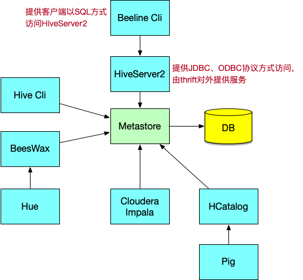

## Hive元数据管理与存储

### 第1节 Metastore

在Hive的具体使用中，首先面临的问题便是如何定义表结构信息，跟结构化的数据映射成功。所谓的映射指的是一种对应关系。

在Hive中需要描述清楚表跟文件之间的映射关系、列和字段之间的关系等等信息。这些描述映射关系的数据的称之为Hive的元数据。该数据十分重要，因为只有通过查询它才可以确定用户编写sql和最终操作文件之间的关系。 

**Metadata**即元数据。元数据包含用Hive创建的database、table、表的字段等元信息。元数据存储在关系型数据库中。如hive内置的Derby、第三方如MySQL等。 

**Metastore**即元数据服务，是Hive用来管理库表元数据的一个服务。有了它上层的服务不用再跟裸的文件数据打交道，而是可以基于结构化的库表信息构建计算框架。 

通过Metastore服务将Hive的元数据暴露出去，而不是需要通过对Hive元数据库mysql的访问才能拿到Hive的元数据信息；metastore服务实际上就是一种thrift服务，通过它用户可以获取到Hive元数据，并且通过thrift获取元数据的方式，屏蔽了 数据库访问需要驱动，url，用户名，密码等细节。 

### Metastore三种配置模式

1. 内嵌模式

   内嵌模式使用的是内嵌的Derby数据库来存储元数据，也不需要额外起Metastore服 务。数据库和Metastore服务都嵌入在主Hive Server进程中。这个是默认的，配置 简单，但是一次只能一个客户端连接，适用于用来实验，不适用于生产环境。 

   

   **优点：**配置简单，解压hive安装包 bin/hive 启动即可使用; 

   **缺点：**不同路径启动hive，每一个hive拥有一套自己的元数据，无法共享。 

   **配置步骤**

   > 1. 下载软件解压缩
   > 2. 设置环境变量，并使之声笑
   > 3. 初始化数据库。schematool -dbType derby --initSchema
   > 4. 进入hive命令行
   > 5. 再打开一个hive命令，发现无法进入

   

2. 本地模式

   本地模式采用外部数据库来存储元数据，目前支持的数据库有：MySQL、 Postgres、Oracle、MS SQL Server。教学中实际采用的是MySQL。 

   本地模式不需要单独起metastore服务，用的是跟Hive在同一个进程里的metastore服务。也就是说当启动一个hive 服务时，其内部会启动一个metastore服务。hive根据hive.metastore.uris参数值来判断，如果为空，则为本地模式。 

   

   **缺点：**每启动一次hive服务，都内置启动了一个metastore；在hive-site.xml中暴露了数据库的连接信息; 

   **优点：**配置较简单，本地模式下hive的配置中指定mysql的相关信息即可。 

3. 远程模式

   远程模式下，需要单独起metastore服务，然后每个客户端都在配置文件里配置连接到该metastore服务。远程模式的metastore服务和hive运行在不同的进程里。

   **在生产环境中，建议用远程模式来配置Hive Metastore。** 

   

   在这种模式下，其他依赖Hive的软件都可以通过Metastore访问Hive。此时需要配置 hive.metastore.uris 参数来指定 metastore 服务运行的机器ip和端口，并且需要单独手动启动metastore服务。metastore服务可以配置多个节点上，避免单节点故障导致整个集群的hive client不可用。同时hive client配置多个metastore地址，会自动选择可用节点。 

   **配置规划**

   | 节点      | metastore | client |
   | --------- | --------- | ------ |
   | bigdata01 | ✔️         |        |
   | bigdata02 |           | ✔️      |
   | bigdata03 | ✔️         |        |

   **配置步骤**

   1. 将bigdata03的hive安装文件拷贝到bigdata01、bigdata02

   2. 在bigdata01、bigdata03上分别启动metastore服务

      ```shell
      #启动metastore服务
      nohup hive --service metastore &
      
      # 安装lsof
      yum install lsof
      
      # 查询9083端口(metastore服务占用的端口)
      lsof -i:9083
      ```

   3. 修改bigdata02上的hive-site.xml

      删除配置文件中：MySQL的配置、连接数据库的用户名、口令等信息；

      增加连接metastore的配置

      ```xml
      	<!-- hive metastore服务地址 -->
        <property>
          <name>hive.metastore.uris</name>
          <value>thrift://bigdata01:9083,thrift://bigdata03:9083</value>
        </property>
      ```

   4. 启动hive，此时client端无需实例化hive的metastore，启动速度会加快。

      ```
      cd /opt/servers/hive-2.3.7
      #启动hive
      bin/hive
      ```

   5. 高可用测试。关闭已连接的metastore服务，发现hive连到另一个节点的服务上，仍然能够正常使用。

### 第2节 HiveServer2

HiveServer2是一个服务端接口，使远程客户端可以执行对Hive的查询并返回结果。 目前基于Thrift RPC的实现是HiveServer的改进版本，并支持多客户端并发和身份验证，启动hiveServer2服务后，就可以使用jdbc、odbc、thrift的方式连接。 

Thrift是一种接口描述语言和二进制通讯协议，它被用来定义和创建跨语言的服务。 它被当作一个远程过程调用(RPC)框架来使用，是由Facebook为“大规模跨语言服务开发”而开发的。 



HiveServer2(HS2)是一种允许客户端对Hive执行查询的服务。HiveServer2是HiveServer1的后续版本。HS2支持多客户端并发和身份验证，旨在为JDBC、ODBC等开放API客户端提供更好的支持。 

HS2包括基于Thrift的Hive服务(TCP或HTTP)和用于Web UI 的Jetty Web服务器。 

**HiveServer2作用** 

- 为Hive提供了一种允许客户端远程访问的服务
- 基于thrift协议，支持跨平台，跨编程语言对Hive访问
- 允许远程访问Hive 

**HiveServerw配置规划**

| 节点      | HiveServer2 | client(beeline) |
| --------- | ----------- | --------------- |
| bigdata01 |             |                 |
| bigdata02 |             | ✔️               |
| bigdata03 | ✔️           |                 |

**配置步骤**

1. 修改hadoop集群的core-site.xml

   ```xml
   	<!-- HiveServer2连不上10000；hadoop为安装用户 -->
     <!-- root用户可以代理所有主机上的所有用户 -->
     <property>
       <name>hadoop.proxyuser.root.hosts</name>
       <value>*</value>
     </property>
     <property>
       <name>hadoop.proxyuser.root.groups</name>
       <value>*</value>
     </property>
     <property>
       <name>hadoop.proxyuser.hadoop.hosts</name>
       <value>*</value>
     </property>
     <property>
       <name>hadoop.proxyuser.hadoop.groups</name>
       <value>*</value>
     </property>
   ```

2. 修改hadoop集群的hdfs-site.xml

   ```xml
   	<!-- HiveServer2 连不上10000;启用 webhdfs 服务 -->
     <property>
       <name>dfs.webhdfs.enabled</name>
       <value>true</value>
     </property>
   ```

3. 在bigdata03上的HiveServer2服务

   ```
   #启动hiveserver2服务
   nohup hiveserver2 &
   
   #检查hiveserver2端口
   lsof -i:10000
   
   #从2.0开始，HiveServer2提供了WebUI
   #还可以使用浏览器检查hiveserver2的启动情况。http://bigdata03:10002/
   ```

4. 启动bigdata02节点上的beeline

   Beeline是从Hive 0.11版本引入的，是Hive新的命令行客户端工具。Hive客户端工具后续将使用Beeline替代Hive命令行工具 ，并且后续版本也会废弃掉Hive客户端工具。 

   ```
   [root@bigdata02 hive-2.3.7]# beeline
   Beeline version 2.3.7 by Apache Hive
   #以root用户启动
   beeline> !connect jdbc:hive2://bigdata03:10000 root
   0: jdbc:hive2://bigdata03:10000> show databases;
   +----------------+
   | database_name  |
   +----------------+
   | default        |
   | mydb           |
   | test           |
   +----------------+
   3 rows selected (0.668 seconds)
   ```

   或

   ```
   beeline -u jdbc:hive2://bigdata03:10000 -n root
   ```

   执行一个DDL命令

   ```
   0: jdbc:hive2://bigdata03:10000> create database mytest;
   No rows affected (0.152 seconds)
   0: jdbc:hive2://bigdata03:10000> show databases;
   ```

   连接mysql

   ```
   [root@bigdata02 hive-2.3.7]# beeline
   Beeline version 2.3.7 by Apache Hive
   beeline> !connect jdbc:mysql://bigdata03:3306
   0: jdbc:mysql://bigdata03:3306> show databases;
   +---------------------+
   |      Database       |
   +---------------------+
   | hivemetadata        |
   | information_schema  |
   | mysql               |
   | performance_schema  |
   | sys                 |
   +---------------------+
   5 rows selected (0.067 seconds)
   0: jdbc:mysql://bigdata03:3306> use hivemetadata;
   No rows affected (0.008 seconds)
   0: jdbc:mysql://bigdata03:3306> select * from VERSION;
   +---------+-----------------+-----------------------------+
   | VER_ID  | SCHEMA_VERSION  |       VERSION_COMMENT       |
   +---------+-----------------+-----------------------------+
   | 1       | 2.3.0           | Hive release version 2.3.0  |
   +---------+-----------------+-----------------------------+
   1 row selected (0.024 seconds)
   
   #帮助命令
   0: jdbc:mysql://bigdata03:3306> !help
   #退出
   0: jdbc:mysql://bigdata03:3306> !quit
   Closing: 0: jdbc:mysql://bigdata03:3306
   [root@bigdata02 hive-2.3.7]#
   ```

### 第3节 HCatalog

HCatalog 提供了一个统一的元数据服务，允许不同的工具如 Pig、MapReduce 等通 过 HCatalog 直接访问存储在 HDFS 上的底层文件。HCatalog是用来访问Metastore的Hive子项目，它的存在给了整个Hadoop生态环境一个统一的定义。 

HCatalog 使用了Hive的元数据存储，这样就使得像 MapReduce 这样的第三方应用可以直接从 Hive 的数据仓库中读写数据。同时，HCatalog 还支持用户在MapReduce程序中只读取需要的表分区和字段，而不需要读取整个表，即提供一种逻辑上的视图来读取数据，而不仅仅是从物理文件的维度。 

HCatalog 提供了一个称为 hcat 的命令行工具。这个工具和 Hive 的命令行工具类 似，两者最大的不同就是 hcat 只接受不会产生 MapReduce 任务的命令。 

```shell
#进入hcat所在目录。$HIVE_HOME/hcatalog/bin
cd $HIVE_HOME/hcatalog/bin
#执行命令，创建表
./hcat -e "create table default.test1(id string, name string, age int)"

#长命令也可写入文件，使用 -f 选项执行
./hcat -f createtable.txt

#查看元数据
./hcat -e "use mydb;show tables;"
#查看表结构
./hcat -e "desc default.emp;"
#删除表
./hcat -e "drop table default.test1;"
```

### 第4节 数据存储格式

Hive支持的存储数的格式主要有：TEXTFILE(默认格式) 、SEQUENCEFILE、RCFILE、ORCFILE、PARQUET。 

- TEXTFILE为默认格式，建表时没有指定文件格式，则使用TEXTFILE，导入数据时会直接把数据文件拷贝到hdfs上不进行处理；
- SEQUENCEFILE、RCFILE、ORCFILE格式的表不能直接从本地文件导入数据，数据要先导入到TEXTFILE格式的表中， 然后再从表中用insert导入sequencefile、rcfile、 orcfile表中。 

**行存储与列存储**

行式存储下一张表的数据都是放在一起的，但列式存储下数据被分开保存了。

**行式存储**

- 优点：数据被保存在一起，insert和update更加容易
- 缺点：选择(selection)时即使只涉及某几列，所有数据也都会被读取

**列式存储**

- 优点：查询时只有涉及到的列会被读取，效率高
- 缺点：选中的列要重新组装，insert/update比较麻烦 

TEXTFILE、SEQUENCEFILE的存储格式是基于行存储的；

ORC和PARQUET 是基于列式存储的；


**TextFile** 

Hive默认的数据存储格式，数据**不做压缩**，磁盘开销大，数据解析开销大。 可结合 Gzip、Bzip2使用（系统自动检查，执行查询时自动解压），但使用这种方式，hive不 会对数据进行切分，从而无法对数据进行并行操作。 

```
create table if not exists uaction_text(
  userid string,
  itemid string,
  behaviortype int,
  geohash string,
  itemcategory string,
  time string)
row format delimited fields terminated by ','
stored as textfile;
load data local inpath '/data/uaction.dat' overwrite into table uaction_text;
```

**SEQUENCEFILE** 

SequenceFile是Hadoop API提供的一种二进制文件格式，其具有使用方便、可分割、可压缩的特点。 SequenceFile支持三种压缩选择：none、record、block。 Record压缩率低，**一般建议使用BLOCK压缩**。 

**RCFile** 

RCFile全称Record Columnar File，列式记录文件，是一种类似于SequenceFile的键值对数据文件。RCFile结合列存储和行存储的优缺点，是基于行列混合存储的RCFile。 

RCFile遵循的“**先水平划分，再垂直划分**”的设计理念。先将数据按行水平划分为行组，这样一行的数据就可以保证存储在同一个集群节点；然后在对行进行垂直划分。 


- 一张表可以包含多个HDFS block
- 在每个block中，RCFile以行组为单位存储其中的数据；row group又由三个部分组成 
  1. 用于在block中分隔两个row group的16字节的标志区
  2. 存储row group元数据信息的header
  3. 实际数据区，表中的实际数据以列为单位进行存储 

**ORCFile** 

ORC File，它的全名是Optimized Row Columnar (ORC) file，其实就是对RCFile做 了一些优化，在hive 0.11中引入的存储格式。这种文件格式可以提供一种高效的方法来存储Hive数据。它的设计目标是来克服Hive其他格式的缺陷。运用ORC File可以提高Hive的读、写以及处理数据的性能。ORC文件结构由三部分组成：

1. 文件脚注（file footer）：包含了文件中stripe的列表，每个stripe行数，以及每个列的数据类型。还包括每个列的最大、最小值、行计数、求和等信息 
2. postscript：压缩参数和压缩大小相关信息
3. 条带（stripe）：ORC文件存储数据的地方。在默认情况下，一个stripe的大小为250MB 
   - Index Data：一个轻量级的index，默认是每隔1W行做一个索引。包括该条带的一些统计信息，以及数据在stripe中的位置索引信息
   - Rows Data：存放实际的数据。先取部分行，然后对这些行按列进行存储。 对每个列进行了编码，分成多个stream来存储 
   - Stripe Footer：存放stripe的元数据信息 


ORC在每个文件中提供了3个级别的索引：文件级、条带级、行组级。借助ORC提供的索引信息能加快数据查找和读取效率，规避大部分不满足条件的查询条件的文件和数据块。使用ORC可以避免磁盘和网络IO的浪费，提升程序效率，提升整个集群的工作负载。 

```sql
create table if not exists uaction_orc(
  userid string,
  itemid string,
  behaviortype int,
  geohash string,
  itemcategory string,
  time string)
stored as orc;
insert overwrite table uaction_orc select * from uaction_text;
```

**Parquet** 

Apache Parquet是Hadoop生态圈中一种新型列式存储格式，它可以兼容Hadoop生态圈中大多数计算框架（Mapreduce、Spark等），被多种查询引擎支持（Hive、 Impala、Drill等），**与语言和平台无关的**。 

Parquet文件以二进制方式存储，不能直接读取，文件中包括实际数据和元数据，Parquet格式文件是自解析的。 


**Row group**

- 写入数据时的最大缓存单元
- MR任务的最小并发单元
- 一般大小在50MB-1GB之间 

**Column chunk**

- 存储当前Row group内的某一列数据
- 最小的IO并发单元 

**Page** 

- 压缩、读数据的最小单元
- 获得单条数据时最小的读取数据单元
- 大小一般在8KB-1MB之间，越大压缩效率越高 

**Footer**

- 数据Schema信息
- 每个Row group的元信息：偏移量、大小
- 每个Column chunk的元信息：每个列的编码格式、首页偏移量、首索引页偏移量、个数、大小等信息 

```sql
create table if not exists uaction_parquet(
userid string,
itemid string,
behaviortype int,
geohash string,
itemcategory string,
time string)
stored as parquet;

insert overwrite table uaction_parquet select * from uaction_text;
```


**文件存储格式对比测试** 

说明

1. 给bigdata03分配合适的资源。2core、2048M内存 

2. 适当减小文件的数据量（现有数据约800W，根据自己的实际选择处理100-300W 条数据均可）

   ```
   #检查文件行数
   wc -l uaction.dat
   
   #抽取数据
   head -n 1000000 uaction.dat > uaction1.dat
   tail -n 1000000 uaction.dat > uaction2.dat
   ```

**文件压缩比**

```
hive (mydb)> dfs -ls -h /user/hive/warehouse/mydb.db/ua*;
Found 2 items
38.8 M 2022-04-21 11:57 /user/hive/warehouse/mydb.db/uaction_orc/000000_0
12.7 M 2022-04-21 11:57 /user/hive/warehouse/mydb.db/uaction_orc/000001_0
Found 2 items
117.4 M 2022-04-21 12:26 /user/hive/warehouse/mydb.db/uaction_parquet/000000_0
32.9 M 2022-04-21 12:25 /user/hive/warehouse/mydb.db/uaction_parquet/000001_0
Found 1 items
339.1 M 2022-04-21 11:25 /user/hive/warehouse/mydb.db/uaction_text/uaction.dat
```

ORC > Parquet > text

**执行查询**

```sql
SELECT COUNT(*) FROM uaction_text;
SELECT COUNT(*) FROM uaction_orc;
SELECT COUNT(*) FROM uaction_parquet;

-- text: 14.537 seconds, Fetched: 1 row(s)
-- orc: 0.112 seconds, Fetched: 1 row(s)
-- parquet: 0.107 seconds, Fetched: 1 row(s)
```

orc ≈ parquet > txt 


在生产环境中，Hive表的数据格式使用最多的有三种：TextFile、ORCFile、 Parquet。 

- TextFile文件更多的是作为跳板来使用（即方便将数据转为其他格式）
- 有update、delete和事务性操作的需求，通常选择ORCFile
- 没有事务性要求，希望支持Impala、Spark，建议选择Parquet