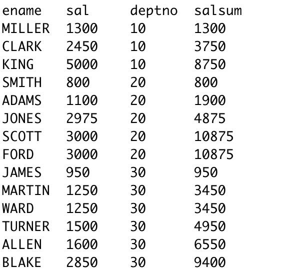

## Hive函数

### 第1节 系统内置函数

#### 查看系统函数

1. 查看系统自带函数

   ```
   show functions;
   ```

2. 显示自带函数的用法

   ```
   desc function upper;
   desc function extended upper;
   ```

#### 日期函数【重要】

1. 当前日期

   ```sql
   select current_date;
   -- 2022-04-16
   select current_timestamp();
   -- 2022-04-16 08:07:01.393
   select unix_timestamp();
   -- unix_timestamp(void) is deprecated. Use current_timestamp instead.
   -- 1650067735
   ```

2. 时间戳转日期

   ```sql
   select from_unixtime(1650067735);
   -- 2022-04-16 08:08:55
   select from_unixtime(1650067735, "yyyyMMdd");
   -- 20220416
   select from_unixtime(1650067735, "yyyy-MM-dd HH:mm:ss");
   -- 2022-04-16 08:08:55
   ```

3. 日期转时间戳

   ```sql
   select unix_timestamp("2022-04-16 08:08:55");
   -- 1650067735
   ```

4. 计算时间差

   ```sql
   select datediff("2022-04-12", '2022-03-26');
   -- 17
   select datediff("2022-03-26", "2022-04-12");
   -- -17
   ```

5. 查询当月第几天

   ```sql
   select dayofmonth("2022-04-16");
   ```

6. 计算月末日期

   ```sql
   select last_day("2022-04-16");
   ```

7. 当月第一天

   ```sql
   select date_sub(current_date, dayofmonth(current_date) - 1);
   ```

8. 下月第一天，即当月第一天加一个月

   ```sql
   select add_months(date_sum(current_date, dayofmonth(current_date)-1), 1);
   ```

9. 字符串转时间，字符串格式必须为：yyyy-MM-dd格式

   ```sql
   select to_date("2022-01-01");
   -- 2022-01-01
   select to_date("2022-01-01 11:12:12");
   -- 2022-01-01
   ```

10. 时期、时间戳、字符串类型格式化输出标准时间格式

    ```sql
    select date_format(current_timestamp(), "yyyy-MM-dd hh:MM:ss");
    -- 2022-04-16 08:04:02
    select date_format(current_date, "yyyyMMdd");
    -- 20220416
    select date_format("2022-01-01", "yyyy-MM-dd hh:MM:ss");
    -- 结果2022-01-01 12:01:00
    ```

示例：计算emp表中，每个人的工龄

```sql
select *, round(datediff(current_date,hiredate)/365,1) from emp;
```

#### 字符串函数

1. `lower` 转小写

   ```sql
   select lower("HELLO WORLD");
   ```

2. `upper`转大写

   ```sql
   select upper("hello world");
   ```

3. `length` 字符串长度

   ```sql
   select length("hello world");
   ```

4. `concat`或`||  `字符串拼接 

   ```sql
   select concat("hello", " ", "world", "!");
   select "hello" || " " || "world" || "!";
   ```

5. `concat_ws`指定分隔符对字符串拼接

   语法：concat_ws(separator, [string|array(string)]+)

   ```sql
   select concat_ws(".", "www", array("baidu", "com"));
   select concat_ws(".", "www", "baidu", "com");
   ```

6. `substr`求子串，index从1开始

   ```sql
   select substr("www.baidu.com", 5);
   -- baidu.com
   
   select substr("www.baidu.com", -5);
   -- u.com
   
   select substr("www.baidu.com", 5, 5);
   -- baidu
   ```

7. `split`字符串切分

   ```sql
   select split("www.baidu.com", "\\.");
   ```

   > **注意','逗号要转义**

#### 数学函数

1. `round`四舍五入

   ```sql
   select round(314.15926);
   -- 314
   select round(314.15926, 2);
   -- 314.16
   select round(314.15926, -2);
   -- 300
   ```

2. `ceil`向上取整

   ```sql
   select ceil(3.14);
   -- 4
   select ceil(3.0);
   -- 3
   ```

3. 向下取整

   ```sql
   select floor(3.8);
   -- 3
   ```

其它数学函数包括：绝对值、平方、开方、对数运算、三角运算等，可查看函数文档

#### 条件函数【重要】

1. `if`

   语法：if(boolean testCondition, T valueTrue, T valueFalseOrNull)

   ```
   select sal, if(sal<1500, 1, if(sal<3000, 2, 3)) from emp;
   ```

2. `case when`

   语法：case when a then b [when c then d]* [else 3] end

   复杂条件用case when更直观

   ```sql
   select sal, case when sal<=1500 then 1
   								 when sal<=3000 then 2
               		 else 3 end sallevel
   from emp;
   ```

   以下两语句时等价的：

   ```sql
   select ename,deptno,
   			 case when deptno=10 then 'accounting'
   			 			when deptno=20 then 'research'
   			 			when deptno=30 then 'sales'
   			 			else 'unknown' end deptname
   from emp;
   -- 等价语句
   select ename, deptno,
   			 case deptno when 10 then 'accounting'
   			 						 when 20 then 'research'
   			 						 when 30 then 'sales'
   			 						 else 'unknown' end deptname
   from emp;
   ```

3. `coalesce`

   语法：coalesce(T v1, T v2, ...)

   返回参数中的第一个非空值；如果所有值都为NULL，那么返回NULL

   ```sql
   select sal, coalesce(comm, 0) from emp;
   ```

4. `isnull`、`isnotnull`

   语法：isnull(a),isnotnull(a)

   ```
   select * from emp where isnull(comm);
   select * from emp where isnotnull(comm);
   ```

5. `nvl`

   语法：nvl(T value, T default_value)

   ```sql
   select empno, ename, sal + nvl(comm, 0) sumsal from emp;
   ```

6. `nullify`

   语法：nullif(x,y)

   相等为空，否则为x

   ```sql
   select nullif("a","b"),nullif("b","b");
   ```

#### UDTF函数【重要】

UDTF：User Defined Table-Generating Functions。用户定义表生成函数，一行输入，多行输出。

1. `explode` 炸裂函数，就是将一行中的复杂的array或map结构拆分成多行

   ```
   hive (default)> select explode(array('A','B','C'));
   col
   A
   B
   C
   hive (default)> select explode(map('a',1,'b',2));
   key	value
   a	1
   b	2
   ```

   > UDTF's are not supported outside the SELECT clause, nor nested in expressions
   > SELECT pageid, explode(adid_list) AS myCol... is not supported
   > SELECT explode(explode(adid_list)) AS myCol... is not supported

2. `lateral view` 用于将数据一行转多列, ，常与表生成函数explode结合使用

   语法

   ```
   lateralView: LATERAL VIEW udtf(expression) tableAlias AS columnAlias (',' columnAlias)*
   fromClause: FROM baseTable (lateralView)*
   ```

   示例

   ```sql
   with t1 as (select "ok" cola, split("www.baidu.com", "\\.") colb)
   select cola, colb, colc from t1
   lateral view explode(colb) t2 as colc;
   ```

##### UDTF案例1

测试数据文件：/root/tab1.dat

```
id	tags
1	1,2,3
2	2,3
3	1,2
```

编写sql实现以下结果

```
1 1
1 2
1 3
2 2
2 3
3 1
3 2
```

SQL

```sql
-- 建表
create table tab1(
  id int,
  tags string
)
row format delimited
fields terminated by "\t";

-- 加载数据
load data local inpath "/root/tab1.dat" into table tab1;

-- 查询语句
select id, tag
	from tab1
			 lateral view explode(split(tags, ",")) tmp as tag;
```

##### UDTF案例2

测试数据文件：/root/score.dat

```
lisi|Chinese:90,Math:80,English:70
wangwu|Chinese:88,Math:90,English:96
maliu|Chinese:99,Math:65,English:60
```

SQL

```sql
-- 建表
create table stuscore(
name string,
score map<string,string>
)
row format delimited
fields terminated by "|"
collection items terminated by ","
map keys terminated by ":";

-- 加载数据
load data local inpath "/root/score.dat" into table stuscore;

-- 需求：找到每个学员的最好成绩
-- 第1步，使用explode函数将map结构拆分成多行
select explode(score) as (subject, scorenum) from stuscore;
-- 但是这里却少了学员姓名，加上学员姓名后出错。以下语句时错误的
select name,explode(score) as (subject, scorenum) from stuscore;

-- 第2步：explode长于lateral view函数联用，这两个函数结合在一起关联其它字段
select name, subject, scorenum
	from stuscore
			 lateral view explode(score) tmp as subject, scorenum

-- 第3步:找到每个学员的最好成绩
select name, max(scorenum) max_num
	from (select name, subject, scorenum
					from stuscore
			 				 lateral view explode(score) tmp as subject, scorenum
  ) tmp2
 group by name;
 

with tmp as(
select name, subject, scorenum
  from stuscore
  		 lateral view explode(score) t2 as subject, scorenum
)
select name, max(scorenum) max_num
	from tmp
 group by name;

```

##### UDTF小结

1. 将一行数据转换成多行数据，可以用于array和map类型的数据;

2. `lateral view` 与 `explode` 联用，解决 UDTF 不能添加额外列的问题 

### 第二节 窗口函数【重要】

窗口函数又名开窗函数，属于分析函数的一种。

用于解决复杂报表统计需求的功能强大的函数，很多场景都需要用到。

窗口函数用于计算基于组的某种聚合值，它和聚合函数的不同之处是：

- 对于每个组返回多行，而聚合函数对于每个组只返回一行。
- 窗口函数指定了分析函数工作的数据窗口大小，这个数据窗口大小可能会随着行的变化而变化。

1. `over`关键字

   使用窗口函数之前一般要通过over()进行开窗；

   窗口函数是针对每一行数据的；

   如果over中没有参数，默认的是全部结果集

   ```sql
   -- 查询emp表工资之和
   select sum(sal) from emp;
   
   -- 不使用窗口函数，有语法错误
   select ename, sal, sum(sal) salsum from emp;
   
   -- 使用窗口函数，查询员工姓名、薪水、薪水总和
   select ename, sal, sum(sal) over() sumsal, concat(round(sal/sum(sal) over() * 100, 1), "%") ratiosal from emp;
   ```

2. `partition by`子句

   在over窗口进行分区，对某一列进行分区统计，窗口的大小就是分区的大小

   ```sql
   -- 查询员工姓名、薪水、部门薪水总和
   select ename, sal, sum(sal) over(partition by deptno) sumsal from emp;
   ```

3. `order by`子句

   order by子句对输入的数据进行排序

   ```sql
   -- 增加了order by子句;sum:从分组的第一行到当前行求和
   select ename, sal, deptno, sum(sal) over(partition by deptno order by sal) salsum from emp;
   ```

   

   4. window子句

      语法：rows between ... and ...

      如果要对窗口的结果做更细粒度的划分，使用window子句，有如下的几个选项：

      - unbounded preceding 组内第一行数据
      - n preceding 组内当前行的前n行数据
      - current row 当前行数据
      - n following 组内当前行的后n行数据
      - Unbounded following 组内最后一行数据

      

      ```sql
      -- rows between ... and ... 子句
      -- 等价。组内，第一行到当前行的和
      select ename, sal, deptno,
      			 sum(sal) over(partition by deptno order by ename)
      	from emp;
      select ename, sal, deptno,
      			 sum(sal) over(partition by deptno order by ename
                           rows between unbounded preceding and current row)
       	from emp;
       	
      -- 组内，第一行到最后一行的和
      select ename, sal, deptno,
      			 sum(sal) over(partition by deptno order by ename
                           rows between unbounded preceding and unbounded following)
      	from emp;
      	
      -- 组内，前一行、当前行、后一行的和
      select ename, sal, deptno, 
      			 sum(sal) over(partition by deptno order by ename 
                           rows between 1 preceding and 1 following)
      	from emp;
      ```

#### 排名函数

都是从1开始，生成数据项在分组中的排名。

1. row_number() 排名顺序增加不会重复；如1、2、3、4、5、...
2. rank() 排名相等会在名次中留下空位；如1、2、2、4、5、...
3. dense_rank()  排名相等会在名次中不会留下空位 ;如1、2、2、3、4、...

测试数据文件/root/t2.dat

```
class1	s01	100
class1	s03	100
class1	s05	100
class1	s07	99
class1	s09	98
class1	s02	98
class1	s04	97
class2	s21	100
class2	s24	99
class2	s27	99
class2	s22	98
class2	s25	98
class2	s28	97
class2	s26	96
```

SQL

```
-- 建表
create table t2(
cname string,
sname string,
score int
)
row format delimited
fields terminated by "\t";

-- 加载数据
load data local inpath "/root/t2.dat" into table t2;

-- 按照班级，使用3中方式对成绩进行排名
select cname, sname, score,
			 row_number() over(partition by cname order by score desc) rank,
			 rank() over(partition by cname order by score desc) rank2,
			 dense_rank() over(partition by cname order by score desc) rank3
	from t2;
```

#### 序列函数

测试文件数据/root/userpv.dat

```
cid	ctime	pv
cookie1,2019-04-10,1
cookie1,2019-04-11,5
cookie1,2019-04-12,7
cookie1,2019-04-13,3
cookie1,2019-04-14,2
cookie1,2019-04-15,4
cookie1,2019-04-16,4
cookie2,2019-04-10,2
cookie2,2019-04-11,3
cookie2,2019-04-12,5
cookie2,2019-04-13,6
cookie2,2019-04-14,3
cookie2,2019-04-15,9
cookie2,2019-04-16,7
```

建表及加载数据SQL

```sql
-- 建表
create table userpv(
cid string,
ctime date,
pv int
)
row format delimited
fields terminated by ",";

-- 加载数据
load data local inpath "/root/userpv.dat" into table userpv;	
```

1. `lag` 返回当前数据行的上一行数据

   ```sql
   select cid, ctime, pv,
   			 lag(pv) over(partition by cid order by ctime) lagpv
   	from userpv;
   ```

2. `lead` 返回当前数据行的下一行数据

   ```
   select cid, ctime, pv,
   			 lead(pv) over(partition by cid order by ctime) leadpv
   	from userpv;
   ```

3. `first_value` 取分组内排序后，截止到当前行第一个值

   ```sql
   select cid, ctime, pv,
   			 first_value(pv) over(partition by cid order by ctime
                               rows between unbounded preceding and unbounded following) firstpv
   	from userpv;
   ```

4. `last_value` 分组内排序后，截止到当前行，最后一个值

   ```sql
   select cid, ctime, pv,
   			 last_value(pv) over(partition by cid order by ctime
                              rows between unbounded preceding and unbounded following) lastpv
   	from userpv;
   ```

5. `ntile` 将分组的数据按照顺序切分成n片，返回当前切片值

   ```
   select cid, ctime, pv,
   			 ntile(3) over(partition by cid order by ctime) ntile
   	from userpv;
   ```

#### 第三节 SQL面试题

1. 连续7天登录的用户 

   ```
   -- 测试数据文件/root/ulogin.dat
   uid dt status(1 正常登录，0 异常) 1 2019-07-11 1
   1 2019-07-12 1
   1 2019-07-13 1
   1 2019-07-14 1
   1 2019-07-15 1
   1 2019-07-16 1
   1 2019-07-17 1
   1 2019-07-18 1
   2 2019-07-11 1
   2 2019-07-12 1
   2 2019-07-13 0
   2 2019-07-14 1
   2 2019-07-15 1
   2 2019-07-16 0
   2 2019-07-17 1
   2 2019-07-18 0
   3 2019-07-11 1
   3 2019-07-12 1
   3 2019-07-13 1
   3 2019-07-14 0
   3 2019-07-15 1
   3 2019-07-16 1
   3 2019-07-17 1
   3 2019-07-18 1
   4 2019-07-12 1
   4 2019-07-13 1
   4 2019-07-14 1
   4 2019-07-15 1
   4 2019-07-16 1
   4 2019-07-18 1
   4 2019-07-19 1
   4 2019-07-20 1
   ```

   SQL实现

   ```sql
   -- 建表语句
   create table ulogin(
       uid int,
       dt date,
       status int
   )
   row format delimited fields terminated by ' ';
   
   -- 加载数据
   load data local inpath "/root/ulogin.dat" into table ulogin;
   
   -- 1、使用 row_number 在组内给数据编号(rownum)
   -- 2、某个值 - rownum = gid，得到结果可以作为后面分组计算的依据
   -- 3、根据求得的gid，作为分组条件，求最终结果
   select uid, count(gid) gcount
   	from (select uid, dt, date_sub(dt, row_number() over(partition by uid order by dt)) gid
           	from ulogin
            where status=1) as tmp
    group by uid, gid
    having gcount>=7;
   ```

2. 编写sql语句实现每班前三名，分数一样并列，同时求出前三名按名次排序的分差

   ```
   -- 测试数据文件/root/stu.dat
   id class score
   1 1901 90
   2 1901 90
   3 1901 83
   4 1901 60
   5 1902 66
   6 1902 23
   7 1902 99
   8 1902 67
   9 1902 87
   -- 实现结果
   class score rank lagscore
   1901 90 1 0
   1901 90 1 0
   1901 83 2 -7
   1901 60 3 -23
   1902 99 1 0
   1902 87 2 -12
   1902 67 3 -20
   ```

   SQL实现

   ```sql
   -- 建表
   create table stu(
   sid int,
   class string,
   score int
   )
   row format delimited
   fields terminated by " ";
   
   -- 加载数据
   load data local inpath "/root/stu.dat" into table stu;
   
   -- 求解思路:
   -- 1、上排名函数，分数一样并列，所以用dense_rank 
   -- 2、将上一行数据下移，相减即得到分数差
   -- 3、处理 NULL
   with tmp as(
     select sid,class,score,
     			 dense_rank() over(partition by class order by score desc) rank
     	from stu
   )
   select sid, class, rank,
   			 nvl(score-lag(score) over(partition by class order by score desc), 0) lagscore
   	from tmp
    where rank<=3;
   
   ```

3. 行 <=> 列

   需求

   ```
   -- 测试数据文件/root/rowline1.dat
   id course
   1 java
   1 hadoop
   1 hive
   1 hbase
   2 java
   2 hive
   2 spark
   2 flink
   3 java
   3 hadoop
   3 hive
   3 kafka
   
   -- 编写sql，得到结果如下(1表示选修，0表示未选修)
   id java hadoop hive hbase spark flink kafka
   1 	1 	1 			1 	1 		0 		0 		0 
   2 	1 	0 			1 	0 		1 		1 		0
   3 	1 	1 			1	 	0 		0 		0 		1
   ```

   SQL实现

   ```sql
   -- 建表
   create table rowline1(
   id int,
   course string
   )
   row format delimited
   fields terminated by " ";
   
   -- 加载数据
   hive (default)> load data local inpath "/root/rowline1.dat" into table rowline1;
   
   -- sql
   select id,
   			 sum(case when course="java" then 1 else 0 end) as java,
   			 sum(case when course="hadoop" then 1 else 0 end) as hadoop,
   			 sum(case when course="hive" then 1 else 0 end) as hive,
   			 sum(case when course="hbase" then 1 else 0 end) as hbase,
   			 sum(case when course="spark" then 1 else 0 end) as spark,
   			 sum(case when course="flink" then 1 else 0 end) as flink,
   			 sum(case when course="kafka" then 1 else 0 end) as kafka
   	from rowline1
    group by id;		 
   ```

   需求2

   ```
   -- 测试数据文件/root
   id1 id2 flag
   a b 2
   a b 1
   a b 3
   c d 6
   c d 8
   c d 8
   
   -- 编写sql实现如下结果
   id1 id2 flag
   a b 2|1|3
   c d 6|8
   ```

   SQL实现

   ```sql
   -- 建表
   create table rowline2(
   id1 string,
   id2 string,
   flag int
   )
   row format delimited fields terminated by " ";
   
   -- 加载
   load data local inpath "/root/rowline2.dat" into table rowline2;
   
   -- sql
   -- 1.对数据进行分组聚拢
   select id1, id2, collect_set(flag) from rowline2 group by id1, id2;
   select id1, id2, collect_list(flag) from rowline2 group by id1, id2;
   select id1, id2, sort_array(flag) from rowline2 group by id1, id2;
   -- 2.将元素连接在一起，因flag为int类型，需使用cast函数将其转换成string
   select id1, id2, concat_ws("|", collect_set(cast(flag as string))) flag
   	from rowline2
    group by id1, id2; 
   ```

   

   需求2

   ```sql
   -- 建表
   create table rowline3 as
   select id1, id2, concat_ws("|", collect_set(cast(flag as string))) flag
   	from rowline2
    group by id1, id2; 
   ```

   实现结果

   ```
   id1 id2 flag
   a b 2
   a b 1
   a b 3
   c d 6
   c d 8
   c d 8
   ```

   SQL实现

   ```sql
   select id1, id2, newflag
     from rowline3
   			 lateral view explode(split(flag, "\\|")) t1 as newflag;
   ```

### 第4节 用户自定义函数

当 Hive 提供的内置函数无法满足实际的业务处理需要时，可以考虑使用用户自定义函数进行扩展。

用户自定义函数分为以下三类

1. UDF(User Defined Function) 用户自定义函数，一进一出
2.  UDAF(User Defined Aggregation Function) 用户自定义聚集函数，多进一 出；类似于：count/max/min
3.  UDTF(User Defined Table-Generating Functions) 用户自定义表生成函数，一进多出；类似于：explode 


**UDF开发:** 

- 继承org.apache.hadoop.hive.ql.exec.UDF
- 需要实现evaluate函数;
- evaluate函数支持重载
- UDF必须要有返回类型，可以返回null，但是返回类型不能为void 

**UDF开发步骤** 

1. 创建maven java 工程，添加依赖
2. 开发java类继承UDF，实现evaluate 方法
3. 将项目打包上传服务器
4. 添加开发的jar包
5. 设置函数与自定义函数关联
6. 使用自定义函数 

**需求：扩展系统nvl函数功能** 

```
-- 系统内建的 nvl 函数
nvl(ename, "OK"): ename==null => 返回第二个参数

-- 要实现的函数功能
nvl(ename, "OK"): ename==null or ename=="" or ename=="
返回第二个参数
```

**步骤**

1. 创建maven java工程，添加依赖

   ```xml
   <!-- pom.xml 文件 -->
   <repositories>
     <!-- 增加这个配置，避免org.pentaho:pentaho-aggdesigner-algorithm:pom:5.1.5-jhyde加载错误 -->
     <repository>
       <id>spring-plugin</id>
       <url>https://maven.aliyun.com/repository/spring-plugin</url>
     </repository>
   </repositories>
   <dependencies>
     <dependency>
       <groupId>org.apache.hive</groupId>
       <artifactId>hive-exec</artifactId>
       <version>2.3.7</version>
     </dependency>
   </dependencies>
   ```

2. 开发java类继承UDF，实现evaluate方法

   ```
   package com.hive.udf;
   
   import org.apache.hadoop.hive.ql.exec.UDF;
   import org.apache.hadoop.io.Text;
   
   public class nvl extends UDF {
       public Text evaluate(final Text t, final Text x){
           if(t == null || t.toString().trim().length() == 0){
               return x;
           }
           return t;
       }
   }
   ```

3. 将项目打包上传服务器

4. 添加开发的jar包

   ```
   hive (default)> add jar /root/HiveUdf.jar;
   ```

5. 创建临时函数，指定类名一定要完整的路径，即包名加类名

   ```
   hive (default)> create temporary function mynvl as "com.hive.udf.nvl";
   ```

6. 测试

   ```sql
   -- 基本功能
   select mynvl(null, 0);
   
   -- 测试扩展功能
   select mynvl("", "ok");
   select mynvl(" ", "ok");
   ```

7. 退出hive命令行，再次进入，发现mynvl函数失效。

 针对临时生效的函数，我们可以创建永久函数

1. 将jar上传HDFS

   ```
   hdfs dfs -put HiveUdf.jar /jar
   ```

2. 在hive命令行中创建永久函数

   ```sql
   create function mynvl as "com.hive.udf.nvl" using jar "hdfs:/jar/HiveUdf.jar";
   ```

3. 查询说有的函数，发现mynvl在列表中

   ```
   show functions;
   ```

4. 退出hive后再测试，参照临时步骤6测试

5. 删除永久函数，并检查（再hive shell中执行）

   ```
   drop function mynvl;
   ```

   退出hive命令行后执查看函数，发现mynvl函数已经被删除了

   ```
   show functions;
   ```

