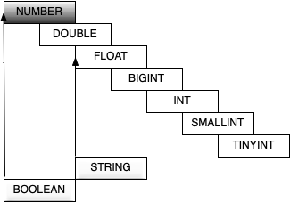

## Hive数据类型与文件格式

Hive支持关系型数据库中的绝大多数基本数据类型，同时也支持4中集合数据类型

### 基本数据类型

| 大类                          | 类型                                                         |
| ----------------------------- | ------------------------------------------------------------ |
| Integers 整型                 | TINYINT -- 1字节有符号整数<br>SMALLINT -- 2字节有符号整数<br>INT -- 4字节有符号整数<br>BIGINT -- 8字节有符号整数 |
| Floating point numbers 浮点数 | FLOAT -- 单精度浮点数<br>DOUBLE -- 双精度浮点数              |
| Fixed point numbers 定点数    | DECIMAL -- 17字节，任意精度数字。<br>通常用户自定义decimal(12, 6) |
| String 字符串                 | STRING -- 可指定字符集的不定长字符串<br>VARCHAR -- 1~65535长度的不定长字符串<br>CHAR -- 1~255定长字符串 |
| Datetime 时间日期类型         | TIMESTAMP -- 时间戳（纳秒精度）<br>DATE -- 时间日期类型      |
| Boolean 布尔类型              | BOOLEAN -- TRUE/FALSE                                        |
| Binary types 二进制类型       | BINARY -- 二进制类型                                         |

### 数据类型的隐式转换

hive的数据类型是可以进行隐式转换的，基本类型遵循以下层次结构，按照这个层次结构，子类型到祖先类型允许隐式转换。



总结来说数据转换遵循以下规律

```
hive (default)> select '1.0'+2;
3.0

hive (default)> select '111'>10;
true

hive (default)> select 1>0.2;
true
```

### 数据类型的显示转换

使用cast函数进行强制类型转换；如果潜质类型转换失败，则返回NULL

```
hive (default)> select cast('1abc' as int);
NULL

hive (default)> select cast('11' as int);
11
```


### 集合数据类型

hive支持集合数据类型，包括array、map、struct、union

| 类型   | 说明                                              | 示例                                                         |
| ------ | ------------------------------------------------- | ------------------------------------------------------------ |
| ARRAY  | 有序的相同数据类型的集合                          | array(1,3,5)                                                 |
| MAP    | key-value对。<br>key必须是基本数据类型，value不限 | map('a',1,'b',2)                                             |
| STRUCT | 不同类型字段的集合                                | struct('1',1,1.0)，<br>named_struct('col1','1','col2',1,'col3',1.0) |
| UNION  | 不同类型的元素存储在统一字段的不同行中            | create_union(1,'a',63)                                       |

```
hive (default)> select array(1,2,3);
[1,2,3]

hive (default)> select arr[0],arr[3] from (select array(1,2,3) as arr) as tmp;
_c0	_c1
1	NULL

hive (default)> select map('a',1,'b',2,'c',3);
{"a":1,"b":2,"c":3}

-- 使用 [] 访问map元素，key不存在返回NULL
hive (default)> select mymap['a'],mymap['x'] from (select map('a',1,'b',2) mymap) tmp;
_c0	_c1
1	NULL

hive (default)> select struct('abc', 1, 3.0);
_c0
{"col1":"abc","col2":1,"col3":3}

-- 给struct中的字段命名
hive (default)> select named_struct('name','zhangsan','age',18);
_c0
{"name":"zhangsan","age":18}
-- 使用 列名.字段名 访问具体信息
hive (default)> select userinfo.name,userinfo.age from (select named_struct('name','zhangsan','age',18) userinfo) tmp;
name	age
zhangsan	18

-- union数据类型
-- union是从几种数据类型中指明选择一种，union的值必须与这些数据类型之一完全匹配
hive (default)> select create_union(0, "zhansan", 19, 8000.88) uinfo;
uinfo
{0:"zhansan"}
```

### 文本文件数据编码

Hive表中的数据在存储在文件系统上，Hive定义了默认的存储格式，也支持用户自定义文件存储格式。

Hive默认使用几个很少出现在字段值中的控制字符，来表示替换默认分隔符的字符。 

**Hive默认分隔符**

| 分隔符 | 名称     | 说明                                                         |
| ------ | -------- | ------------------------------------------------------------ |
| \n     | 换行符   | 用于分隔行。每一行是一条记录，使用换行符分割数据             |
| ^A     | <Ctrl>+A | 用于分隔字段。在CREATE TABLE语句中使用八进制编码 \001表示    |
| ^B     | <Ctrl>+B | 用于分隔 ARRAY、MAP、STRUCT 中的元素。在CREATE TABLE语句中使用八进制编码\002表示 |
| ^C     | <Ctrl>+C | Map中 key、value之间的分隔符。在CREATE TABLE语句 中使用八进制编码\003表示 |
Hive中没有定义专门的数据格式，数据格式可以由用户指定，用户定义数据格式需要指定三个属性:

1. 列分隔符(通常为空格、"\t"、"\x001")
2. 行分隔符("\n")
3. 读取文件数据的方法。 

**在加载数据的过程中，Hive不会对数据本身进行任何修改，而只是将数据内容复制或者移动到相应的HDFS目中。** 

将 Hive 数据导出到本地时，系统默认的分隔符是^A、^B、^C 这些特殊字符，使用 cat 或者 vim 是看不到的; 

在 vi 中输入特殊字符: 

(Ctrl + v) + (Ctrl + a) => ^A

(Ctrl + v) + (Ctrl + b) => ^B 

(Ctrl + v) + (Ctrl + c) => ^C 

^A / ^B / ^C 都是特殊的控制字符，使用 more 、 cat 命令是看不见的; 可以使用`cat -A file.dat `

**示例**


```
s1.dat
id name age hobby(array) score(map)
666^Alisi^A18^Aread^Bgame^Ajava^C97^Bhadoop^C87

create table s1(
id int,
name string,
age int,
hobby array<string>,
score map<string, int>
);
load data local inpath '/home/hadoop/data/s1.dat' into table s1;
select * from s1;
```

### 读时模式

在传统数据库中，在加载时发现数据不符合表的定义，则拒绝加载数据。数据在写入数据库时对照表模式进行检查，这种模式称为"写时模式"(schema on write)。 

写时模式 -> 写数据检查 -> RDBMS; 

Hive中数据加载过程采用"读时模式" (schema on read)，加载数据时不进行数据格式的校验，读取数据时如果不合法则显示NULL。

读时模式 -> 读时检查数据 -> Hive;

优点：加载数据快;

问题：数据显示NULL 