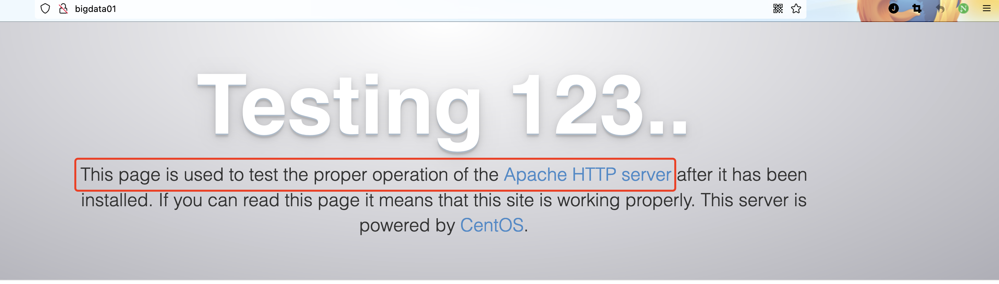
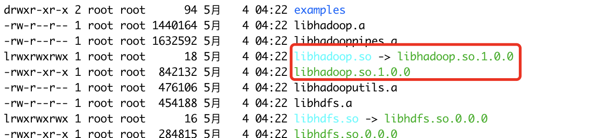
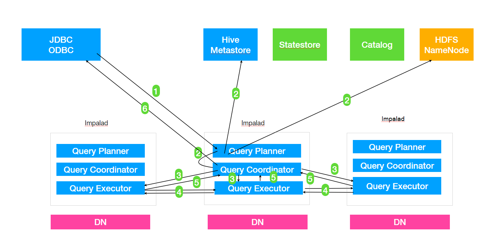
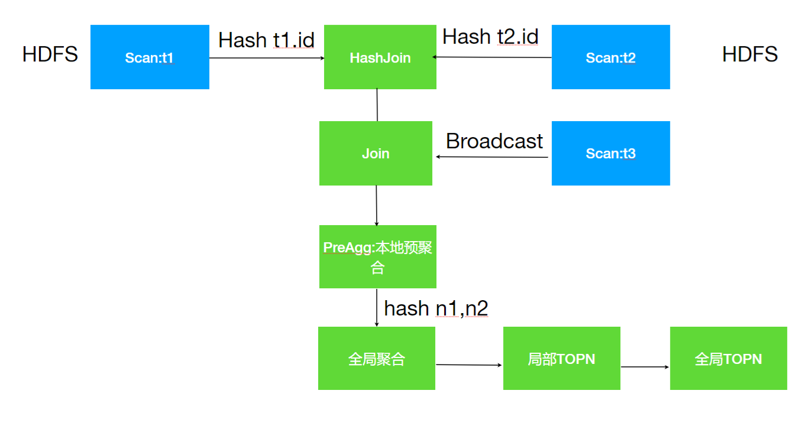

## Impala概述

### Impala是什么 

Impala是Cloudera提供的⼀款开源的针对HDFS和HBASE中的PB级别数据进⾏交互式实时查询(Impala速度快)，Impala是参照谷歌的新三篇论文当中的Dremel实现⽽来，其中旧三篇论⽂分别是 (BigTable，GFS，MapReduce)分别对应我们即将学的HBase和已经学过的HDFS以及MapReduce。 

Impala最大卖点和最大特点就是**快速**，Impala中文翻译是⾼角羚⽺。 

### Impala优势 

回顾前面⼤数据课程路线其实就是⼀个大数据从业者面对的大数据相关技术发展的过程，

- 技术发展以及更新换代的原因就是老的技术架构遇到新的问题，有些问题可以通过不断优化代码优化设计得以解决，有一些问题就不再是简简单单修改代码就能解决，需要从框架本身架构设计上改变，以至于需要推倒重建。
- 在大数据领域主要解决的问题是数据的存储和分析，但是其实一个完整的大数据分析任务如果细分会有非常多具体的场景，⾮常多的环节；并没有一个类似Java Web的Spring框架实现大一统的局面。 

⽐如我们按照阶段划分一个大数据开发任务，会有：数据采集(日志文件，关系型数据库中)，数据清洗 (数据格式整理，脏数据过滤等)，数据预处理(为了后续分析所做的工作)，数据分析：离线处理(T+1分析)，实时处理(数据到来即分析)，数据可视化，机器学习，深度学习等 

面对如此众多的阶段再加上大数据天生的大数据量问题没有任何一个框架可以完美cover以上每个阶段。所以大数据领域有⾮常多框架，每个框架都有最适合⾃己的具体场景。⽐如：HDFS负责大数据量存储，MapReduce(Hive)负责大数据量的分析计算， 

**Impala的诞⽣**

之前学习的Hive以及MR适合离线批处理，但是对交互式查询的场景⽆能为力要求快速响应)，所以为了解决查询速度的问题，Cloudera公司依据Google的Dremel开发了Impala,Impala抛弃了**MapReduce** 使⽤了类似于传统的**MPP**数据库技术，⼤大提⾼了查询的速度。 

**MPP是什么?** 

MPP (Massively Parallel Processing)，就是大规模并⾏处理，在MPP集群中，每个节点资源都是独⽴享有也就是有独⽴的磁盘和内存，每个节点通过网络互相连接，彼此协同计算，作为整体提供数据服 务。 

简单来说，MPP是将任务并行的分散到多个服务器和节点上，在每个节点上计算完成后，将各自部分的结果汇总在一起得到最终的结果 

对于MPP架构的软件来说聚合操作比如计算某张表的总条数，则先进⾏局部聚合(每个节点并⾏计算)， 然后把局部汇总结果进⾏全局聚合(与Hadoop相似)。 

**Impala与Hive对⽐**

Impala的技术优势

- Impala没有采取MapReduce作为计算引擎，MR是非常好的分布式并⾏计算框架，但MR引擎更多的是⾯向批处理模式，⽽不是⾯向交互式的SQL执⾏。与 Hive相⽐：Impala把整个查询任务转为一棵执⾏计划树，⽽不是一连串的MR任务，在分发执⾏计划后，Impala使⽤拉取的⽅式获取上个阶段的执⾏行结果，把结果数据、按执⾏树流式传递汇集，减少的了把中间结果写入磁盘的步骤，再从磁盘读取数据的开销。Impala使⽤服务的⽅式避免每次执⾏查询都需要启动的开销，即相⽐Hive没了MR启动时间。 

- 使⽤用LLVM(C++编写的编译器器)产⽣运⾏代码，针对特定查询⽣成特定代码。 

- 优秀的IO调度，Impala⽀持直接数据块读取和本地代码计算。

- 选择适合的数据存储格式可以得到最好的性能(Impala⽀支持多种存储格式)。

- 尽可能使用内存，中间结果不写磁盘，及时通过网络以stream的⽅式传递。

Impala与Hive对比分析

查询过程

- Hive：在Hive中，每个查询都有一个“冷启动”的常见问题。(map,reduce每次都要启动关闭，申请资源，释放资源。。。)

- Impala：Impala避免了任何可能的启动开销，这是⼀种本地查询语⾔。 因为要始终处理查询，则 Impala守护程序进程总是在集群启动之后就准备就绪。守护进程在集群启动之后可以接收查询任务并执行查询任务。

中间结果

- Hive：Hive通过MR引擎实现所有中间结果，中间结果需要落盘，这对降低数据处理速度有不利影响。

- Impala：在执⾏程序之间使⽤流的⽅式传输中间结果，避免数据落盘。尽可能使用内存避免磁盘开销

交互查询

- Hive：对于交互式计算，Hive不是理想的选择。
- Impala：对于交互式计算，Impala非常适合。(数据量量级PB级)

计算引擎

- Hive：是基于批处理的Hadoop MapReduce
- Impala：更像是MPP数据库

容错

- Hive：Hive是容错的(通过MR&Yarn实现) 

- Impala：Impala没有容错，由于良好的查询性能，Impala遇到错误会重新执行⼀次查询

查询速度 

​	Impala：Impala比Hive快3-90倍。

**Impala优势总结**

1. Impala最大优点就是查询速度快，在一定数据量下;
2. 速度快的原因：避免了MR引擎的弊端，采⽤了MPP数据库技术

### Impala的缺点

1. Impala属于MPP架构，只能做到百节点级，一般并发查询个数达到20左右时，整个系统的吞吐已经达到满负荷状态，在扩容节点也提升不了吞吐量，处理数据量在PB级别最佳。 
2. 资源不能通过YARN统⼀资源管理调度，所以Hadoop集群⽆法实现Impala、Spark、Hive等组件的动态资源共享。 

### 适用场景

 **Hive**：复杂的批处理理查询任务，数据转换任务，对实时性要求不⾼同时数据量⼜很⼤的场景。 

**Impala**：实时数据分析，与Hive配合使用，对Hive的结果数据集进⾏实时分析。impala不能完全取代hive，impala可以直接处理hive表中的数据。 


## Impala安装与入⻔案例 

### 集群准备 

1. 安装**Hadoop,Hive** 
   - Impala的安装需要提前装好Hadoop，Hive这两个框架
   - hive需要在所有的Impala安装的节点上面都要有，因为Impala需要引用Hive的依赖包
   - hadoop的框架需要支持C程序访问接⼝，查看下图，如果该路径有.so结尾⽂文件，就证明支持C接口。 

2. 准备Impala的所有依赖包

   Cloudera公司对于Impala的安装只提供了rpm包没有提供tar包；所以我们选择使用Cloudera的rpm包进⾏Impala的安装，但是另外一个问题，Impala的rpm包依赖⾮常多的其他的rpm包，我们可以⼀个个的将依赖找出来，但是这种⽅式实在是浪费时间。 

   Linux系统中对于rpm包的依赖管理提供了⼀个非常好的管理工具叫做Yum，类似于Java工程中的包管理工具Maven，Maven可以自动搜寻指定Jar所需的其它依赖并⾃动下载来。Yum同理可以⾮常⽅便的让我们进⾏rpm包的安装⽆需关系当前rpm所需的依赖。但是与Maven下载其它依赖需要到中央仓库⼀样 Yum下载依赖所需的源也是在放置在国外服务器并且其中没有安装Impala所需要的rpm包，所以默认的这种Yum源可能下载依赖失败。所以我们可以指定Yum去哪里下载所需依赖。 

   rpm⽅式安装：需要⾃己管理rpm包的依赖关系，⾮常麻烦，解决依赖关系使⽤yum；默认Yum源是没有Impala的rpm安装包，所以我们⾃己准备好所有的Impala安装所需的rpm包，制作Yum本地源，配置 Yum命令去到我们准备的Yun源中下载Impala的rpm包进⾏安装。 

**本地Yum原制作步骤**

Yum源是Centos当中下载软件rpm包的地址，因此通过制作本地Yum源并指定Yum命令使⽤本地Yum源，为了使Yum命令(本机，跨⽹网络节点)可以通过网络访问到本地源，我们使⽤Httpd这种静态资源服务器来开放我们下载所有的rpm包。

1. 在bigdata01上安装httpd服务器

   ```shell
   #安装
   yum install -y httpd
   #启动服务
   systemctl start httpd
   ```

   验证httpd工作是否正常，默认端口是80，可以省略，访问地址：http://bigdata01

   

2. 新建一个测试页面

   httpd默认存放页面路径`/var/www/html`

   新建一个test.html

   ```html
   <html>
     <body>
       <div>this is a new page!!</div>
     </body>
   </html>
   ```

   访问：http://bigdata01/test.html

   后续可以把下载的rpm包解压房知道此处便可下载

3. 下载Impala安装所需rpm包

   impala所需安装包下载：http://archive.cloudera.com/cdh5/repo-as-tarball/5.7.6/cdh5.7.6-centos7.tar.gz

   注意：该tar.gz包是包含了Cloudera所提供的⼏乎所有rpm包，但是为了方便我们不再去梳理其中依赖关系，全部下载来，整个⽂件⽐较⼤，有3.8G。选择一个磁盘空间够的节点，后续还要把压缩包解压所以磁盘空间要剩余10G以上。

   下载完成后将安装包上传到bigdata01的/opt/software目录中

4. 使用httpd浏览安装包文件

   解压缩安装包

   ```shell
   tar -zxvf /opt/software/impala-cdh5.7.6-centos7.tar.gz -C /opt/servers/
   ```

   创建软链接到 /var/www/html目录下

   ```shell
   ln -s /opt/servers/cdh/5.7.6 /var/www/html/cdh57
   ```

   验证：http://bigdata01/cdh57

   > 注意：如果提示403 forbidden，修改/etc/selinux/config配置SELINUX=disabled，然后重启机器

5. 修改yum源配置文件

   ```
   cd /etc/yum.repos.d/
   #创建一个新配置文件
   vi local.repo
   #添加内容
   [local]
   name=local
   baseurl=http://bigdata01/cdh57/
   gpgcheck=0
   enabled=1
   ```

   说明

   - name：对于当前源的描述；
   - baseurl：访问当前源的地址信息；
   - gpgcheck：1/0，gpg校验；
   - enabled：1/0，是否使⽤用当前源；

6. 分发local.repo文件到其它节点


### 安装Impala

#### 集群规划

| 服务               | Bigdata01 | Bigdata02 | Bigdata03 |
| ------------------ | --------- | --------- | --------- |
| Impala-catalogd    | ✘         | ✘         | ✔︎         |
| impala-statestored | ✘         | ✘         | ✔︎         |
| impala-server      | ✔︎         | ✔︎         | ✔︎         |

impala-server：这个进程是Impala真正工作的进程，官⽅建议把impala-server安装在datanode节点， 更更靠近数据(短路路读取)，进程名impalad；

impala-statestored：健康监控⻆色，主要监控impala-server，impala-server出现异常时告知给其它impala-server，进程名叫做statestored；

impala-catalogd：管理和维护元数据(Hive)，impala更新操作，把impala-server更新的元数据通知给其它impala-server，进程名catalogd；

官方建议statestore与catalog安装在同一节点上!! 

#### 安装步骤

bigdata03

```shell
yum install -y impala
yum install -y impala-server
yum install -y impala-state-store
yum install -y impala-catalog
yum install -y impala-shell
```

bigdata01与bigdata02
```
yum install -y impala-server
yum install -y impala-shell
```

配置Impala

1. hive-site.xml

   ```xml
     <!--指定metastore地址，之前添加过可以不不⽤用添加 -->
     <property>
       <name>hive.metastore.uris</name>     
       <value>thrift://bigdata01:9083,thrift://bigdata03:9083</value>
     </property>
     <property>
       <name>hive.metastore.client.socket.timeout</name>
       <value>3600</value>
     </property>
   ```

2.  分发hive安装包到集群节点 

   ```
   rsync-script /opt/servers/hive-2.3.7/
   ```

3. bigdata03启动metastore服务

   ```
   nohup hive --service metastore &
   ```

   启动hiveserver2服务

   ```
   nohup hive --service hiveserver2 &
   ```

4. 修改HDFS集群hdfs-site.xml

   配置HDFS集群的短路读取

   什么是短路读取? 

   在HDFS中通过DataNode来读取数据。但是当客户端向DataNode请求读取文件时，DataNode就会从磁盘读取该文件并通过TCP socket将数据发送到客户端。所谓“短路”是指Client客户端直接读取文件。很明显，这种情况只在客户端与数据放在同一地点(译者注:同⼀主机)时才有可能发生。短路读对于许多应用程序会带来重大的性能提升。 

   短路读取：就是Client与DataNode属于同一节点，⽆需再经过⽹络传输数据，直接本地读取。 要配置短路本地读，需要验证本机Hadoop是否有libhadoop.so;

   查看目录`/opt/servers/hadoop-2.9.2/lib/native`

    

   短路路读取配置步骤

   1)创建短路路读取本地中转站

   ```
   # 所有节点创建目录
   mkdir -p /var/lib/hadoop-hdfs
   ```

   2) 修改hdfs-site.xml

   ```xml
   	<!--打开短路路读取开关 --> <!-- 打开短路路读取配置-->
     <property>
       <name>dfs.client.read.shortcircuit</name>
       <value>true</value>
     </property>
     <!--这是⼀个UNIX域套接字的路路径，用于DataNode和本地HDFS客户机之间的通信 -->
     <property>
       <name>dfs.domain.socket.path</name>
       <value>/var/lib/hadoop-hdfs/dn_socket</value>
     </property>
     <!--block存储元数据信息开发开关 -->
     <property>
       <name>dfs.datanode.hdfs-blocks-metadata.enabled</name>
       <value>true</value>
     </property>
     <property>
       <name>dfs.client.file-block-storage-locations.timeout</name>
       <value>30000</value>
     </property>
   ```

   分发到其他节点并重启hadoop集群
   
   ```
   #停止集群
   stop-yarn.sh
   stop-dfs.sh
   
   #启动集群
   start-dfs.sh
   start-yarn.sh
   ```
   
5. impala具体配置

   **引⽤HDFS，Hive配置**

   使⽤Yum方式安装impala，默认的Impala配置⽂件目录为 /etc/impala/conf，Impala的使⽤依赖Hadoop和Hive框架，所以需要把HDFS，Hive的配置文件告知Impala。 

   所有集群节点执行以下命令把HDFS，Hive的配置⽂件软链接到/etc/impala/conf下

   ```
   ln -s /opt/servers/hadoop-2.9.2/etc/hadoop/core-site.xml /etc/impala/conf/core-site.xml
   ln -s /opt/servers/hadoop-2.9.2/etc/hadoop/hdfs-site.xml /etc/impala/conf/hdfs-site.xml
   ln -s /opt/servers/hive-2.3.7/conf/hive-site.xml /etc/impala/conf/hive-site.xml
   ```

   **Impala自身配置**

   所有节点更改Impala默认配置文件以及添加mysql的驱动包

   ```
   vi /etc/default/impala
   
   # 更新以下配置
   IMPALA_CATALOG_SERVICE_HOST=bigdata03
   IMPALA_STATE_STORE_HOST=bigdata03
   ```

   所有节点创建mysql的驱动包的软链接

   ```
   mkdir /usr/share/java
   ln -s /opt/servers/hive-2.3.7/lib/mysql-connector-java-5.1.46.jar /usr/share/java/mysql-connector-java.jar
   ```

   

   修改bigtop的java_home路径

   ```
   vi /etc/default/bigtop-utils
   export JAVA_HOME=/opt/servers/jdk1.8.0_231
   ```

   注意：Apache Bigtop 是一个针对基础设施工程师和数据科学家的开源项⽬，旨在全⾯打包、测试和配置领先的开源大数据组件/项目。Impala项目中使⽤到了此软件。

   ```
   #bigdata03启动如下角色
   service impala-state-store start
   service impala-catalog start
   service impala-server start
   
   #其余节点启动如下⻆角⾊色
   service impala-server start
   ```

   验证Impala启动结果

   

   

   

   浏览器web界面验证

   - impalad管理界面 http://bigdata03:25000
   - statestored管理界面 http://bigdata03:25010

   **消除Impala影响** 

   由于使用yum命令安装Impala，我们选择使⽤yum自动进⾏Impala依赖的安装和处理理，所以本次安装默认会把Impala依赖的所有框架都会安装，⽐Hadoop、Hive、Mysql等，为了保证我们⾃己安装的Hadoop等使⽤正常我们需要删除掉Impala默认安装的其它框架

   ```
   which hadoop hive hdfs beeline hiveserver2
   /usr/bin/hadoop
   /usr/bin/hive
   /usr/bin/hdfs
   /usr/bin/beeline
   /usr/bin/hiveserver2
   
   # 从结果发现以上命令非我们自己安装的路径，需要把这些命令都删除
   rm -rf /usr/bin/hadoop /usr/bin/hive /usr/bin/hdfs /usr/bin/beeline /usr/bin/hiveserver2
   ```

   重新生效环境变量`source /etc/profile`

   jps 时出现没有名字的进程 或者process information unavailable

   

   解决方式`rm -rf /tmp/hsperfdata_*`

### Impala入门案例

使⽤Yum方式安装Impala后，impala-shell可以全局使⽤；

impala-shell进入到impala的交互窗⼝

```
[root@bigdata03 ~]# impala-shell
Starting Impala Shell without Kerberos authentication
Connected to bigdata03:21000
Server version: impalad version 2.5.0-cdh5.7.6 RELEASE (build ecbba4f4e6d5eec6c33c1e02412621b8b9c71b6a)
***********************************************************************************
Welcome to the Impala shell. Copyright (c) 2015 Cloudera, Inc. All rights reserved.
(Impala Shell v2.5.0-cdh5.7.6 (ecbba4f) built on Tue Feb 21 14:54:50 PST 2017)

To see a summary of a query's progress that updates in real-time, run 'set
LIVE_PROGRESS=1;'.
***********************************************************************************
[bigdata03:21000] >
```

查看所有数据库 

```
[bigdata03:21000] > show databases;
Query: show databases
+------------------+----------------------------------------------+
| name             | comment                                      |
+------------------+----------------------------------------------+
| _impala_builtins | System database for Impala builtin functions |
| default          | Default Hive database                        |
+------------------+----------------------------------------------+
Fetched 2 row(s) in 0.30s
```

如果想要使用Impala，需要将数据加载到Impala中，如何加载数据到Impala中呢？

- 使⽤Impala的外部表，这种适用于已经有数据文件，只需将数据文件拷贝到HDFS上，创建⼀张Impala外部表，将外部表的存储位置指向数据文件的位置即可。(类似Hive) 
- 通过Insert⽅式插入数据，适⽤于我们没有数据文件的场景。 

1. 准备数据文件`user.dat`

   ```
   392456197008193000,张三,20,0
   267456198006210000,李四,25,1
   892456199007203000,王五,24,1
   492456198712198000,赵六,26,2
   392456197008193000,张三,20,0
   392456197008193000,张三,20,0
   ```

2. 创建HDFS存放数据的路径

   ```
   hdfs dfs -mkdir -p /user/impala/t1
   #上传本地文件user.dat到hdfs: /user/impala/table1
   hdfs dfs -put /root/user.dat /user/impala/t1
   ```

3. 创建表

   ```sql
   drop table if exists t1;
   create external table t1(
     id string,
     name string,
     age int,
     gender int
   )
   row format delimited
   fields terminated by ","
   location "/user/impala/t1";
   ```

4. 查询数据

   ```
   [bigdata03:21000] > select * from t1;
   Query: select * from t1
   +--------------------+------+-----+--------+
   | id                 | name | age | gender |
   +--------------------+------+-----+--------+
   | 392456197008193000 | 张三 | 20  | 0      |
   | 267456198006210000 | 李四 | 25  | 1      |
   | 892456199007203000 | 王五 | 24  | 1      |
   | 492456198712198000 | 赵六 | 26  | 2      |
   | 392456197008193000 | 张三 | 20  | 0      |
   | 392456197008193000 | 张三 | 20  | 0      |
   +--------------------+------+-----+--------+
   ```

5. 创建t2表

   ```shell
   # 创建一个内部表
   create table t2(
   id string,
   name string,
   age int,
   gender int
   )
   row format delimited
   fields terminated by ",";
   
   # 查看表结构
   desc t1;
   desc formatted t2;
   ```

6. 插入数据到t2

   ```sql
   insert overwrite table t2 select * from t1 where gender=0;
   ```

   验证数据

   ```
   [bigdata03:21000] > select * from t2;
   Query: select * from t2
   +--------------------+------+-----+--------+
   | id                 | name | age | gender |
   +--------------------+------+-----+--------+
   | 392456197008193000 | 张三 | 20  | 0      |
   | 392456197008193000 | 张三 | 20  | 0      |
   | 392456197008193000 | 张三 | 20  | 0      |
   +--------------------+------+-----+--------+
   ```

   **更新元数据**

   使⽤Beeline连接Hive查看Hive中的数据，发现通过Impala创建的表，导入的数据都可以被Hive感知到。

   ```
   [root@bigdata03 ~]# beeline -u jdbc:hive2://bigdata03:10000 -n root
   0: jdbc:hive2://bigdata03:10000> show tables;
   +-----------+
   | tab_name  |
   +-----------+
   | mytbl     |
   | t1        |
   | t2        |
   0: jdbc:hive2://bigdata03:10000> select * from t2;
   +---------------------+----------+---------+------------+
   |        t2.id        | t2.name  | t2.age  | t2.gender  |
   +---------------------+----------+---------+------------+
   | 392456197008193000  | 张三       | 20      | 0          |
   | 392456197008193000  | 张三       | 20      | 0          |
   | 392456197008193000  | 张三       | 20      | 0          |
   +---------------------+----------+---------+------------+
   3 rows selected (3.112 seconds)
   ```

   **总结** 

   1. 案例中Impala的数据⽂件是以逗号分隔的⽂本文件，实际上Impala可以⽀持RCFile/SequenceFile/Parquet等多种文件格式。 

   2. Impala与Hive元数据的关系? 

      Hive对于元数据的更新操作不能被Impala感知到；

      Impala对元数据的更新操作可以被Hive感知到。 

      Impala同步Hive元数据命令：手动执⾏invalidate metadata，(后续详细讲解) 

      Impala是通过Hive的metastore服务来访问和操作Hive的元数据，但是Hive对表进⾏创建删除修改等操作，Impala是无法自动识别到Hive中元数据的变更情况的，如果想让Impala识别到Hive元数据的变化，所以需要进入impala-shell之后⾸先要做的操作就是执行`invalidate metadata`，该命令会将所有的Impala的元数据失效并重新从元数据库同步元数据信息。后⾯详细讲解元数据更新命令。 

   3. Impala操作HDFS使用的是Impala用户，所以为了避免权限问题，我们可以选择关闭权限校验 

      在hdfs-site.xml中添加如下配置: 

      ```xml
      <!--关闭hdfs权限校验 -->
      <property>
        <name>dfs.permissions.enabled</name>
        <value>false</value>
      </property>
      ```

## Impala架构原理

### impala组件

Impala是⼀个分布式，大规模并⾏处理(MPP)数据库引擎，它包括多个进程。Impala与Hive类似不是数据库而是数据分析工具。

```
[root@bigdata03 ~]# ps -ef | grep impala
/usr/lib/impala/sbin/statestored -log_dir=/var/log/impala -state_store_port=24000
/usr/lib/impala/sbin/catalogd -log_dir=/var/log/impala
/usr/lib/impala/sbin/impalad -log_dir=/var/log/impala -catalog_service_host=bigdata03 -state_store_port=24000 -use_statestore -state_store_host=bigdata03 -be_port=22000
```


**impalad**

- ⻆色名称为Impala Daemon，是在每个节点上运⾏的进程，是Impala的核心组件，进程名是Impalad；
- 作用，负责读写数据文件，接收来⾃Impala-shell，JDBC，ODBC等的查询请求，与集群其它Impalad分布式并⾏完成查询任务，并将查询结果返回给中⼼协调者。 为了保证Impalad进程了解其它Impalad的健康状况，Impalad进程会一直与statestore保持通信；
- Impalad服务由三个模块组成：Query Planner、Query Coordinator和Query Executor，前两个模块组成前端，负责接收SQL查询请求，解析SQL并转换成执⾏计划，交由后端执⾏； 

**statestored**

- statestore监控集群中Impalad的健康状况，并将集群健康信息同步给Impalad；
- statestore进程名为statestored

**catalogd**

- Impala执⾏的SQL语句引发元数据发生变化时，catalog服务负责把这些元数据的变化同步给其它Impalad进程(⽇志验证，监控statestore进程日志)
- catalog服务对应进程名称是catalogd
- 由于⼀个集群需要一个catalogd以及一个statestored进程，⽽且catalogd进程所有请求都是经过statestored进程发送，所以官方建议让statestored进程与catalogd进程安排同一个节点。 

### Impala查询



1. Client提交任务

   Client发送⼀个SQL查询请求到任意一个Impalad节点，会返回一个queryId⽤于之后的客户端操作。 

2. 生成单机和分布式执⾏计划 

   SQL提交到Impalad节点之后，Analyser依次执⾏SQL的词法分析、语法分析、语义分析等操作；从MySQL元数据库中获取元数据，从HDFS的名称节点中获取数据地址，以得到存储这个查询相关数据的所有数据节点

   - 单机执⾏计划：根据上一步对SQL语句的分析，由Planner先生成单机的执⾏计划，该执⾏计划是有PlanNode组成的一棵树，这个过程中也会执⾏一些SQL优化，例如Join顺序改变、谓词下推等。
   - 分布式并⾏物理计划：将单机执⾏计划转换成分布式并⾏物理执⾏计划，物理执⾏计划由⼀个个的Fragment组成，Fragment之间有数据依赖关系，处理过程中需要在原有的执⾏计划之上加入一些ExchangeNode和DataStreamSink信息等。 
     - Fragment：sql⽣成的分布式执⾏计划的一个子任务; 
     - DataStreamSink：传输当前的Fragment输出数据到不同的节点 

3. 任务调度和分发 

   Coordinator将Fragment(子任务)根据数据分区信息发配到不同的Impalad节点上执⾏。Impalad 节点接收到执⾏行行Fragment请求交由Executor执⾏行行。 

4. Fragment之间的数据依赖

   每一个Fragment的执⾏输出通过DataStreamSink发送到下⼀个Fragment，Fragment运⾏过程中不断向coordinator节点汇报当前运⾏状态。 

5. 结果汇总 

   查询的SQL通常情况下需要有⼀个单独的Fragment用于结果的汇总，它只在Coordinator节点运行，将多个节点的最终执⾏结果汇总，转换成ResultSet信息。 

6. 获取结果

   客户端调用获取ResultSet的接⼝，读取查询结果。 

**现实计划示例**

以⼀个SQL例例⼦来展示查询计划

```sql
select t1.n1, t2.n2, count(1) as c
	from t1 join t2 on t1.id=t2.id
					join t3 on t1.id=t3.id
 where t2.n3 between 'a' and 'f'
 group by t1.n1, t2.n2
 order by c desc
 limit 100;
```

QueryPlanner生成单机的执行计划


分析上⾯的单机执⾏计划，第一步先去扫描t1表中需要的数据，如果数据⽂件存储是列式存储我们可以便利的扫描到所需的列id,n1;接着需要与t2表进行Join操作，扫描t2表与t1表类似获取到所需数据列id,n2;t1与t2表进⾏关联，关联之后再与t3表进⾏关联，这⾥Impala会使⽤谓词下推扫描t3表只取join所需数据;对group by进相应的aggregation操作，最终是排序取出指定数量的数据返回。 


**分布式并⾏执⾏计划** 

所谓的分布式并⾏化执⾏计划就是在单机执⾏计划基础之上结合数据分布式存储的特点，按照任务的计算要求把单机执⾏计划拆分为多段子任务，每个子任务都是可以并行执行的。上面的单机执⾏计划转为分布式并⾏执⾏计划如下图所示:


分布式并⾏执⾏计划流程图



分布式执⾏计划中涉及到多表的Join，Impala会根据表的⼤小来决定Join的方式，主要有两种分别是Hash Join与Broadcast Join

上⾯分布式执⾏计划中可以看出T1与T2表大一些，⽽T3表小一些，所以对于T1与T2的Join Impala选择使用Hash Join，对于T3表选择使用Broadcast方式，直接把T3表⼴播到需要Join的节点上。 

分布式并⾏计划流程 

1. T1和T2使用Hash join，此时需要按照id的值分别将T1和T2分散到不同的Impalad进程，但是相同的id会散列到相同的Impalad进程，这样每一个Join之后是全部数据的一部分 

2. T1与T2 Join之后的结果数据再与T3表进行Join，此时T3表采⽤Broadcast⽅式把⾃己全部数据(id列) 广播到需要的Impala节点上 

3. T1,T2,T3 Join之后再根据Group by执⾏本地的预聚合，每⼀个节点的预聚合结果只是最终结果的⼀部分(不同的节点可能存在相同的group by的值)，需要再进⾏一次全局的聚合。 
4. 全局的聚合同样需要并⾏，则根据聚合列进⾏Hash分散到不同的节点执⾏Merge运算(其实仍然是⼀次聚合运算)，⼀般情况下为了较少数据的⽹络传输， Impala会选择之前本地聚合节点做全局聚合工作。 
5. 通过全局聚合之后，相同的key只存在于一个节点，然后对于每一个节点进⾏排序和TopN计算，最终将每⼀个全局聚合节点的结果返回给Coordinator进⾏合并、排序、limit计算，返回结果给用户。

## Impala的使用

Impala的核⼼开发语⾔是sql语句，Impala有shell命令⾏窗⼝，以及JDBC等方式来接收sql语句执⾏， 对于复杂类型分析可以使用C++或者Java来编写UDF函数。 

Impala的sql语法是高度集成了Apache Hive的sql语法，Impala支持Hive支持的数据类型及部分Hive的内置函数。 

需要注意的几点: 

1. Impala与Hive类似它们的重点都是在与查询，所以像Update,delete等具有更新性质的操作最好不要使⽤这种工具，对于删除数据的操作可以通过Drop Table,Alter Table Drop Partition来实现，更新可以尝试使用Insert overwrite⽅式 
2. 通常使⽤Impala的方式是数据文件存储在Hdfs文件系统，借助于Impala的表定义来查询和管理Hdfs上的数据文件; 
3. Impala的使⽤大多数与Hive相同，⽐如Impala同样⽀持内外部表，以及分区等，可以借鉴参考Hive的使⽤。 

### 第1节 Impala-shell命令参数

#### impala-shell外部命令

所谓的外部命令指的是不需要进⼊到impala-shell交互命令行当中即可执⾏的命令参数。impala-shell后面执行的时候可以带很多参数。你可以在启动impala-shell时设置，⽤于修改命令执⾏环境。 

impala-shell –h可以帮助我们查看帮助手册。也可以参考课程附件资料。 

⽐如⼏个常见的: 

`impala-shell –r`：刷新impala元数据，与建立连接后执⾏REFRESH语句效果相同(元数据发⽣变化的时候) 

`impala-shell –f`： ⽂件路径执⾏指的的sql查询文件。 

`impala-shell –i`：指定连接运行impalad守护进程的主机。默认端⼝21000。你可以连接到集群中运⾏impalad 的任意主机。 

`impala-shell –o`：保存执⾏结果到文件当中去。 

```
[root@bigdata03 ~]# impala-shell -f test.sql
Query: show databases
+------------------+----------------------------------------------+
| name             | comment                                      |
+------------------+----------------------------------------------+
| _impala_builtins | System database for Impala builtin functions |
| default          | Default Hive database                        |
| mydb             |                                              |
+------------------+----------------------------------------------+
```

展示Impala默认支持的内置函数需要进入Impala默认系统数据库中执⾏，在其它数据库下⽆无法查看!!

```
show functions;
```

#### impala-shell内部命令

所谓内部命令是指进入impala-shell命令⾏之后可以执⾏的语法。

```
[bigdata03:21000] > help;

Documented commands (type help <topic>):
========================================
compute   exit     history  quit    shell  unset   version
connect   explain  insert   select  show   use     with
describe  help     profile  set     tip    values

Undocumented commands:
======================
alter  create  desc  drop  load  summary
```

`connect hostname`：连接到指定的机器impalad上去执行。 

```
[bigdata03:21000] > connect bigdata02;
Connected to bigdata02:21000
Server version: impalad version 2.5.0-cdh5.7.6 RELEASE (build ecbba4f4e6d5eec6c33c1e02412621b8b9c71b6a)
Query: use `default`
```

`refresh dbname.tablename`：增量刷新，刷新某一张表的元数据，主要⽤于刷新hive当中数据表⾥面的数据改变的情况。 

```
[bigdata02:21000] > refresh default.t1;
Query: refresh default.t1

Fetched 0 row(s) in 0.46s
[bigdata02:21000] >
```

`invalidate metadata`：全量刷新，性能消耗较大，主要用于hive当中新建数据库或者数据库表的时候来进行刷新。 

`quit`/`exit`命令：从Impala shell中退出

`explain`命令：⽤于查看sql语句的执⾏计划 

explain的值可以设置成0,1,2,3等几个值，其中3级别是最高的，可以打印出最全的信息

```
[bigdata02:21000] > set explain_level=3;
EXPLAIN_LEVEL set to 3
[bigdata02:21000] > explain select * from t1;
Query: explain select * from t1
+------------------------------------------------------------------------------------+
| Explain String                                                                     |
+------------------------------------------------------------------------------------+
| Estimated Per-Host Requirements: Memory=32.00MB VCores=1                           |
| WARNING: The following tables are missing relevant table and/or column statistics. |
| default.t1                                                                         |
|                                                                                    |
| F01:PLAN FRAGMENT [UNPARTITIONED]                                                  |
|   01:EXCHANGE [UNPARTITIONED]                                                      |
|      hosts=1 per-host-mem=unavailable                                              |
|      tuple-ids=0 row-size=38B cardinality=unavailable                              |
|                                                                                    |
| F00:PLAN FRAGMENT [RANDOM]                                                         |
|   DATASTREAM SINK [FRAGMENT=F01, EXCHANGE=01, UNPARTITIONED]                       |
|   00:SCAN HDFS [default.t1, RANDOM]                                                |
|      partitions=1/1 files=1 size=186B                                              |
|      table stats: unavailable                                                      |
|      column stats: unavailable                                                     |
|      hosts=1 per-host-mem=32.00MB                                                  |
|      tuple-ids=0 row-size=38B cardinality=unavailable                              |
+------------------------------------------------------------------------------------+
Fetched 17 row(s) in 0.52s
```

`profile`命令：执⾏sql语句之后执⾏，可以打印出更加详细的执行步骤，主要用于查询结果的查看，集群的调优等。 

```
[bigdata02:21000] > profile;
Query Runtime Profile:
Query (id=554af7713120a54a:d819ab0c40a2cb82):
  Summary:
    Session ID: ce42b7b6f472d619:4b6176aaa6dc89aa
    Session Type: BEESWAX
    Start Time: 2022-05-07 17:47:18.688179000
    End Time: 2022-05-07 17:47:19.201799000
    Query Type: EXPLAIN
    Query State: FINISHED
    Query Status: OK
    Impala Version: impalad version 2.5.0-cdh5.7.6 RELEASE (build ecbba4f4e6d5eec6c33c1e02412621b8b9c71b6a)
    User: root
    Connected User: root
    Delegated User:
    Network Address: ::ffff:192.168.143.103:54174
    Default Db: default
    Sql Statement: explain select * from t1
    Coordinator: bigdata02:22000
    Query Options (non default): EXPLAIN_LEVEL=3
    : 0.000ns
    Query Timeline: 513.993ms
       - Start execution: 63.178us (63.178us)
       - Planning finished: 502.299ms (502.236ms)
       - Rows available: 502.427ms (127.967us)
       - First row fetched: 507.095ms (4.668ms)
       - Unregister query: 513.716ms (6.620ms)
  ImpalaServer:
     - ClientFetchWaitTimer: 11.099ms
     - RowMaterializationTimer: 0.000ns
```

expalin：可以不真正执⾏任务，只是展示任务的执⾏计划;

profile：需要任务执⾏完成后调⽤，可以从更底层以及更详细的层面来观察我们运⾏impala的任务，进 

⾏调优。 


### 第 **2** 节 Impala sql语法

#### 数据库特定语句

1. 创建数据库

   CREATE DATABASE语句用于在Impala中创建新数据库。

   CREATE DATABASE IF NOT EXISTS database_name; 这⾥，IF NOT EXISTS是⼀个可选的⼦句。如果我们使⽤此⼦句，则只有在没有具有相同名称的现有数据库时，才会创建具有给定名称的数据库。 

   sql: `create database if not exists test;`

   默认会在hive的数仓路径下创建新的数据库名⽂件夹`/user/hive/warehouse/test.db`

2. 删除数据库

   DROP DATABASE语句用于从Impala中删除数据库。 

   在删除数据库之前，建议从中删除所有表。 

   如果使用级联删除，Impala会在删除指定数据库中的表之前删除它。 

   ```
   drop database test cascade;
   ```

#### 表特定语句

1. create table 语句

   CREATE TABLE语句用于在所需数据库中创建新表，需要指定表名字并定义其列和每列的数据类型。 

   impala支持的数据类型和hive类似. 

   ```sql
   create table IF NOT EXISTS database_name.table_name (column1 data_type,
   column2 data_type,  column3 data_type,  .........  columnN data_type);
   
   CREATE TABLE IF NOT EXISTS my_db.student(name STRING, age INT, contact INT );
   ```

   默认建表的数据存储路径跟hive一致。也可以在建表的时候通过location指定具体路径。 

2. insert 语句 

   Impala的INSERT语句有两个⼦句: into和overwrite。into⽤于插⼊新记录数据，overwrite⽤于覆盖已有的记录。 

   ```
   insert into table_name (column1, column2, column3,...columnN)values (value1,
   value2, value3,...valueN);
   insert into table_name values (value1, value2, value2);
   ```

   这⾥column1，column2，... columnN是要插⼊数据的表中的列的名称。还可以添加值而不指定列名，但是需要确保值的顺序与表中的列的顺序相同。 

   例：

   ```
   create table employee (Id INT, name STRING, age INT,address STRING, salary BIGINT);
   insert into employee VALUES (1, 'Ramesh', 32, 'Ahmedabad', 20000 );
   insert into employee values (2, 'Khilan', 25, 'Delhi', 15000 );
   Insert into employee values (3, 'kaushik', 23, 'Kota', 30000 );
   Insert into employee values (4, 'Chaitali', 25, 'Mumbai', 35000 );
   Insert into employee values (5, 'Hardik', 27, 'Bhopal', 40000 );
   Insert into employee values (6, 'Komal', 22, 'MP', 32000 );
   ```

   overwrite覆盖⼦句覆盖表当中全部记录。 覆盖的记录将从表中永久删除。

   ```
   Insert overwrite employee values (1, 'Ram', 26, 'Vishakhapatnam', 37000 );
   ```

3.  select语句
    Impala SELECT语句用于从数据库查询数据， 此查询以表的形式返回数据。

   ```
   [bigdata02:21000] > select * from t2;
   Query: select * from t2
   +--------------------+------+-----+--------+
   | id                 | name | age | gender |
   +--------------------+------+-----+--------+
   | 392456197008193000 | 张三 | 20  | 0      |
   | 392456197008193000 | 张三 | 20  | 0      |
   | 392456197008193000 | 张三 | 20  | 0      |
   +--------------------+------+-----+--------+
   ```

4. describe语句

   Impala中的describe语句用于提供表的描述。 此语句的结果包含有关表的信息，例如列名称及其数据类型。
   ```
   describe table_name;
   ```

5. alter table

   Impala中的Alter table语句用于对给定表执⾏更改。使用此语句，我们可以添加，删除或修改现有表中的列，也可以重命名它们。


6. delete**、**truncate table

   drop table语句用于删除Impala中的现有表。此语句句还会删除内部表的底层HDFS文件。 
   
   > 注意：使⽤此命令时必须⼩心，因为删除表后，表中可⽤的所有信息也将永远丢失。  
   
   ```
   drop table database_name.table_name;
   ```
   
   Truncate Table语句用于从现有表中删除所有记录。保留表结构。 
   
   您也可以使用DROP TABLE命令删除一个完整的表，但它会从数据库中删除完整的表结构，如果您希望存储⼀一些数据，您将需要重新创建此表。 
   
   ```
   truncate table_name;
   ```
   
   Impala对复杂数据类型的支持：对于Text存储格式中的复杂类型不⽀持，复杂类型要使用parquet格式。 

7. view视图

   视图仅仅是存储在数据库中具有关联名称的Impala查询语言的语句。 它是以预定义的SQL查询形式的表的组合。 

   视图可以包含表的所有⾏或选定的⾏。

   ```
   create view if not exists view_name as select statement
   ```

   创建视图view、查询视图view 

   ```
   create view if not exists employee_view AS select name, age from employee;
   ```

   修改视图

   ```
   alter view database_name.view_name as Select语句句
   ```

   删除视图 

   ```
   drop view database_name.view_name;
   ```

8. order by⼦句

   Impala ORDER BY子句用于根据⼀个或多个列以升序或降序对数据进⾏排序。 默认情况下，一些数据库按升序对查询结果进⾏排序。 

   ```
    select * from table_name ORDER BY col_name
    [ASC|DESC] [NULLS FIRST|NULLS LAST]
   ```

   关键字ASC或DESC分别按升序或降序排列表中的数据。
   NULLS FIRST，表中的所有空值都排列在顶⾏；NULLS LAST，包含空值的⾏将最后排列。 

9. group by⼦句

   GROUP BY⼦句与SELECT语句协作使⽤，以将相同的数据排列到组中。

   ```
   select name, sum(salary) from employee group by name;
   ```

10. having⼦句

    容易与where过滤进行混淆， 

    如何区分: 

    where：过滤的数据是原始数据，表中本来就存在的数据；

    having：过滤的是查询结果数据；

    按年龄对表进⾏分组，选择每个组的最⼤工资，并显示大于20000的⼯资 

    ```
    select max(salary) from employee group by age having max(salary) > 20000; 
    ```
    
11. limit、offset
  

Impala中的limit⼦句⽤于将结果集的⾏数限制为所需的数，即查询的结果集不包含超过指定限制的记录。 

  ⼀般来说，select查询的resultset中的⾏从0开始。使⽤offset⼦句，我们可以决定从哪⾥考虑输出。

  ```
  select * from employee order by salary limit 2 offset 2;
  ```

  使⽤offset关键字要求结果数据必须是排序之后的!!


### 第 3 节 Impala导入数据

1. insert into values

   ```
   create table t_test2(id int,name string);
   insert into table t_test2 values(1,”zhangsan”);
   ```

2. insert into select

   插⼊一张表的数据来自于后⾯的select查询语句返回的结果。
   
3.  create table as select

  建表的字段个数、类型、数据来⾃于后续的select查询语句。
  load data方式，这种⽅式不建议在Impala中使⽤，先使用load data方式把数据加载到Hive表中，然后 
  
  使⽤以上⽅式插⼊Impala表中。 
  
  
  
  
## Impala的JDBC⽅式查询

在实际⼯作当中，因为impala的查询⽐较快，所以可能有会使⽤到impala来做数据库查询的情况，我们 

可以通过java代码来进行操作impala的查询

1. pom.xml

   ```xml
   	<repositories>
           <!-- 增加这个配置，避免org.pentaho:pentaho-aggdesigner-algorithm:pom:5.1.5-jhyde加载错误 -->
           <repository>
               <id>spring-plugin</id>
               <url>https://maven.aliyun.com/repository/spring-plugin</url>
           </repository>
       </repositories>
   
       <dependencies>
           <!-- https://mvnrepository.com/artifact/org.apache.hadoop/hadoop-common -->
           <dependency>
               <groupId>org.apache.hadoop</groupId>
               <artifactId>hadoop-common</artifactId>
               <version>2.9.2</version>
           </dependency>
           <!-- https://mvnrepository.com/artifact/org.apache.hive/hive-common -->
           <dependency>
               <groupId>org.apache.hive</groupId>
               <artifactId>hive-common</artifactId>
               <version>2.3.7</version>
           </dependency>
           <!-- https://mvnrepository.com/artifact/org.apache.hive/hive-metastore -->
           <dependency>
               <groupId>org.apache.hive</groupId>
               <artifactId>hive-metastore</artifactId>
               <version>2.3.7</version>
           </dependency>
           <!-- https://mvnrepository.com/artifact/org.apache.hive/hive-service -->
           <dependency>
               <groupId>org.apache.hive</groupId>
               <artifactId>hive-service</artifactId>
               <version>2.3.7</version>
           </dependency>
           <!-- https://mvnrepository.com/artifact/org.apache.hive/hive-jdbc -->
           <dependency>
               <groupId>org.apache.hive</groupId>
               <artifactId>hive-jdbc</artifactId>
               <version>2.3.7</version>
           </dependency>
           <!-- https://mvnrepository.com/artifact/org.apache.hive/hive-exec -->
           <dependency>
               <groupId>org.apache.hive</groupId>
               <artifactId>hive-exec</artifactId>
               <version>2.3.7</version>
           </dependency>
       </dependencies>
   ```

2.  java代码 

   ```java
   package com.impala.jdbc;
   
   import java.sql.*;
   
   public class ImpalaTest {
       public static void main(String[] args) throws ClassNotFoundException, SQLException {
           //定义连接impala的驱动和连接url
           String driver = "org.apache.hive.jdbc.HiveDriver";
           String driverUrl = "jdbc:hive2://bigdata03:21050/default;auth=noSasl";
   
           //sql语句
           String querySql = "select * from t1;";
           //获取连接
           Class.forName(driver);
   
           //通过Drivermanager获取连接
           final Connection conn = DriverManager.getConnection(driverUrl);
           final PreparedStatement ps = conn.prepareStatement(querySql);
   
           //执行查询
           final ResultSet resultSet = ps.executeQuery();
           //解析返回结果
           //获取到每条数据的列数
           final int columnCount = resultSet.getMetaData().getColumnCount();
           while(resultSet.next()){
               for (int i = 1; i <= columnCount; i++) {
                   String str = resultSet.getString(i);
                   System.out.print(str + "\t");
               }
               System.out.println();
           }
           ps.close();
           conn.close();
       }
   }
   ```

   

## Impala进阶 

### 第1节 Impala的负载均衡

Impala主要有三个组件，分别是statestore，catalog和impalad，对于Impalad节点，每一个节点都可以接收客户端的查询请求，并且对于连接到该Impalad的查询还要作为Coordinator节点(需要消耗一定的内存和CPU)存在，为了保证每一个节点的资源开销的平衡需要对于集群中的Impalad节点做一下负载均衡。

Cloudera官方推荐的代理方案：HAProxy DNS做负载均衡 

DNS做负载均衡⽅案是最简单的，但是性能一般，所以这⾥我们按照官方的建议使用HAProxy实现负载均衡 

生产中应该选择⼀个⾮Impalad节点作为HAProxy的安装节点

1. HAProxy方案

   安装haproxy

   ```
   yum install haproxy -y
   ```

   配置文件`/etc/haproxy/haproxy.cfg`

   ```
   #---------------------------------------------------------------------
   # Example configuration for a possible web application.  See the
   # full configuration options online.
   #
   #   http://haproxy.1wt.eu/download/1.4/doc/configuration.txt
   #
   #---------------------------------------------------------------------
   
   #---------------------------------------------------------------------
   # Global settings
   #---------------------------------------------------------------------
   global
       # to have these messages end up in /var/log/haproxy.log you will
       # need to:
       #
       # 1) configure syslog to accept network log events.  This is done
       #    by adding the '-r' option to the SYSLOGD_OPTIONS in
       #    /etc/sysconfig/syslog
       #
       # 2) configure local2 events to go to the /var/log/haproxy.log
       #   file. A line like the following can be added to
       #   /etc/sysconfig/syslog
       #
       #    local2.*                       /var/log/haproxy.log
       #
       log         127.0.0.1 local2
   
       chroot      /var/lib/haproxy
       pidfile     /var/run/haproxy.pid
       maxconn     4000
       user        haproxy
       group       haproxy
       daemon
   
       # turn on stats unix socket
       stats socket /var/lib/haproxy/stats
   
   #---------------------------------------------------------------------
   # common defaults that all the 'listen' and 'backend' sections will
   # use if not designated in their block
   #---------------------------------------------------------------------
   defaults
       mode                    http #tcp表示4层，http表示7层，health仅作为健康检查使⽤
       log                     global
       option                  httplog
       option                  dontlognull
       #option http-server-close
       #option forwardfor       except 127.0.0.0/8
       #option abbortonclose	#连接数过大自动关闭
       option                  redispatch #如果失效则强制转换其他服务器器
       retries                 3 #尝试3次失败则从集群摘除
       timeout http-request    10s
       timeout queue           1m
       #timeout connect         10s
       #timeout client          1m
       #timeout server          1m
       timeout connect          1d #连接超时时间，重要，hive查询数据能返回结果的保证
       timeout client           1d #同上
       timeout server           1d #同上
       timeout http-keep-alive 10s
       timeout check           10s #健康检查时间
       maxconn                 3000 #最大连接数
   
   listen status #定义管理理界⾯面
       bind 0.0.0.0:1080 #管理界面访问IP和端⼝
       mode http#管理界⾯所使用的协议
       option httplog
       maxconn 5000 #最⼤连接数
       stats refresh 30s #30秒⾃动刷新
       stats uri /stats
   		
   listen impalashell
       bind 0.0.0.0:25003 #ha作为proxy所绑定的IP和端⼝
       mode tcp #以4层⽅式代理，重要
       option tcplog
       balance roundrobin #调度算法 'leastconn'最少连接数分配，或'roundrobin'轮询
       server impalashell_1 bigdata01:21000 check
       server impalashell_2 bigdata02:21000 check
       server impalashell_3 bigdata03:21000 check
   
   listen impalajdbc
       bind 0.0.0.0:25004 #ha作为proxy所绑定的IP和端⼝
       mode tcp #以4层⽅式代理，重要
       option tcplog
       balance roundrobin #调度算法 'leastconn'最少连接数分配，或'roundrobin'轮询
       server impalajdbc_1 bigdata01:21050 check
       server impalajdbc_2 bigdata02:21050 check
       server impalajdbc_3 bigdata03:21050 check
   
   #---------------------------------------------------------------------
   # main frontend which proxys to the backends
   #---------------------------------------------------------------------
   frontend  main *:5000
       acl url_static       path_beg       -i /static /images /javascript /stylesheets
       acl url_static       path_end       -i .jpg .gif .png .css .js
   
       use_backend static          if url_static
       default_backend             app
   
   #---------------------------------------------------------------------
   # static backend for serving up images, stylesheets and such
   #---------------------------------------------------------------------
   backend static
       balance     roundrobin
       server      static 127.0.0.1:4331 check
   
   #---------------------------------------------------------------------
   # round robin balancing between the various backends
   #---------------------------------------------------------------------
   backend app
       balance     roundrobin
       server  app1 127.0.0.1:5001 check
       server  app2 127.0.0.1:5002 check
       server  app3 127.0.0.1:5003 check
       server  app4 127.0.0.1:5004 check
   ```

   命令

   ```
   #开启
   service haproxy start
   #关闭
   service haproxy stop
   #重启
   service haproxy restart
   ```

   应用

   impala-shell访问方式

   ```
   [root@bigdata02 haproxy]# impala-shell -i bigdata02:25003
   Starting Impala Shell without Kerberos authentication
   Connected to bigdata02:25003
   Server version: impalad version 2.5.0-cdh5.7.6 RELEASE (build ecbba4f4e6d5eec6c33c1e02412621b8b9c71b6a)
   ***********************************************************************************
   Welcome to the Impala shell. Copyright (c) 2015 Cloudera, Inc. All rights reserved.
   (Impala Shell v2.5.0-cdh5.7.6 (ecbba4f) built on Tue Feb 21 14:54:50 PST 2017)
   
   Want to know what version of Impala you're connected to? Run the VERSION command to
   find out!
   ***********************************************************************************
   [bigdata02:25003] >
   ```

   使⽤起来十分方便，区别仅仅相当于是修改了一个ip地址和端口而已，其余不变。 

   ```
   jdbc:hive2://bigata03:25004/default;auth=noSasl
   ```

   Impala集群在操作过程中尽量多给内存，如果内存不能满足使⽤要求，Impala的执⾏很可能会报错!! 

### 第2节 Impala优化

cloudera官网上的Impala文档，原名为《Impala Performance Guidelines and Best Practices》。主要介绍了为提升impala性能应该考虑的一些事情，结合实际考虑：

1. 基本优化策略

   - ⽂文件格式

     对于大数据量来说，Parquet⽂件格式是最佳的

   - 避免⼩文件
   
     insert ... values会产生⼤量小⽂件，避免使⽤
   
   - 合理分区粒度
   
     利用分区可以在查询的时候忽略掉⽆用数据，提⾼查询效率，通常建议分区数量在3万以下 (太多的分区也会造成元数据管理的性能下降) 
   
   - 分区列数据类型最好是整数类型
   
     分区列可以使用string类型，因为分区列的值最后都是作为HDFS目录使用，如果分区列使⽤整数类型可以降低内存消耗
   
   
   - 获取表的统计指标：在追求性能或者大数据量查询的时候，要先获取所需要的表的统计指标 (如:执⾏compute stats ) 
   
   - 减少传输客户端数据量
   
     聚合(如 count、sum、max 等) 
   
     过滤(如 WHERE ) 
   
     limit限制返回条数
   
     返回结果不要使用美化格式进⾏展示(在通过impala-shell展示结果时，添加这些可选参数: - B、 --output_delimiter) 
   
   - 在执⾏之前使⽤EXPLAIN来查看逻辑规划，分析执⾏逻辑
   - Impala join⾃动的优化⼿段就是通过使⽤COMPUTE STATS来收集参与Join的每张表的统计信息，然后由Impala根据表的⼤小、列的唯一值数目等来自动优化查询。为了更加精确地获取每张表的统计信息，每次表的数据变更时(如执行Insert,add partition,drop partition等)最好都要执⾏一遍COMPUTE STATS获取到准确的表统计信息。 