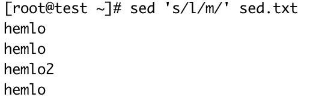
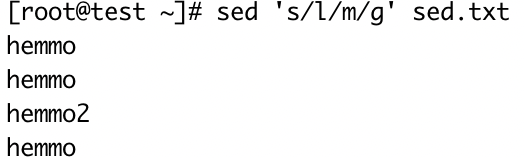
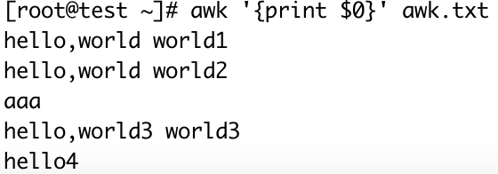
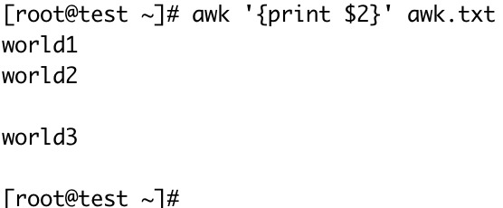
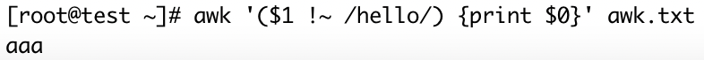
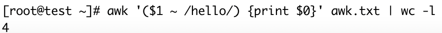

#### `grep`  — 查找

- 常用于查找文件中符合条件的字符串
- -i：忽略大小写、-n：显示该行的行号、-v：忽略包含制定字符串的内容、-R：查找所有文件包含子文件
- 注意：grep经常和管道"｜"结合使用，实现数据过滤查找

<table>
  <tbody>
    <tr>
      <td width="50%"><i><b>测试文件linux.txt</b></i></td>
      <td><pre>linux
linux
centos
linux
centos
ubuntu
ubuntu
CentoS</pre></td>
    </tr>
    <tr>
      <td colspan=2><b>shell命令测试</b></td>
    </tr>
    <tr>
      <td>查询含有cent的内容</td>
      <td></td>
    </tr>
    <tr>
      <td>查询以字母<b>u</b>开头的内容</td>
      <td></td>
    </tr>
    <tr>
      <td>忽略大小写查询含有cent的内容</td>
      <td></td>
    </tr>
    <tr>
      <td>查询带行号内容</td>
      <td></td>
    </tr>
    <tr>
      <td>查询关于python的进程</td>
      <td></td>
    </tr>
    <tr>
      <td>
        去除无用的python进程信息<br />
        -v：忽略包含制定字符串的内容
      </td>
      <td></td>
    </tr>
    <tr>
      <td>
        满足多个关键字之一<br/>
        <code>grep -E "str1|str2|str3|" filename</code><br/>
        <code>egrep "str1|str2|str3|" filename</code>
      </td>
      <td></td>
    </tr>
  </tbody>
</table>


#### `sed `  — 编辑

- 用来自动编辑一个或多个文件、简化对文件的反复操作
- a/i：增加、d：删除、s：替换、-i：直接修改源文件

<table>
  <tbody>
    <tr>
      <td width="40%">测试文件</td>
      <td><pre>hello
hello
hello2
hello</pre></td>
    </tr>
    <tr>
      <td colspan=2><b>shell命令测试</b></td>
    </tr>
    <tr>
      <td>在第2行下添加一行内容haha, 通过参数a</td>
      <td>
        <br />
        但是我们查看这个文件的内容发现数据<b>并没有被真正添加进去</b>。<br />
				<b>注意</b>：sed默认不会直接修改文件数据，而是将数据复制到缓冲区中，
        修改也仅限于缓冲区中的数据，最后把缓冲区中的数据输出到控制台
      </td>
    </tr>
    <tr>
      <td>在文件最后一行后添加haha，通过参数$a</td>
      <td></td>
    </tr>
    <tr>
      <td>在第1行前面插入一行hahaha，通过参数i</td>
      <td></td>
    </tr>
    <tr>
      <td>删除第3行数据，通过参数d</td>
      <td></td>
    </tr>
    <tr>
      <td>删除最后一行，通过参数$d</td>
      <td></td>
    </tr>
    <tr>
      <td colspan=2>
        替换文件内容，<b>最常用</b><br />
        参数格式：[address]s/pattern/replacement/flags
        <ul>
          <li>address：表示指定要操作的具体行，是一个可选项</li>
          <li>s：表示替换操作</li>
          <li>pattern：指要替换的内容</li>
          <li>replacement：指要替换的新内容、</li>
          <li>
            flags：如果为空，则只会在第一次匹配成功时做替换操作。不为空时有两种用法：<br/>
            1. 表示为1～512之间的任意一个数字，表示要替换的字符串在这一行中出现第几次才替换<br/>
            2. 表示为g，表示对每一行数据中所有匹配到的内容全部进行替换
          </li>
        </ul>
      </td>
    </tr>
    <tr>
      <td>flags参数为空，默认匹配每行第一次出现的l</td>
      <td></td>
    </tr>
    <tr>
      <td>将每行第2次出现的l替换成m</td>
      <td></td>
    </tr>
    <tr>
      <td>将每行所有出现的l替换成m</td>
      <td></td>
    </tr>
    <tr>
      <td>将第2行第一次出现的l转换成m</td>
      <td></td>
    </tr>
    <tr>
      <td>将第2行所有出现的l转换成m</td>
      <td></td>
    </tr>
    <tr>
      <td colspan=2><b>注意了,注意了</b>，以上所有的操作都不会修改源文件的内容</td>
    </tr>
    <tr>
      <td><b>修改原文件的内容，使用sed -i</b><br />将每行所有出现的l替换成m，并保存到文件中</td>
      <td></td>
    </tr>
  </tbody>
</table>


#### awk  — 强大的文本分析工具

相对于grep的查找，sed的编辑，awk在**其对数据分析并生成报告时**，显得尤为强大，简单说awk就是把文件逐行的读入，以空白字符为默认分隔符将每行内容分片，切开的部分在进行各种分析处理。

```
[root@bigdata01 ~]# awk --help
Usage: awk [POSIX or GNU style options] -f progfile [--] file ...
Usage: awk [POSIX or GNU style options] [--] 'program' file ...

Examples:
	gawk '{ sum += $1 }; END { print sum }' file
	gawk -F: '{ print $1 }' /etc/passwd
```

- option：可选项，指定文件中数据的分割符
- program：具体的处理逻辑
- file：被操作的文件

在具体使用awk之前我们还需要掌握awk的一个特性，就是awk在处理文本数据的时候，它会自动给每行中的每个字段分配一个变量。

变量从1开始，

`$1`：表示文本中的第1个数据字段

`$2`：表示文本中的第2个数据字段

以此类推

特殊情况：`$0`：表示整个个文本行的内容

<table>
  <tbody>
    <tr>
      <td width=40%><i><b>测试文件</b></i></td>
      <td><pre>hello,world world1
hello,world world2
aaa
hello,world3 world3
hello4</pre></td>
    </tr>
    <tr>
      <td colspan=2><b>打印文本中的数据</b></td>
    </tr>
    <tr>
      <td>打印整个文本行内容</td>
      <td></td>
    </tr>
    <tr>
      <td>打印每行数据的第2个数据字段</td>
      <td></td>
    </tr>
    <tr>
      <td colspan=2><b>指定字段分割符：awk -F: '{print $1}' /etc/password</b></td>
    </tr>
    <tr>
      <td>通过-F指定分割符为逗号,</td>
      <td></td>
    </tr>
    <tr>
      <td colspan=2><b>通过正则表达式进行过滤</b></td>
    </tr>
    <tr>
      <td>打印包含hello,world字符串的数据字段</td>
      <td></td>
    </tr>
    <tr>
      <td colspan=2><b>对某一列数据匹配，$指匹配具体哪一列，~表示匹配，!~表示不匹配，对比逻辑放入到小括号()内</b></td>
    </tr>
    <tr>
      <td>第1列匹配包含hello的整个文本行内容</td>
      <td></td>
    </tr>
    <tr>
      <td>第2列匹配包含字母的第2列文本行内容</td>
      <td></td>
    </tr>
    <tr>
      <td>不匹配使用!~, 每行数据第一个数据不匹配hello</td>
      <td></td>
    </tr>
    <tr>
      <td colspan=2><b>与管道命令结合使用</b></td>
    </tr>
    <tr>
      <td>统计第1列匹配包含hello的文本总共几行</td>
      <td></td>
    </tr>
  </tbody>
</table>