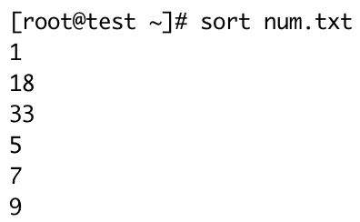
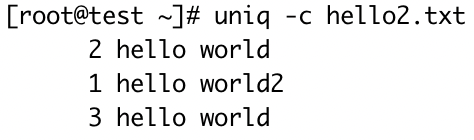
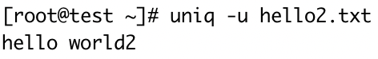

#### wc — 打印文件中换行符，字，和字节个数

- 常用参数

  ```
    -c, --bytes            	打印字节数，包含换行符
    -m, --chars            	打印字符数，包含换行符
    -l, --lines            	显示行数
        --files0-from=F     从指定文件读取以NUL 终止的名称，如果该文件被指定为"-"则从标准输入读文件名
    -L, --max-line-length		打印最长行的长度
    -w, --words							打印单词计数
        --help							显示帮助信息
        --version						输出版本信息
  ```

- 文件hello.txt

  ```
  hello world
  hello world
  hello world hello world
  hello world
  hello world
  hello world
  ```

- 示例

  ```
  [root@test ~]# wc -c hello.txt
  84 hello.txt
  [root@test ~]# wc -m hello.txt
  84 hello.txt
  [root@test ~]# wc -l hello.txt
  6 hello.txt
  [root@test ~]# wc -L hello.txt
  23 hello.txt
  [root@test ~]# wc -w hello.txt
  14 hello.txt
  ```

#### sort — 排序文本行

```
  常用参数
  -b, --ignore-leading-blanks	忽略前导的空白区域
  -d, --dictionary-order			只考虑空白区域和字母字符
  -f, --ignore-case						忽略字母大小写
  -g, --general-numeric-sort  按一般数值比较
  -i, --ignore-nonprinting    只考虑可打印的字符 
  -M, --month-sort            compare (unknown) < 'JAN' < ... < 'DEC'
  -h, --human-numeric-sort    使用易读性数字(例如： 2K 1G)
  -n, --numeric-sort					根据字符串数值比较
  -R, --random-sort						根据随机hash 排序
      --random-source=文件		 从指定文件中获得随机字节
  -r, --reverse								逆序输出排序结果
      --sort=WORD							按照WORD 指定的格式排序：一般数字-g，高可读性-h，月份-M，数字-n，随机-R，版本-V
  -V, --version-sort					在文本内进行自然版本排序

其他选项：
  -c, --check, 								检查输入是否已排序，若已有序则不进行操作
  -k, --key=KEYDEF          	通过键排序； KEYDEF 给出位置和类型 
  -o, --output=文件						 将结果写入到文件而非标准输出
  -t, --field-separator=分隔符	使用指定的分隔符代替非空格到空格的转换
  -u, --unique		配合-c，严格校验排序；不配合-c，则只输出一次排序结果
      --help			显示此帮助信息并退出
      --version		显示版本信息并退出
```

<table>
  <tbody>
    <tr>
      <td width=50%><i><b>文件num.txt</b></i></td>
      <td><i><b>文件num2.txt</b></i></td>
    </tr>
    <tr>
      <td><pre>1
33
5
7
9
18</pre></td>
      <td><pre>ac 11
ab 2
cx 31
dd 8
ef 26</pre></td>
    </tr>
    <tr>
      <td colspan=2><i><b>命令测试</b></i></td>
    </tr>
    <tr>
      <td>默认按字符串排序</td>
      <td></td>
    </tr>
    <tr>
      <td>按照数据的数值大小排序</td>
      <td></td>
    </tr>
    <tr>
      <td>按字符串倒叙排序</td>
      <td></td>
    </tr>
    <tr>
      <td>按照数值倒序排序</td>
      <td></td>
    </tr>
    <tr>
      <td>对于文件稍复杂的数据，如果对数据排序上述命令已经无法实现我们的需求，这时我们可以结合参数<code>-k</code>表示数值是文件的第几列，<b>列编号从1开始</b></td>
      <td></td>
    </tr>
  </tbody>
</table>


#### uniq — 检查重复的行列

<table>
  <tbody>
    <tr>
      <td width=50%><i><b>测试文件hello2.txt</b></i></td>
      <td><pre>hello world
hello world
hello world2
hello world
hello world
hello world</pre></td>
    </tr>
    <tr>
      <td colspan=2><i><b>命令</b></i></td>
    </tr>
    <tr>
      <td>对连续的内容去重</td>
      <td></td>
    </tr>
    <tr>
      <td>在输出行前面加上数据在文件中重复出现的次数</td>
      <td></td>
    </tr>
    <tr>
      <td>返回文件中不重复的行</td>
      <td></td>
    </tr>
    <tr>
      <td>
        获取全文中每个单词的唯一<br/>
        1. 首先对文件内容安字符串排序<br/>
        2. 然后使用管道命令<code>|</code>结合<code>uniq</code>获取去重后的数据
      </td>
      <td></td>
    </tr>
  </tbody>
</table>


#### head — 获取前N条数据

<table>
  <tbody>
    <tr>
      <td width=50%><i><b>测试文件head.txt</b></i></td>
            <td><pre>1
33
5
7
9
18</pre></td>
    </tr>
    <tr>
      <td colspan=2><i><b>实例</b></i></td>
    </tr>
    <tr>
      <td><code>head -n</code>获取前n条数据</td>
     	<td></td>
    </tr>
    <tr>
      <td>获取head.txt的topN数据</td>
      <td></td>
    </tr>
  </tbody>
</table>


