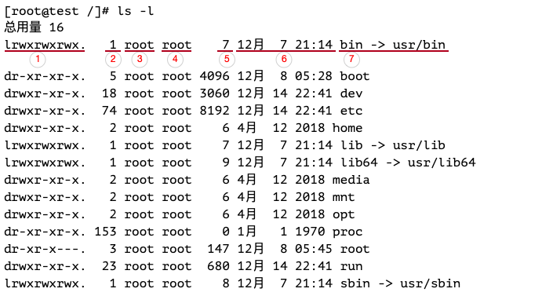

#### pwd — 打印当前工作目录

```
[root@192 ~]# pwd
/root
```

#### cd — 更改目录

- 切换到绝对路径

  ```
  [root@test /]# cd /usr/bin/
  [root@test bin]#
  ```

- 切换到相对路径

  ```
  [root@test etc]# cd /usr/bin/
  [root@test bin]# pwd
  /usr/bin
  #进入到相对目录
  [root@test bin]# cd ../etc/
  [root@test etc]# pwd
  /usr/etc
  ```

- 有用的快捷键

  | 快捷键          | 运行结果                                                     |
  | --------------- | ------------------------------------------------------------ |
  | `cd .`          | 回到当前目录                                                 |
  | `cd ..`         | 回到当前目录的上一级目录                                     |
  | `cd ~`或`cd`    | 更改工作目录到你的家目录                                     |
  | `cd -`          | 更改工作目录到先前的工作目录                                 |
  | `cd  ̃user_name` | 更改工作目录到用户家目录。例如, cd  ̃suker 会更改工作目 录到用户“”的家目录。 |

####  ls — 列出目录内容

最常使用的命令，可以列出一个目录包含的文件及子目录，以及各种重要文件和目录的属性。

| 选项 | 长选项           |                                                              |
| ---- | ---------------- | ------------------------------------------------------------ |
| -a   | --all            | 列出所有文件，包括文件名以圆点开头的默认会被隐藏的隐藏文件   |
| -d   | --directory      | 通常，如果指定了目录名，ls 命令会列出这个目录中 的内容，而不是目录本身。<br>把这个选项与 -l 选项结合 使用，可以看到所指定目录的详细信息，而不是目录中的内容。 |
| -F   | --classify       | 这个选项会在每个所列出的名字后面加上一个指示符。<br>例如，如果名字是目录名，则会加上一个’/’ 字 符。 |
| -h   | --human-readable | 当以长格式列出时，以人们可读的格式，而不是以字 节数来显示文件的大小 |
| -l   |                  | 以长格式显示结果                                             |
| -r   | --reverse        | 以相反的顺序来显示结果。通常，ls 命令的输出结果按照字母升序排列。 |
| -S   |                  | 命令输出结果按照文件大小来排序                               |
| -t   |                  | 按照修改时间来排序                                           |

- 列出当前目录下所有文件和子目录

  ```
  [root@test ~]# ls
  anaconda-ks.cfg
  ```

- 指定目录

  ```
  [root@192 ~]# ls /usr/
  bin  etc  games  include  lib  lib64  libexec  local  sbin  share  src  tmp
  ```

- 指定多个目录

  ```
  [root@192 ~]# ls /usr /var
  /usr/:
  bin  etc  games  include  lib  lib64  libexec  local  sbin  share  src  tmp
  
  /var:
  adm  cache  crash  db  empty  games  gopher  kerberos  lib  local  lock  log  mail  nis  opt  preserve  run  spool  tmp  yp
  ```

- `ls -l`文件属性信息

  

  选一个文件，来看一下各个输出字段的含义
  
  | 序号 | 值             | 含义                                                         |
  | ---- | -------------- | ------------------------------------------------------------ |
  | 1    | lrwxrwxrwx     | 对于文件的访问权限。<br>第一个字符含义：文件(-)、目录(d)、链接(l);<br/>其余字符每3个一组(rwx)：r(读)、w(写)、x(执行)；<br>第一组：文件所有者权限，第二组：文件所属组成员权限，第三组：其他所有人访问权限 |
  | 2    | 1              | 文件的硬链接数目                                             |
  | 3    | root           | 文件所有者的用户名                                           |
  | 4    | root           | 文件所属用户组的名字                                         |
  | 5    | 7              | 文件大小（字节）                                             |
  | 6    | 12月  7 21:14  | 上次修改文件的时间和日期                                     |
  | 7    | bin -> usr/bin | 文件名/目录名                                                |

####  touch — 创建一个空文件

用法：touch [选项]... 文件...

```
[root@test soft]# touch test.txt
[root@test soft]# ls -l
总用量 189604
-rw-r--r-- 1 root root 194151339 8月  31 16:14 jdk-8u231-linux-x64.tar.gz
-rw-r--r-- 1 root root         0 10月  8 15:48 test.txt
```

####  file — 确定文件类型

```
[root@test ~]# file anaconda-ks.cfg
anaconda-ks.cfg: ASCII text
```

####  more — 一页一页的显示文件内容

用法：more  文件

- 功能

  space键：代表向下翻一页

  enter键：向下翻一行

  ctrl + F：向下滚动一屏

  ctrl + B：向上滚动一屏

  =键：输出当前行的行号

  q：离开程序

#### less — 浏览文件内容

用法：less 文件，与more相似，不同的是less允许使用[pageup]和[pagedown]往回滚动

- 功能

  space键：向下翻动一页

  [pagedown]：向下翻动一页

  [pageup]：向上翻动一页

  /字符串：向下搜索【字符串】的功能；n：向下查找；N：向上查找

  ?字符串：向上搜索【字符串】的功能；n：向上查找；N：向下查找

  q：离开程序

#### cp — 复制文件和目录

用法：cp 源文件 目标文件

​    或：cp -r 源文件... 目录

```
# 复制文件test.txt,复制后的文件名为test1.txt
[root@test soft]# cp test.txt test1.txt
# 复制文件test.txt,复制后的文件名为test2.txt
[root@test soft]# cp -r test.txt test2.txt
[root@test soft]# ls
test1.txt  test2  test2.txt  test.txt
# 递归复制test2目录到/root, 注意一定加参数-r
[root@test soft]# cp -r test2 /root
```

#### mv — 移动/重命名文件和目录

用法：mv [选项]... [-T] 源文件 目标文件
    或：mv [选项]... 源文件... 目录
    或：mv [选项]... -t 目录 源文件...

```
# 重命名文件test1.txt为test
[root@test soft]# mv test1.txt test
# 重命名目录名test2为testdir
[root@test soft]# mv test2 testdir
# 将文件test2.txt移动到/root目录下
[root@test soft]# mv test2.txt /root
# 将目录testdir移动到/root目录下
[root@test soft]# mv testdir/ /root

# 验证
[root@test soft]# ls -l /root/
总用量 8
-rw-------. 1 root root 2580 9月   1 15:25 anaconda-ks.cfg
-rw-r--r--  1 root root 1148 9月  19 03:04 install_jdk.sh
drwxr-xr-x  3 root root   19 10月  8 16:50 test2
-rw-r--r--  1 root root    0 10月  8 16:44 test2.txt
drwxr-xr-x  3 root root   19 10月  8 16:02 testdir
```

#### mkdir — 创建目录

用法：mkdir [选项]... 目录... 

- 创建目录

  ```
  [root@test soft]# mkdir test
  ```
  
- -p, --parents，创建多层目录

  ```
  [root@test soft]# mkdir -p test2/test3
  ```

#### rmdir — 删除指定的空目录

用法：rmdir [选项]... 目录....

```
[root@test soft]# rmdir test
[root@test soft]# rmdir test2
rmdir: 删除 "test2" 失败: 目录非空
```

#### rm — 删除文件和目录

- rm 文件, 删除文件，需要询问

  ```
  [root@test soft]# rm test.txt
  rm：是否删除普通空文件 "test.txt"？y
  [root@test soft]# ls
  test
  ```

- rm -r 目录，需要询问

  ```
  [root@test soft]# rm -r testdir/
  rm：是否进入目录"testdir/"? y
  rm：是否删除目录 "testdir/test3"？y
  rm：是否删除目录 "testdir/"？y
  ```

- rm -f，强制删除文件，不需要询问，**慎用**，删除之后就找不到了，**linux系统中没用回收站**

  ```
  [root@test soft]# rm -f testfile
  ```

- rm -rf，递归删除目录及其文件，**最危险的操作，没有任何提示，慎用！慎用！慎用！**

  ```
  [root@test soft]# ls -al
  总用量 0
  drwxr-xr-x 3 root root 49 10月  8 17:19 .
  drwxr-xr-x 6 root root 74 9月  23 20:14 ..
  -rw-r--r-- 1 root root  0 10月  8 16:43 test
  drwxr-xr-x 3 root root 19 10月  8 17:19 testdir
  -rw-r--r-- 1 root root  0 10月  8 17:18 testfile
  [root@test soft]# rm -f testfile
  [root@test soft]# rm -rf testdir/
  [root@test soft]# ls -al
  总用量 0
  drwxr-xr-x 2 root root 18 10月  8 17:21 .
  drwxr-xr-x 6 root root 74 9月  23 20:14 ..
  -rw-r--r-- 1 root root  0 10月  8 16:43 test
  ```

#### ln — 创建硬链接和符号链接

链接有两种：软(符号)链接、硬链接

硬链接相当于一个原始文件的一个复制，不能对目录使用硬链接；软链接相当于快捷方式，不能删除原文件

```
# 创建一个硬链接
[root@test soft]# ln testfile file2
[root@test soft]# ls -l
总用量 0
-rw-r--r-- 2 root root  0 10月  8 17:34 file2
drwxr-xr-x 3 root root 19 10月  8 17:34 testdir
-rw-r--r-- 2 root root  0 10月  8 17:34 testfile

# 创建一个软链接
[root@test soft]# ln -s testfile vlink
[root@test soft]# ll
总用量 0
drwxr-xr-x 3 root root 19 10月  8 17:34 testdir
-rw-r--r-- 1 root root  0 10月  8 17:36 testfile
lrwxrwxrwx 1 root root  8 10月  8 17:37 vlink -> testfile
```

#### cat — 将[文件]或标准输入组合输出到标准输出

用法：cat [选项]... [文件]...

```
[root@test ~]# cat hello.txt
hello1
hello2
hello3

# 列出一些特殊字符
[root@test ~]# cat -A hello.txt
hello1$
hello2$
hello3$

# 列出行号
[root@test ~]# cat -b hello.txt
     1	hello1
     2	hello2
     3	hello3

# 查看centos版本
[root@test ~]# cat /etc/redhat-release
CentOS Linux release 7.7.1908 (Core)
```

#### tac — 查看文件内容，从最后一行开始显示，按行倒序显示

```
[root@test ~]# tac hello.txt
hello3
hello2
hello1
```

#### tail — 查看文件尾部内容

优点：可以查看文件实时追加的内容

```
#tail -n 2 文件，查看文件头（从末尾开始）2行内容，2可以是任何数
[root@test ~]# tail -n 2 hello.txt
hello2
hello3

[root@test ~]# echo hello.txt 4 >> hello.txt
[root@test ~]# echo hello.txt 5 >> hello.txt
#tail -f 文件，实时追踪该文件的所有更新
[root@test ~]# tail -f hello.txt
hello1
hello2
hello3
hello.txt 4
hello.txt 5

#Ctrl + c：退出
```

#### echo — 将内容输出到设备

```
[root@test ~]# echo "hello world"
hello world
#不解析转义字符
[root@test ~]# echo "hello\t\t world"
hello\t\t world
#解析转义字符
[root@test ~]# echo -e "hello\t\t world"
hello		 world
#打印变量
[root@test ~]# echo $PATH
/usr/local/sbin:/usr/local/bin:/usr/sbin:/usr/bin:/data/servers/jdk1.8/bin:/root/bin

#将“hello world”写入到test.txt文件中
[root@test ~]# echo "hello word~" > test.txt`
```

#### 重定向命令

用法：ls -l > test.txt文件 （>表示覆盖写）

​    或：ls -l >> test.txt文件（>>表示追加到文件末尾）

```
[root@test ~]# cat hello.txt
hello1
hello2
#覆盖写
[root@test ~]# ls -l > hello.txt
[root@test ~]# cat hello.txt
总用量 8
-rw-------. 1 root root 2580 9月   1 15:25 anaconda-ks.cfg
-rw-r--r--  1 root root    0 10月  8 21:07 hello.txt
-rw-r--r--  1 root root 1148 9月  19 03:04 install_jdk.sh

#追加到文件末尾
[root@test ~]# ls -l >> hello.txt
[root@test ~]# cat hello.txt
总用量 8
-rw-------. 1 root root 2580 9月   1 15:25 anaconda-ks.cfg
-rw-r--r--  1 root root    0 10月  8 21:07 hello.txt
-rw-r--r--  1 root root 1148 9月  19 03:04 install_jdk.sh
总用量 12
-rw-------. 1 root root 2580 9月   1 15:25 anaconda-ks.cfg
-rw-r--r--  1 root root  185 10月  8 21:07 hello.txt
-rw-r--r--  1 root root 1148 9月  19 03:04 install_jdk.sh
```

#### history — 显示或操纵历史列表

history 保留了最近执行的命令记录，默认可以保存1000，历史清单从0开始编号到最大值

<table>
  <tbody>
    <tr>
      <td>history N</td>
      <td>显示最近N条命令</td>
  	</tr>
    <tr>
      <td>history -c</td>
      <td>清除所有的历史记录</td>
  	</tr>
    <tr>
      <td>history -w test.txt </td>
      <td>保存历史记录到文件test.txt</td>
  	</tr>
  </tbody>
</table>

```
#显示最近10条历史记录
[root@test ~]# history 10
```

