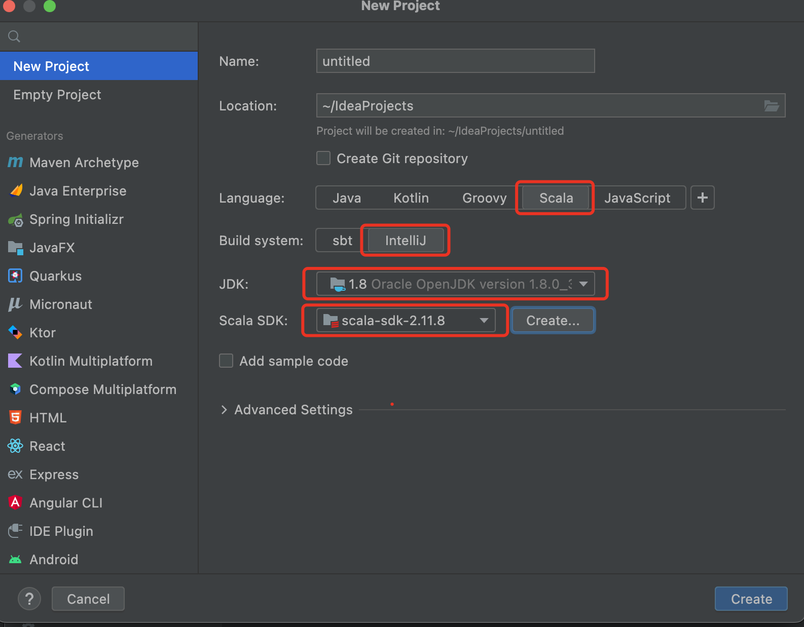
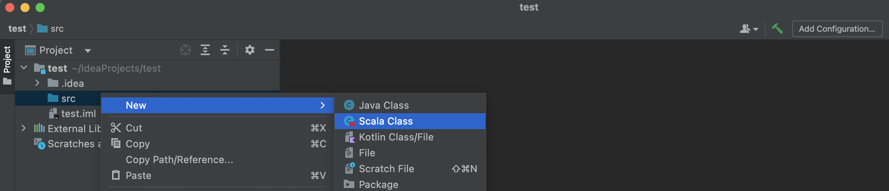
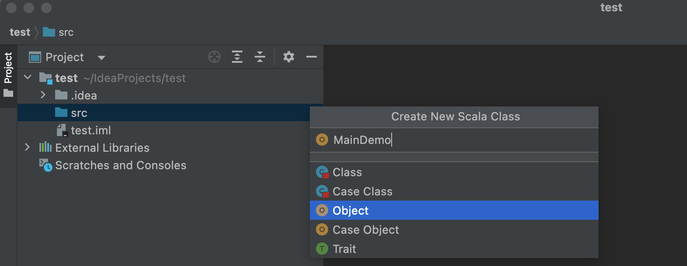
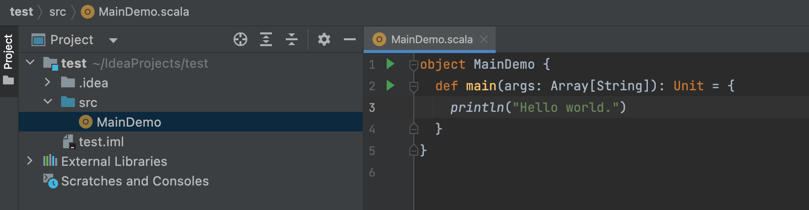
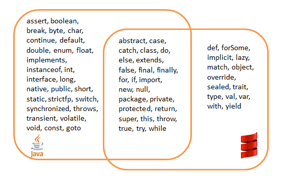
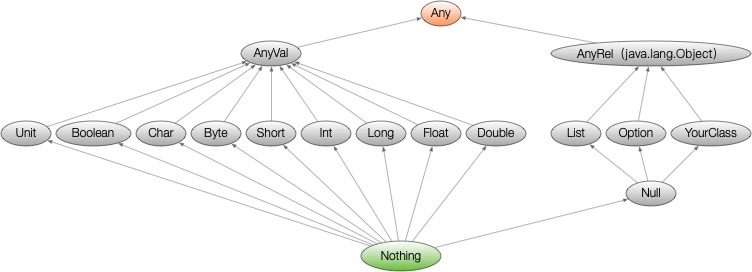

## Scala编程

课程目标：熟练使用Scala进行Spark开发，为阅读Spark内核源码做准备

## 第一部分 Scala基础

### 第1节 Scala语言概述

#### 1.1 Scala语言起源

马丁·奥德斯基(Martin Odersky)是编译器及编程的狂热爱好者。 主流JVM的Javac编译器就是马丁·奥德斯基编写出来的，JDK5.0、JDK8.0的编译器也是他写的。 长时间的编程之后，他希望发明一种语言，能够让写程序这样的基础工作变得高效简单。当接触到Java语言后，对Java这门语言产生了极大的兴趣，所以决定将函数式编程语言的特点融合到 Java中，由此发明了Scala。

#### 1.2 Scala语言特点

Scala是一门以JVM为运行环境并将面向对象和函数式编程的最佳特性结合在一起的静态类型编程语言。 源代码会被编译成Java字节码，然后运行于JVM之上，并可以调用现有的Java类库，实现两种语言的无缝互操作。 

- 面向对象 

  Scala是一种面向对象的语言。 Scala中的每个值都是一个对象，包括基本数据类型(即布尔值、数字等)在内，连函数也是对象。 

- 函数式编程

  Scala也是一种函数式语言，其函数也能当成值来使用。 Scala中支持高阶函数，允许嵌套多层函数，并支持柯里化。 Scala提供了模式匹配，可以匹配各种情况，比如变量的类型、集合的元素、有值或无值。

- 静态类型

  Scala具备类型系统，通过编译时检查，保证代码的安全性和一致性

- 并发性

  Scala使用Actor作为其并发模型，Actor是类似线程的实体。 Actor可以复用线程，因此可以在程序中使用数百万个Actor，而线程只能创建数千个。 

#### 1.3 为什么要学Scala

优雅：这是框架设计师第一个要考虑的问题，框架的用户是应用开发程序员，API是否优雅直接影响用户体验。

简洁：Scala语言表达能力强，一行代码抵得上Java多行，开发速度快。 

融合大数据生态圈：Hadoop现在是大数据事实标准，（Kafka Spark源码都是用Scala编写的，Spark Flink都支持使用Scala进行开发）Spark并不是要取代Hadoop，而是要完善Hadoop生态。 

### 第2节 环境准备

Scala官网：https://www.scala-lang.org/

scala-2.11.8，开发工具IntelliJ IDEA

#### 2.1 Mac下环境配置

> 注意：安装scala之前需安装jdk

解压

```
sudo tar -zxvf scala-2.11.8.tgz -C /usr/local/share
```

配置环境变量

```
vi ~/.bash_profile
# 在文件末尾追加
export JAVA_HOME=$(/usr/libexec/java_home)
# scala
export SCALA_HOME=/usr/local/share/scala-2.11.8
export PATH="$SCALA_HOME/bin:$PATH"
# scala END
```

编辑完成后执行

```
sudo cp ~/.bash_profile ~/.zshrc
source ~/.bash_profile
```

若scala执行错误

```
cat: /Library/Internet: No such file or directory
cat: Plug-Ins/JavaAppletPlugin.plugin/Contents/Home: No such file or directory
```

在/usr/local/share/scala-2.11.8/bin/scala文件中修改

```
# 第201行
java_release="$(cat "$JAVA_HOME"/release | grep JAVA_VERSION)"
```

执行scala，进入命令行

```
suker@192 ~ % scala
Welcome to Scala 2.11.8 (Java HotSpot(TM) 64-Bit Server VM, Java 1.8.0_311).
Type in expressions for evaluation. Or try :help.

scala>
```

#### 2.2 IDEA环境配置

IDEA是JAVA的集成开发环境，要支持Scala开发，需要安装Scala插件

Configure -> Plugins，搜索Scala后安装即可





2.3 Scala的REPL

在命令行输入scala可启动Scala REPL。REPL 是一个交互式解析器环境，R(read)、E(evaluate) 、P(print)、L(loop) 输入值，交互式解析器会读取输入内容并对它求值，再打印结果，并重复此过程。 

### 第3节 基础语法

**基础语法规则**

- **区分大小写**：Scala语言对大小写敏感；
- **类名**：所有的类名的第一个字母要大写；如果使用几个单词来构成一个类名，每个单词的第一个字母要大写；
- **方法名**：所有方法名的第一个字母用小写；如果使用几个单词来构成方法名，除第一个单词外每个单词的第一个字母应大写；
- **程序文件名** ：Scala程序文件的后缀名是 .scala，程序文件的名称可以不与对象名称完全匹配。这点与Java有所区别。**强烈建议遵循Java的惯例，程序文件名称与对象名称匹配；**
- **main()方法**：Scala程序从main()方法开始处理，这是每一个程序的入口点。**注意：main()定义在object中；**

**标识符**：所有Scala组件都需要名称，用于对象、类、变量和方法的名称称为标识符。

- 关键字不能用作标识符，标识符区分大小写；
- 标识符以字母或下划线开头，后面可以有更多的字母、数字或下划线；
- $字符是Scala中的保留关键字，不能在标识符中使用；保留关键字见下图


**注释**：Scala使用了与Java相同的单行和多行注释；

**换行符**：Scala语句可以用分号作为一行的结束，语句末尾的分号通常可以省略，但是如果一行里有多个语句那么分号是必须的。

### 第4节 常用类型与字面量

| 数据类型 | 描述                                                         |
| -------- | ------------------------------------------------------------ |
| Byte     | 8位有符号补码整数。数值区间为 -128 到 127                    |
| Short    | 16位有符号补码整数。数值区间为 -32768 到 32767               |
| Int      | 32位有符号补码整数。数值区间为 -2147483648 到 2147483647     |
| Long     | 64位有符号补码整数。数值区间为 -9223372036854775808 到 9223372036854775807 |
| Float    | 32 位, IEEE 754标准的单精度浮点数                            |
| Double   | 64 位 IEEE 754标准的双精度浮点数                             |
| Char     | 16位无符号Unicode字符, 区间值为 U+0000 到 U+FFFF             |
| String   | 字符序列                                                     |
| Boolean  | true或false                                                  |
| Unit     | 表示无值，相当于Java中的void，用于不返回任何结果的方法的返回类型。Unit写成 () |
| Null     | 通常写为null                                                 |
| Nothing  | Nothing类型在Scala类层级的最低端，它是任何其他类型的子类型   |
| Any      | Any是Scala中所有类的超类                                     |
| AnyRel   | AnyRef是Scala中所有引用类的超类                              |

Scala和Java一样，有8种数值类型 Byte、Short、Int、Long、Float、Double、Char、Boolean 类型; 

和 Java 不同的是 ，这些类型都是类，有自己的属性和方法。 

Scala并不刻意的区分基本类型和引用类型。 

String直接引用Java.lang.String中的类型，String在需要时能隐式转换为StringOps，因此不需要任何额外的转换，String就可以使用StringOps中的方法。 

每一种数据类型都有对应的Rich类型，如RichInt、RichChar等，为基本类型提供了更多的有用操作。  

```
-- StringOps。 //toInt等方法都定义在StringLike中;StringOps实现了StringLike
scala> "11".toString
res0: String = 11

scala> 1.max(10)
res1: Int = 10

scala> 1.min(10)
res2: Int = 1

scala> 1.to(10)
res3: scala.collection.immutable.Range.Inclusive = Range(1, 2, 3, 4, 5, 6, 7, 8, 9, 10)

scala> 1.until(10)
res4: scala.collection.immutable.Range = Range(1, 2, 3, 4, 5, 6, 7, 8, 9)
```

- **整数字面量**：有两种形式，十进制与十六进制(0X/0x开头) 

  ```
  -- 十六进制整数字面量
  scala> 0Xa
  res6: Int = 10
  
  scala> 0xa
  res7: Int = 10
  
  scala> 0xcafe
  res8: Int = 51966
  
  -- 十进制整数字面量
  scala> 255
  res9: Int = 255
  
  -- Long类型整数字面量
  scala> 0xcafeL
  res10: Long = 51966
  
  scala> 255L
  res11: Long = 255
  
  -- Byte 或 Short类型，需要明确声明，否则编译器会推断为Int类型
  scala> val little: Short = 32767
  little: Short = 32767
  
  scala> val littler: Byte = 127
  littler: Byte = 127
  ```

- **浮点数字面量**

  ```
  -- 十进制数、可选的小数点、可选的e开头的指数
  scala> 3.1415926
  res12: Double = 3.1415926
  
  scala> 2.1415926e2
  res13: Double = 214.15926
  
  -- 浮点数字面量以F/f结尾为Float类型;否则为Double类型;
  
  scala> 3.1415926f
  res14: Float = 3.1415925
  
  scala> 3.1415926F
  res15: Float = 3.1415925
  ```

- **字符字面量**

  ```
  scala> 'A'
  res16: Char = A
  
  -- 用字符的Unicode码来表示。Unicode码前128个字符就是ASCII码
  scala> '\u0042'
  res17: Char = B
  
  scala> '\'
  <console>:1: error: unclosed character literal
  '\'
  ^
  
  scala> '\\'
  res18: Char = \
  ```

- 字符串字面量

  ```
  scala> "Hello Scala"
  res19: String = Hello Scala
  ```

### 第5节 类层次结构

Scala中所有的类，包括值类型和引用类型，都最终继承自一个统一的根类型Any。 

Scala中定义了以下三个底层类: 

1. Any是所有类型共同的根类型，Any是AnyRef和AnyVal的超类
2. AnyRef是所有引用类型的超类
3. AnyVal是所有值类型的超类 



上图中有三个类型需要注意：

1. Null是所有引用类型的子类型
   Null类只有一个实例对象**null**。 null可以赋值给任意引用类型，但是不能赋值给值类型。

2. Nothing位于Scala类继承关系的底部，它是其他所有其他类型的子类型

   Nothing对泛型结构有用 。比如，空列表Nil的类型就是List[Nothing] 

   Nothing的可以给出非正常终止的信号。比如，使用Nothing处理异常

3. Unit类型用来标识过程，过程就是没有返回值的方法，Unit类似于Java里的void；**Unit只有一个实例()**。 

```
scala> var i: Int = null
<console>:11: error: an expression of type Null is ineligible for implicit conversion
       var i: Int = null
                    ^

scala> val str: String = null
str: String = null

-- 使用Nothing处理异常
scala> val test = false
test: Boolean = false

scala> var thing: Int = if(test) 42 else throw new Exception("ERROR")
java.lang.Exception: ERROR
  ... 32 elided
  
-- Unit类型只有一个实例(),该实例没有实际意义
scala> val a = ()
a: Unit = ()
```

### 第6节 值与变量&自动类型推断

Scala当中声明变量可以使用以下两种方式

- val，值 -- value，用val定义的变量，值是不可变的
- var，变量 -- variable，用var定义的变量，值是可变的

**在Scala中，鼓励使用val。**大多数程序并不需要那么多的var变量。

声明变量时，可以不指定变量的数据类型，编译器会根据赋值内容自动推断当前变量的数据类型。**备注：简单数据类型可以省略，对于复杂的数据类型建议明确声明；**

声明变量时，可以将多个变量放在一起声明。 

```
-- val定义的变量不可更改，变量的类型编译器可以进行自动类型推断
scala> val name = "tom"
name: String = tom

-- 必要时制定数据类型
scala> var name: String = null
name: String = null

-- 可以将多个值或变量放在一起声明
scala> var x, y = 1;
x: Int = 1
y: Int = 1

scala> var name, message: String = null
name: String = null
message: String = null
```

### 第7节 操作符

Scala的算术操作符、位操作符与Java中的效果一样的。 

需要特别注意一点：Scala中的操作符都是方法 

书写时推荐使用：a + b 、1 to 10这种代码风格。 Scala 没有提供 ++、-- 操作符，但是可以使用+=、-=

### 第8节 块表达式和赋值语句

{} 块包含一系列表达式，其结果也是一个表达式，块中最后一个表达式的值就是块的值；

赋值语句返回Unit类型，代表没有值；

```
scala> :paste
// Entering paste mode (ctrl-D to finish)

val x1 = 1
val y1 = 1
val x2 = 0
val y2 = 0
val distance = {
  val dx = x1 - x2
  val dy = y1 - y2
  math.sqrt(dx*dx + dy*dy)
}

// Exiting paste mode, now interpreting.

x1: Int = 1
y1: Int = 1
x2: Int = 0
y2: Int = 0
distance: Double = 1.4142135623730951

-- 赋值语句的值是Unit类型，不要把它们串接在一起。x的值是什么?
scala> :paste
// Entering paste mode (ctrl-D to finish)

var y = 0
var x = y = 1

// Exiting paste mode, now interpreting.

y: Int = 1
x: Unit = ()
```

### 第9节 输入和输出

通过readLine从控制台读取一行输入。 

如果要读取数字、Boolean或者字符，可以用readInt、readDouble、readByte、readShort、 readLong、readFloat、readBoolean或readChar。 

print、println、printf 可以将结果输出到屏幕; 

```
-- printf 带有C语言风格的格式化字符串的printf函数
scala> printf("Hello %s! You are %d years old.", "Scala", 18)
Hello Scala! You are 18 years old.
```

### 第10节 字符串插值器

Scala 提供了三种字符串插值器

1. s 插值器，对内嵌的每个表达式求值，对求值结果调用toString，替换掉字面量中的那些表达式

   ```scala
   var subject = "Spark"
   var str1 = s"Hello $subject"
   println(str1)
   
   val arr = (1 to 10).toArray
   val str2 = s"arr.length = ${arr.length}"
   println(str2)
   
   println(s"The answer is ${6*6}")
   ```
   输出结果

   ```
   Hello Spark
   arr.length = 10
   The answer is 36
   ```

2. f 插值器，它除了s插值器的功能外，还能进行格式化输出，在变量后用%指定输出格式，使用 java.util.Formatter中给出的语法

   ```scala
   val year = 2020
   val month = 10
   val day = 9
   println(f"$year-$month-$day")
   
   // yyyy-MM-dd，不足2位用0填充
   println(f"$year-$month%02d-$day%02d")
   ```

   输出结果

   ```
   2020-10-9
   2020-10-09
   ```

3. raw 插值器，按照字符串原样进行输出

   ```scala
   println("a\nb\nt")
   println("raw======")
   println(raw"a\nb\nt")
   println("""a\nb\tc""")
   ```

   输出结果

   ```
   a
   b
   t
   raw======
   a\nb\nt
   a\nb\tc
   ```

### 第11节 对象相等性

Java 中可以 == 来比较基本类型和引用类型：对基本类型而言，比较的是值的相等性对引用类型而言，比较的是引用相等性，即两个变量是否指向JVM堆上的同个对象 

Scala中

- 使用 == 或 !=比较两个基础类型的对象是否相等

  ```
  scala> 1 == 1
  res24: Boolean = true
  
  scala> 1 != 2
  res25: Boolean = true
  ```

- == 或 != 可以比较同一类型的两个对象

  ```
  scala> List(1,2,3) == List(1,2,3)
  res26: Boolean = true
  
  scala> List(1,2,3) != Array(1,2,3)
  res28: Boolean = true
  ```

- == 或 != 比较不同类型的两个对象

  ```
  scala> 2 == 2.0
  res29: Boolean = true
  
  scala> List(1,2,3) == "scala"
  res30: Boolean = false
  ```

## 第二部分 控制结构和函数

### 第1节 if表达式

Scala中 if 表达式有返回值。如果if 和 else 的返回值类型不一样，那么就返回两个返回值类型公共的父类。 

```scala
// if语句有返回值
val x = 10
val s = if (x > 0)
  1
else
  -1

// 多分支if语句
val s = if (x == 0)
  0
else if (x > 1)
  1
else
  2

// 如果返回值类型不一致就返回公共的父类
val x = 10
val s = if (x > 0)
  "positive"
else
  -1

// 缺省 else 语句;s1/s2的返回类型不同
val s1 = if (x > 0) 1
// 等价
val s1 = if (x > 0) 1 else ()

val s2 = if (x > 0) "positive"
//等价
val s2 = if (x > 0) "positive" else ()
```

### 第2节 for表达式

Scala中for循环语法结构：for (i <- 表达式 / 集合)，让变量 i遍历<-右边的表达式/集合的所有值。 

Scala为for循环提供了很多的特性，这些特性被称之为 for守卫式 或 for推导式。 

```scala
// 基本结构。使用to实现左右两边闭合的访问区间
for(i <- 1 to 10) {
  println(s"i=$i")
}

// 基本结构。使用until实现左闭右开的访问区间
for(i <- 1 until 10){
  println(s"i = $i")
}

// 使用变量
for (i <- 1 to 3; j = 4 - i){
  println(s"$i * $j")
}

// 守卫语句，增加if条件语句
for(i <- 1 to 10; j <- 1 to 10 if i == j){
  println(s"i * j = $i * $j = ${i * j}")
}

// 使用 yield 接收返回的结果，这种形式被称为for推导式
val result = for(i <- 1 to 5) yield i * 2

// 使用大括号将生成器、守卫、定义包含在其中;并以换行的方式来隔开它们
for{
  i <- 1 to 3
  from = 4-i
  j <- from to 3
}
println(s"i = $i; j = $j")
```

### 第3节 while表达式

Scala提供了与Java类似的while和do...while循环。while语句的本身没有任何返回值类型，即while语句的返回结果是Unit类型的() 。

Scala内置控制结构特地去掉了break 和 continue，特殊情况下如果需要终止循环，可以有以下三种方式

1. 使用Boolean类型的控制变量
2. 使用return关键字
3. 使用breakable和break，需要导入scala.util.control.Breaks包 

```scala
// while循环
var flag = true
var result = 0
var n = 0
while(flag){
  res += n
  n += 1
  println("res = " + res)
  if( n == 10){
    flag = false
  }
}

// for循环
var flag = true
var res = 0
for(i <- 0 until 10 if flag){
  res += i
  println("res = " + res)
  if(i == 5) flag = false
}

// return
var res = 0
for(i <- 0 until 10){
  if(i == 5){
    return
  }
  res += i
  println("res = " + res)
}

// 使用breakable和break
import scala.util.control.Breaks._
var res = 0
breakable{
  for(i <- 0 until 10){
    if(i == 5){
      break
    }
    res += i
  }
}
println("res = " + res)
```

### 第4节 函数

函数体中最后一句为返回值的话，可以将return去掉；如果一个函数体只有一句代码，大括号可以去掉。

如果一个函数没有返回值，即返回类型为Unit，并且 “=” 号可以去掉，这样的函数被称为过程；

可以不声明函数的返回类型，返回类型可通过自动类型推断来完成，但递归函数的返回类型必须声明；

**备注：建议明确声明函数的返回值，即使为Unit**

```scala
// 定义函数
def add(x: Int, y: Int): Int = {
  x + y
}

// 递归函数必须声明返回类型
def fibonacci(n: Int) Long = {
  if(n > 0){
    if(n == 1 || n == 2)
      1
    else
      fibonacci(n - 1) + fibonacci(n - 2)
  }
}

// 参数的默认值
def add(x: Int, y: Int=10): Int = {
  x + y
}

// 带名参数, 例add(z=20)
def add(x: Int=1, y: Int=10, z: Int): Int = {
  x + y + z
}

// 变长参数。x的数据类型可以简单的认为是Array[Int]
def add(x: Int*): Int = {
  x.sum
}
// 告诉编译器这个参数被当做参数序列处理。使用 parameter: _* 的形式
val arr = (1 to 10).toArray
println(add(arr: _*))

// 变长参数只能出现在参数列表的尾部，只能有一个，以下函数定义是错的
// Error: *-parameter must come last
def add1(x: Int*, y: String) = {
  ......
}
```

### 第5节 懒值

**当val被声明为lazy时（var不能声明为lazy）**，它的初始化将被推迟，直到首次对此取值，适用于初始化 

开销较大的场景。 

```scala
// 语句立刻执行，发现文件不存在，报错
val file1 = scala.io.Source.fromFile("src/test111.scala")
// 文件不存在时，不会报错。因为语句此时并没有被执行
lazy val file2 = scala.io.Source.fromFile("src/test111.scala")
println("OK1")
// 执行getLines()，才报错
file2.getLines().size
```

### 第6节 文件操作

导入scala.io.Source包

1. 读取文本文件的内容

   ```
   import scala.io.{BufferedSource, Source}
   
   object MainDemo {
     def main(args: Array[String]): Unit = {
       //注意文件的编码格式，如果编码格式不对，那么读取报错
       val file: BufferedSource = Source.fromFile("/Users/suker/data/test.txt", "UTF-8")
       val lines: Iterator[String] = file.getLines()
       // 如果将文件内容转数组，直接调用toArray: lines.toArray
       for (elem <- lines) {
         println(elem)
       }
       //关闭文件
       file.close()
     }
   }
   ```

2. 读取网络资源

   ```
   import scala.io.{BufferedSource, Source}
   
   object MainDemo {
     def main(args: Array[String]): Unit = {
       val source: BufferedSource = Source.fromURL("http://www.baidu.com")
       val str: String = source.mkString
       println(str)
       source.close()
     }
   }
   ```

3. 写入文本文件

   Scala没有内建的对写入文件的支持，可使用java.io.PrintWriter

   ```
   import java.io.PrintWriter
   
   object MainDemo {
     def main(args: Array[String]): Unit = {
       val writer = new PrintWriter("/Users/suker/data/test.txt")
       for(i <- 10 to 20){
         writer.println(i)
         writer.flush()
       }
       writer.close()
     }
   }
   ```

## 第三部分 数组和元组

### 第1节 数据定义

数组几乎是所有语言中最基础的数据结构。数组可索引、类型一致、长度不变。 

```scala
// 定义长度为10的整型数组，初始值为0
val nums = new Array[Int](10)
// 使用()访问数据元素；下标从0开始
nums(9) = 10

// 长度为10的字符串数组，初始值为null
val strs = new Array[String](10)

// 省略new关键字，定义数组，scala进行自动类型判断
val arrs = Array(1,2,3)

// 快速定义数组，用于测试
val numsTest = (1 to 100).toArray
```

### 第2节 变长数组ArrayBuffer

Scala中很多数组类型都有可变、不可变两个版本，推荐使用不可变的数组类型；使用可变数组类型ArrayBuffer时，需要导入包import scala.collection.mutable.ArrayBuffer; 

```scala
import scala.collection.mutable.ArrayBuffer

object MainDemo {
  def main(args: Array[String]): Unit = {
    // 定义一个空的可变长Int型数组。注意：后面要有小括号
    val nums = ArrayBuffer[Int]()

    // 在尾端添加元素
    nums += 1

    // 在尾端添加多个元素
    nums += (2,3,4,5)

    // 在++=在尾端添加任何集合
    nums ++= Array(6,7,8)

    // 这些操作，有对应的 -= --=可以做数组的删减，用法同+= ++=
    nums -= 1
    nums --= Array(2,3)

    // 使用append追加一个或这多个元素
    nums.append(1)
    nums.append(6,7,8)

    // 在下边2之前插入元素
    nums.insert(2, 20)
    nums.insert(2, 30, 30, 50)

    // 移除最后2元素
    nums.trimEnd(2)
    // 移除最开始的一个或多个元素
    nums.trimStart(2)

    // 从下标2移除一个或多个元素
    nums.remove(2)
    nums.remove(2, 3)
  }
}
```

### 第3节 数组操作

1. 数组转换

   ```scala
   val nums = new ArrayBuffer[Int](10)
   
   // Array <=> BufferArray定长数组与变长数组转换
   // toArray，变长数组转换为定长数组
   val array: Array[Int] = nums.toArray
   
   // toBuffer, 定长数组转换为变长数组
   val buffer: mutable.Buffer[Int] = array.toBuffer
   ```

2. 数组遍历

   ```scala
   val nums = Array(1,2,3,4,5)
   
   // 使用until，基于下标访问使用增强for循环进行数组遍历
   for(i <- 0 until nums.length)
     println(nums(i))
   // 使用to，基于下标访问使用增强for循环进行数组遍历
   for(i <- 0 to nums.length - 1)
     println(nums(i))
   // 使用增强for循环遍历数组元素
   for (elem <- nums)
     println(elem)
   ```

### 第4节 常见算法

在Scala中对数组进行转换非常简单方便，这些转换动作不会修改原始数组，而是产生一个全新的数组。

任务：将数组中偶数元素加倍，奇数元素丢弃

```scala
val a1 = (1 to 10).toArray

// 使用for推导式。注意原来的数组没有该表
val res = for(elem <- a1 if elem %2 == 0) yield elem * 2

// scala高阶函数
var res2 = a1.filter(_ % 2 == 0).map(_ * 2)

// 取第一个元素
a1.head
// 取最后一个元素
a1.last
// 除了第一个元素，剩下的其他元素
a1.tail
// 除了最后一个元素，剩下其他元素
a1.init

// 数组常用算法
Array(1,2,3).sum // 求和
Array(1,2,3).product // 元素相乘
Array(1,2,3,4,5).max // 求最大值
Array(1,3,2,7,5).sorted // 升序排列
// max、min、sorted方法，要求数组元素支持比较操作

Array(1,2,3,4,5).map(_ * 2)
Array(1,2,3,4,5).reduce(_ + _)
Array(1,2,3,4,1,2).distinct // 数据去重
Array(1,2,3,4,5,3,2,1).length
Array(1,2,3,4,5,4,3).size
Array(1,2,3,4,5,4,3).indices // 数据索引

// filter 过滤数据，原始数据中的数据保持不变，返回一个新的数组
Array(1,2,3,4,5,4,3,2).count(_ > 3)
Array(1,2,3,4,5,4).count(_ % 2 == 0)

// 在REPL环境中输入数组名称即可打印数组元素，非常方便
// 在IDEA中，print(a) / print(a.toString)都不能打印数组元素
// 使用mkString / toBuffer 是打印数组元素简单高效的方法
Array(5,4,3,2,1).toString
Array(5,4,3,2,1).mkString(" & ")
Array(5,4,3,2,1).mkString("<", " & ", ">")
Array(5,4,3,2,1).toBuffer

// take取前4个元素;takeRight取后4个元素
// 原始数组中的数据保持不变，返回一个新的数组
Array(1,2,3,4,5).take(4)
Array(1,2,3,4,5).takeRight(4)

// takeWhile 从左向右提取列表的元素，直到条件不成立（条件不成立时终止）
Array(1,2,3,4,5).takeWhile(_ < 5)

// drop 删除前4个元素；dropRight删除后4个元素
// dropWhile删除元素，直到条件不成立
Array(1,2,3,4,5).drop(4)
Array(1,2,3,4,5).dropRight(4)
Array(1,2,3,4,5,6,7).dropWhile(_ < 5)

// 将数组分为前n个元素，与剩下的部分
Array(1,2,3,4,5,6,7).splitAt(4)

// 数组切片。取下标第2到第4的元素(不包括第5个元素)
// 返回结果：Array(2, 3, 4)
Array(0,1,2,3,4,5,6,7,8,9,10).slice(2,5)

// 拉链操作：a1,a2的长度不一致时，截取相同的长度
val a1 = Array("A", "B", "C")
val a2 = Array(1, 2, 3, 4)
var z1 = a1.zip(a2)

// 拉链操作;a1,a2的长度不一致时，a1用 * 填充，a2用 -1 填充
val z2 = a1.zipAll(a2, "*", -1)
val z3 = a1.zipAll(a2, -1, "*")

// 用数组索引号填充
val z4 = a1.zipWithIndex

// unzip的逆操作，拆分成2个数组
val (l1, l2) = z4.unzip

// unzip3拆分成3个数组
val(l1,l2,l3) = Array((1, "one", '1'), (2, "two", '2'), (3, "three", '3')).unzip3

// 用于数组的操作符(:+、+:、++)
// :+ 方法用于在尾部追加元素；+: 方法用于在头部追加元素；
// 备注:冒号永远靠近集合类型，加号位置决定元素加在前还是后；
// ++ 该方法用于连接两个集合(数组、列表等)，arr1 ++ arr2；
val a = (1 to 4).toArray
val b = (5 to 8).toArray

// 分别在集合头部、尾部增加元素;连接两个集合
val c = 10 +: a
val d = c :+ 9
val e = a ++ b

// 说明:上述的很多方法不仅仅对Array适用，一般情况下对其他集合类型同样适用。
val list = (1 to 10).toList
list.sum
list.max
list.take(4)
list.drop(4)

//数组排序
val nums = Array(1, 3, 2, 6, 4, 7, 8, 5)
println(nums.sorted.toBuffer) //升序
println(nums.sorted.reverse.toBuffer) //降序
println(nums.sortWith(_ > _).toBuffer) //降序
println(nums.sortWith(_ < _).toBuffer) //升序
```

### 第5节 多维数组

通过Array的ofDim方法来定义一个多维的数组，多少行，多少列，都是自己说了算。

```scala
// 创建一个3行4列的二维数组
val dim = Array.ofDim[Double](3, 4)
dim(1)(1) = 11.11
for(i <- 0 to 2; j <- 0 to 3){
  println(dim(i)(j) + " ")
  if(j == 3) println()
}
```

### 第6节 元组及操作

Tuple元组。Map是键值对的集合。对偶是元组的最简单形态; 

元组是不同类型的值的集合，元组中的元素可以是不同的数据类型，元组在Scala中的应用非常广泛。 

```scala
// error，元组的元素个数上限是22个
val a = Tuple23(1,2,3,4,5,6,7,8,9,0,1,2,3,4,5,6,7,8,9,0,1,2,3)

// 定义元组
val a = (1, 1.2, "ad", 'd')
val b = Tuple4(1, 1.2, "ad", 'd')
println(a == b)

// Tuple的访问形式比较特殊。元组的下标从1开始
a._1
a._2
a._3
a._4

// 从元组接收数据
val (a1, a2, a3, a4), a5 = a
val (b1, _, b2, _), b5 = a

// 遍历元组，第一种方式
for(x <- a.productIterator){
  println(x)
}

// 遍历元组，第二种方式
a.productIterator.foreach(x => println(x))
```

## 第四部分 类与对象

### 第1节 类和无参构造器

在Scala中，类并不用声明为public；

Scala源文件中可以包含多个类，所有这些类都具有公有可见性；

val修饰的变量(常量)，值不能改变，只提供getter方法，没有setter方法；

var修饰的变量，值可以改变，对外提供getter、setter方法；

如果没有定义构造器，类会有一个默认的无参构造器；

```scala
class Person {
  // Scala中声明一个字段，必须显示的初始化，然后根据初始化的数据类型自动推断其类型，字段类型可以省略
  var name = "jacky"
  // _ 表示一个占位符，编译器会根据变量的数据类型赋予相应的初始值
  // 使用占位符，变量类型必须指定
  // _ 对应的默认值:整型默认值0;浮点型默认值0.0;String与引用类型，默认值null; Boolean默认值false
  var nickName: String = _
  var age = 20
  // 如果赋值为null,则一定要加数据类型，因为不加类型, 该字段的数据类型就是Null类型
  // 改为:
  var address: String = null

  // val修饰的变量不能使用占位符
  val num = 30

  // 类私有字段,有私有的getter方法和setter方法
  // 在类的内部可以访问，其伴生对象也可以访问
  private var hobby: String = "旅游"
  
  // 对象私有字段,访问权限更加严格，只能在当前类中访问
  private[this] val cardInfo = "123456"
  
  // 自定义方法
  def hello(message: String): Unit = {
    // 只能在当前类中访问cardInfo
    println(s"$message,$cardInfo")
  }
  
  // 定义一个方法实现两数相加求和
  def addNum(num1: Int, num2: Int): Int = {
    num1 + num2
  }
}
```

类的实例化以及使用: 

```scala
object ClassDemo {
  def main(args: Array[String]): Unit = {
    // 创建对象两种方式，这里都是使用的无参构造器来进行创建对象的
    val person = new Person()
    // 创建类的对象时，小括号()可以省略
    val person1 = new Person
    // 给类的属性赋值
    person.age = 50
    // 注意:如果使用对象的属性加上 _= 给var修饰的属性进行重新赋值，其实就是调用age_=这个setter方法	
    person.age_=(20)
    // 直接调用类的属性，其实就是调用getter方法
    println(person.age)
    // 调用类中的方法
    person.hello("hello")
    
    val result = person.addNum(10, 20)
    println(result)
	} 
}
```

### 第2节 自定义getter和setter方法

对于 Scala 类中的每一个属性，编译后会有一个私有的字段和相应的getter、setter方法生成。 

```scala
// getter方法
println(person age)
// setter方法
person age_= (18)
// getter方法
println(person.age)
```

可以不使用自动生成的方式，自己定义getter和setter方法

```scala
class Dog {
  private var _leg = 0
  // 自定义getter方法
  def leg = _leg

  def leg_=(newLeg: Int): Unit ={
    _leg = newLeg
  }
}

// 使用自定义getter和setter方法
val dog = new Dog
dog.leg_=(4)
println(dog.leg)
```

自定义变量的getter和setter方法需要遵循以下原则：

字段属性名以“_”作为前缀，如: _leg getter方法定义为:def leg = _leg setter方法定义为:def leg_=(newLeg: Int) 

### 第3节 Bean属性

JavaBean规范把Java属性定义为一堆getter和setter方法。

类似于Java，当将Scala字段标注为@BeanProperty时，getFoo和setFoo方法会自动生成。

使用@BeanProperty并不会影响Scala自己自动生成的getter和setter方法。

在使用时需要导入包scala.beans.BeanProperty

```scala
import scala.beans.BeanProperty

class Teacher{
  @BeanProperty var name: String = _
}

object BeanDemo {
  def main(args: Array[String]): Unit = {
    val tea: Teacher = new Teacher
    tea.name = "zhangsan"

    tea.setName("lisi")
    println(tea.getName)
  }
}
```

上述Teacher类中共产生了四个方法

```
1. name: String
2. name_= (newValue: String): Unit
3. getName(): String
4. setName (newValue: String): Unit
```

### 第4节 构造器

如果没有定义构造器，Scala类中会有一个默认的无参构造器；

Scala当中类的构造器分为两种：主构造器和辅助构造器；

主构造器的定义与类的定义交织在一起，将主构造器的参数直接放在类名之后。 

当主构造器的参数不用var或val修饰时，参数会生成类的私有val成员。 

Scala中，所有的辅助构造器都必须调用另外一个构造器，另外一个构造器可以是辅助构造器，也可以 是主构造器。 

```scala
// 主构造器直接定义在类中，其代码不包含在任何方法中
// Scala中的主构造器与类名交织在一起，类名后面的参数即为主构造器的参数
class Dog(name: String, age: Int) {
  // 类中不在任何方法中的代码，都属于主构造器的代码
  // 创建类的对象时会去执行主构造器的代码
  println(name)
  println(age)

  var gender: String = ""

  def this(name: String, age: Int, gender: String){
    // 每个辅助构造器，都必须以其他辅助构造器，或者主构造器的调用作为第一句代码
    this(name, age)
    this.gender = gender
  }

  var color = ""
  def this(name: String, age: Int, gender: String, color: String){
    this(name, age, gender)
    this.color = color
  }
}

object Dog {
  def main(args: Array[String]): Unit = {
    val dog1 = new Dog("狗蛋", 4)
    val dog2 = new Dog("旺财", 3, "男")
    println(dog2.gender)
    val dog3 = new Dog("小六", 5, "雄性", "黑色")
    println(dog3.color)
  }
}
```

### 第5节 对象

#### 5.1 单例对象

Scala并没有提供Java那样的静态方法或静态字段；

可以采用object关键字实现单例对象，具备和Java静态方法同样的功能；

使用object语法结构【object是Scala中的一个关键字】达到静态方法和静态字段的目的；对象本质上可以拥有类的所有特性，除了不能提供构造器参数；

对于任何在Java中用单例对象的地方，在Scala中都可以用object实现：

- 作为存放工具函数或常量的地方
- 高效地共享单个不可变实例

```scala
class Session{
  def hello(first: Int): Int = {
    println(first)
    first
  }
}

object SessionFactory {
  val session = new Session
  def getSession: Session = {
    session
  }

  def main(args: Array[String]): Unit = {
    for(x <- 1 to 10){
      // 通过直接调用，产生的对象都是单例的
      val session = SessionFactory.getSession
      println(session)
    }
  }
}
```

Scala中的单例对象具有如下特点：

1. 创建单例对象不需要使用new关键字
2. object中只有无参构造器
3. 主构造代码块只能执行一次，因为它是单例的 

```
object ObjectDemo {
  println("这是单例对象的代码！")

  def main(args: Array[String]): Unit = {
    val object1 = ObjectDemo
    println(object1)
    val object2 = ObjectDemo
    println(object2)
  }
}
```

#### 5.2 伴生类与伴生对象

当单例对象与某个类具有相同的名称时，它被称为这个类的“伴生对象”；

类和它的伴生对象必须存在于同一个文件中，而且可以相互访问私有成员(字段和方法)；

```scala
class ClassObject{
  val id = 1
  private var name = "zhangsan"

  def printName() = {
    // 在ClassObject类中访问伴生对象ClassObject的私有字段
    println(ClassObject.CONSTANT + name)
  }
}

object ClassObject {
  // 伴生对象中的私有字段
  private val CONSTANT = "汪汪汪"

  def main(args: Array[String]): Unit = {
    val p = new ClassObject
    println(p.name)
    // 访问伴生类的私有字段name
    p.name = "123"
    p.printName()
  }
}
```

#### 5.3 应用程序对象

每个Scala应用程序都必须从一个对象的main方法开始，这个方法的类型为 Array[String] => Unit；

备注：main方法写在class中是没有意义的，在IDEA中这样的 class 连run的图标都不能显示；

除了main方法以外，也可以扩展App特质(trait) ；

```scala
object Hello extends App {
  if (args.length > 0)
    println(s"Hello World; args.length = ${args.length}")
  else
    println("Hello World")
}
```

#### 5.4 apply方法

object中有一个非常重要的特殊方法 -- apply方法；

- apply方法通常定义在伴生对象中，目的是通过伴生类的构造函数功能，来实现伴生对象的构造函数功能；
- 通常我们会在类的伴生对象中定义apply方法，**当遇到类名(参数,...参数n)时apply方法会被调用**；
- 在创建伴生对象或伴生类的对象时，通常不会使用new class/class() 的方式，而是**直接使用class()**隐式的调用伴生对象的**apply方法**，这样会让对象创建的更加简洁；

```scala
// class Student为伴生类
class Student(name: String, age: Int){
  private var gender: String = _

  def sayHi() = {
    println(s"大家好，我是${name}, ${gender}生")
  }
}

// object Student是class Student的伴生对象
object Student {
  // apply方法定义在伴生对象中
  def apply(name: String, age: Int): Student = {
    println("apply method")
    new Student(name, age)
  }

  def main(args: Array[String]): Unit = {
    // 调用伴生类创建对象
    val student = new Student("Jacky", 30)
    student.gender = "男"
    student.sayHi()

    // 直接利用类名创建对象，这种方式实际上是调用伴生对象的apply方法实现的
    val stu2 = Student("Lily", 20)
    stu2.gender = "女"
    stu2.sayHi()
  }
}
```

**问题**：在Scala中实现工厂方法，让子类声明哪种对象应该被创建，保持对象创建在同一位置。例如， 假设要创建Animal工厂，让其返回Cat和Dog类的实例，基于这个需求，通过实现Animal伴生对象的apply方法，工厂的使用者可以像这样创建新的Cat和Dog实例 

```scala
abstract class Animal{
  def speak
}

class Dog extends Animal{
  override def speak: Unit = {
    println("dog")
  }
}

class Cat extends Animal{
  override def speak: Unit = {
    println("cat")
  }
}
object Animal {
  def apply(str: String): Animal = {
    if(str == "dog"){
      new Dog
    }else{
      new Cat
    }
  }

  def main(args: Array[String]): Unit = {
    val cat = Animal("cat")
    cat.speak

    val dog = Animal("dog")
    dog.speak
  }
}
```

## 第五部分 继承

### 第1节 继承的概念

Scala中继承类的方式和Java一样，也是使用extends关键字: 

```scala
class Employee extends Person{
  var salary = 1000
}
```

和Java一样，可在定义中给出子类需要而父类没有的字段和方法，或者重写父类的方法。 

```scala
//Person类
class Person(name:String,age:Int)
//Student继承Person类
class Student(name:String,age:Int,var studentNo:String) extends Person(name,age)
object Demo{
  def main(args: Array[String]): Unit = {
     val student=new Student("john",18,"1024")
  }
}
```

上面继承部分的代码等效于下面的Java代码

```java
//Person类 class Person{
    private String name;
    private int age;
    public Person(String name,int age){
       this.name=name;
       this.age=age;
    }
}
//Student继承Person类
class Student extends Person{
    private String studentNo;
    public Student(string name,int age,String studentNo){
        super(name,age);
        this.sutdentNo=studentNo;
    }
}
```

### 第2节 构造器执行顺序

Scala在继承的时候构造器的执行顺序：首先执行父类的主构造器，其次执行子类自身的主构造器。 

类有一个主构造器和任意数量的辅助构造器，每个辅助构造器都必须以对先前定义的辅助构造器或主构造器的调用开始。

子类的辅助构造器最终都会调用主构造器。只有主构造器可以调用父类的构造器。

```scala
// Person类
class Person(name:String, age:Int){
  println("这是父类Person")
}

// Student继承Person类
class Student(name: String, age: Int, studentNo: String) extends Person(name, age){
  println("这是子类Student")
}

object Demo {
  def main(args: Array[String]): Unit = {
    // 下面的语句执行时会打印下列内容
    // 这是父类Person
    // 这是子类Student
    // 也就是说，构造Student对象之前，首先会调用Person的主构造器
    val student = new Student("john", 18, "1024")
  }
}
```

### 第3节 override方法重写

方法重写指的是当子类继承父类的时候，从父类继承过来的方法不能满足子类的需要，子类希望有自己的实现，这时需要对父类的方法进行重写，方法重写是实现多态的关键。Scala中的方法重写同Java一样，也是利用override关键字标识重写父类的方法。

```scala
class Programmer(name: String, age: Int){
  def coding(): Unit = println("我在写代码...")
}

// ScalaProgrammer继承Programmer类
class ScalaProgrammer(name: String, age: Int, workNo: String) extends Programmer(name, age){
  override def coding(): Unit = {
    // 调用父类的方法
    super.coding()
    // 增加了自己的实现
    println("我在写Scala代码...")
  }
}

object ExtendsDemo {
  def main(args: Array[String]): Unit = {
    val scalaProgrammer = new ScalaProgrammer("张三", 30, "1001")
    scalaProgrammer.coding()
  }
}
```

注意：如果父类是抽象类，则override关键字可以不加。如果继承的父类是抽象类(假设抽象类为AbstractClass，子类为SubClass)，在SubClass类中，AbstractClass对应的抽象方法如果没有实现的话，那SubClass也必须定义为抽象类，否则的话必须要有方法的实现。 

```scala
// 抽象Person类
abstract class Person(name:String, age:Int){
  def walk(): Unit
}

// Student继承抽象Person类
class Student(name: String, age: Int, studentNo: String) extends Person(name, age){
  // 重写抽象类的walk方法，可以不加override关键字
  override def walk(): Unit = {
    println("walk like a elegant swan")
  }
}

object Demo {
  def main(args: Array[String]): Unit = {
    val student = new Student("john", 18, "1024")
    student.walk()
  }
}
```

### 第4节 类型检查与转换

测试某个对象是否属于某个给定的类，用isInstanceOf方法。若测试成功，用asInstanceOf方法进行类型转换。

```scala
if(p.isInstanceOf[Employee]){
  // s的类型转换为Employee
  val s = p.asInstanceOf[Employee]
}
```

如果p指向的是Employee类及其子类的对象，则p.isInstanceOf[Employee]将会成功。

如果p是null，则p.isInstanceOf[Employee]将返回false，且p.asInstanceOf[Employee]将返回null。

如果p不是一个Employee，则p.asInstanceOf[Employee]将抛出异常。

如果想要测试p指向的是一个Employee对象但又不是其子类，可以用

```scala
if(p.getClass == classOf[Employee])
```

classOf方法定义在scala.Preder对象中，因此会被自动引入。 不过，与类型检查和转换相比，模式匹配通常是更好的选择。

```scala
p.match{
  // 将s作为Employee处理
  case s: Employee => ...
  // p不是Employee的情况
  case _ => ...
}
```

## 第六部分 特质

### 第1节 作为接口使用的特质

Scala中的trait特质是一种特殊的概念。

首先可以将trait作为接口来使用，此时的trait就与Java中的接口非常类似。

在trait中可以定义抽象方法，与抽象类中的抽象方法一样，只要不给出方法的具体实现即可。

类可以使用extends关键字继承trait。

注意：在Scala中没有implement的概念，无论继承类还是trait特质，统一都是extends。

类继承trait特质后，必须实现其中的抽象方法，实现时**可以省略override关键字**。

Scala不支持对类进行多继承，但是**支持多重继承trait特质，使用with关键字即可**。 

```scala
// 定义一个trait特质
trait HelloTrait{
  def sayHello
}

// 定义一个trait特质
trait MakeFriendTrait{
  def makeFriend
}

// 继承多个trait，第一个trait使用extends关键字，其他trait使用with关键字
class Person(name: String) extends HelloTrait with MakeFriendTrait with Serializable {
  override def sayHello: Unit = println("hello, my name is " + name)

  // override关键字也可以省略
  override def makeFriend: Unit = println("hello, " + name)
}
```

### 第2节 带有具体实现的特质

**具体方法**

Scala中的trait特质不仅仅可以定义抽象方法，还可以定义具体实现的方法，这时的trait更像是包含了通用工具方法的类。比如，trait中可以包含一些很多类都通用的功能方法，比如打印日志等等，Spark中就使用了trait来定义通用的日志打印方法。

**具体字段**

Scala trait特质中的字段可以是抽象的，也可以是具体的。 

```scala
trait People{
  // 定义抽象字段
  val name: String
  // 定义age字段
  val age = 30

  def eat(message: String): Unit = {
    println(message)
  }
}

trait Worker{
  // 这个trait也定义了age字段
  val age = 25

  def work: Unit = {
    println("Working ...")
  }
}

// Student类继承了Worker、People这两个特质，需要使用extends、with这两个关键字
class Student extends Worker with People {
  // 重写抽象字段，override可以省略
  override val name: String = "张三"
  //继承两个trait中都有age字段，此时需要重写age字段，override不能省略
  override val age = 20
}


object TraitDemo2 {
  def main(args: Array[String]): Unit = {
    val stu = new Student
    stu.eat("吃饭")
    stu.work
    println(s"Name is ${stu.name}, Age is ${stu.age}")
  }
}
```

**注意：**特质Person和Worker中都有age字段，当Student继承这两个特质时，需要重写age字段，并且要用override关键字，否则就会报错。 

### 第3节 特质构造顺序

在Scala中，trait特质也是有构造器的，也就是trait中的不包含在任何方法中的代码。

构造器以如下顺序执行

1. 执行父类的构造器；
2. 执行trait的构造器，多个trait从左到右依次执行；
3. 构造trait时会先构造父trait，如果多个trait继承同一个父trait，则父trait只会构造一次；
4. 所有trait构造完毕之后，子类的构造器才执行；

```scala
class Person2{println("Person's constructor!")}

trait Logger{println("Logger's constructor!")}

trait MyLogger extends Logger{println("MyLogger's constructor!")}

trait TimeLogger extends Logger{println("TimeLogger's constructor!")}

// 类既继承了类又继承了特质，要先写父类
class Student2 extends Person2 with MyLogger with TimeLogger{
  println("Student's constructor!")
}

object TraitDemo3 {
  def main(args: Array[String]): Unit = {
    new Student2
  }
}
```

上面代码的输出结果：

```
Person's constructor!
Logger's constructor!
MyLogger's constructor!
TimeLogger's constructor!
Student's constructor!
```

### 第4节 特质继承类

在Scala中，trait特质也可以继承class类，此时这个class类就会成为所有继承此trait的类的父类。 

```scala
class MyUtil{
  def printMessage(msg: String) = println(msg)
}

// 特质Log继承MyUtil类
trait Log extends MyUtil{
  def log(msg: String) = printMessage(msg)
}

// Person3类继承Log特质，Log特质继承MyUtil类，所以MyUtil类成为Person3的父类
class Person3(name: String) extends Log{
  def sayHello: Unit = {
    log("hello, " + name)
    println("hi " + name)
  }
}

object TraitDemo4 {
  def main(args: Array[String]): Unit = {
    val person = new Person3("张三")
    person.sayHello
  }
}
```

### 第5节 Ordered和Ordering

在Java中对象的比较有两个接口，分别是Comparable和Comparator。它们之间的区别在于：

- 实现Comparable接口的类，重写compareTo()方法后，其对象自身就具有了可比较性；
- 实现Comparator接口的类，重写compare()方法后，则提供一个第三方比较器，用于比较两个对象； 

在Scala中也引入了以上两种比较方法(Scala.math包下)：

- Ordered特质混入Java的Comparable接口，它定义了相同类型间的比较方式，但这种内部比较方式是单一的

  ```scala
  trait Ordered[A] extends Any with java.lang.Comparable[A]{......}
  ```

  例：使用Ordered特质进行排序操作

  ```scala
  case class Project(tag: String, score: Int) extends Ordered[Project]{
    override def compare(pro: Project): Int = tag.compareTo(pro.tag)
  }
  
  object OrderedDemo {
    def main(args: Array[String]): Unit = {
      val list = List(Project("hadoop", 60), Project("flink", 90), Project("hive", 70), Project("spark", 80))
      println(list.sorted)
    }
  }
  ```

- Ordering特质混入Comparator接口，它是提供第三方比较器，可以自定义多种比较方式，在实际开发 中也是使用比较多的，灵活解耦合。 

  ```scala
  trait Ordering[T] extends Comparator[T] with PartialOrdering[T] with
  Serializable {......}
  ```

  例：使用Ordering特质进行排序操作

  ```scala
  import scala.util.Sorting
  
  object OrderingDemo {
    def main(args: Array[String]): Unit = {
      val pairs = Array(("a", 7, 2), ("c", 9, 1), ("b", 8, 3))
      // Ordering.by[(Int,Int,Double),Int](_._2)表示从Tuple3转到Int型
      // 并按此Tuple3中第二个元素进行排序
      Sorting.quickSort(pairs)(Ordering.by[(String, Int, Int), Int](_._2))
      println(pairs.toBuffer)
    }
  }
  ```

## 第七部分 模式匹配和样例类

### 第1节 模式匹配

Scala没有Java中的switch case，它有一个更加强大的模式匹配机制，可以应用到很多场合。 Scala的模式匹配可以匹配各种情况，比如变量的类型、集合的元素、有值或无值。 模式匹配的基本语法结构:**变量** **match { case** **值** **=>** **代码** **}** 

模式匹配match case中，只要有一个case分支满足并处理了，就不会继续判断下一个case分支了，不 需要使用break语句。这点与Java不同，Java的switch case需要用break阻止。如果值为下划线，则代 表不满足以上所有情况的时候如何处理。 

模式匹配match case最基本的应用，就是对变量的值进行模式匹配。match是表达式，与if表达式一 样，是有返回值的。 

除此之外，Scala还提供了样例类，对模式匹配进行了优化，可以快速进行匹配。 

## 第八部分 函数及抽象化

## 第十部分 隐式机制

## 第十一部分 扩展