## linux目录

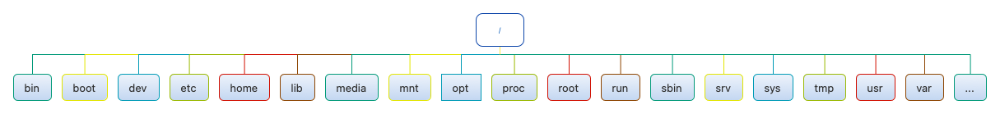

| 目录名 | 说明                                                         |
| ------ | ------------------------------------------------------------ |
| /      | linux根目录                                                  |
| /bin   | 存放二进制可执行文件，如常用的ls、cd、mkdir等                |
| /boot  | 存放系统引导时使用的核心文件，包括一些连接文件和镜像文件     |
| /dev   | Device的缩写，存放设备文件                                   |
| /etc   | Etcetera的缩写，存放系统配置文件                             |
| /home  | 存放用户文件的主目录                                         |
| /lib   | Library的缩写，存放文件系统中程序运行需要的共享库及内核模块  |
| /media | linux会自动识别一些设备，如u盘，识别后，linux会把识别的设备挂在到这个目录下 |
| /mnt   | linux提供了让用户临时挂载的文件目录                          |
| /opt   | Optional的缩写，存放主机额外安装软件的目录                   |
| /proc  | Processes的缩写，虚拟文件系统，存放当前内存的映射            |
| /root  | 超级用户主目录                                               |
| /sbin  | 存储系统管理员的二进制执行文件                               |
| /usr   | 存放系统应用程序，比较重要的目录/usr/local为管理员软件安装目录 |
| /var   | 存放运行时需要改变数据的文件                                 |


## 文件目录

#### pwd — 打印当前工作目录

```
[root@192 ~]# pwd
/root
```

#### cd — 更改目录

- 切换到绝对路径

  ```
  [root@test /]# cd /usr/bin/
  [root@test bin]#
  ```

- 切换到相对路径

  ```
  [root@test etc]# cd /usr/bin/
  [root@test bin]# pwd
  /usr/bin
  #进入到相对目录
  [root@test bin]# cd ../etc/
  [root@test etc]# pwd
  /usr/etc
  ```

- 有用的快捷键

  | 快捷键          | 运行结果                                                     |
  | --------------- | ------------------------------------------------------------ |
  | `cd .`          | 回到当前目录                                                 |
  | `cd ..`         | 回到当前目录的上一级目录                                     |
  | `cd ~`或`cd`    | 更改工作目录到你的家目录                                     |
  | `cd -`          | 更改工作目录到先前的工作目录                                 |
  | `cd  ̃user_name` | 更改工作目录到用户家目录。例如, cd  ̃suker 会更改工作目 录到用户“”的家目录。 |

####  ls — 列出目录内容

最常使用的命令，可以列出一个目录包含的文件及子目录，以及各种重要文件和目录的属性。

| 选项 | 长选项           |                                                              |
| ---- | ---------------- | ------------------------------------------------------------ |
| -a   | --all            | 列出所有文件，包括文件名以圆点开头的默认会被隐藏的隐藏文件   |
| -d   | --directory      | 通常，如果指定了目录名，ls 命令会列出这个目录中 的内容，而不是目录本身。<br>把这个选项与 -l 选项结合 使用，可以看到所指定目录的详细信息，而不是目录中的内容。 |
| -F   | --classify       | 这个选项会在每个所列出的名字后面加上一个指示符。<br>例如，如果名字是目录名，则会加上一个’/’ 字 符。 |
| -h   | --human-readable | 当以长格式列出时，以人们可读的格式，而不是以字 节数来显示文件的大小 |
| -l   |                  | 以长格式显示结果                                             |
| -r   | --reverse        | 以相反的顺序来显示结果。通常，ls 命令的输出结果按照字母升序排列。 |
| -S   |                  | 命令输出结果按照文件大小来排序                               |
| -t   |                  | 按照修改时间来排序                                           |

- 列出当前目录下所有文件和子目录

  ```
  [root@test ~]# ls
  anaconda-ks.cfg
  ```

- 指定目录

  ```
  [root@192 ~]# ls /usr/
  bin  etc  games  include  lib  lib64  libexec  local  sbin  share  src  tmp
  ```

- 指定多个目录

  ```
  [root@192 ~]# ls /usr /var
  /usr/:
  bin  etc  games  include  lib  lib64  libexec  local  sbin  share  src  tmp
  
  /var:
  adm  cache  crash  db  empty  games  gopher  kerberos  lib  local  lock  log  mail  nis  opt  preserve  run  spool  tmp  yp
  ```

- `ls -l`文件属性信息

  

  选一个文件，来看一下各个输出字段的含义

  | 序号 | 值             | 含义                                                         |
  | ---- | -------------- | ------------------------------------------------------------ |
  | 1    | lrwxrwxrwx     | 对于文件的访问权限。<br>第一个字符含义：文件(-)、目录(d)、链接(l);<br/>其余字符每3个一组(rwx)：r(读)、w(写)、x(执行)；<br>第一组：文件所有者权限，第二组：文件所属组成员权限，第三组：其他所有人访问权限 |
  | 2    | 1              | 文件的硬链接数目                                             |
  | 3    | root           | 文件所有者的用户名                                           |
  | 4    | root           | 文件所属用户组的名字                                         |
  | 5    | 7              | 文件大小（字节）                                             |
  | 6    | 12月  7 21:14  | 上次修改文件的时间和日期                                     |
  | 7    | bin -> usr/bin | 文件名/目录名                                                |

####  touch — 创建一个空文件

用法：touch [选项]... 文件...

```
[root@test soft]# touch test.txt
[root@test soft]# ls -l
总用量 189604
-rw-r--r-- 1 root root 194151339 8月  31 16:14 jdk-8u231-linux-x64.tar.gz
-rw-r--r-- 1 root root         0 10月  8 15:48 test.txt
```

####  file — 确定文件类型

```
[root@test ~]# file anaconda-ks.cfg
anaconda-ks.cfg: ASCII text
```

####  more — 一页一页的显示文件内容

用法：more  文件

- 功能

  space键：代表向下翻一页

  enter键：向下翻一行

  ctrl + F：向下滚动一屏

  ctrl + B：向上滚动一屏

  =键：输出当前行的行号

  q：离开程序

#### less — 浏览文件内容

用法：less 文件，与more相似，不同的是less允许使用[pageup]和[pagedown]往回滚动

- 功能

  space键：向下翻动一页

  [pagedown]：向下翻动一页

  [pageup]：向上翻动一页

  /字符串：向下搜索【字符串】的功能；n：向下查找；N：向上查找

  ?字符串：向上搜索【字符串】的功能；n：向上查找；N：向下查找

  q：离开程序

#### cp — 复制文件和目录

用法：cp 源文件 目标文件

​    或：cp -r 源文件... 目录

```
# 复制文件test.txt,复制后的文件名为test1.txt
[root@test soft]# cp test.txt test1.txt
# 复制文件test.txt,复制后的文件名为test2.txt
[root@test soft]# cp -r test.txt test2.txt
[root@test soft]# ls
test1.txt  test2  test2.txt  test.txt
# 递归复制test2目录到/root, 注意一定加参数-r
[root@test soft]# cp -r test2 /root
```

#### mv — 移动/重命名文件和目录

用法：mv [选项]... [-T] 源文件 目标文件
    或：mv [选项]... 源文件... 目录
    或：mv [选项]... -t 目录 源文件...

```
# 重命名文件test1.txt为test
[root@test soft]# mv test1.txt test
# 重命名目录名test2为testdir
[root@test soft]# mv test2 testdir
# 将文件test2.txt移动到/root目录下
[root@test soft]# mv test2.txt /root
# 将目录testdir移动到/root目录下
[root@test soft]# mv testdir/ /root

# 验证
[root@test soft]# ls -l /root/
总用量 8
-rw-------. 1 root root 2580 9月   1 15:25 anaconda-ks.cfg
-rw-r--r--  1 root root 1148 9月  19 03:04 install_jdk.sh
drwxr-xr-x  3 root root   19 10月  8 16:50 test2
-rw-r--r--  1 root root    0 10月  8 16:44 test2.txt
drwxr-xr-x  3 root root   19 10月  8 16:02 testdir
```

#### mkdir — 创建目录

用法：mkdir [选项]... 目录... 

- 创建目录

  ```
  [root@test soft]# mkdir test
  ```

- -p, --parents，创建多层目录

  ```
  [root@test soft]# mkdir -p test2/test3
  ```

#### rmdir — 删除指定的空目录

用法：rmdir [选项]... 目录....

```
[root@test soft]# rmdir test
[root@test soft]# rmdir test2
rmdir: 删除 "test2" 失败: 目录非空
```

#### rm — 删除文件和目录

- rm 文件, 删除文件，需要询问

  ```
  [root@test soft]# rm test.txt
  rm：是否删除普通空文件 "test.txt"？y
  [root@test soft]# ls
  test
  ```

- rm -r 目录，需要询问

  ```
  [root@test soft]# rm -r testdir/
  rm：是否进入目录"testdir/"? y
  rm：是否删除目录 "testdir/test3"？y
  rm：是否删除目录 "testdir/"？y
  ```

- rm -f，强制删除文件，不需要询问，**慎用**，删除之后就找不到了，**linux系统中没用回收站**

  ```
  [root@test soft]# rm -f testfile
  ```

- rm -rf，递归删除目录及其文件，**最危险的操作，没有任何提示，慎用！慎用！慎用！**

  ```
  [root@test soft]# ls -al
  总用量 0
  drwxr-xr-x 3 root root 49 10月  8 17:19 .
  drwxr-xr-x 6 root root 74 9月  23 20:14 ..
  -rw-r--r-- 1 root root  0 10月  8 16:43 test
  drwxr-xr-x 3 root root 19 10月  8 17:19 testdir
  -rw-r--r-- 1 root root  0 10月  8 17:18 testfile
  [root@test soft]# rm -f testfile
  [root@test soft]# rm -rf testdir/
  [root@test soft]# ls -al
  总用量 0
  drwxr-xr-x 2 root root 18 10月  8 17:21 .
  drwxr-xr-x 6 root root 74 9月  23 20:14 ..
  -rw-r--r-- 1 root root  0 10月  8 16:43 test
  
  ```

#### ln — 创建硬链接和符号链接

链接有两种：软(符号)链接、硬链接

硬链接相当于一个原始文件的一个复制，不能对目录使用硬链接；软链接相当于快捷方式，不能删除原文件

```
# 创建一个硬链接
[root@test soft]# ln testfile file2
[root@test soft]# ls -l
总用量 0
-rw-r--r-- 2 root root  0 10月  8 17:34 file2
drwxr-xr-x 3 root root 19 10月  8 17:34 testdir
-rw-r--r-- 2 root root  0 10月  8 17:34 testfile

# 创建一个软链接
[root@test soft]# ln -s testfile vlink
[root@test soft]# ll
总用量 0
drwxr-xr-x 3 root root 19 10月  8 17:34 testdir
-rw-r--r-- 1 root root  0 10月  8 17:36 testfile
lrwxrwxrwx 1 root root  8 10月  8 17:37 vlink -> testfile

```

#### cat — 将[文件]或标准输入组合输出到标准输出

用法：cat [选项]... [文件]...

```
[root@test ~]# cat hello.txt
hello1
hello2
hello3

# 列出一些特殊字符
[root@test ~]# cat -A hello.txt
hello1$
hello2$
hello3$

# 列出行号
[root@test ~]# cat -b hello.txt
     1	hello1
     2	hello2
     3	hello3

# 查看centos版本
[root@test ~]# cat /etc/redhat-release
CentOS Linux release 7.7.1908 (Core)

```

#### tac — 查看文件内容，从最后一行开始显示，按行倒序显示

```
[root@test ~]# tac hello.txt
hello3
hello2
hello1

```

#### tail — 查看文件尾部内容

优点：可以查看文件实时追加的内容

```
#tail -n 2 文件，查看文件头（从末尾开始）2行内容，2可以是任何数
[root@test ~]# tail -n 2 hello.txt
hello2
hello3

[root@test ~]# echo hello.txt 4 >> hello.txt
[root@test ~]# echo hello.txt 5 >> hello.txt
#tail -f 文件，实时追踪该文件的所有更新
[root@test ~]# tail -f hello.txt
hello1
hello2
hello3
hello.txt 4
hello.txt 5

#Ctrl + c：退出

```

#### echo — 将内容输出到设备

```
[root@test ~]# echo "hello world"
hello world
#不解析转义字符
[root@test ~]# echo "hello\t\t world"
hello\t\t world
#解析转义字符
[root@test ~]# echo -e "hello\t\t world"
hello		 world
#打印变量
[root@test ~]# echo $PATH
/usr/local/sbin:/usr/local/bin:/usr/sbin:/usr/bin:/data/servers/jdk1.8/bin:/root/bin

#将“hello world”写入到test.txt文件中
[root@test ~]# echo "hello word~" > test.txt`

```

#### 重定向命令

用法：ls -l > test.txt文件 （>表示覆盖写）

​    或：ls -l >> test.txt文件（>>表示追加到文件末尾）

```
[root@test ~]# cat hello.txt
hello1
hello2
#覆盖写
[root@test ~]# ls -l > hello.txt
[root@test ~]# cat hello.txt
总用量 8
-rw-------. 1 root root 2580 9月   1 15:25 anaconda-ks.cfg
-rw-r--r--  1 root root    0 10月  8 21:07 hello.txt
-rw-r--r--  1 root root 1148 9月  19 03:04 install_jdk.sh

#追加到文件末尾
[root@test ~]# ls -l >> hello.txt
[root@test ~]# cat hello.txt
总用量 8
-rw-------. 1 root root 2580 9月   1 15:25 anaconda-ks.cfg
-rw-r--r--  1 root root    0 10月  8 21:07 hello.txt
-rw-r--r--  1 root root 1148 9月  19 03:04 install_jdk.sh
总用量 12
-rw-------. 1 root root 2580 9月   1 15:25 anaconda-ks.cfg
-rw-r--r--  1 root root  185 10月  8 21:07 hello.txt
-rw-r--r--  1 root root 1148 9月  19 03:04 install_jdk.sh

```

#### history — 显示或操纵历史列表

history 保留了最近执行的命令记录，默认可以保存1000，历史清单从0开始编号到最大值

<table>
  <tbody>
    <tr>
      <td>history N</td>
      <td>显示最近N条命令</td>
  	</tr>
    <tr>
      <td>history -c</td>
      <td>清除所有的历史记录</td>
  	</tr>
    <tr>
      <td>history -w test.txt </td>
      <td>保存历史记录到文件test.txt</td>
  	</tr>
  </tbody>
</table>

```
#显示最近10条历史记录
[root@test ~]# history 10
```


## 用户组管理

#### useradd — 添加新用户

用法：useradd 用户名

<table>
  <tr>
    <td width=40%>添加用户hadoop</td>
    <td><code>[root@test ~]# useradd hadoop</code></td>
  </tr>
</table>

#### passwd — 修改用户名的密码

用法：passwd 用户名

<table>
  <tr>
    <td width=40%>修改hadoop用户的密码</td>
    <td><code>[root@test ~]# passwd hadoop</code></td>
  </tr>
</table>

#### id — 判断用户名是否存在

用法：id 用户名

<table>
  <tr>
    <td width=40%>查看hadoop用户是否存在</td>
    <td><code>[root@test ~]# id hadoop</code></td>
  </tr>
</table>

#### su — 切换用户

<table>
  <tr>
    <td>su 用户名</td>
    <td>切换用户并获得用户的执行权限，但不能获得环境变量</td>
    <td><code>[root@test ~]# su hadoop</code></td>
  </tr>
  <tr>
    <td>su - 用户名</td>
    <td>切换用户并获得该用户的环境变量及执行权限</td>
    <td><code>[root@test ~]# su - hadoop</code></td>
  </tr>
</table>

#### userdel — 删除用户

<table>
  <tr>
    <td>userdel 用户名</td>
    <td>删除用户但保留用户家目录</td>
    <td><pre>[root@test home]# userdel hadoop
[root@test home]# ls /home/
hadoop  suker</pre></td>
  </tr>
  <tr>
    <td>userdel -r 用户名</td>
    <td>删除用户且删除用户家目录</td>
    <td><pre>[root@test ~]# userdel -r hadoop
[root@test ~]# ls /home/
suker</pre></td>
  </tr>
</table>

#### who — 显示用户

<table>
  <tr>
    <td>显示自身用户</td>
    <td><pre>[hadoop@test root]$ whoami
hadoop</pre></td>
  </tr>
  <tr>
    <td>显示系统登录用户</td>
    <td><pre>[hadoop@test root]$ who am i
root     pts/1        2021-10-11 18:50 (192.168.185.1)</pre></td>
  </tr>
  <tr>
    <td>显示当前系统登录了哪些用户</td>
    <td><pre>[root@test ~]# who
root     tty1         2021-12-17 21:00
root     pts/0        2021-12-17 21:00 (192.168.64.1)</pre></td>
  </tr>
</table>

#### sudo

1) 修改配置文件`/etc/sudoers` -- 在root下增加hadoop用户配置

```
## Allow root to run any commands anywhere
root    ALL=(ALL)       ALL
hadoop  ALL=(ALL)       ALL
```

2) 测试

```
[hadoop@test root]$ sudo mkdir test
我们信任您已经从系统管理员那里了解了日常注意事项。
总结起来无外乎这三点：

    #1) 尊重别人的隐私。
    #2) 输入前要先考虑(后果和风险)。
    #3) 权力越大，责任越大。

[sudo] hadoop 的密码：
[hadoop@test root]$ ls
ls: 无法打开目录.: 权限不够
[hadoop@test root]$ sudo ls
anaconda-ks.cfg  hello.txt  install_jdk.sh  test  test.txt
```

#### `cat /etc/passwd` — 查看创建了哪些用户

#### usermod — 将用户添加到用户组

用法：usermod -g 用户组 用户名

```
#将hadoop用户添加到root用户组
[root@test ~]# usermod -g root hadoop
#查看hadoop用户信息
[root@test ~]# id hadoop
uid=1001(hadoop) gid=0(root) 组=0(root)
```

#### groupadd — 创建组

用法：groupadd 组名，创建组

<table>
  <tr>
    <td>创建hadoop组</td>
    <td><code>[root@test ~]# groupadd hadoop</code></td>
  </tr>
</table>

#### groupdel — 删除组

用法：groupdel 组名

<table>
  <tr>
    <td>删除hadoop组</td>
    <td><code>[root@test ~]# groupdel hadoop</code></td>
  </tr>
</table>

#### groupmod — 修改组名为新组名

用法：groupmod -n 新组名 老组名

```
# 前提条件：组hadoop1未创建，hadoop已创建
[root@test ~]# groupmod -n hadoop1 hadoop
```

#### `cat /etc/group` — 查看创建了哪些组


## 文件权限

#### chmod — 修改文件或目录权限

- 符号模式用法：chmod [{ugoa}{+-=}{rwx}] [⽂件或目录]

  ```
  #给当前用户添加执行权限
  [root@test ~]# chmod u+x install_jdk.sh
  ```

- 八进制用法：chmod [mode=421 ] [文件或目录]

  ```
  #给install_jdk添加rwxrwxrwx权限
  [root@test ~]# chmod 777 install_jdk.sh
  
  #给目录test递归添加rwxrwxrwx权限
  [root@test ~]# chmod -R 777 test
  ```

#### chown — 改变文件或目录的所有者

用法：`chown [选项]... [所有者][:[组]]` 文件...

<table>
  <tr>
    <td><code>chown root /u</code></td>
    <td>将 /u 的属主更改为"root"</td>
  </tr>
  <tr>
    <td><code>chown root:staff /u</code></td>
    <td>和上面类似，但同时也将其属组更改为"staff"</td>
  </tr>
  <tr>
    <td><code>chown -hR root</code></td>
    <td>将 /u 及其子目录下所有文件的属主更改为"root"</td>
  </tr>
</table>

#### chgrp — 改变文件或目录的所属组

用法：chgrp [选项]... 用户组 文件...

<table>
  <tr>
    <td><code>chgrp staff /u</code></td>
    <td>将 /u 的属组更改为"staff"</td>
  </tr>
  <tr>
    <td><code>chgrp -hR staff /u</code></td>
    <td>将/u及其子目录下所有文件的属组更改为"staff</td>
  </tr>
</table>


## 压缩解压缩

#### tar

<table>
<tbody>
  <tr>
    <td colspan=2><i><b>参数，注意：参数-c/-x仅能存在一个</b></i></td>
  </tr>
  <tr>
    <td>-z</td>
    <td>是否同时具有gzip的属性？亦即是否需要用gzip压缩？</td>
  </tr>
  <tr>
    <td>-c</td>
    <td>创建一个压缩文件的参数指令</td>
  </tr>
  <tr>
    <td>-x</td>
    <td>解开一个压缩文件的参数指令</td>
  </tr>
  <tr>
    <td>-v</td>
    <td>压缩的过程中显示文件</td>
  </tr>
  <tr>
    <td>-f</td>
    <td>使用档案名字，这个参数是最后一个参数，后面只能接档案名</td>
  </tr>
  <tr>
    <td colspan=2><i><b>实例</b></i></td>
  </tr>
  <tr>
    <td>解压，解压abc.tar.gz</td>
    <td><code>tar -zxvf abc.tar.gz</code></td>
  </tr>
  <tr>
    <td>压缩，将abc目录内容打包压缩为abc.tar.gz</td>
    <td><code>tar -zcvf abc.tar.gz abc</code></td>
  </tr>
</tbody>
</table>

#### zip \ unzip

安装`yum install zip unzip`

<table>
  <tbody>
    <tr>
			<td colspan=2><i><b>压缩</b></i></td>
    </tr>
    <tr>
      <td width=50%>压缩文件test.txt和文件hello.txt，<br/>压缩后名称为test.zip</td>
      <td><code>zip test.zip test.txt hello.txt</code></td>
    </tr>
    <tr>
      <td>-r，压缩文件test.txt和目录test</td>
      <td><code>zip -r test.zip test.txt test/</code></td>
    </tr>
     <tr>
			<td colspan=2><i><b>解压缩</b></i></td>
    </tr>
    <tr>
      <td>解压缩test.zip，如果存在重名，则会询问</td>
      <td><code>unzip test.zip</code></td>
    </tr>
    <tr>
      <td>-d，解压test.zip到指定目录</td>
      <td><code>unzip test.zip -d /data/</code></td>
    </tr>
  </tbody>
</table>

#### gzip \ gunzip

<table>
  <tbody>
    <tr>
      <td>压缩文件</td>
      <td><code>gzip hello.txt</code></td>
    </tr>
    <tr>
      <td>解压缩文件</td>
      <td><code>gunzip hello.txt.gz</code></td>
    </tr>
    <tr>
      <td colspan=2><b>注意：</b>只能压缩文件和解压缩文件，不能操作目录，操作后源文件会被删除</td>
    </tr>
  </tbody>
</table>


## 文件内容统计

#### wc — 打印文件中换行符，字，和字节个数

- 常用参数

  ```
    -c, --bytes            	打印字节数，包含换行符
    -m, --chars            	打印字符数，包含换行符
    -l, --lines            	显示行数
        --files0-from=F     从指定文件读取以NUL 终止的名称，如果该文件被指定为"-"则从标准输入读文件名
    -L, --max-line-length		打印最长行的长度
    -w, --words							打印单词计数
        --help							显示帮助信息
        --version						输出版本信息
  ```

- 文件hello.txt

  ```
  hello world
  hello world
  hello world hello world
  hello world
  hello world
  hello world
  ```

- 示例

  ```
  [root@test ~]# wc -c hello.txt
  84 hello.txt
  [root@test ~]# wc -m hello.txt
  84 hello.txt
  [root@test ~]# wc -l hello.txt
  6 hello.txt
  [root@test ~]# wc -L hello.txt
  23 hello.txt
  [root@test ~]# wc -w hello.txt
  14 hello.txt
  ```

#### sort — 排序文本行

```
  常用参数
  -b, --ignore-leading-blanks	忽略前导的空白区域
  -d, --dictionary-order			只考虑空白区域和字母字符
  -f, --ignore-case						忽略字母大小写
  -g, --general-numeric-sort  按一般数值比较
  -i, --ignore-nonprinting    只考虑可打印的字符 
  -M, --month-sort            compare (unknown) < 'JAN' < ... < 'DEC'
  -h, --human-numeric-sort    使用易读性数字(例如： 2K 1G)
  -n, --numeric-sort					根据字符串数值比较
  -R, --random-sort						根据随机hash 排序
      --random-source=文件		 从指定文件中获得随机字节
  -r, --reverse								逆序输出排序结果
      --sort=WORD							按照WORD 指定的格式排序：一般数字-g，高可读性-h，月份-M，数字-n，随机-R，版本-V
  -V, --version-sort					在文本内进行自然版本排序

其他选项：
  -c, --check, 								检查输入是否已排序，若已有序则不进行操作
  -k, --key=KEYDEF          	通过键排序； KEYDEF 给出位置和类型 
  -o, --output=文件						 将结果写入到文件而非标准输出
  -t, --field-separator=分隔符	使用指定的分隔符代替非空格到空格的转换
  -u, --unique		配合-c，严格校验排序；不配合-c，则只输出一次排序结果
      --help			显示此帮助信息并退出
      --version		显示版本信息并退出
```

<table>
  <tbody>
    <tr>
      <td width=50%><i><b>文件num.txt</b></i></td>
      <td><i><b>文件num2.txt</b></i></td>
    </tr>
    <tr>
      <td><pre>1
33
5
7
9
18</pre></td>
      <td><pre>ac 11
ab 2
cx 31
dd 8
ef 26</pre></td>
    </tr>
    <tr>
      <td colspan=2><i><b>命令测试</b></i></td>
    </tr>
    <tr>
      <td>默认按字符串排序</td>
      <td></td>
    </tr>
    <tr>
      <td>按照数据的数值大小排序</td>
      <td>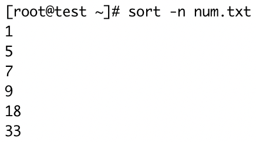</td>
    </tr>
    <tr>
      <td>按字符串倒叙排序</td>
      <td>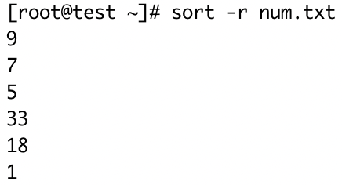</td>
    </tr>
    <tr>
      <td>按照数值倒序排序</td>
      <td></td>
    </tr>
    <tr>
      <td>对于文件稍复杂的数据，如果对数据排序上述命令已经无法实现我们的需求，这时我们可以结合参数<code>-k</code>表示数值是文件的第几列，<b>列编号从1开始</b></td>
      <td>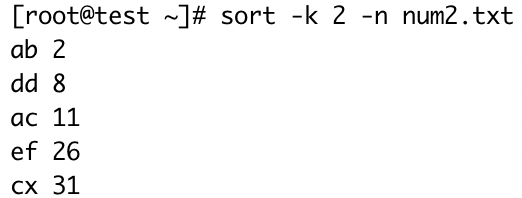</td>
    </tr>
  </tbody>
</table>


#### uniq — 检查重复的行列

<table>
  <tbody>
    <tr>
      <td width=50%><i><b>测试文件hello2.txt</b></i></td>
      <td><pre>hello world
hello world
hello world2
hello world
hello world
hello world</pre></td>
    </tr>
    <tr>
      <td colspan=2><i><b>命令</b></i></td>
    </tr>
    <tr>
      <td>对连续的内容去重</td>
      <td></td>
    </tr>
    <tr>
      <td>在输出行前面加上数据在文件中重复出现的次数</td>
      <td></td>
    </tr>
    <tr>
      <td>返回文件中不重复的行</td>
      <td></td>
    </tr>
    <tr>
      <td>
        获取全文中每个单词的唯一<br/>
        1. 首先对文件内容安字符串排序<br/>
        2. 然后使用管道命令<code>|</code>结合<code>uniq</code>获取去重后的数据
      </td>
      <td></td>
    </tr>
  </tbody>
</table>


#### head — 获取前N条数据

<table>
  <tbody>
    <tr>
      <td width=50%><i><b>测试文件head.txt</b></i></td>
            <td><pre>1
33
5
7
9
18</pre></td>
    </tr>
    <tr>
      <td colspan=2><i><b>实例</b></i></td>
    </tr>
    <tr>
      <td><code>head -n</code>获取前n条数据</td>
     	<td>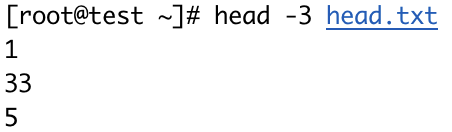</td>
    </tr>
    <tr>
      <td>获取head.txt的topN数据</td>
      <td>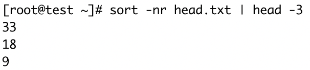</td>
    </tr>
  </tbody>
</table>


## 日期

#### cal — 日历

- 本月日历

  ```
  [root@test ~]# cal
        十月 2021
  日 一 二 三 四 五 六
                  1  2
   3  4  5  6  7  8  9
  10 11 12 13 14 15 16
  17 18 19 20 21 22 23
  24 25 26 27 28 29 30
  31
  ```

- 显示系统前一个月、当前月和下一个月的日历

  ```
  [root@test ~]# cal -3
        九月 2021             十月 2021            十一月 2021
  日 一 二 三 四 五 六  日 一 二 三 四 五 六  日 一 二 三 四 五 六
            1  2  3  4                  1  2      1  2  3  4  5  6
   5  6  7  8  9 10 11   3  4  5  6  7  8  9   7  8  9 10 11 12 13
  12 13 14 15 16 17 18  10 11 12 13 14 15 16  14 15 16 17 18 19 20
  19 20 21 22 23 24 25  17 18 19 20 21 22 23  21 22 23 24 25 26 27
  26 27 28 29 30        24 25 26 27 28 29 30  28 29 30
                        31
  ```

- 显示2021年日历

  ```
  [root@test ~]# cal 2021
  ```

#### date — 获取当前时间

- 默认获取系统当前时间

  ```
  #不友好
  [root@test ~]# date
  2021年 09月 17日 星期五 00:54:59 CST
  ```

- 获得格式化后的时间`date [FORMAT]`

  ```
  [root@test ~]# date +'%Y-%m-%d %H:%M:%S'
  2021-09-17 01:05:43
  
  #参数后没有空格，可省略双引号
  [root@test ~]# date +%Y-%m-%d
  2021-09-17
  [root@test ~]# date +'%Y-%m-%d'
  2021-09-17
  ```

- 获取时间戳`date +%s`，单位为秒

  ```
  [root@test ~]# date +%s
  1631814404
  ```

  如果获取毫秒，可在秒后加000

  ```
  [root@test ~]# date +%s000
  1631814567000
  ```

- **获取格式化指定时间`date -d`**

  ```
  #获取指定时间的默认日期
  [root@test ~]# date -d "2021-09-17 04:22:20"
  2021年 09月 17日 星期五 04:22:20 CST
  #时间字符串转时间戳
  [root@test ~]# date -d "2021-09-17 04:22:20" +%s
  1631823740
  #时间戳转字符串
  [root@test ~]# date -d @1631823740 +"%Y-%m-%d %H:%M:%S"
  2021-09-17 04:22:20
  #获取昨日日期
  [root@test ~]# date -d "1 days ago" +"%Y-%m-%d"
  2021-09-16
  #获取2021年2月份的天数
  [root@test ~]# date -d "2021-03-01 1 days ago" +%d
  28
  ```

- 设置系统时间`date -s`

  ```
  #设置系统时间
  [root@test ~]# date -s "2021-03-01 19:30:00"
  #查看结果
  [root@test ~]# date +"%Y-%m-%d %H:%M:%S"
  2021-03-01 19:30:21
  ```


## 进程

<table>
  <tbody>
    <tr>
      <td colspan=3><i><b>进程状态</b></i></td>
    </tr>
    <tr>
      <td>R</td>
      <td>Runnable（运行）</td>
      <td>正在运行或在运行队列中等待</td>
    </tr>
    <tr>
      <td>S</td>
      <td>Sleeping（中断）</td>
      <td>休眠中，受阻，在等待某个条件的形成或接收到信号</td>
    </tr>
    <tr>
      <td>D</td>
      <td>Uninterruptible Sleep（不可中断）</td>
      <td>进程正在等待 I/O，比方说，一个磁盘驱动 器的 I/O。</td>
    </tr>
    <tr>
      <td>Z</td>
      <td>Zombie（僵死）</td>
      <td>
        一个死进程或“僵尸”进程。<br/>
        这是一个已经终止的子进程， 但是它的父进程还没有清空它。<br/>
        (父进程没有把子进程从进程表中删除)
      </td>
    </tr>
    <tr>
      <td>T</td>
      <td>Traced or Stopped（停止）</td>
      <td>进程收到SiGSTOP,SIGSTP,SIGTOU信号后停止运行</td>
    </tr>
    <tr>
      <td colspan=3><i><b>进程状态后缀</b></i></td>
    </tr>
    <tr>
      <td><</td>
      <td colspan=2>优先级高的进程</td>
    </tr>
    <tr>
      <td>N</td>
      <td colspan=2>优先级低的进程</td>
    </tr>
    <tr>
      <td>L</td>
      <td colspan=2>有些页被锁紧内存</td>
    </tr>
    <tr>
      <td>s</td>
      <td colspan=2>进程的领导者（在它之下有子进程）</td>
    </tr>
    <tr>
      <td>l</td>
      <td colspan=2>ismulti-threaded(using CLONE_THREAD,like NPTL pthreads do)</td>
    </tr>
    <tr>
      <td>+</td>
      <td colspan=2>位于后台的进程组</td>
    </tr>
  </tbody>
</table>


#### ps — 报告当前进程快照

- 显示系统所有的进程

  ```
  [root@test ~]# ps -ef
  UID         PID   PPID  C STIME TTY          TIME CMD
  root          1      0  0 9月13 ?       00:00:03 /usr/lib/systemd/systemd --switched-root --system --deserialize 22
  root          2      0  0 9月13 ?       00:00:00 [kthreadd]
  root          4      2  0 9月13 ?       00:00:00 [kworker/0:0H]
  root          6      2  0 9月13 ?       00:01:23 [ksoftirqd/0]
  root          7      2  0 9月13 ?       00:00:00 [migration/0]
  root          8      2  0 9月13 ?       00:00:00 [rcu_bh]
  ........
  ```

- 通常与`grep`命令组合使用，需要用到管道`|`

  ```
  # 过滤系统内的python进程
  [root@test ~]# ps -ef | grep python
  root       902     1  0 12:33 ?        00:00:03 /usr/bin/python2 -Es /usr/sbin/firewalld --nofork --nopid
  root      1181     1  0 12:34 ?        00:00:26 /usr/bin/python2 -Es /usr/sbin/tuned -l -P
  root      1969  1658  0 19:35 pts/0    00:00:00 grep --color=auto python
  ```

#### netstat — 显示端口信息

- 比`ps`命令额外显示端口相关的信息，这个命令模式是没有安装的，使用yum安装

  ```
  [root@test ~]# yum install -y net-tools
  ```

- 常见用法：netstat -anp

  ```
  # 查看占用端口22的使用情况
  [root@test ~]# netstat -anp | grep 22
  tcp        0      0 0.0.0.0:80              0.0.0.0:*               LISTEN      32282/nginx: master
  tcp        0      0 0.0.0.0:22              0.0.0.0:*               LISTEN      795/sshd
  tcp        0      0 192.168.185.101:22      192.168.185.1:50628     ESTABLISHED 47468/sshd: root@pt
  tcp        0      0 192.168.185.101:9000    192.168.185.103:37122   ESTABLISHED 10053/java
  tcp6       0      0 :::22                   :::*                    LISTEN      795/sshd
  unix  2      [ ACC ]     STREAM     LISTENING     19822    931/master           private/anvil
  unix  3      [ ]         STREAM     CONNECTED     516385   32282/nginx: master
  unix  3      [ ]         STREAM     CONNECTED     516386   32282/nginx: master
  ```

#### jps — 显示Java进程

- 类似ps命令，不同的是ps是用来显示所有进程信息的，而jps只显示java进程信息

- 准确的说jps是显示当前用户已启动的java进程信息，信息包括进程号和简短的进程command

- **注意**：jps是java提供的命令，只有在安装配置好Java环境之后才能使用

  ```
  [root@bigdata01 ~]# jps
  11584 NodeManager
  36979 Kafka
  10053 NameNode
  10154 DataNode
  11755 JobHistoryServer
  48075 Jps
  23517 QuorumPeerMain
  ```

#### top — 动态监控进程信息

- 主要作用在于动态显示系统消耗资源最多的进程信息；包含进程ID、内存占用、CPU占用等

- 和ps命令作用基本相同，唯一的区别是top命令能够动态显示进程信息

  

  **注意：这里的CPU是总体CPU的使用情况，如果是多核CPU，想查看每个CPU的使用情况，可以在监控模式中按键`1`**

  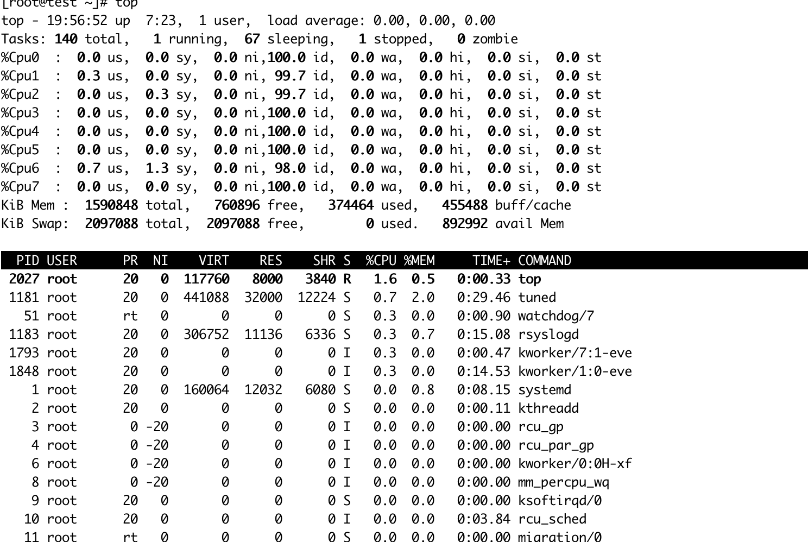

  按键`q`退出监控模式

#### kill — 终止进程 

- kill PID：杀掉进程，自杀

- kill -9 PID：强制杀掉进程，它杀

  ```
  [root@bigdata01 ~]# ps -ef
  UID         PID   PPID  C STIME TTY          TIME CMD
  root          1      0  0 9月13 ?       00:00:03 /usr/lib/systemd/systemd --switched-root --system --deserialize 22
  root          2      0  0 9月13 ?       00:00:00 [kthreadd]
  root          4      2  0 9月13 ?       00:00:00 [kworker/0:0H]n
  
  # kthreadd进程的PID值为2
  # 杀死进程 kill PID
  [root@bigdata01 ~]# kill 2
  
  # 强制杀死进程 kill -9 PID
  [root@bigdata01 ~]# kill -9 2
  ```


## linux三剑客
#### `grep`  — 查找

- 常用于查找文件中符合条件的字符串
- -i：忽略大小写、-n：显示该行的行号、-v：忽略包含制定字符串的内容、-R：查找所有文件包含子文件
- 注意：grep经常和管道"｜"结合使用，实现数据过滤查找

<table>
  <tbody>
    <tr>
      <td width="50%"><i><b>测试文件linux.txt</b></i></td>
      <td><pre>linux
linux
centos
linux
centos
ubuntu
ubuntu
CentoS</pre></td>
    </tr>
    <tr>
      <td colspan=2><b>shell命令测试</b></td>
    </tr>
    <tr>
      <td>查询含有cent的内容</td>
      <td></td>
    </tr>
    <tr>
      <td>查询以字母<b>u</b>开头的内容</td>
      <td>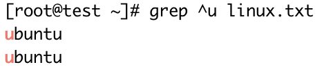</td>
    </tr>
    <tr>
      <td>忽略大小写查询含有cent的内容</td>
      <td></td>
    </tr>
    <tr>
      <td>查询带行号内容</td>
      <td>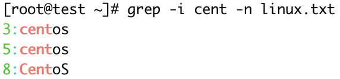</td>
    </tr>
    <tr>
      <td>查询关于python的进程</td>
      <td>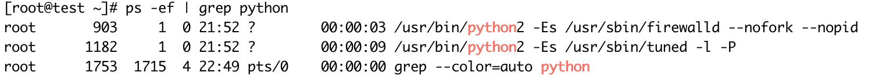</td>
    </tr>
    <tr>
      <td>
        去除无用的python进程信息<br />
        -v：忽略包含制定字符串的内容
      </td>
      <td>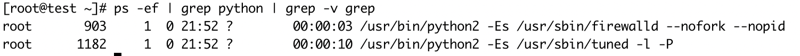</td>
    </tr>
    <tr>
      <td>
        满足多个关键字之一<br/>
        <code>grep -E "str1|str2|str3|" filename</code><br/>
        <code>egrep "str1|str2|str3|" filename</code>
      </td>
      <td>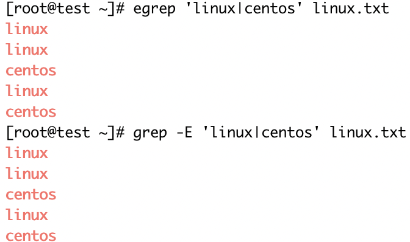</td>
    </tr>
  </tbody>
</table>


#### `sed `  — 编辑

- 用来自动编辑一个或多个文件、简化对文件的反复操作
- a/i：增加、d：删除、s：替换、-i：直接修改源文件

<table>
  <tbody>
    <tr>
      <td width="40%">测试文件</td>
      <td><pre>hello
hello
hello2
hello</pre></td>
    </tr>
    <tr>
      <td colspan=2><b>shell命令测试</b></td>
    </tr>
    <tr>
      <td>在第2行下添加一行内容haha, 通过参数a</td>
      <td>
        <br />
        但是我们查看这个文件的内容发现数据<b>并没有被真正添加进去</b>。<br />
				<b>注意</b>：sed默认不会直接修改文件数据，而是将数据复制到缓冲区中，
        修改也仅限于缓冲区中的数据，最后把缓冲区中的数据输出到控制台
      </td>
    </tr>
    <tr>
      <td>在文件最后一行后添加haha，通过参数$a</td>
      <td></td>
    </tr>
    <tr>
      <td>在第1行前面插入一行hahaha，通过参数i</td>
      <td>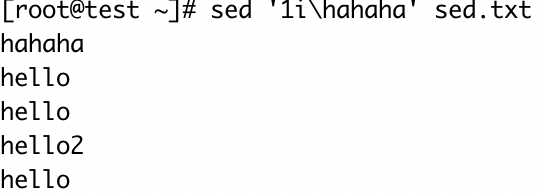</td>
    </tr>
    <tr>
      <td>删除第3行数据，通过参数d</td>
      <td></td>
    </tr>
    <tr>
      <td>删除最后一行，通过参数$d</td>
      <td>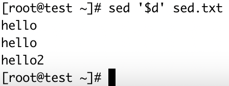</td>
    </tr>
    <tr>
      <td colspan=2>
        替换文件内容，<b>最常用</b><br />
        参数格式：[address]s/pattern/replacement/flags
        <ul>
          <li>address：表示指定要操作的具体行，是一个可选项</li>
          <li>s：表示替换操作</li>
          <li>pattern：指要替换的内容</li>
          <li>replacement：指要替换的新内容、</li>
          <li>
            flags：如果为空，则只会在第一次匹配成功时做替换操作。不为空时有两种用法：<br/>
            1. 表示为1～512之间的任意一个数字，表示要替换的字符串在这一行中出现第几次才替换<br/>
            2. 表示为g，表示对每一行数据中所有匹配到的内容全部进行替换
          </li>
        </ul>
      </td>
    </tr>
    <tr>
      <td>flags参数为空，默认匹配每行第一次出现的l</td>
      <td></td>
    </tr>
    <tr>
      <td>将每行第2次出现的l替换成m</td>
      <td>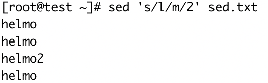</td>
    </tr>
    <tr>
      <td>将每行所有出现的l替换成m</td>
      <td></td>
    </tr>
    <tr>
      <td>将第2行第一次出现的l转换成m</td>
      <td>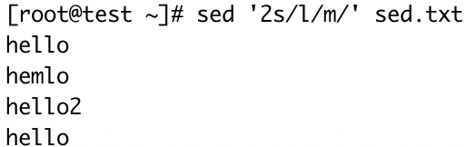</td>
    </tr>
    <tr>
      <td>将第2行所有出现的l转换成m</td>
      <td></td>
    </tr>
    <tr>
      <td colspan=2><b>注意了,注意了</b>，以上所有的操作都不会修改源文件的内容</td>
    </tr>
    <tr>
      <td><b>修改原文件的内容，使用sed -i</b><br />将每行所有出现的l替换成m，并保存到文件中</td>
      <td></td>
    </tr>
  </tbody>
</table>


#### awk  — 强大的文本分析工具

相对于grep的查找，sed的编辑，awk在**其对数据分析并生成报告时**，显得尤为强大，简单说awk就是把文件逐行的读入，以空白字符为默认分隔符将每行内容分片，切开的部分在进行各种分析处理。

```
[root@bigdata01 ~]# awk --help
Usage: awk [POSIX or GNU style options] -f progfile [--] file ...
Usage: awk [POSIX or GNU style options] [--] 'program' file ...

Examples:
	gawk '{ sum += $1 }; END { print sum }' file
	gawk -F: '{ print $1 }' /etc/passwd
```

- option：可选项，指定文件中数据的分割符
- program：具体的处理逻辑
- file：被操作的文件

在具体使用awk之前我们还需要掌握awk的一个特性，就是awk在处理文本数据的时候，它会自动给每行中的每个字段分配一个变量。

变量从1开始，

`$1`：表示文本中的第1个数据字段

`$2`：表示文本中的第2个数据字段

以此类推

特殊情况：`$0`：表示整个个文本行的内容

<table>
  <tbody>
    <tr>
      <td width=40%><i><b>测试文件</b></i></td>
      <td><pre>hello,world world1
hello,world world2
aaa
hello,world3 world3
hello4</pre></td>
    </tr>
    <tr>
      <td colspan=2><b>打印文本中的数据</b></td>
    </tr>
    <tr>
      <td>打印整个文本行内容</td>
      <td></td>
    </tr>
    <tr>
      <td>打印每行数据的第2个数据字段</td>
      <td></td>
    </tr>
    <tr>
      <td colspan=2><b>指定字段分割符：awk -F: '{print $1}' /etc/password</b></td>
    </tr>
    <tr>
      <td>通过-F指定分割符为逗号,</td>
      <td>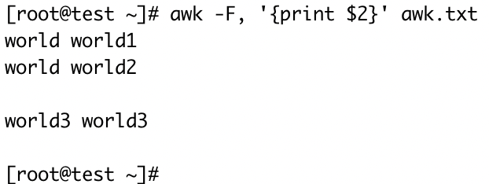</td>
    </tr>
    <tr>
      <td colspan=2><b>通过正则表达式进行过滤</b></td>
    </tr>
    <tr>
      <td>打印包含hello,world字符串的数据字段</td>
      <td>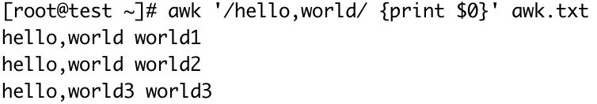</td>
    </tr>
    <tr>
      <td colspan=2><b>对某一列数据匹配，$指匹配具体哪一列，~表示匹配，!~表示不匹配，对比逻辑放入到小括号()内</b></td>
    </tr>
    <tr>
      <td>第1列匹配包含hello的整个文本行内容</td>
      <td></td>
    </tr>
    <tr>
      <td>第2列匹配包含字母的第2列文本行内容</td>
      <td>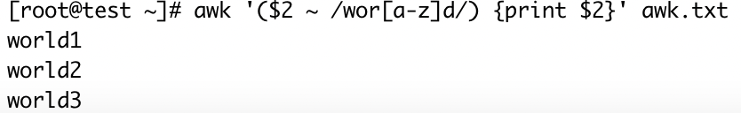</td>
    </tr>
    <tr>
      <td>不匹配使用!~, 每行数据第一个数据不匹配hello</td>
      <td></td>
    </tr>
    <tr>
      <td colspan=2><b>与管道命令结合使用</b></td>
    </tr>
    <tr>
      <td>统计第1列匹配包含hello的文本总共几行</td>
      <td></td>
    </tr>
  </tbody>
</table>

## 远程复制

#### scp

scp是secure copy的简写，用于在Linux下进行远程拷贝文件的命令，和它类似的命令有cp，不过cp只是在本机进行拷贝不能跨服务器，而且scp传输是加密的，它使用ssh安全协议传输数据。

scp系统开消小不占资源，不会提高多少系统负荷。虽然 rsync只传送修改的部分。

<table>
  <tbody>
    <tr>
      <td colspan=2><b>参数</b></td>
    </tr>
    <tr>
      <td>-r</td>
      <td>复制目录</td>
    </tr>
    <tr>
      <td>-v</td>
      <td>显示进度</td>
    </tr>
    <tr>
      <td>-q</td>
      <td>静默复制模式</td>
    </tr>
    <tr>
      <td colspan=2><b>shell测试</b></td>
    </tr>
    <tr>
      <td width=50%>scp test.txt root@172.16.29.101:/root/</td>
      <td>从本地复制文件test.txt到远程主机172.16.29.101的/root目录下</td>
    </tr>
    <tr>
      <td>scp -rq /root/dir root@172.16.29.101:/root/</td>
      <td>从本地复制目录dir到远程主机172.16.29.101的/root目录下</td>
    </tr>
  </tbody>
</table>


#### rsync

它是一款实现远程同步功能的软件，它在同步文件的同时，可以保持原来文件的权限、时间、软硬链接等附加信息。

rsync是一个数据镜像及备份工具，具有可使本地和远程两台主机的文件，目录之间，快速同步镜像，远程数据备份等功能。在同步过程中，rsync是根据自己独特的算法，只同步有变化的文件，甚至在一个文件里只同步有变化的部分，所以可以实现快速的同步数据的功能。

使用前安装`yum install -y rsync`

<table>
  <tbody>
    <tr>
      <td colspan=2><b>参数</b></td>
    </tr>
    <tr>
      <td>-r</td>
      <td>递归</td>
    </tr>
    <tr>
      <td>-v</td>
      <td>显示复制过程</td>
    </tr>
    <tr>
      <td>-l</td>
      <td>拷贝符号连接</td>
    </tr>
    <tr>
      <td colspan=2>
        <b>语法：</b>rsync -rvl $pdir/$fname $user@$host:$pdir/$fname
      </td>
    </tr>
  </tbody>
</table>

## 文件编辑利器 - vi

## 软件管理
#### rpm — 管理.rpm软件包

<table>
  <tbody>
   <tr>
     <td>rpm -i emacs-22.1-7.fc7-i386.rpm</td>
     <td>安装emacs软件</td>
   </tr>
   <tr>
     <td>rpm -U emacs-22.1-7.fc7-i386.rpm</td>
     <td>升级软件到emacs-22.1-7.fc7-i386.rpmz 所包含的 emacs 版本</td>
   </tr>
   <tr>
     <td>rpm -q emacs</td>
     <td>查看已安装的emacs软件</td>
   </tr>
   <tr>
     <td>rpm -qa | grep emacs</td>
     <td>查看已安装的关于emacs的软件</td>
   </tr>
   <tr>
     <td>rpm -qf /usr/bin/vim</td>
     <td>查看哪个软件包安装了/usr/bin/vim 这个文件</td>
   </tr>
   <tr>
     <td>rpm -e firefox</td>
     <td>卸载firefox软件</td>
   </tr>
  </tbody>
</table>


#### yum — 在线管理软件包

<table>
  <tbody>
    <tr>
      <td>yum install -y vim</td>
      <td>安装vim软件</td>
    </tr>
    <tr>
      <td>yum search emacs</td>
      <td>搜索一个yum资源库来查找emacs</td>
    </tr>
    <tr>
      <td>yum remove emacs</td>
      <td>删除emacs程序</td>
    </tr>
    <tr>
      <td>yum update emacs</td>
      <td>升级emacs程序</td>
    </tr>
    <tr>
      <td>yum info emacs</td>
      <td>显示emacs包信息</td>
    </tr>
    <tr>
      <td>yum list emacs*</td>
      <td>显示可以装的emacs的所有软件</td>
    </tr>
    <tr>
      <td>yum clean all</td>
      <td>清楚所有缓存（包含文件、旧文件）</td>
    </tr>
  </tbody>
</table>

## 查找文件

## 系统使用信息

#### df

<table>
  <tbody>
    <tr>
      <td>df -h</td>
      <td>查看硬盘使用情况</td>
    </tr>
  </tbody>
</table>

#### free  —查看内存和交换空间的使用情况

<table>
  <tbody>
    <tr>
      <td>free -m</td>
      <td>显示内存单位为MB</td>
    </tr>
    <tr>
      <td>free -h</td>
      <td>根据值的大小，显示易于识别的单位</td>
    </tr>
  </tbody>
</table>

## shell脚本
#### shell脚本

- 定义：把单个命令按照一定的逻辑和规则，组装到一个文件中，后面执行的时候就可以直接执行到这个文件

- 脚本后缀：约定俗称以.sh结尾，不强制

- 第一行内容：#!/bin/bash，表示将shell的执行环境引入

- 示例：hello.sh

  ```
  #!/bin/bash
  # first command
  echo hello
  ```

  ```
  # hello.sh为只读权限
  [root@bigdata01 ~]# ls -ll hello.sh
  -rw-r--r-- 1 root root 39 9月  18 01:15 hello.sh
  ```

- 执行：sh hello.sh或bash hello.sh或./hello.sh

  1. 其实sh和bash在之前是对应两种类型的shell，不过后来统一了，我们就不再区分了，所以在shell脚本中第一行引入/bin/bash，或者/bin/sh都是一样的。

  2. 很多资料都会说需要先给脚本添加执行权限，然后才能执行，为什么sh和bash直接可以执行？指定sh或bash执行hello.sh脚本，表示把hello.sh脚本中的内容作为参数直接传给了sh命令来执行，所以这个脚本有没有执行权限就无所谓了

  3. 执行./hello.sh会报`-bash: ./hello.sh: 权限不够`的错误信息，赋予脚本权限即可`chmod u+x hello.sh`

- **单步执行 - 方便调试**

  ```
  [root@bigdata01 ~]# bash -x hello.sh
  + echo hello
  hello
  ```


**hello.sh问题？？？**

```
[root@bigdata01 ~]# hello.sh
-bash: hello.sh: command not found
```

解决：

```
[root@bigdata01 ~]# vi /etc/profile

# 增加配置
export PATH=.:$PATH
```

然后生效环境变量`source /etc/profile`即可


#### shell变量

- shell为弱类型语言，变量不需要声明，初始化也不需要指定类型

- 变量命名只能使用数字、字母和下划线，且不能以数字开头

- 变量赋值是通过`=`赋值，在变量、等号和值之间不能出现空格！

  ```
  [root@bigdata01 ~]# name=zhangsan
  ```

- 打印变量的值，通过`echo`命令

  ```
  # 变量简化写法 $name
  [root@bigdata01 ~]# echo $name
  zhangsan
  # 变量完整写法${name}
  [root@bigdata01 ~]# echo ${name}
  zhangsan
  
  # 完整写法后面拼接字符串111
  [root@bigdata01 ~]# echo ${name}111
  zhangsan111
  # 简化写法则打印空，表示是一个变量name111
  [root@bigdata01 ~]# echo $name111
  
  # 如果拼接的字符串开头为空字符串
  [root@bigdata01 ~]# echo $name 111
  zhangsan 111
  ```

**变量分类**

1. 本地变量

  - 格式： VAR_NAME=VALUE

  - 生效范围：只对当前shell进程有效，关闭shell进程就失效了，对当前shell进程的子进程和其它shell进程无效。我们开启一个shell的命令行窗口就是开启了一个shell进程，子进程可以在原有窗口执行`bash`表示一个字进程，执行`exit`即可退出字进程

  - 使用pstree命令查看当前进程树信息

    ```
    [root@bigdata01 ~]# yum install -y psmisc
    ```

2. 环境变量

  - 格式：export VAR_NAME=VALUE

  - 用于设置临时环境变量，关闭当前shell进程后就环境变量失效。

  - 生效范围：对当前进程和子进程有效，对其它shell进程无效。

  - 临时生效，shell进程关闭后失效

    ```
    root@bigdata01 ~]# export age=18
    [root@bigdata01 ~]# echo $age
    18
    ```

  - 永久生效，通过配置文件/etc/profile生效

    ```
    [root@bigdata01 ~]# vi /etc/profile
    
    # 增加以下配置
    export age=19
    ```

    通过`source /etc/profile`生效

3. 位置变量

   如果我们想给shell脚本动态的传递一些参数，这个时候我们就需要用到位置变量，类似于`$0 $1 $2`

  - 脚本执行格式：test.bash ab cd ef

  - 脚本测试

    ```
    [root@bigdata01 ~]# cat test.bash
    #!/bin/bash
    echo $0
    echo $1
    echo $2
    echo $3
    # 执行脚本
    [root@bigdata01 ~]# sh test.bash ab cd
    test.bash
    ab
    cd
    
    ```

  - 变量结果说明

    $0：脚本名称

    $1：脚本后面的第1个参数

    $2：脚本后面的第2个参数

    $3：脚本后面的第三个参数，没有传递为空

    多个参数使用空格分割

4. 特殊变量

  - `$?`：表示是上一条命令的状态码，范围在0～255。命令执行成功，返回状态码为0，如果失败则在1～255之间，不同的状态码表示不同的错误信息

    ```
    [root@bigdata01 ~]# echo 1
    1
    [root@bigdata01 ~]# echo $?
    0
    
    [root@bigdata01 ~]# name
    -bash: name: 未找到命令
    [root@bigdata01 ~]# echo $?
    127
    ```

    **常用状态码**

    | 状态码 | 描述                     |
    | ------ | ------------------------ |
    | 0      | 命令成功结束             |
    | 1      | 通用未知错误             |
    | 2      | 误用shell命令            |
    | 126    | 命令不可执行             |
    | 127    | 没有找到命令             |
    | 128    | 无效退出参数             |
    | 128+x  | linux信号x的严重错误     |
    | 130    | 命令通过ctrl+c控制码越界 |
    | 255    | 退出码越界               |

  - `$#`: 获取shell脚本传递参数的个数

    ```
    [root@bigdata01 ~]# cat paramnum.sh
    #!/bin/bah
    echo $#
    
    [root@bigdata01 ~]# sh paramnum.sh 1 2 3 4
    4
    ```


**变量和引号的特殊使用**

- 单引号`''`：不解析变量

  ```
  [root@bigdata01 ~]# name=zhangsan
  [root@bigdata01 ~]# echo '$name'
  $name
  ```

- 双引号`""`：解析变量

  ```
  [root@bigdata01 ~]# echo "$name"
  zhangsan
  ```

- 反引号：执行反引号内值的命令

  ```
  [root@bigdata01 ~]# name=pwd
  # 反引号首先获取$name的值pwd，然后去执行这个值的命令
  [root@bigdata01 ~]# echo `$name`
  /root
  ```

  反引号的另一种写法

  ```
  [root@bigdata01 ~]# echo $($name)
  /root
  ```

- 特殊案例，获取`'pwd'`这个字符串

  ```
  [root@bigdata01 ~]# echo '"$name"'
  "$name"
  [root@bigdata01 ~]# echo "'$name'"
  'pwd'
  ```


#### for循环

for循环有2种格式

1. 适合迭代多次，步长一致的情况

   ```
   for((i=0;i<10;i++))
   do
   循环体
   done
   ```

   例：for1.bash

   ```
   #!/bin/bash
   for((i=0;i<10;i++))
   do
   echo $i
   done
   ```

   do也可以和for写在一行，只是需要加一个分号

   ```
   #!/bin/bash
   for((i=0;i<10;i++));do
   echo $i
   done
   ```

2. 适合没有规律的列表，或者是有限的几种情况进行迭代是比较方便的

   ```
   for i in 1 2 3
   do
   循环体...
   done
   ```

   例：

   ```
   #!/bin/bash
   for i in 1 2 3
   do
   echo $i
   done
   ```


#### while循环

主要适用于循环次数未知，或不便于使用for直接生成较大列表时的情况

while循环的格式

```
while 测试条件
do
循环体...
done
```

注意：这里的测试条件为“真”则进入循环，测试条件为假则退出循环

**测试条件支持两种格式**

1. test EXPR
2. [ EXPR ]，中括号和表达式之间的空格不能少

EXPR表达式里面写的就是具体的比较逻辑，shell中的比较有一些不同之处，针对整型数据和字符串数据是不一样的

- 整型测试：-gt(大于)、-lt(小于)、-ge(大于等于)、-le(小于等于)、-eq(等于)、-ne(不等于)

  针对整型数据，需要用整形测试中的gt、lt等写法，而不是`>`和`<`，这里需要注意

- 字符串测试：=(等于)、!=(不等于)

整型测试例：

```
#!/bin/bash
while test 2 -gt 1
do
echo yes
sleep 1
done
```

或

```
#!/bin/bash
while [ 2 -gt 1 ]
do
echo yes
sleep 1
done
```

字符串测试例：

```
#!/bin/bash
while [ 'abc' = 'abc' ]
do
echo equal
sleep 1
done
```


#### if判断

1. 单分支

   ```
   if 测试条件
   then
   		选择分支	
   fi
   ```

   测试条件和while中的一致

   例：if1.sh

   ```
   #!/bin/bash
   flag=$1
   if [ $flag -eq 1 ]
   then
   echo one
   fi
   ```

   执行脚本

   ```
   [root@bigdata01 ~]# sh if1.sh 1
   one
   ```

   如果不传参数

   ```
   [root@bigdata01 ~]# sh if1.sh
   if1.sh: 第 3 行:[: -eq: 期待一元表达式
   ```

   那么我可以可以改善脚本

   ```
   #!/bin/bash
   if [ $# -lt 1 ]
   then
   echo 'not found param'
   exit 100
   fi
   
   flag=$1
   if [ $flag -eq 1 ]
   then
   echo one
   fi
   ```

   然后再执行

   ```
   [root@bigdata01 ~]# sh if1.sh
   not found param
   [root@bigdata01 ~]# sh if1.sh 1
   one
   ```

2. 双分支

   ```
   if 测试条件
   then
   		选择分支1
   else
   		选择分支2
   fi
   ```

   例：if2.sh

   ```
   [root@bigdata01 ~]# sh if2.sh
   not found param
   [root@bigdata01 ~]# sh if2.sh 1
   one
   [root@bigdata01 ~]# sh if2.sh 2
   other
   ```

3. 多分支

   ```
   if 测试条件1
   then
   		选择分支1
   elif 测试条件2
   then
   		选择分支2
   ...
   else
   		选择分支n
   fi
   ```

   例：if3.sh

   ```
   #!/bin/bash
   if [ $# -lt 1 ]
   then
   echo 'no param'
   exit 100
   fi
   
   flag=$1
   if [ $flag -eq 1 ]
   then
   echo one
   elif [ $flag -eq 2 ]
   then
   echo two
   elif [ $flag -eq 3 ]
   then
   echo three
   else
   echo 'not support'
   fi
   ```

   运行结果

   ```
   [root@bigdata01 ~]# sh if3.sh
   no param
   [root@bigdata01 ~]# sh if3.sh 1
   one
   [root@bigdata01 ~]# sh if3.sh 2
   two
   [root@bigdata01 ~]# sh if3.sh 3
   three
   [root@bigdata01 ~]# sh if3.sh 4
   not support
   [root@bigdata01 ~]# sh if3.sh 4
   not support
   ```


#### shell扩展

- 后台模式运行脚本：`nohup test.sh &`
- 标准输出(1)，标准错误输出(2)，重定向(>或者>>)
- 后台脚本部署`nohup sh hello.sh > /dev/null 2>&1 &`


## 项目联系
### 第1节 分析论坛日志
项目任务-分析论坛访问日志

***\*题目描述：\****
针对ngix中的access访问日志进行分析，统计以下3个指标

1：PV

2：UV

3：访问次数最多的前10个IP以及访问的次数

针对日志数据中核心字段的介绍

```
27.19.74.143 - - [30/May/2013:17:38:20 +0800] "GET /static/image/common/faq.gif HTTP/1.1" 200 1127
```

- 27.19.74.143：IP
- /static/image/common/faq.gif ：具体请求的URL地址，最后是以.gif结尾的，说明请求的是一个图片地址
- 200：HTTP状态码


测试数据在git中，地址 下载地址.txt

***\*效果：\****
1：PV最终返回的是一个数值，例如：300

2：UV最终返回的是一个数值，例如：30

3：访问次数最多的前10个ip以及访问的次数，结果如下：

注意：最终返回的结果类似这样，但是具体的ip和次数这里只是一个样例。

第一列是IP出现的次数，第二列是具体的IP

989 192.168.32.23

820 10.23.14.56

430 32.23.34.2

382 27.19.74.143

309 110.52.250.126

210 8.35.201.166

208 21.35.201.156

197 57.19.74.146

86 50.23.17.103

36 18.27.12.34


***\*任务要求:\****

1：过滤掉日志中的无效数据，包括针对图片、js、css的请求，具体的后缀为：`.jpg .png .css .js .gif`

2：过滤掉HTTP状态码不是200的数据

***\*任务提示、思路分析：\****

1：需要区分出PV和UV的区别，如果不了解的，建议通过互联网查找相关资料

2：在统计数值的时候，需要先过滤掉异常数据，然后在结合sort、uniq、wc、head等命令统计需要的结果

uv

```
awk '($9 ~ /200/ && $7 !~ /(.jpg|.png|.css|.js|.gif)/) {print $1}' access_2020_04_30.log | sort | uniq | wc -l
```

pv

```
awk '($9 ~ /200/ && $7 !~ /(.jpg|.png|.css|.js|.gif)/)' access_2020_04_30.log | wc -l
```

访问次数最多的前10个IP以及访问的次数

```
[root@test soft]# awk '($9 ~ /200/ && $7 !~ /(.jpg|.png|.css|.js|.gif)/) {print $1}' access_2020_04_30.log | sort | uniq -c | sort -k 1 -rn | head -10
   2495 61.50.141.7
   1874 220.181.89.156
   1389 222.133.189.179
   1291 61.135.249.210
   1114 60.10.5.65
    659 173.199.114.195
    598 139.227.126.111
    559 157.56.93.85
    543 222.141.54.75
    537 180.173.113.181
```

### 第2节 杀死挖矿程序
项目任务-杀掉某挖矿程序

***\*题目描述：\****
Linux被挖矿病毒程序侵入，暂时没有找到病毒程序的根源，kill掉病毒程序之后隔一会还会自动启动，临时解决方案是写一个脚本循环执行，发现这个病毒程序就把它kill掉。


***\*效果：\****
脚本每隔1秒会判断一次病毒程序是否存在，如果存在则强制杀掉此病毒程序。


***\*任务要求:\****

1：在shell脚本中使用while语句实现循环判断，执行一次休息1秒

2：挖跨程序的标识名称为：`dbused`

3：使用kill -9 强制杀进程

***\*任务提示、思路分析：\****

1：在while循环内容，查询过滤`dbused`进程，获取此进程的PID

2：杀进程使用kill -9命令

3：让程序休息1秒需要用到sleep命令

```bash
#!/bin/bash
pname=dbused
while true
do
pids=`ps -ef | grep $pname | grep -v grep | awk '{print $2}'`
for pid in $pids
do
#echo ---kill -9 $pid---
`kill -9 $pid`
done
sleep 1
done
```

### 第3节 shell脚本安装jdk
项目任务-使用shell脚本一键安装配置JDK

***\*题目描述：\****
将JDK的安装配置步骤封装到shell脚本`install_jdk.sh`中，包括JDK的解压、重命名、添加环境变量等所有操作。

注意：将JDK的安装包上传到Linux的指定目录`/data/soft`中


***\*效果：\****
最终想要达到的效果是

先执行`install_jdk.sh`脚本，再执行`java -version` 命令可以查看到JDK的版本信息


***\*任务要求:\****

1：在封装`install_jdk.sh`脚本的时候需要动态接收两个参数，第一个参数是JDK安装包的路径信息，第二个参数是JDK安装包解压之后的默认目录名称

2：需要修改默认的JDK目录名称，修改为`jdk1.8`

3：在`/etc/profile`中配置`JAVA_HOME`环境变量和`PATH`环境变量


***\*任务提示、思路分析：\****

1：先手工在Linux中安装配置一遍JDK，再将用到的命令封装到shell脚本中

2：需要注意文件和目录的路径问题，能用绝对路径就使用绝对路径

3：在向`/etc/profile`中添加环境变量的时候，使用sed命令向文件中添加配置
